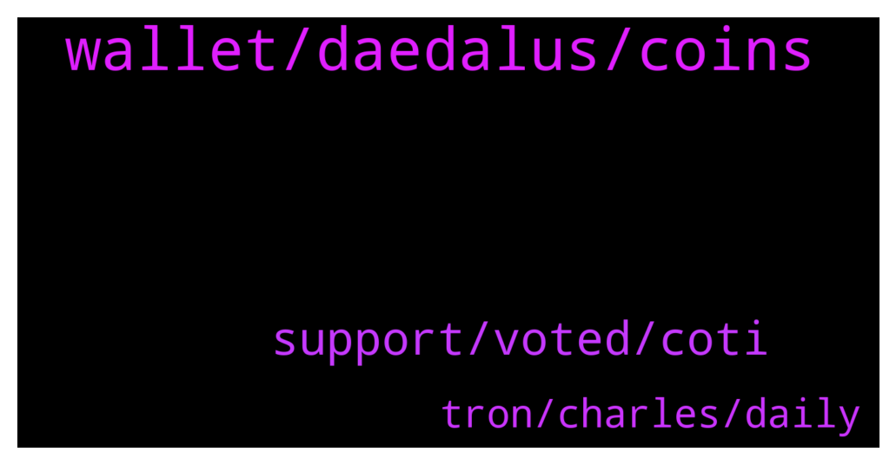

# **@Cardano**
 ## Analysis for **2021-12-28** - **2021-12-29**.

---

## 📊 **Basic Stats**

**n_messages_sent**: 42

---

---

## 🔝 **Top keywords and related messages**

1. **wallet, daedalus, coins**

    @Anasheku_CryptoBuzz --- *can I send native Ada coin from Kucoin to Yoroi wallet?* **--->** [TG Discussion](https://t.me/Cardano/763118)

    @apex_pool_spo --- *Daedalus does not have an "undelegate" option. you can restore your wallet in Yoroi or another software and undelegate, if this is what you want to do.* **--->** [TG Discussion](https://t.me/Cardano/763523)

    @RVarel --- *But if my coins are in Daedalus, will i be able to access them through yoroi?* **--->** [TG Discussion](https://t.me/Cardano/763528)

    @glitch04 --- *You can use one of the third party explorers like adastat.net or cardanoscan.io with a used receive address from your wallet* **--->** [TG Discussion](https://t.me/Cardano/763395)

    @RVarel --- *Oh okay, let me try doing that then* **--->** [TG Discussion](https://t.me/Cardano/763531)

    @apex_pool_spo --- *Your coins are on blockchain, your keys are in Daedalus. You can restore your Wallet ( the keys required to move your coins) in any other wallet software, using the recovery words (the 24 words you have since when you created the wallet).* **--->** [TG Discussion](https://t.me/Cardano/763529)

2. **support, voted, coti**

    @ExInfernis --- *47 hours left. I have voted 37 times. If just everyone here votes at least once until the end we can take the lead.* **--->** [TG Discussion](https://t.me/Cardano/763502)

    @thomas --- *[Forwarded from Cardano Announcements] Hey all! Want to help get more adoption and grow #Cardano? 👀  Please take a moment to vote and potentially get Ada added to bitpay app! ✨  Thanks for all the support! 💪  https://twitter.com/bitpay/status/1458977852230180868?s=21  Direct link to poll: https://gleam.io/1a0mE/bitpay-coin-poll (FYI: You can vote every day!😉)  Would you rather request a feature via the website and ask them for Cardano support? Please visit here and let your voices be heard: https://bitpay.canny.io/feature-request?sort=top* **--->** [TG Discussion](https://t.me/Cardano/763412)

    @ExInfernis --- *COTI telegram group admin even let me to post the voting pool link if someone there wants to help with voting, they don't usually let links not related to coti to be posted 🤗* **--->** [TG Discussion](https://t.me/Cardano/763525)

    @glitch04 --- *Also if anyone dm's you acting as support block and report them as they are scammers.* **--->** [TG Discussion](https://t.me/Cardano/763396)

    @ChrisSTR8 --- *Please do support the BitPay poll, we could still win this if enough voted, only 2 days to go* **--->** [TG Discussion](https://t.me/Cardano/763299)

    @Muneeb1988 --- *Finally been trying for weeks to get verified in here 🙌* **--->** [TG Discussion](https://t.me/Cardano/763241)

3. **tron, charles, daily**

    @DrNo8910 --- *Charles is live on YouTube n Twitter* **--->** [TG Discussion](https://t.me/Cardano/763305)

    @Frederick --- *I love Charles and he does show immaturity when he focuses on the negative. Just build baby.* **--->** [TG Discussion](https://t.me/Cardano/763044)

    @Frederick --- *That was over one year ago* **--->** [TG Discussion](https://t.me/Cardano/763043)

    @Frederick --- *So now I hope Charles won't smear Tron.   I never heard Just Sun belly ach about the perception of tron.   In 2020, TRON-based dApps also broke new records, and currently average over 100,000 daily active users. 1,400 dApps have now been created on the TRON network, with a daily transaction volume of over $12 million.Dec 17, 2020* **--->** [TG Discussion](https://t.me/Cardano/763041)

    @Igor_3air_Ambassador --- *They are going to stain the reputation they built and possibly Cardano's* **--->** [TG Discussion](https://t.me/Cardano/763024)

