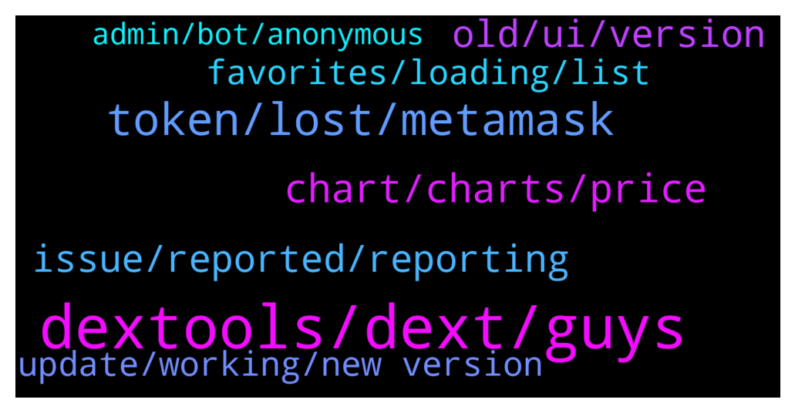

# **@DEXToolsCommunity**
 ## Analysis for **2021-12-27** - **2021-12-29**.

---

## 📊 **Basic Stats**

**n_messages_sent**: 478

---

---

## 🔝 **Top keywords and related messages**

1. **dextools, dext, guys**

    @Gideon649 --- *What do I need to list on Dextool ?* **--->** [TG Discussion](https://t.me/DEXToolsCommunity/319755)

    @gumbercules --- *Mine says low community score so watch out* **--->** [TG Discussion](https://t.me/DEXToolsCommunity/319112)

    @TexasCryptoMan --- *How does one get a telegram group link to be shown on the site?* **--->** [TG Discussion](https://t.me/DEXToolsCommunity/319276)

    @Roya_jk2 --- *Hello, how can we advertise in dextools?* **--->** [TG Discussion](https://t.me/DEXToolsCommunity/319485)

    @OMOONXT1 --- *ppl are selling without any problem as I can see on dextools* **--->** [TG Discussion](https://t.me/DEXToolsCommunity/319860)

    @napascual --- *Dm me the factory/deployer and dex info* **--->** [TG Discussion](https://t.me/DEXToolsCommunity/319659)

2. **token, lost, metamask**

    @FredericDEXT --- *Same as before , at token info tab* **--->** [TG Discussion](https://t.me/DEXToolsCommunity/318154)

    @gumbercules --- *I'm not seeing a verified marking (assuming we're talking about the same token)* **--->** [TG Discussion](https://t.me/DEXToolsCommunity/319109)

    @chrismagic0 --- *I need support for my token* **--->** [TG Discussion](https://t.me/DEXToolsCommunity/319970)

    @Osama --- *Any Information about shibdoge  Please? I lost a lot of money* **--->** [TG Discussion](https://t.me/DEXToolsCommunity/319955)

    @EricCryptoman --- *i lost a large amount of $eth because of the error on your site* **--->** [TG Discussion](https://t.me/DEXToolsCommunity/319536)

    @Giribabu --- *I am unable to sell my tokens* **--->** [TG Discussion](https://t.me/DEXToolsCommunity/319342)

3. **chart, charts, price**

    @Simon --- *I still think being able to hide the stuff on the left would be good so I can have the chart and trade history spanning the rest of the width* **--->** [TG Discussion](https://t.me/DEXToolsCommunity/318245)

    @napascual --- *It would display several lines of hotpairs and we wanted to avoid that* **--->** [TG Discussion](https://t.me/DEXToolsCommunity/318406)

    @JustAToxicGod --- *Is there a way to automatically grab the chart link every so often?* **--->** [TG Discussion](https://t.me/DEXToolsCommunity/318786)

    @napascual --- *We've updated to one line favs when hiding charts* **--->** [TG Discussion](https://t.me/DEXToolsCommunity/318214)

    @hopiumvictim --- *Hey is there a way to display the favorite token prices above the chart? I cant see them on my vertical monitor.* **--->** [TG Discussion](https://t.me/DEXToolsCommunity/318708)

    @Singhdeep05050 --- *Hey on chart your "measuring shift" doesn't work properly* **--->** [TG Discussion](https://t.me/DEXToolsCommunity/318967)

4. **old, ui, version**

    @Crabouif --- *I agree. Keep reloading back the old one lol* **--->** [TG Discussion](https://t.me/DEXToolsCommunity/318840)

    @Darius5558 --- *Feel like this update has made the UI worse* **--->** [TG Discussion](https://t.me/DEXToolsCommunity/319241)

    @Qboybm --- *Can I switch back to the old interface?* **--->** [TG Discussion](https://t.me/DEXToolsCommunity/318791)

    @Dir3ctor3 --- *The new ui is the worst thing I’ve used all year* **--->** [TG Discussion](https://t.me/DEXToolsCommunity/318673)

    @Dir3ctor3 --- *The new one is awful compared to it* **--->** [TG Discussion](https://t.me/DEXToolsCommunity/318854)

    @arthieupham --- *I like the old version better* **--->** [TG Discussion](https://t.me/DEXToolsCommunity/318187)

5. **issue, reported, reporting**

    @FredericDEXT --- *We can fix that thanks for reporting* **--->** [TG Discussion](https://t.me/DEXToolsCommunity/318650)

    @FredericDEXT --- *All feedback is noted , we will deliver fixes for all reported issues in the next days.* **--->** [TG Discussion](https://t.me/DEXToolsCommunity/319630)

    @FredericDEXT --- *Good to know, we didn't have that issue before* **--->** [TG Discussion](https://t.me/DEXToolsCommunity/319840)

    @FredericDEXT --- *Nothing we can do about it. Our devs are checking and fixing the issue.* **--->** [TG Discussion](https://t.me/DEXToolsCommunity/319069)

    @FredericDEXT --- *Yes , that was already reported and will be fixed next week* **--->** [TG Discussion](https://t.me/DEXToolsCommunity/318655)

    @stanes --- *I will forward the issue with the "sort by" to the team. Thanks for reporting.* **--->** [TG Discussion](https://t.me/DEXToolsCommunity/319363)

6. **favorites, loading, list**

    @Singhdeep05050 --- *I can't remove favorites. There's a bug* **--->** [TG Discussion](https://t.me/DEXToolsCommunity/319309)

    @Monolithof --- *At the bottom of the list, it says "Loading more favorites" but it's actually not loading it. It's non-clickable too* **--->** [TG Discussion](https://t.me/DEXToolsCommunity/318846)

    @Qboybm --- *I can't see the full list FAVORITES* **--->** [TG Discussion](https://t.me/DEXToolsCommunity/318772)

    @emilypanique --- *hi hoow to view favorites in dextools? i close it and nowhere to found* **--->** [TG Discussion](https://t.me/DEXToolsCommunity/319508)

    @Lost --- *Why favor tokens cant load ?* **--->** [TG Discussion](https://t.me/DEXToolsCommunity/319406)

    @darkstorns --- *there is a problem when deleting the coins in the favorites list, i use iphone or pc it is very difficult to delete, i have to delete it a few times to get it, sometimes it can't be deleted especially on pc, sometimes the favorites table  like jerky lag like hang up* **--->** [TG Discussion](https://t.me/DEXToolsCommunity/319611)

7. **update, working, new version**

    @stanes --- *No. But team is currently working on improving the new version with all the feedbacks received.* **--->** [TG Discussion](https://t.me/DEXToolsCommunity/318794)

    @chupapimunyenyo60 --- *What is this latest update about?* **--->** [TG Discussion](https://t.me/DEXToolsCommunity/319242)

    @napascual --- *Feel free to update it there and it'll be updated automatically* **--->** [TG Discussion](https://t.me/DEXToolsCommunity/318610)

    @napascual --- *But feel free to share a possible enhancement and we'll think on it* **--->** [TG Discussion](https://t.me/DEXToolsCommunity/318409)

    @Crabouif --- *👍 Thanks. I'll do the necessary there. Will it be automatically updated once it is there?* **--->** [TG Discussion](https://t.me/DEXToolsCommunity/318863)

    @jointhefuture4_0 --- *the penultimate update was not optimal in information* **--->** [TG Discussion](https://t.me/DEXToolsCommunity/318198)

