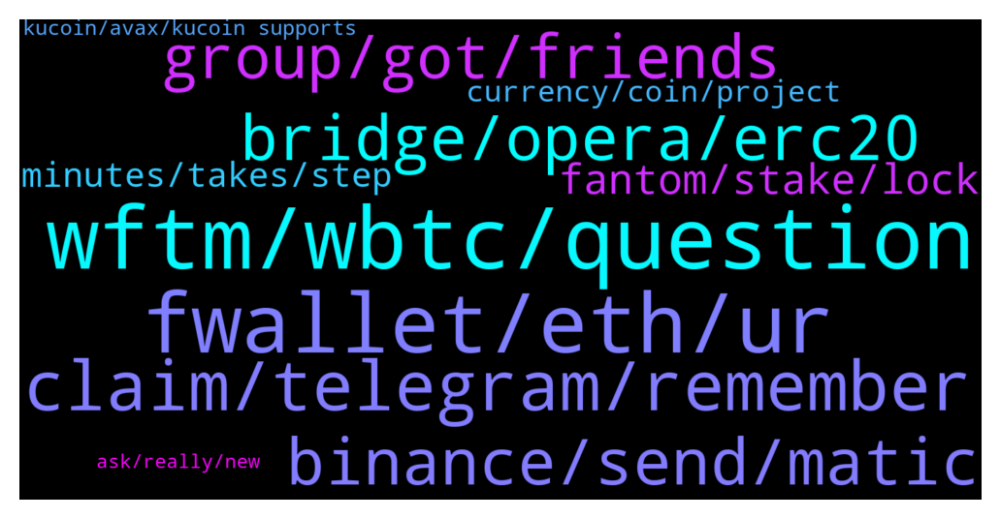

# **@Fantom_English**
 ## Analysis for **2021-12-28** - **2021-12-29**.

---

## 📊 **Basic Stats**

**n_messages_sent**: 287

---

---

## 🔝 **Top keywords and related messages**

1. **wftm, wbtc, question**

    @Janevietani --- *for US citizen, you can use Gate.io or Kucoin to buy native FTM* **--->** [TG Discussion](https://t.me/Fantom_English/617908)

    @sam --- *FTM is one of my favourite holdings, I got in cheap so I wasn't too pissed off.* **--->** [TG Discussion](https://t.me/Fantom_English/618013)

    @KoinLuc --- *Wtf happy  with ftm .. is dying 😭* **--->** [TG Discussion](https://t.me/Fantom_English/617562)

    @Alihaiderdar96 --- *Just b o u g h t.. FTM in dip* **--->** [TG Discussion](https://t.me/Fantom_English/617589)

    @nashtic321 --- *I m out of ftm ;(* **--->** [TG Discussion](https://t.me/Fantom_English/617822)

    @Ionuț --- *Ftm ....  stay strong !* **--->** [TG Discussion](https://t.me/Fantom_English/617973)

2. **fwallet, eth, ur**

    @EAE999 --- *How to import my Fwallet to metamask?* **--->** [TG Discussion](https://t.me/Fantom_English/618288)

    @Telegra_Me123 --- *But i can see the tokens only on Eth mainchain* **--->** [TG Discussion](https://t.me/Fantom_English/617991)

    @Mcjig --- *no, only the owner of the receiving address can fix* **--->** [TG Discussion](https://t.me/Fantom_English/617894)

    @Darqus --- *no sir u sent to eth wallet which is same as ur fwallet* **--->** [TG Discussion](https://t.me/Fantom_English/618270)

    @Darqus --- *since Fwallet doesnt support eth as fast as I know* **--->** [TG Discussion](https://t.me/Fantom_English/618284)

    @Darqus --- *so in that case ur eth went to eth wallet with same adress as ur Fwallet* **--->** [TG Discussion](https://t.me/Fantom_English/618282)

3. **claim, telegram, remember**

    @Blackbeard3105 --- *I am trying to "Claim & Restake" my rewards before locking my stake back in again but when I click on the Claim button I keep getting an error message that says "Error GraphQL error: transaction underpriced".  What does this mean and how do I correct this so I can proceed?  Thanks.* **--->** [TG Discussion](https://t.me/Fantom_English/617703)

    @sam --- *I got scammed a few days ago, not as much as you but 1300 FTM. there is another FTM Foundation group on telegram and there's 40,000 members or bots who knows 😂* **--->** [TG Discussion](https://t.me/Fantom_English/618005)

    @KoinLuc --- *Is a office legit or just a scam ? 🤔 thank for sharing your opinion with me* **--->** [TG Discussion](https://t.me/Fantom_English/618568)

    @DastardlyDude --- *what is the typical apr for staking in a node?* **--->** [TG Discussion](https://t.me/Fantom_English/618131)

    @RitwanRistanto --- *do you need ambassador or admin community from my country?* **--->** [TG Discussion](https://t.me/Fantom_English/618590)

    @N32121 --- *Can I speak to you on your personal account?* **--->** [TG Discussion](https://t.me/Fantom_English/618557)

4. **binance, send, matic**

    @P. --- *I accidentally transferred fusdt from a metamask wallet on ftm opera to my binance wallet on Beop20 network. It’s pretty stupid, but does anyone know if there is any way to retrieve the money?* **--->** [TG Discussion](https://t.me/Fantom_English/617970)

    @Janevietani --- *deposit it to Binance and withdraw native FTM from  Binance* **--->** [TG Discussion](https://t.me/Fantom_English/618499)

    @HanMooKwan --- *why you don‘t trade them into usdc, send to binance and from there via binance mainnet to ftm opera?* **--->** [TG Discussion](https://t.me/Fantom_English/617570)

    @bymat21 --- *Hello  how can i send matics from phantom metamask to polygon wallet* **--->** [TG Discussion](https://t.me/Fantom_English/617569)

    @Mcjig --- *see if anyswap does bep2, not sure if its bep2 or 20. you can also send to binance and just withdraw mainnet* **--->** [TG Discussion](https://t.me/Fantom_English/617622)

    @HanMooKwan --- *impossible… go on binance spot wallet, choose matic, choose deposit, choose polygon network, copy deposit address* **--->** [TG Discussion](https://t.me/Fantom_English/617575)

5. **bridge, opera, erc20**

    @pajamasfreak --- *It is much cheaper to utilize opera network than erc20 that’s why we give options to users.* **--->** [TG Discussion](https://t.me/Fantom_English/618383)

    @official_feral_gent --- *If I buy the FTM/Erc20 token, I’d more than likely have to swap/bridge it to the Opera network for native FTM; similar to Matic network in order to participate in the projects on the network?* **--->** [TG Discussion](https://t.me/Fantom_English/618234)

    @Janevietani --- *Because  FTX only support  erc20 FTM so you need to bridge it if you wanna have it as Opera FTM* **--->** [TG Discussion](https://t.me/Fantom_English/617992)

    @pajamasfreak --- *Yeah, per our last AMA. We will reduce erc20 tokens and increase more on opera, so yeah we are getting towards that goal. Not sure completely but majority will be on opera.* **--->** [TG Discussion](https://t.me/Fantom_English/618394)

    @pajamasfreak --- *There is no sense if you keep expecting from foundation while anyswap is 3rd party* **--->** [TG Discussion](https://t.me/Fantom_English/617698)

    @bymat21 --- *i will try it too.  Do you have any bridge suggestions?* **--->** [TG Discussion](https://t.me/Fantom_English/617576)

6. **group, got, friends**

    @akalterssdfa --- *coz u didnt make native bridge😢* **--->** [TG Discussion](https://t.me/Fantom_English/617709)

    @SummerWind --- *Any possible way to report the other fantom group?got scammed for being greedy but thought should raise awareness* **--->** [TG Discussion](https://t.me/Fantom_English/617879)

    @official_feral_gent --- *Gotcha🤙 Gonna dink around with it for a second 😅* **--->** [TG Discussion](https://t.me/Fantom_English/618236)

    @hellohellochris --- *where is andre, he should be in here helping answer questions* **--->** [TG Discussion](https://t.me/Fantom_English/618337)

    @Aflatoon123 --- *I dont know if links are allowed here or not😅* **--->** [TG Discussion](https://t.me/Fantom_English/617987)

    @JorgeYogYou --- *HI There friends, its Portuguese Jorge here.* **--->** [TG Discussion](https://t.me/Fantom_English/618133)

7. **fantom, stake, lock**

    @VR_Lee --- *Any article how to set up Fantom in MM?* **--->** [TG Discussion](https://t.me/Fantom_English/617940)

    @eznika --- *any word on how to get a project listed on the "projects fantom network" website?  submitted 2 times already but it isn't listed* **--->** [TG Discussion](https://t.me/Fantom_English/618126)

    @Hyphaed --- *it gives really bad image to Fantom Opera* **--->** [TG Discussion](https://t.me/Fantom_English/617998)

    @pajamasfreak --- *Look up the guide from fantombot* **--->** [TG Discussion](https://t.me/Fantom_English/617748)

    @Ed --- *How do I use Fantom bought in Gemini to stake in tomb?* **--->** [TG Discussion](https://t.me/Fantom_English/617904)

    @Mahjid_1 --- *Can someone help me with fantom contract address on fantom network* **--->** [TG Discussion](https://t.me/Fantom_English/617756)

8. **minutes, takes, step**

    @Mcjig --- *it only takes a few minutes. obviously you had a issue* **--->** [TG Discussion](https://t.me/Fantom_English/618583)

    @M.K --- *i think that's what I think... now I have to wait for all blocks to be confirmed and that takes about 2-3 month* **--->** [TG Discussion](https://t.me/Fantom_English/618585)

    @Jace --- *yes I checked it there and it also says completed* **--->** [TG Discussion](https://t.me/Fantom_English/618542)

    @EAE999 --- *Does that mean  its gone forever?* **--->** [TG Discussion](https://t.me/Fantom_English/618265)

    @Jace --- *Ok how long does it usually take to get liquidity?* **--->** [TG Discussion](https://t.me/Fantom_English/618563)

    @Mcjig --- *nothing takes 2 or 3 months/ dont know how you figure that* **--->** [TG Discussion](https://t.me/Fantom_English/618587)

9. **currency, coin, project**

    @coinmania222 --- *how much worth is advisable to buy now please* **--->** [TG Discussion](https://t.me/Fantom_English/618603)

    @Farthaze --- *Hello, how much is the fee to mint in Artion* **--->** [TG Discussion](https://t.me/Fantom_English/618298)

    @DevilFinance_io --- *Hello, we are the Devil Finance team and we will soon launch a Yield Optimizer platform on the Fantom blockchain. May we promote our project in your group? Thank you.* **--->** [TG Discussion](https://t.me/Fantom_English/618065)

    @N32121 --- *I have a special project that will lead your currency to a huge investment* **--->** [TG Discussion](https://t.me/Fantom_English/618558)

    @N32121 --- *I have a giant deal that contributes to the stability of the rise and the upward trend of the currency, and it is an experience that will remain free until it is successful and will become paid.. We will make the price of this currency exceed 30%* **--->** [TG Discussion](https://t.me/Fantom_English/618550)

    @Janevietani --- *try to contact the coin project , maybe they can help* **--->** [TG Discussion](https://t.me/Fantom_English/617909)

10. **kucoin, avax, kucoin supports**

    @Derivadax2 --- *How to send avax from Metamask to Kucoin via the Fantom network* **--->** [TG Discussion](https://t.me/Fantom_English/617535)

    @slickrick6 --- *You need to contact kucoin. They are the only ones who can help you in this instance* **--->** [TG Discussion](https://t.me/Fantom_English/617510)

    @slickrick6 --- *You sent fantom network to kucoin MetaMask erc 20?* **--->** [TG Discussion](https://t.me/Fantom_English/617505)

    @Mcjig --- *kucoin only supports avax c chain/ so you need to bridge it to c chain then to kucoin* **--->** [TG Discussion](https://t.me/Fantom_English/617541)

    @Mcjig --- *you dont, you need to see if kucoin even supports avax on different chains* **--->** [TG Discussion](https://t.me/Fantom_English/617539)

    @Johnnyfantom --- *Never used Kucoin so not sure but maybe @Janevietani @Mcjig @slickrick6 might know* **--->** [TG Discussion](https://t.me/Fantom_English/618521)

