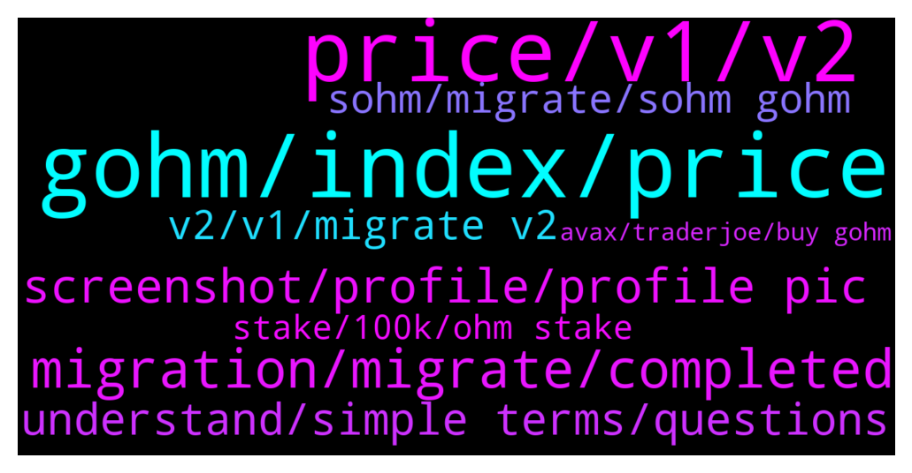

# **@OlympusTG**
 ## Analysis for **2021-12-28** - **2021-12-29**.

---

## 📊 **Basic Stats**

**n_messages_sent**: 748

---

---

## 🔝 **Top keywords and related messages**

1. **gohm, index, price**

    @Ap0l1o --- *the only way price of gOhm can drop is if the price of Ohm drops* **--->** [TG Discussion](https://t.me/OlympusTG/137199)

    @Ap0l1o --- *gOhm does not change in quantity frens* **--->** [TG Discussion](https://t.me/OlympusTG/137172)

    @Zalord --- *The index rebases, then your gOHM multiplied by that index gives you your actual value* **--->** [TG Discussion](https://t.me/OlympusTG/136093)

    @Ap0l1o --- *the gOhm amount does not increase in quantity, so the sOhm preview is to show the increase* **--->** [TG Discussion](https://t.me/OlympusTG/136435)

    @AdamGabriel7 --- *Your gohm will remain the same quantity, your sohm you will see increasing* **--->** [TG Discussion](https://t.me/OlympusTG/135819)

    @shogunfx1 --- *gOHM will not increase in your holdings, although it will increase in price, as it's value is subject to ohm price * rebase index* **--->** [TG Discussion](https://t.me/OlympusTG/136215)

2. **price, v1, v2**

    @Kred88 --- *for each OHM u migrate, u lost 50$.  I migrate 100 OHM of the value of 434$ to 100 OHM of the value of 385$* **--->** [TG Discussion](https://t.me/OlympusTG/135910)

    @Kred88 --- *Selling my 100 ohm v1 on market, than i can buy 110ohm v2 on sushi...* **--->** [TG Discussion](https://t.me/OlympusTG/135921)

    @kevalbaba --- *How reliable is the price of ohm on the app? I am looking at an aggregator and the average price from various sources comes to ~420* **--->** [TG Discussion](https://t.me/OlympusTG/136018)

    @amkuo --- *HI one silly question.  any knows why OHM shows differents stats on coingecko, coinmarketcap? its a lot of diffrences* **--->** [TG Discussion](https://t.me/OlympusTG/136867)

    @matt_jm --- *:( no way I can get compensated for this? I can show the TX etc 4 OHM is quite a real big amount of money for me* **--->** [TG Discussion](https://t.me/OlympusTG/136814)

    @RichR7 --- *You are missing OHM's price is going down.* **--->** [TG Discussion](https://t.me/OlympusTG/136099)

3. **migration, migrate, completed**

    @(3'3) --- *I try to migrate but it does not leave me the platform ...* **--->** [TG Discussion](https://t.me/OlympusTG/137128)

    @amkuo --- *where can i see document related this migration? whats is the purpose for this migration* **--->** [TG Discussion](https://t.me/OlympusTG/136120)

    @nohso --- *i dont remember, but theres no button to click for migrate anymore, its gone* **--->** [TG Discussion](https://t.me/OlympusTG/136957)

    @nfwaple --- *does the website prompt you to migrate still?* **--->** [TG Discussion](https://t.me/OlympusTG/137119)

    @rbolivar2 --- *Anyone know when the migration will be completed ?* **--->** [TG Discussion](https://t.me/OlympusTG/136776)

    @Thomas --- *3,3T  lottery still coming back after migration? About a third of my bag was solely for this purpose.* **--->** [TG Discussion](https://t.me/OlympusTG/136188)

4. **screenshot, profile, profile pic**

    @eatsandtravels --- *I’d show screenshot but can’t haha* **--->** [TG Discussion](https://t.me/OlympusTG/136351)

    @nfwaple --- *Have u been banned before? If not try desktop and change profile pic* **--->** [TG Discussion](https://t.me/OlympusTG/136121)

    @Aditia --- *The one link from the official web* **--->** [TG Discussion](https://t.me/OlympusTG/136907)

    @Aditia --- *Thank you ill give it a shoot* **--->** [TG Discussion](https://t.me/OlympusTG/136308)

    @Ap0l1o --- *You can DM me the screenshot* **--->** [TG Discussion](https://t.me/OlympusTG/136353)

    @JulioMXCD --- *Send the link where to see* **--->** [TG Discussion](https://t.me/OlympusTG/136684)

5. **understand, simple terms, questions**

    @Wbish91 --- *I thought the TG was an open discussion for people to understand. Okay sorry to causing a ruckus, I was just merely open to hear your views on other peoples opinions As some with a level head.* **--->** [TG Discussion](https://t.me/OlympusTG/137224)

    @Chit Yan --- *Can explain in more simple terms?* **--->** [TG Discussion](https://t.me/OlympusTG/137079)

    @Pallas1111 --- *@Ap0l1o thank you for your explanation. It's starting to make more sense. It's definitely not the easiest thing to grasp.* **--->** [TG Discussion](https://t.me/OlympusTG/137227)

    @JulioMXCD --- *again, if you can prove otherwise I will believe you* **--->** [TG Discussion](https://t.me/OlympusTG/136707)

    @Ap0l1o --- *just read above, everything has been explained many many times.* **--->** [TG Discussion](https://t.me/OlympusTG/136717)

    @Kuchi --- *Go with your guts, your thinking is better than others* **--->** [TG Discussion](https://t.me/OlympusTG/137229)

6. **v2, v1, migrate v2**

    @nfwaple --- *correct, most support v2 because we want the protocol to improve* **--->** [TG Discussion](https://t.me/OlympusTG/136235)

    @RizescuA --- *another 50 usd to migrate to v2 so I can benefit from this project (wonderful) :)) no thanks* **--->** [TG Discussion](https://t.me/OlympusTG/136241)

    @gabrielhain --- *OHM I bought on gate is v1 or v2? I don't get it the big price difference  between CEX & DEX, by the way.* **--->** [TG Discussion](https://t.me/OlympusTG/136360)

    @DrJames11 --- *Hope I can migrate my tokens to v2 on march?* **--->** [TG Discussion](https://t.me/OlympusTG/137037)

    @amkuo --- *i never saws that much difference...* **--->** [TG Discussion](https://t.me/OlympusTG/136870)

    @Rezentic --- *Do i need to migrate to v2 to continue to get the staking rewards?* **--->** [TG Discussion](https://t.me/OlympusTG/136909)

7. **sohm, migrate, sohm gohm**

    @ZR_CRYPTO --- *you migrated gohm to sohm? it should be vice versa* **--->** [TG Discussion](https://t.me/OlympusTG/137164)

    @nfwaple --- *I think since you're already at this point, you might as well migrate and see if you get missed rebases, apparently you can migrate from OHM v1 to gOHM directly* **--->** [TG Discussion](https://t.me/OlympusTG/137125)

    @A. --- *I read some infos about the migration. I don't understand : will the increasements of gohm be the same over a year as in sOhm? Absolutely no disadvantage to migrate? Please tag me.* **--->** [TG Discussion](https://t.me/OlympusTG/136369)

    @Cle7us --- *Is it possible to migrate sOHM version 1 to sOHM version 2? Or only from sOHM version 1 to gOHM? Im on the eth network* **--->** [TG Discussion](https://t.me/OlympusTG/136032)

    @JWH007 --- *I'm trying to migrate to V2. I'm on the Wrap page. I've Approved the TX but my sOHM doesn't show up. I can see my sOHM on the staking Dashboard. Do I need to unstake to wrap/move to gOHM??* **--->** [TG Discussion](https://t.me/OlympusTG/136247)

    @nohso --- *i did the migration, but i still see sOHM under stake, page. Do i unstake and restake to gOHM?* **--->** [TG Discussion](https://t.me/OlympusTG/136948)

8. **stake, 100k, ohm stake**

    @The_Coin_Collector --- *yes bought ohm with eth. not staked as yet* **--->** [TG Discussion](https://t.me/OlympusTG/136401)

    @jken123456 --- *The ohmdao is for whale only...hahahaha..I'm poor can't stake my 0.1ohm..lol* **--->** [TG Discussion](https://t.me/OlympusTG/136757)

    @matt_jm --- *Just assumed the token OHM Was the same and didn’t change🤦‍♂️ that’s so annoying just lost 4ohm without even staking it* **--->** [TG Discussion](https://t.me/OlympusTG/136808)

    @The_Coin_Collector --- *Im confused, i have OHM at the moment in my mm wallet..... nothing staked* **--->** [TG Discussion](https://t.me/OlympusTG/136389)

    @Shaun11181977 --- *Hey team. New to the platform. just staked some OHM. Any recommendations as to next steps?* **--->** [TG Discussion](https://t.me/OlympusTG/135878)

    @moonordust24 --- *So on January the 1st am I good to just swap a load of eth for OHM and stake it and I’m good to go yeah?* **--->** [TG Discussion](https://t.me/OlympusTG/136514)

