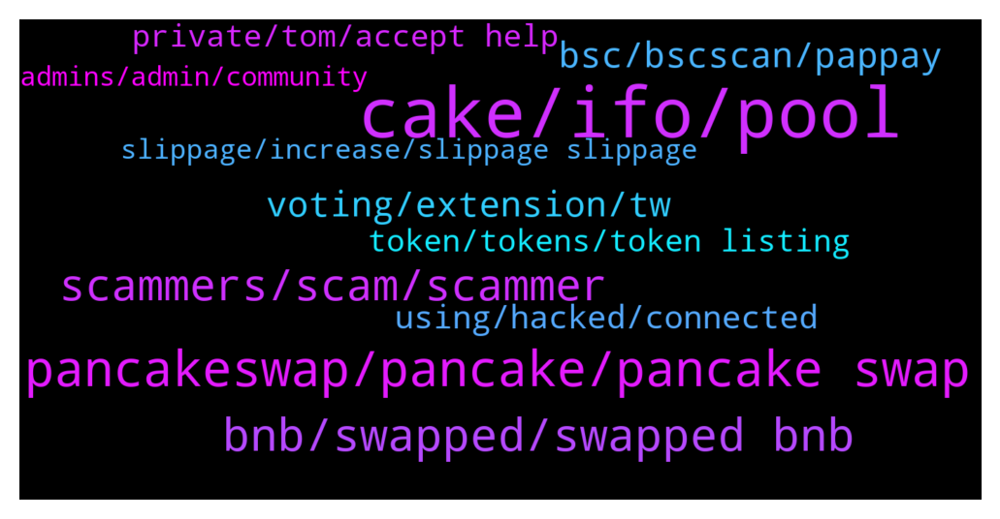

# **@PancakeSwap**
 ## Analysis for **2021-12-28** - **2021-12-29**.

---

## 📊 **Basic Stats**

**n_messages_sent**: 1107

---

---

## 🔝 **Top keywords and related messages**

1. **cake, ifo, pool**

    @TomorrowlandForLife --- *The max ammount of CAKE you can put in Basic or Unlimited Pool depend on your Average IFO Pool* **--->** [TG Discussion](https://t.me/PancakeSwap/2231278)

    @Lina19878 --- *auto cake and ifo  cake for bigginer right? :)* **--->** [TG Discussion](https://t.me/PancakeSwap/2229388)

    @Lina19878 --- *Hello guys can someone please help me, if i staked on pancake swap and i unstaked after 5 days..is there any fees or penalty please help me* **--->** [TG Discussion](https://t.me/PancakeSwap/2229353)

    @REACHO --- *Admin am trying to unstake my cake in manual pool but it fails?* **--->** [TG Discussion](https://t.me/PancakeSwap/2230176)

    @igorwale --- *Ignore this guy, he probably bought everything he had in life at the top price, which he Says It makes no sense, if you look at his posts you can tell he's depressed, he probably lost control of the amount of cake he bought over 40 dol without having a risk organization, he is clearly depressed* **--->** [TG Discussion](https://t.me/PancakeSwap/2227654)

    @vmbarmedilla --- *Can I use my extra Cake just Insted to commit? And not unstake my cake in ifo* **--->** [TG Discussion](https://t.me/PancakeSwap/2230586)

2. **pancakeswap, pancake, pancake swap**

    @SecuestPcs --- *It’s about token contract, not about Pancakeswap. Did you check slippage?* **--->** [TG Discussion](https://t.me/PancakeSwap/2229689)

    @mirak --- *Hello still have issues on pancakeswap* **--->** [TG Discussion](https://t.me/PancakeSwap/2231043)

    @HAITIENLK --- *pancakeswap.finance is normal bro. try again.* **--->** [TG Discussion](https://t.me/PancakeSwap/2230426)

    @Yuvraj0786 --- *Any solution seriously I swapped in pancakeswap* **--->** [TG Discussion](https://t.me/PancakeSwap/2227114)

    @Ak1905 --- *Hello, I bought using pancakeswap router from bscscan. But the token was sold to me at a very high price. I paid $4700 each for the token, but the token had seen a maximum of $5.5. Can you help me? TXN: 0x3a3a839c2bb75c798e4489457f1dbec37774e545f08a210d237880ad94cd3ad9* **--->** [TG Discussion](https://t.me/PancakeSwap/2228844)

    @Eyassu --- *I would just like to know what to do next time because I set everything up and the transaction stated I would get more on pancake swap during the swap* **--->** [TG Discussion](https://t.me/PancakeSwap/2227674)

3. **bnb, swapped, swapped bnb**

    @Yuvraj0786 --- *Seriously I swapped bnb to dogedi* **--->** [TG Discussion](https://t.me/PancakeSwap/2227099)

    @SecuestPcs --- *You transferred your bnb to other adress.* **--->** [TG Discussion](https://t.me/PancakeSwap/2227118)

    @SecuestPcs --- *Check internal txns. You have bnb* **--->** [TG Discussion](https://t.me/PancakeSwap/2227141)

    @darkmttr --- *Hello guys, I have swapped BNB to ETH on pancake swap but eth does not show up on my eth network in my assets in metamask* **--->** [TG Discussion](https://t.me/PancakeSwap/2229692)

    @HAITIENLK --- *https://bscscan.com/tx/0x96f4b775aff348ef49a543200548c1f9f0d89504dea6f36bd39ccc85fdc1d527  —> you transfer 0.019 bnb 1day ago* **--->** [TG Discussion](https://t.me/PancakeSwap/2228304)

    @cryptotrip7 --- *I just made a transaction of $1000 and I think I may have lost it.  I traded Smart Chain BNB for XYZ token and the swap went through. AFTERWARDS, I realized I had my BNB Smartchain in place instead of my Etherwallet in place (In my BNB Firefox Wallet), and the token is an ether token but the swap was a wrapped BNB to XYZ swap. and I see no coins in my XYZ folder of my BNB wallet now. I fear I may have lost the $1000.  Can anyone here helm me with this, without trying to guide me to some way to connect my wallet and hand over my pass phrase? lol    I just need someone to explain to me what I need to do. Any REAL help is much appreciated.* **--->** [TG Discussion](https://t.me/PancakeSwap/2229597)

4. **scammers, scam, scammer**

    @Luvmakrichie --- *Soft scam???? Can you explain please.* **--->** [TG Discussion](https://t.me/PancakeSwap/2230765)

    @CakeCompounder --- *Ignore EVERYONE who messages you. They are ALL SCAMMERS* **--->** [TG Discussion](https://t.me/PancakeSwap/2230272)

    @erR_K_R --- *Message here, don't call or don't DM me* **--->** [TG Discussion](https://t.me/PancakeSwap/2228661)

    @rpoole69 --- *SCAMMER! Don't answer any DM unless you initiate it* **--->** [TG Discussion](https://t.me/PancakeSwap/2228345)

    @Balarabe_muaz --- *This is just a scam project* **--->** [TG Discussion](https://t.me/PancakeSwap/2229930)

    @ItsAMS --- *a fake account just sent me a dm with your name 😅* **--->** [TG Discussion](https://t.me/PancakeSwap/2227447)

5. **voting, extension, tw**

    @CoinTosser --- *#1 Yes I do # 2 yes i use the BRAVE Browser* **--->** [TG Discussion](https://t.me/PancakeSwap/2228394)

    @Liam --- *I have the same issue...no response yet...wtf is this😡* **--->** [TG Discussion](https://t.me/PancakeSwap/2230178)

    @rpoole69 --- *lmfao, never mind, have tried this numerous times before and no luck, I click the link above and I have voting power. Yet still when I click on voting under the ... those still show no voting power:/ ex uri is : https://pancakeswap.finance/voting/proposal/QmdbF9kKxnF7WabGdM9emQHVTSBczMjwP43KtmxaDiLseT* **--->** [TG Discussion](https://t.me/PancakeSwap/2230627)

    @Vengeful_one_13 --- *even clear cache is not helping* **--->** [TG Discussion](https://t.me/PancakeSwap/2231257)

    @CoinTosser --- *It’s like chrome with same extensions -(should I empty cache ??) & from a Mac* **--->** [TG Discussion](https://t.me/PancakeSwap/2228404)

    @TomorrowlandForLife --- *that's weird...it's working for everyone Try clear cache or from a different device if possible* **--->** [TG Discussion](https://t.me/PancakeSwap/2231330)

6. **bsc, bscscan, pappay**

    @mic_min --- *best thing is to check your transactions in bscscan yourself* **--->** [TG Discussion](https://t.me/PancakeSwap/2229598)

    @rpoole69 --- *bscheck.eu/bsc/0x27d72484f1910f5d0226afa4e03742c9cd2b297a shows this token as risky, but do you have the actual transaction id* **--->** [TG Discussion](https://t.me/PancakeSwap/2228311)

    @FabulousXBT --- *check bscscan.com is there any strange transaction. if not try clear cache and try again  or maybe you put your cake at finished pool* **--->** [TG Discussion](https://t.me/PancakeSwap/2228700)

    @rpoole69 --- *David, this is a nice app to easily see history in a much more readable format then bscscan, this is a direct link to your wallet.  debank.com/profile/0x96cf295360e1adb78aa8629f702c0afa637e4c78/history* **--->** [TG Discussion](https://t.me/PancakeSwap/2228338)

    @rpoole69 --- *Also make sure you are on the BSC Mainnet network and not ETH* **--->** [TG Discussion](https://t.me/PancakeSwap/2228375)

    @Michael_Angeles --- *igot 2 transaction form Londex -> BSC SUCCESSFUL BUT PAPPAY -> BSC SUCCESSFUL BUTAMOUNT IS TE ON BSC* **--->** [TG Discussion](https://t.me/PancakeSwap/2227380)

7. **using, hacked, connected**

    @HAITIENLK --- *I don't know if your wallet is hacked or not. I just give some guidelines based on my experience. https://t.me/PancakeSwap/2227717* **--->** [TG Discussion](https://t.me/PancakeSwap/2227766)

    @kikmf --- *Metamask should fix the issue with wallet syncing, it's pathetic when using on multiple system* **--->** [TG Discussion](https://t.me/PancakeSwap/2228473)

    @Flavioaffonso --- *You can try a different wallet tho.....tokenpocket for example.* **--->** [TG Discussion](https://t.me/PancakeSwap/2231070)

    @Flavioaffonso --- *I c....than I would try to reinstall the tw and see if that helps.....please do not forget to keep your seed protected to import the same wallet back.   Have you ever thought about trying in your PC, it might be easier.* **--->** [TG Discussion](https://t.me/PancakeSwap/2231066)

    @HAITIENLK --- *if you didn't do that, please create a new wallet. your wallet may be hacked./ lost seephase or private key.* **--->** [TG Discussion](https://t.me/PancakeSwap/2227631)

    @ctellyc --- *the better way, use new wallet* **--->** [TG Discussion](https://t.me/PancakeSwap/2227773)

8. **token, tokens, token listing**

    @SecuestPcs --- *You need to talk with token team about this* **--->** [TG Discussion](https://t.me/PancakeSwap/2227272)

    @kikmf --- *Nope, tokens can easily be added but other issues, like I added BSC mainnet on chrome and added bnb and swap token. When logged into android app, I've to add the network as well as tokens again* **--->** [TG Discussion](https://t.me/PancakeSwap/2228479)

    @rpoole69 --- *Do you mean the token lists?* **--->** [TG Discussion](https://t.me/PancakeSwap/2228475)

    @manasreddy --- *In case of any server issues or maintenance on pcs will it affect a single token or all tokens on pcs?* **--->** [TG Discussion](https://t.me/PancakeSwap/2229985)

    @john_609 --- *What do you mean. I am getting stucked with scam tokens. I am asking the question for getting a solution* **--->** [TG Discussion](https://t.me/PancakeSwap/2228524)

    @Therealcrypto6 --- *Im selling, no buying a token* **--->** [TG Discussion](https://t.me/PancakeSwap/2228126)

9. **private, tom, accept help**

    @Flavioaffonso --- *Tell your problem here and do not accept help on private* **--->** [TG Discussion](https://t.me/PancakeSwap/2231053)

    @Ray --- *So I'm not the only one?* **--->** [TG Discussion](https://t.me/PancakeSwap/2228050)

    @Yuvraj0786 --- *Can you help me plz ?* **--->** [TG Discussion](https://t.me/PancakeSwap/2227123)

    @HAITIENLK --- *This is not an answer for you, but for someone else* **--->** [TG Discussion](https://t.me/PancakeSwap/2228127)

    @HAITIENLK --- *it's clear, please read my answer.* **--->** [TG Discussion](https://t.me/PancakeSwap/2228156)

    @HAITIENLK --- *your question has been answered and you repeated it 3 times* **--->** [TG Discussion](https://t.me/PancakeSwap/2228527)

10. **slippage, increase, slippage slippage**

    @JEO --- *Pls how do I adjust slippage* **--->** [TG Discussion](https://t.me/PancakeSwap/2230385)

    @HussleAlways --- *My slippage is on 30 bro* **--->** [TG Discussion](https://t.me/PancakeSwap/2230311)

    @TomorrowlandForLife --- *Slippage is % you need to change* **--->** [TG Discussion](https://t.me/PancakeSwap/2227446)

    @ctellyc --- *try whole number, otherwise slippage or gwei* **--->** [TG Discussion](https://t.me/PancakeSwap/2227780)

    @golfpro13 --- *You need to adjust the slippage* **--->** [TG Discussion](https://t.me/PancakeSwap/2228423)

    @REACHO --- *did you increase the slippage and it fails again?* **--->** [TG Discussion](https://t.me/PancakeSwap/2230188)

