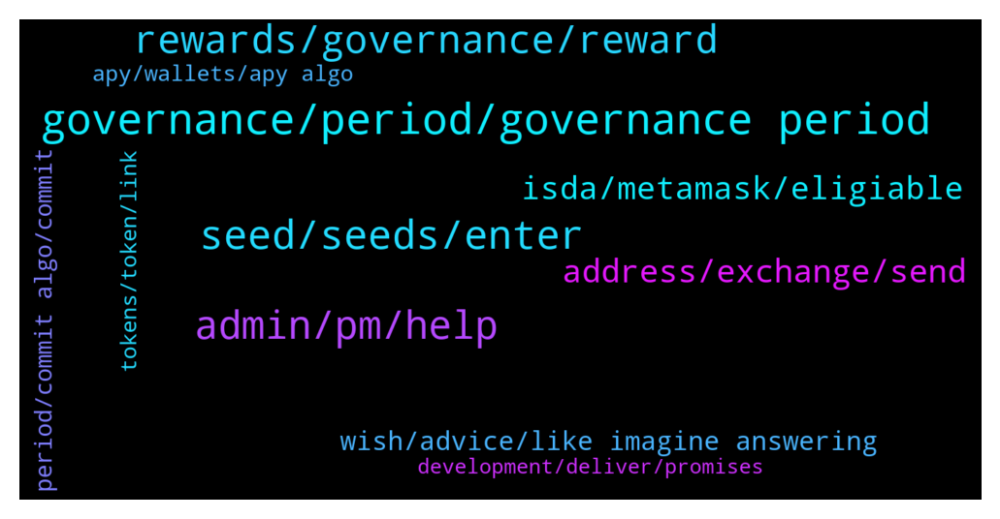

# **@algorand**
 ## Analysis for **2021-12-28** - **2021-12-29**.

---

## 📊 **Basic Stats**

**n_messages_sent**: 235

---

---

## 🔝 **Top keywords and related messages**

1. **governance, period, governance period**

    @MackDenver --- *Hello Emeka, Community Governance enables all Algo holders to participate in the decision making process on the growth and development of the Algorand ecosystem. Signup is ongoing for the second governance period. Check out more here: https://algorand.foundation/governance/* **--->** [TG Discussion](https://t.me/algorand/327321)

    @MackDenver --- *Algorand governance period 2 sign up is ongoing at the moment.* **--->** [TG Discussion](https://t.me/algorand/326967)

    @NightAlgorand --- *Nope, please read the governance FAQ https://algorand.foundation/gov-faq* **--->** [TG Discussion](https://t.me/algorand/327158)

    @KAPIBAYSIDE --- *Does it make sense to put up a small amount of algo for governance* **--->** [TG Discussion](https://t.me/algorand/327151)

    @MackDenver --- *Yes, these ALGOs will be distributed to all participants of the second governance period.* **--->** [TG Discussion](https://t.me/algorand/326985)

    @fikrialr --- *So on governance 2, i should hold it till march 31 right?* **--->** [TG Discussion](https://t.me/algorand/326999)

2. **seed, seeds, enter**

    @NightAlgorand --- *If you enter the exact seed, I am sure there will be no problem with that.* **--->** [TG Discussion](https://t.me/algorand/326905)

    @DayanJ4 --- *admin I can not log in to my wallet .I have screenshot about my 25 seeds .but after enter my seeds .it was wrong .please help me* **--->** [TG Discussion](https://t.me/algorand/326903)

    @wumbu --- *yes i do, note the seed/pharse correctly* **--->** [TG Discussion](https://t.me/algorand/327009)

    @NightAlgorand --- *The key is your seed. If you can't get through, I suppose you wrongly enter the seeds.* **--->** [TG Discussion](https://t.me/algorand/326909)

    @DayanJ4 --- *I checked 3 times enter the seeds .but can not go to my wallet admin* **--->** [TG Discussion](https://t.me/algorand/326908)

    @MackDenver --- *Did you note the seed correctly?* **--->** [TG Discussion](https://t.me/algorand/327006)

3. **admin, pm, help**

    @MackDenver --- *You can reach out to our discord about it  https://discord.com/invite/Pe8rwyPvKp* **--->** [TG Discussion](https://t.me/algorand/327091)

    @Lord_Shin_Chan_2_O --- *@MackDenver sir... Why you avoiding my messages...?🤕* **--->** [TG Discussion](https://t.me/algorand/327012)

    @Crypt0Playa --- *I would send the screenshot so you can see but this DaySandBox bot keeps deleting it* **--->** [TG Discussion](https://t.me/algorand/327129)

    @MackDenver --- *Guys, gentle reminder to take price chat to https://t.me/algorand_price* **--->** [TG Discussion](https://t.me/algorand/327344)

    @NightAlgorand --- *You can join the Chinese Community https://t.me/AlgorandFoundationCN* **--->** [TG Discussion](https://t.me/algorand/327311)

    @Cryptovert223 --- *Yes I've been through there thank you though* **--->** [TG Discussion](https://t.me/algorand/327143)

4. **rewards, governance, reward**

    @bogieman8 --- *@NightAlgorand will the Algo Wallet rewards end at end of February?* **--->** [TG Discussion](https://t.me/algorand/326853)

    @Tsradibanis --- *May I withdraw my comite balance since Im not on the winner list* **--->** [TG Discussion](https://t.me/algorand/326995)

    @KasyWillss --- *I think rewards in Algo wallet, Atomicwallet and others are accrued daily. Depending on your amount of Algo holding* **--->** [TG Discussion](https://t.me/algorand/326855)

    @Crypt0Playa --- *I subscribed about ~33K Algo and the MyAlgoWallet Governance portal says estimated rewards to be just shy of 6000 tokens. Is this right or an error in the portal?* **--->** [TG Discussion](https://t.me/algorand/327119)

    @nicoo1234 --- *Will governance rewards have to be claimed or automatically arrive in the wallet?* **--->** [TG Discussion](https://t.me/algorand/327408)

    @ucumgemblung --- *Admin Can i ask about reward for first governance?   Total Reward ÷ Commited = Reward per each algo commited?   60.000.000 / 1.708.506.071,23 = 0,0351184002  So we will get 0.03 algo for every 1 algo commited on first governance?* **--->** [TG Discussion](https://t.me/algorand/327202)

5. **address, exchange, send**

    @Martin --- *Hey community , I was wondering if there is any way of increasing the privacy of an account? Cause at the moment everyone can know what assets are being moved from and into an account, right?* **--->** [TG Discussion](https://t.me/algorand/327023)

    @Pablo_cast --- *Well, more than be desirable, it's how it works. There are some privacy focused blockchains, but they have many problems with exchanges as they could be used to money laundering* **--->** [TG Discussion](https://t.me/algorand/327030)

    @MackDenver --- *That's why it is decentralized, and Algorand blockchain is already secure. Others can see what you are transferring but nobody will know who is transferring.* **--->** [TG Discussion](https://t.me/algorand/327029)

    @KAPIBAYSIDE --- *I felt the same way best thing is to have several  address maybe one that you only send crypto to. Send to an exchange first before sending to that wallet address for privacy* **--->** [TG Discussion](https://t.me/algorand/327045)

    @Martin --- *But lets say I have the Wallet Address of a friend, or maybe a stranger with whom I transacted something. Then I will be able to know everything he does just putting that address in Algostats?* **--->** [TG Discussion](https://t.me/algorand/327031)

    @KAPIBAYSIDE --- *For example  people can see what coins you are interested  in and staking is that cause for concern ?* **--->** [TG Discussion](https://t.me/algorand/327420)

6. **isda, metamask, eligiable**

    @NightAlgorand --- *Check out this link for all project built on Algorand https://www.algorand.com/ecosystem/use-cases* **--->** [TG Discussion](https://t.me/algorand/326867)

    @Crypt0Playa --- *Thanks. How do I flag the Algo development team to look into the potential erroronous reporting?* **--->** [TG Discussion](https://t.me/algorand/327133)

    @Cryptovert223 --- *I'm adding to my portfolio and tossing up between algo and Adam. Does anyone have any recommendations on sites to research algo that they found helpful. Please and thanks* **--->** [TG Discussion](https://t.me/algorand/327139)

    @Carlos --- *I am looking forward to help on Algorand vision here in Spain. I would like to know if there is someone on the team that I could talk to* **--->** [TG Discussion](https://t.me/algorand/327080)

    @Martin --- *I am not saying anything against Algo (I love Algorand), I am just trying to figure out if things are as I am imaging them or not…* **--->** [TG Discussion](https://t.me/algorand/327041)

    @NightAlgorand --- *Algorand website is a good place to start.* **--->** [TG Discussion](https://t.me/algorand/327142)

7. **wish, advice, like imagine answering**

    @AbuRidwan16 --- *Not at all lol, i wish* **--->** [TG Discussion](https://t.me/algorand/327339)

    @NightAlgorand --- *Yes, that will be the case* **--->** [TG Discussion](https://t.me/algorand/326861)

    @Martin --- *I wish I would have that level of maths* **--->** [TG Discussion](https://t.me/algorand/327214)

    @NightAlgorand --- *Better start than dont at all.* **--->** [TG Discussion](https://t.me/algorand/327157)

    @Pablo_cast --- *Yes, things are like you imagine* **--->** [TG Discussion](https://t.me/algorand/327042)

    @NightAlgorand --- *As far as I know yes.* **--->** [TG Discussion](https://t.me/algorand/326870)

8. **period, commit algo, commit**

    @mcmaxims --- *6k per period? thats too much I assume around 1k algo per 30k committed algo per period* **--->** [TG Discussion](https://t.me/algorand/327120)

    @EmekaKingsley --- *I've committed my algo into the period 2  Am I to use it and vote or I should leave it like that there though am not seeing any voting option there* **--->** [TG Discussion](https://t.me/algorand/327322)

    @EimiFukada96 --- *Equal distribution...or those who commit more than 1 algo will get more?* **--->** [TG Discussion](https://t.me/algorand/326990)

    @Zen_ZZZ --- *For period #2, what if I commit my ALGO being used for commitment at period#1 from now to end of 31st Dec 2021* **--->** [TG Discussion](https://t.me/algorand/327340)

    @Ishansingh00 --- *Ok now I understand I join period 2 on 2January* **--->** [TG Discussion](https://t.me/algorand/327169)

    @EnalTesla20 --- *the number of algo commitments can be increased or only once..?* **--->** [TG Discussion](https://t.me/algorand/327364)

9. **tokens, token, link**

    @Croketaa --- *So those are the only existing tokens on algorand at this moment?* **--->** [TG Discussion](https://t.me/algorand/326869)

    @mcmaxims --- *If you speak of tokens, there are many more which are not listed there. The link Night sent you lists all "big" projects. There are many small projects and tokens as well.* **--->** [TG Discussion](https://t.me/algorand/326875)

    @Croketaa --- *Hey guys, anybody here knows about maricoin token? Its related to algorand Miami acceleration but that’s all I can find online, it’s supposed to be already launched in algorand* **--->** [TG Discussion](https://t.me/algorand/326865)

    @Patdogbaby --- *I'm thinking of launching a token, any good resources to research tokenomics? Max supply, deployment etc* **--->** [TG Discussion](https://t.me/algorand/327203)

    @Martin --- *You could certainly create many wallets for this, but looks too complicated for most people. Imagine saving those 20 secret words for 10 different wallets. Furthermore , you could also track the address of the wallet that is transfering tokens into that wallet, right?* **--->** [TG Discussion](https://t.me/algorand/327035)

    @bogieman8 --- *Any other wallet options?  I have over 30k tokens in Governance but still have some more in the Algorand Wallet…any recommendations?* **--->** [TG Discussion](https://t.me/algorand/326858)

10. **apy, wallets, apy algo**

    @PatBeg --- *only official wallet i guess, sadly, other wallet gives much more apy than myalgo walet* **--->** [TG Discussion](https://t.me/algorand/327159)

    @KAPIBAYSIDE --- *I see someone said the wallet is 0.75 I thought it was more* **--->** [TG Discussion](https://t.me/algorand/327115)

    @Pablo_cast --- *You don't know how many wallets he have* **--->** [TG Discussion](https://t.me/algorand/327032)

    @Crypt0Playa --- *Which other wallets r you talking about that give more APY? I call BS on this. Provide the evidence.* **--->** [TG Discussion](https://t.me/algorand/327160)

    @Chris --- *so i just learned the MyAlgo is different from the AlgoWallet 🙄😂* **--->** [TG Discussion](https://t.me/algorand/326948)

    @KAPIBAYSIDE --- *What's the apy for algo wallet and governance* **--->** [TG Discussion](https://t.me/algorand/327114)

