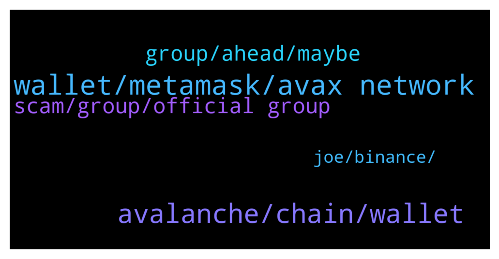

# **@avalancheavax**
 ## Analysis for **2021-12-28** - **2021-12-29**.

---

## 📊 **Basic Stats**

**n_messages_sent**: 116

---

---

## 🔝 **Top keywords and related messages**

1. **wallet, metamask, avax network**

    @Chef --- *Is avax possible to stake and if so on wich platform* **--->** [TG Discussion](https://t.me/avalancheavax/318217)

    @trongtann --- *hi guys, my avax is taking a really long time to get to my metamask wallet.  anyone know why?* **--->** [TG Discussion](https://t.me/avalancheavax/318267)

    @Plato the Enlightener (👁,👁) --- *Yes if you send it all to Binance or kucoin or any other exchange that supports Avax and buy there! Yo should lose 15-20$ for sending your eth but that you cant avoid and thats why Eth will die the slow death and get replaced by avax* **--->** [TG Discussion](https://t.me/avalancheavax/318261)

    @Pytor07 --- *We have special wallet for the stacking Avax?* **--->** [TG Discussion](https://t.me/avalancheavax/317990)

    @Turquality78 --- *To send avax From paribu to binance which one i should choose anybody knows* **--->** [TG Discussion](https://t.me/avalancheavax/318282)

    @Pieruccinii --- *Hi Guys, which is the best platform to farming or staking AVAX? Thanks in advance* **--->** [TG Discussion](https://t.me/avalancheavax/318100)

2. **avalanche, chain, wallet**

    @hiteshpahwa --- *Does capitalisation of wallet address matters in smart contracts in avalanche?* **--->** [TG Discussion](https://t.me/avalancheavax/318195)

    @Nicolas_A --- *List of projects ? Everyone is pretty much working on Avalanche related stuff* **--->** [TG Discussion](https://t.me/avalancheavax/318189)

    @APExCaesar --- *No, avalanche is its own ecosystem which is highly functional and upon which other programmable ecosystems (subnets) can be built.* **--->** [TG Discussion](https://t.me/avalancheavax/318368)

    @clairewilsonxz --- *Avalanche tends to hit a static pump soon that hold more and thank me later* **--->** [TG Discussion](https://t.me/avalancheavax/318357)

    @flyingapeman --- *Hey guy does anyone know any avalanche go node optimizations for c chain? Other then the obvious hardware choices 😅* **--->** [TG Discussion](https://t.me/avalancheavax/318180)

    @Nicolas_A --- *The driver of the Avalanche Andretti team Jake Dennis published a cool vlog in case some of you are interested https://youtu.be/3HHVpml1hJo* **--->** [TG Discussion](https://t.me/avalancheavax/317986)

3. **scam, group, official group**

    @EnduroV1 --- *Another Avalanche Offical group popped up on my Telegram - they saying there is airdrop. Page looks real with 11000+ members. However smells fishy to me? Can anyone confirm this is scam and if though we may need a pinned messge to warn other people in the community* **--->** [TG Discussion](https://t.me/avalancheavax/318113)

    @Lanzhujian --- *I was in another avalanche official group and they are doing airdrop. That scam right?* **--->** [TG Discussion](https://t.me/avalancheavax/318274)

    @sophia720 --- *You are a great detective, lol🤣* **--->** [TG Discussion](https://t.me/avalancheavax/318089)

    @oathtobarbatos --- *Yup, it's a scam. This is the only official group!* **--->** [TG Discussion](https://t.me/avalancheavax/318275)

    @Bruno_LGD --- *Most probably they are trying to scam you lol* **--->** [TG Discussion](https://t.me/avalancheavax/318167)

    @oathtobarbatos --- *It's a scam. This is the only official group. Be careful, guys!* **--->** [TG Discussion](https://t.me/avalancheavax/318129)

4. **group, ahead, maybe**

    @Desk --- *How you’ll be in her heart* **--->** [TG Discussion](https://t.me/avalancheavax/318125)

    @Nicolas_A --- *Hahaha I feel bad deleting the context of this joke* **--->** [TG Discussion](https://t.me/avalancheavax/318038)

    @flyingapeman --- *Don’t fall for those people guys* **--->** [TG Discussion](https://t.me/avalancheavax/318184)

    @jori --- *You should know where is right* **--->** [TG Discussion](https://t.me/avalancheavax/318096)

    @jori --- *We are in the opposite state* **--->** [TG Discussion](https://t.me/avalancheavax/318093)

    @anilyeni --- *but the tradition is using lowercase* **--->** [TG Discussion](https://t.me/avalancheavax/318200)

5. **joe, binance, **

    @CyberSensei --- *YetiSwap going to listed on MEXC 💥💥❄️  https://twitter.com/YetiSwap/status/1475407145239818240?t=xCAZM1KiBFqjqVa7ooDiWQ&s=19* **--->** [TG Discussion](https://t.me/avalancheavax/317999)

    @Joeyve23 --- *Plethori listed on Trader Joe in 3 minutes everyone!! Absolute small cap gem! PLE/AVAX* **--->** [TG Discussion](https://t.me/avalancheavax/318367)

    @Abhi --- *if any one wants to check go to binance.com/en/support/announcement* **--->** [TG Discussion](https://t.me/avalancheavax/318297)

    @gugumillo --- *Binance Will List JOE (JOE) TraderJoe 2021-12-28 01:56 Fellow Binancians, Binance will list JOE (JOE) and will open trading for JOE/BTC, JOE/BUSD and JOE/USDT trading pairs at 2021-12-28 11:00 (UTC). Users can now start depositing JOE in preparation for trading Withdrawals for JOE will open at 2021-12-29 11:00 (UTC)* **--->** [TG Discussion](https://t.me/avalancheavax/318128)

    @muzi0123 --- *Binance announced to list Trader Joe officially just now* **--->** [TG Discussion](https://t.me/avalancheavax/318114)

    @Abhi --- *have u heard about New Year Special Offer - Earn Up to 6X More with Savings..Binance has launched a [New Year Limited] promotional offer for AVAX, LUNA, MATIC and NEAR, helping users to increase their earnings by up to 6x on Flexible Savings. Promotion period: From 2021-12-29 00:00 (UTC) to 2022-01-05 00:00 (UTC)* **--->** [TG Discussion](https://t.me/avalancheavax/318294)

