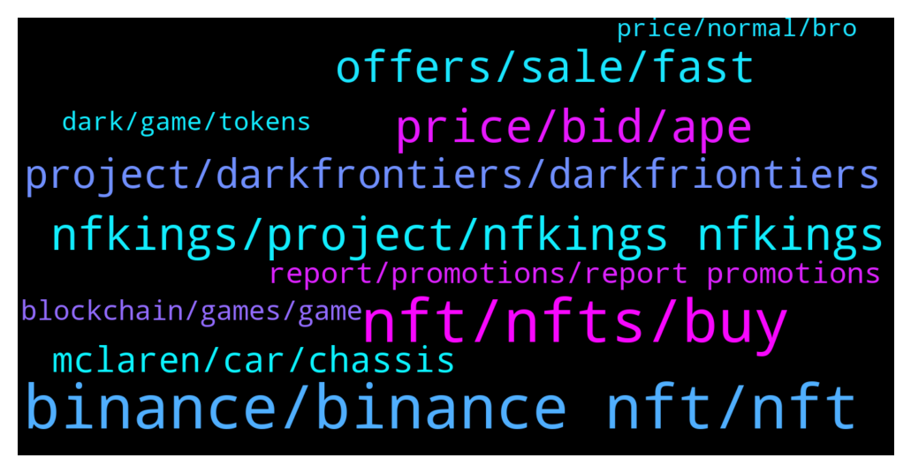

# **@binancenfts**
 ## Analysis for **2021-12-28** - **2021-12-29**.

---

## 📊 **Basic Stats**

**n_messages_sent**: 528

---

---

## 🔝 **Top keywords and related messages**

1. **binance, binance nft, nft**

    @semeerkv --- */report share here BINANCE nft’S and related only . @Sahib_BNB @Dean_khan* **--->** [TG Discussion](https://t.me/binancenfts/418220)

    @ChaoXChaoX --- *To celebrate this HUGE drop and also we are happy to have this AMA session with the Binance NFT, we prepared 5 NFT airdrops 👀 for the community.* **--->** [TG Discussion](https://t.me/binancenfts/418273)

    @semeerkv --- *Off topic. This is BINANCE nft group. Shares BINANCE nft’S and related only . Follow rules brother 🙂* **--->** [TG Discussion](https://t.me/binancenfts/418230)

    @Le0n1D4s --- *admin, is it possible to send all erc20 verified NFT's on opensea to binance NFT marketplace to buy/sell ?  Or does a project need to be "listed" first ? And if so, how does one apply ? Thanks* **--->** [TG Discussion](https://t.me/binancenfts/418613)

    @Aliniordache11 --- *is the nft and the project from binance how can i show  to the guy i am selling what i am saying if he says is  not true ?* **--->** [TG Discussion](https://t.me/binancenfts/420124)

    @De_Gentleman --- *How do I buy nft on binance* **--->** [TG Discussion](https://t.me/binancenfts/419243)

2. **nft, nfts, buy**

    @Francisemma017 --- *How can I create my own nft   Am an Airtist* **--->** [TG Discussion](https://t.me/binancenfts/419107)

    @RP0101 --- *i dont know about nfts my friend forcing me to buy* **--->** [TG Discussion](https://t.me/binancenfts/419994)

    @Aliniordache11 --- *the matevaerse is in alfa testing you should give it a go and see what`s that all about , we are still early . i reckon this nft is 1 mil nft at max lvl .* **--->** [TG Discussion](https://t.me/binancenfts/420157)

    @daivik_2006 --- *Huobi Wallet - Get NFT Worth 50$ - 200$ [Or Even More]  App Link - houbi Wallet on Play Store and app store  Step 1:-  1. Download App. 2. Click On Add Wallet. 3. Choose Polygon , Enter Your Password  4. Wallet Created Sucessfully.  Step2:-  1. From Bottom Go To DApps. 2. Paste Link from bio  3. Enter Refer Code In Banner & Click Submit.  Refer code: LDE1Q9  4. Now On That Page Click On 'Link Address'. 5. Click On Link Wallet.  6. That's It You Get 1 Draw Free Using Refer Code.  7. You Can Draw Tomorrow On 29 Dec 1 PM.  Don't Miss We Can Expect 50-200$ From NFT.   [Total 45000 NFT Are Available]* **--->** [TG Discussion](https://t.me/binancenfts/419232)

    @Aliniordache11 --- *thank you , they announced this item will be SR in metaverse and will be an NPC with real jobs so i think will be able to fam a lot !* **--->** [TG Discussion](https://t.me/binancenfts/420147)

    @Ricardorvs --- *has already been revealed what the use of these nfts?* **--->** [TG Discussion](https://t.me/binancenfts/417759)

3. **price, bid, ape**

    @semeerkv --- *If you want Place your bid cheapest  Search on BINANCE market 👇  Badass Ape #307* **--->** [TG Discussion](https://t.me/binancenfts/418463)

    @semeerkv --- *Current Bid 44$ Cheapest on market  Search on Binance Market 👇  BORED APE #10076▵22* **--->** [TG Discussion](https://t.me/binancenfts/419483)

    @semeerkv --- *Bid Started Cheap Price.  Place you bid Search on BINANCE market 👇  Badass Ape #307* **--->** [TG Discussion](https://t.me/binancenfts/418081)

    @semeerkv --- *Start Your Bid Lowest Price Search on BINANCE market 👇  BORED APE #10076▵22* **--->** [TG Discussion](https://t.me/binancenfts/418149)

    @semeerkv --- *Bid Started Cheap Price Search On BINANCE market 👇  Badass Ape #307* **--->** [TG Discussion](https://t.me/binancenfts/418689)

    @semeerkv --- *if one bid is done you cant cancel* **--->** [TG Discussion](https://t.me/binancenfts/417685)

4. **nfkings, project, nfkings nfkings**

    @kesukehoNDA --- *Do you think the client is an important factor in the development of the project? NFKings hold special events or promotions to attract new users?#NFKings* **--->** [TG Discussion](https://t.me/binancenfts/418374)

    @Fatima_6336 --- *#NFKings Only getting users, holders etc is not everything. In my opinion, a project needs to deal with solving a real world issue or problem What is the problem that  your project primarily focuses on? Please share with us!!* **--->** [TG Discussion](https://t.me/binancenfts/418373)

    @JNeymar --- *I am very impressed with your project, can you and the team tell us more about NFKings the idea how it started and especially why it is needed? Where did the inspiration when you picked that idea come from?#NFKings* **--->** [TG Discussion](https://t.me/binancenfts/418371)

    @DEMLBABA --- *To attract more users, the best strategy is to create Airdrops, bounty, .. for users. Besides organizing AMA program, the team has any other program or event to attract more customers to NFKings are not?#NFKings* **--->** [TG Discussion](https://t.me/binancenfts/418365)

    @Minahil559452 --- *#NFKings Only getting users, holders etc is not everything. In my opinion, a project needs to deal with solving a real world issue or problem What is the problem that  your project primarily focuses on? Please share with us!!* **--->** [TG Discussion](https://t.me/binancenfts/418322)

    @Venlessw --- *Bad artists can steal ideas or music that doesn't belong to them and upload them to NFkings. How do you prevent this from happening? Do you check or audit every incoming content before it is published on NFkings?#NFKings* **--->** [TG Discussion](https://t.me/binancenfts/418357)

5. **offers, sale, fast**

    @Forta0i --- *All four for sale dm ur offers* **--->** [TG Discussion](https://t.me/binancenfts/418698)

    @Forta0i --- *Flash sale all four of these @ 80$  The one who pm me 1st will get it* **--->** [TG Discussion](https://t.me/binancenfts/418134)

    @Forta0i --- *All four for sale 100$  fix price  Dm if only interested or i block u* **--->** [TG Discussion](https://t.me/binancenfts/418553)

    @HudaMohammed01 --- *Guys We are not allowed to sell anything here as mentioned* **--->** [TG Discussion](https://t.me/binancenfts/418679)

    @Forta0i --- *All four  available for sale  Dm me offers* **--->** [TG Discussion](https://t.me/binancenfts/418514)

    @Forta0i --- *Send me good offers and get  it* **--->** [TG Discussion](https://t.me/binancenfts/417709)

6. **project, darkfrontiers, darkfriontiers**

    @ChaoXChaoX --- *More details of the project and campaigns please read our medium  https://medium.com/@NFKingsPro/the-biggest-project-for-the-year-2021-mclaren-12c-gt3-chassis-8-2772c461290f* **--->** [TG Discussion](https://t.me/binancenfts/418310)

    @The_BigBanGgg --- *Your project name seems to be very interesting. Does it have any story behind it? Can you share us with the inspiron for approaching to this name??? #DarkFrontiers* **--->** [TG Discussion](https://t.me/binancenfts/419908)

    @Try_Vique --- *Hello Sylvia,   Players and developers are the core elements of the Gamefi ecosystem. How will Dark Frontiers attract target audiences and ensure player retention amongst competition?     #DarkFrontiers* **--->** [TG Discussion](https://t.me/binancenfts/419879)

    @abhinav9719 --- *Many play-to-earn project already available in the market so what make your project unique from others?? #Darkfrontiers* **--->** [TG Discussion](https://t.me/binancenfts/419880)

    @onguvercin --- *Any set up partnerships on Metaverse via Dark Frontier GS? What will be your brand engagement strategy at all? #DarkFrontiers* **--->** [TG Discussion](https://t.me/binancenfts/419881)

    @SkyKnightMoon --- *Which one of these aspects is important for you?  1 - Empowering Platform Development  2 - Building Community Trust  3 - Expanding Partnership Globally In what order  #DarkFriontiers* **--->** [TG Discussion](https://t.me/binancenfts/419890)

7. **mclaren, car, chassis**

    @cocoteaaa --- *Since you’ve said earlier, when Lambo? Will you include in your future plans to conduct an event with a real Lamborghini supercar as a prize? @ChaoXChaoX  #NFKings* **--->** [TG Discussion](https://t.me/binancenfts/418347)

    @ChaoXChaoX --- *As it is nearly New Year, the last project of the year, we are very excited and honored to be partnering with NFGT and launching the Mclaren GT3 Chassis #8 NFT mystery boxes with the ultimate prize of winning THE McLaren official race car both in physical and digital!* **--->** [TG Discussion](https://t.me/binancenfts/418271)

    @ibps94 --- *I'm curious about this, you said the Mclaren GT3 Chassis #8 NFT mystery boxes will be developed in the metaverse. will it be related to gamefi? I'm a fan of racing games @ChaoXChaoX . thank you #NFKINGS* **--->** [TG Discussion](https://t.me/binancenfts/418368)

    @ChaoXChaoX --- *The design concept of this McLaren GT3 Chassis #8 NFT project is the combination of unconventional materials and mechanical parts that bring a new visual impact.* **--->** [TG Discussion](https://t.me/binancenfts/418285)

    @kaka_hatake --- *Regarding Mclaren GT3 Chassis #8 NFT, are there only 8 mystery boxes? What is the pricing of those boxes? Is it true that I can get official car in physical also? #NFKings* **--->** [TG Discussion](https://t.me/binancenfts/418325)

    @ChaoXChaoX --- *And yes, you didn’t read that wrong, one person will win the REAL Mclaren GT3 Chassis #8 racecar! It is worth up to USD $400,000! And in terms of digital, because this car is unique, the person who wins the car will be able to develop it in Metaverse.* **--->** [TG Discussion](https://t.me/binancenfts/418289)

8. **report, promotions, report promotions**

    @semeerkv --- */report @Sahib_BNB non stop spaming @killuabnb* **--->** [TG Discussion](https://t.me/binancenfts/419429)

    @YaphetsDota --- *So for that you'll report? Are you kidding me* **--->** [TG Discussion](https://t.me/binancenfts/418226)

    @ibrahimozkok --- *fake accounts can be very dangerous indeed!!!* **--->** [TG Discussion](https://t.me/binancenfts/419081)

    @ChibiMaya_bnb --- *!warn no promo of other webs* **--->** [TG Discussion](https://t.me/binancenfts/418949)

    @c_hinmay --- */report @Jarvisbnb no promotions related  to ....* **--->** [TG Discussion](https://t.me/binancenfts/419621)

    @semeerkv --- */report no promotions here @Sahib_BNB @Dean_Khan @Jarvisbnb @ChibiMaya_bnb .* **--->** [TG Discussion](https://t.me/binancenfts/419234)

9. **blockchain, games, game**

    @funraiy --- *Majority of blockchain gaming are often focus more on the blockchain rather the the game itself, as you said.  Related that, how do you compare your project better than others gaming projects?   .* **--->** [TG Discussion](https://t.me/binancenfts/419873)

    @sylviasavi --- *We sometimes see blockchain games calling themselves that, and it's just wrong* **--->** [TG Discussion](https://t.me/binancenfts/419806)

    @sylviasavi --- *Yes but it's important to say , that no game on blockchain at the moment can call themselves AAA* **--->** [TG Discussion](https://t.me/binancenfts/419804)

    @sylviasavi --- *The main problem in blockchain gaming is the current quality of most games- they look like they were developed 20 years ago. Also, they often focus more on the blockchain, rather the the game itself. We say GAMEPLAY FIRST< BLOCKCHAIN SECOND. We believe it's the only sustainable way for blockchain gaming.* **--->** [TG Discussion](https://t.me/binancenfts/419789)

    @landcruiz --- *You mentioned that the main problem in blockchain gaming is the current quality of most games look like they were developed 20 years ago.  How much do you believe that your game is technically more advanced and modern?* **--->** [TG Discussion](https://t.me/binancenfts/419909)

    @spotverse --- *I'm so interested with your statement " GAMEPLAY FIRST,  BLOCKCHAIN SECOND".   Why not by balancing the two 50 50? what is the reason and method of choosing your option?* **--->** [TG Discussion](https://t.me/binancenfts/419893)

10. **dark, game, tokens**

    @TDECIMAL --- *Can we trade $DARK  in various exchanges ? #DarkFrontiers* **--->** [TG Discussion](https://t.me/binancenfts/419949)

    @irfanecruz --- *What is the reason why does Dark Frontiers have 2 tokens $GAME and $DARK? Does these tokens are listed on exchanges? #DarkFrontiers* **--->** [TG Discussion](https://t.me/binancenfts/419918)

    @nuryildiz58 --- *"Sometimes" phrase took interesting when you mention about "Dark Matter Energy, in combination with $GAME Tokens and sometimes combined with $DARK Tokens"   In what cases there would occur a combination? #DarkFrontiers* **--->** [TG Discussion](https://t.me/binancenfts/419897)

    @c_hinmay --- *What are $DARK and $GAME tokenomics? #DarkFrontiers* **--->** [TG Discussion](https://t.me/binancenfts/419886)

    @sylviasavi --- *First of all, $DARK is a BEP-20 token, as we believe it's the most friendly infrastructure for games at the moment. $GAME also has a BEP-20 bridge.* **--->** [TG Discussion](https://t.me/binancenfts/419814)

    @sylviasavi --- *$DARK token will serve as an in-game energy unit. Energy is needed to power the gameplay - travel, mine and merge NFTs. It can also be mined by claiming land on different planets. So $DARK will be very much like the heart and the blood of the game.  $GAME will also be featured, it will act as a booster to certain in-game processes, and you will also be able to buy NFTs with $GAME on Gamestarter marketplace.* **--->** [TG Discussion](https://t.me/binancenfts/419815)

