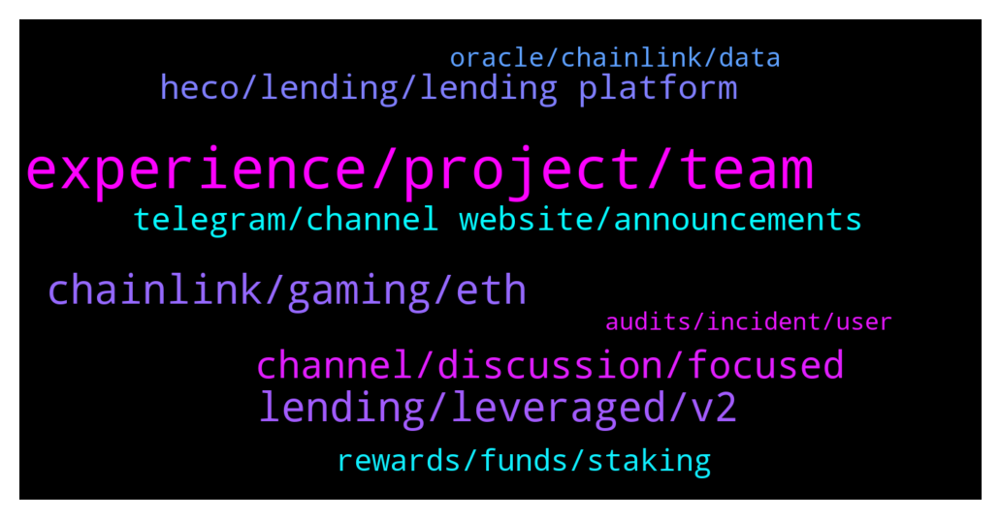

# **@chainlinkofficial**
 ## Analysis for **2021-12-28** - **2021-12-29**.

---

## 📊 **Basic Stats**

**n_messages_sent**: 179

---

---

## 🔝 **Top keywords and related messages**

1. **experience, project, team**

    @Simon --- *I'm not that good in English, so just use simple words.* **--->** [TG Discussion](https://t.me/chainlinkofficial/357999)

    @Anglo53 --- *Do you want to create a Arabic    community for your project? We have a team with good experience in the cryptocurrency field* **--->** [TG Discussion](https://t.me/chainlinkofficial/357853)

    @kerrran --- *The third point is user experience. The user experience of Channels has been praised and recognized by many users. Whether it is the convenience of interactive operations or the overall UI style, our users use one word to describe Channels: smooth We sincerely invite you to experience the channel:https://bsc.channels.finance/* **--->** [TG Discussion](https://t.me/chainlinkofficial/357675)

    @marcromeron --- *Best of lucks on Channels project on 2022!!!* **--->** [TG Discussion](https://t.me/chainlinkofficial/357760)

    @marcromeron --- *Can you tell us more about Channels V2?* **--->** [TG Discussion](https://t.me/chainlinkofficial/357642)

    @marcromeron --- *What's the recent development of Channels?* **--->** [TG Discussion](https://t.me/chainlinkofficial/357711)

2. **chainlink, gaming, eth**

    @Simon --- *I want really to buy chainlink, but I am not sure* **--->** [TG Discussion](https://t.me/chainlinkofficial/357989)

    @ProfessionalApe --- *Is there an easy way to use chainlink to read transactions/information from one chain on another chain? e.g. call a read contract method for an ETH contract on BSC?* **--->** [TG Discussion](https://t.me/chainlinkofficial/357589)

    @Hodayfa01 --- *I have a suggestion regarding establishing an Arabic group for $Chainlink With whom do I communicate?* **--->** [TG Discussion](https://t.me/chainlinkofficial/357856)

    @Simon --- *Ok some technological questions, what can I do with chainlink?* **--->** [TG Discussion](https://t.me/chainlinkofficial/357996)

    @Max --- *Hey guys,  I have some LINK on my metamask, ETH network  How could I swap these LINK from ETH Network to BSC ?* **--->** [TG Discussion](https://t.me/chainlinkofficial/357584)

    @marcromeron --- *Just  another question. One of the most interesting for Chainlink Community...* **--->** [TG Discussion](https://t.me/chainlinkofficial/357737)

3. **lending, leveraged, v2**

    @kerrran --- *Channels is about to announce the deployment of the V2 contracts. Channels     V2 will first support leveraged lending, followed by leveraged trading in mainstream tokens, and last but not the least, the lending yield vault.* **--->** [TG Discussion](https://t.me/chainlinkofficial/357639)

    @kerrran --- *● And last but not the least, Channels V2!  The deployment of the V2 contract will be in three steps. Channels V2 will first support leveraged lending, followed by leveraged trading in mainstream tokens, and last but not the least, the Lending Liquidity Yield Aggregation （LLYA）.* **--->** [TG Discussion](https://t.me/chainlinkofficial/357732)

    @kerrran --- *Our biggest development is V2. By adopting leveraged lending, leveraged trading, and an implementation of lending liquidity yield aggregation strategy (LLYA), Channels V2 is an innovative upgrade of lending protocol to improve capital efficiency.* **--->** [TG Discussion](https://t.me/chainlinkofficial/357712)

    @kerrran --- *Channels V2 innovatively integrates leveraged lending and mortgage lending into one liquidity pool, it means that users can either over-collateralize and borrow assets, or directly use the leveraged lending function to achieve leveraged mining.* **--->** [TG Discussion](https://t.me/chainlinkofficial/357646)

    @kerrran --- *The main driver for the development of Channels V2 is to improve capital efficiency, by adopting leveraged lending, leveraged trading, and implementation of lending liquidity yield aggregation strategy (LLYA).* **--->** [TG Discussion](https://t.me/chainlinkofficial/357644)

    @kerrran --- *6. Leveraged Lending/leveraged Trading These functionalities will be released when V2 is live.* **--->** [TG Discussion](https://t.me/chainlinkofficial/357707)

4. **channel, discussion, focused**

    @RomainSwitzerland --- *Hi Simon, This channel is for a focused technical discussions about Chainlink, price action is outside the scope of this channel.* **--->** [TG Discussion](https://t.me/chainlinkofficial/357991)

    @Aaronthedog --- *yes ok ... but it didn't seem like a discussion on prices ...* **--->** [TG Discussion](https://t.me/chainlinkofficial/357864)

    @Enla520 --- *Where can I buy it, how much does the cheapest beast cost?* **--->** [TG Discussion](https://t.me/chainlinkofficial/357835)

    @ElCidKampeador --- *I think there’s a problem with my MetaMask and I can’t buy, anyone having the same issues?* **--->** [TG Discussion](https://t.me/chainlinkofficial/357845)

    @Linkederic --- *A quick look at essentially any DEX will answer this question for you. I'll reiterate, no trading discussion is permitted in this channel.* **--->** [TG Discussion](https://t.me/chainlinkofficial/358012)

    @JoshSimenhoff --- *It does seem like a discussion on the market* **--->** [TG Discussion](https://t.me/chainlinkofficial/357865)

5. **heco, lending, lending platform**

    @kerrran --- *l   Channels has consistently ranked first in the TVL of loan products in Heco, and the total TVL has been consistently ranked second among all heco products.* **--->** [TG Discussion](https://t.me/chainlinkofficial/357715)

    @kerrran --- *First of all, Channels is the only project on HECO that has zero security incidents since it went online in February 2021. The most important thing is technology.* **--->** [TG Discussion](https://t.me/chainlinkofficial/357684)

    @kerrran --- *The fourth point is the highlight of the project. Channels is the first project on HECO to support LP mortgage lending. The original intention of Channels is to expand the collateral, maximize the utilization of funds, and thus increase the income of users, because mortgage LPs can also obtain income.* **--->** [TG Discussion](https://t.me/chainlinkofficial/357676)

    @kerrran --- *Data will not deceive people. At the same time, we are the first lending platform on Heco that supports LP mortgage loans and the largest LP lending platform on Heco.* **--->** [TG Discussion](https://t.me/chainlinkofficial/357674)

    @marcromeron --- *Number one in HECO! wow that's impressive* **--->** [TG Discussion](https://t.me/chainlinkofficial/357641)

    @kerrran --- *The first and most basic point is security. Channels is the first lending platform in the Heco ecosystem that adopts a decentralized oracle solution, and it is also the first lending platform who completes open source, verification and auditing before launch. There is no doubt that among all lending products, the safety of user assets is the most import, we have 0 incidents since our launch.* **--->** [TG Discussion](https://t.me/chainlinkofficial/357668)

6. **telegram, channel website, announcements**

    @kerrran --- *🌐 Website: channels.finance 🐦Twitter: https://twitter.com/ChannelsFinance/  🔥 Telegram: https://t.me/ChannelsEN 📚 Medium: https://channelsfinance.medium.com/* **--->** [TG Discussion](https://t.me/chainlinkofficial/357755)

    @harrumphharrumph --- *@Juan_Briz thanks for trying to warn people. The bot removes mentions of DM or private messages from newer users.  We will never DM people with special offers.  This article is helpful to avoid being scammed: https://chainlinktoday.com/dont-get-got-avoiding-the-most-common-crypto-scams/* **--->** [TG Discussion](https://t.me/chainlinkofficial/357975)

    @Mrkaaaa --- *Hi guys, how can find the news/ announcements or good/bad news about Link? any specific channel or website?* **--->** [TG Discussion](https://t.me/chainlinkofficial/357849)

    @marcromeron --- *If you have any other questions, please visit their Telegram channel https://t.me/beastieschat* **--->** [TG Discussion](https://t.me/chainlinkofficial/357836)

    @nam_nguyenson --- *China has a telegram group, It’s called @chainlinkfans (unofficial) and please also feel free to check out our Chinese communities (official) here:  https://blog.chain.link/chainlink-chinese-communities/* **--->** [TG Discussion](https://t.me/chainlinkofficial/357619)

    @PolivodaTatiana --- *Please refer to the message above 👆* **--->** [TG Discussion](https://t.me/chainlinkofficial/357857)

7. **rewards, funds, staking**

    @kerrran --- *4.Staking single-token  Channels hold mining events, such as mining CAN by staking COW and C98.* **--->** [TG Discussion](https://t.me/chainlinkofficial/357704)

    @kerrran --- *2.Staking in LP： For example, providing WBNB-BUSD-LP in Pancake could get CAN and CAKE rewards, the APY will be 52.22%.* **--->** [TG Discussion](https://t.me/chainlinkofficial/357700)

    @kerrran --- *1. Staking and lending： These are our fundamental features.  You can get rewards by both supplies and borrowing. By leveraging your investment, you will have double/triple rewards and maximize your interests.* **--->** [TG Discussion](https://t.me/chainlinkofficial/357698)

    @kerrran --- *The farming rewards will be directly given to deposit users, boosting the return rate of funds on Channels. In addition, in order to ensure the absolute safety of funds, funds will only be put into reputable DEXs, such as Pancake on BSC, that has passed the risk analysis.* **--->** [TG Discussion](https://t.me/chainlinkofficial/357654)

    @kerrran --- *Such an initiative not only meets the needs of borrowers for flexible use of funds, but can also increase profits through leveraged mining. At the same time, because the shared fund pool has greatly increased the utilization rate of funds, deposit users can obtain higher rewards.* **--->** [TG Discussion](https://t.me/chainlinkofficial/357647)

    @kerrran --- *5.CAN could also mine other tokens, for example, CAN-MDX-LP could mine YF in YF.FARM. We also partner with other projects, you can stake CAN earn out partners’ token as rewards.* **--->** [TG Discussion](https://t.me/chainlinkofficial/357706)

8. **oracle, chainlink, data**

    @kerrran --- *Decentralized Network — Chainlink Price Feeds are decentralized at the data source, oracle node, and oracle network levels, generating strong protections against downtime and tampering by either the data provider or oracle network.* **--->** [TG Discussion](https://t.me/chainlinkofficial/357749)

    @kerrran --- *Secure Node Operators — Chainlink Price Feeds are secured by independent, security-reviewed, and Sybil-resistant oracle nodes run by leading blockchain DevOps teams, data providers, and traditional enterprises. Chainlink nodes have a strong track record of reliability, even during high gas prices and infrastructure outages.* **--->** [TG Discussion](https://t.me/chainlinkofficial/357748)

    @kerrran --- *After reviewing various oracle solutions, we integrated Chainlink Price Feeds because they provide a multitude of critical features such as:* **--->** [TG Discussion](https://t.me/chainlinkofficial/357746)

    @kerrran --- *Thus, we need to make use of an oracle network to fetch aggregated price data off-chain and deliver it on-chain to be consumed by our application.* **--->** [TG Discussion](https://t.me/chainlinkofficial/357745)

    @kerrran --- *We chose Chainlink as our go-to oracle solution because its infrastructure is seamless to integrate and time-tested in production. Chainlink already helps secure leading DeFi protocols responsible for tens of billions of dollars in smart contract value, maintaining robust security and high availability even amidst unexpected extreme market events, such as exchange downtime, flash crashes, and data manipulation attacks via flash loans.* **--->** [TG Discussion](https://t.me/chainlinkofficial/357741)

    @kerrran --- *Our initial integration involves the use of Chainlink Price Feeds for the following assets: BNB, BUSD, DAI, USDC, USDT，BTC, ETH, BETH, XRP, ADA, UNI, BCH, LTC, LINK, FIL, MATIC, DOGE, DOT, and CAKE.* **--->** [TG Discussion](https://t.me/chainlinkofficial/357740)

9. **audits, incident, user**

    @Juan_Briz --- *whether this information can help the community and prevent theft* **--->** [TG Discussion](https://t.me/chainlinkofficial/357978)

    @kerrran --- *There has never been any security incident since it went online* **--->** [TG Discussion](https://t.me/chainlinkofficial/357719)

    @kerrran --- *There has not been any incident of user assets being stolen. In addition, we also have a professional risk control consulting team.* **--->** [TG Discussion](https://t.me/chainlinkofficial/357686)

    @marcromeron --- *Audits are critical in blockchain ecosystem, so that's perfect.* **--->** [TG Discussion](https://t.me/chainlinkofficial/357670)

    @marcromeron --- *You talk about audits, etc.. but, how do you guarantee user's asset security?* **--->** [TG Discussion](https://t.me/chainlinkofficial/357683)

