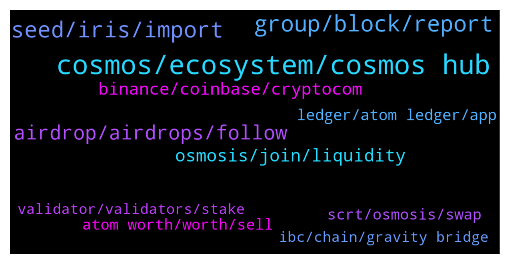

# **@cosmosproject**
 ## Analysis for **2021-12-28** - **2021-12-29**.

---

## 📊 **Basic Stats**

**n_messages_sent**: 564

---

---

## 🔝 **Top keywords and related messages**

1. **cosmos, ecosystem, cosmos hub**

    @luketchang --- *Hey anyone got any recommendations for podcasts on the Cosmos ecosystem? :)* **--->** [TG Discussion](https://t.me/cosmosproject/462155)

    @Hindrhasha --- *Good coding languages, high quality packages and plug-ins, well-coordinated hackatoms, good self-development support for developers, and financial support for development will do that without the tribal tweets :)* **--->** [TG Discussion](https://t.me/cosmosproject/461812)

    @AtomJazz --- *There are application specific cosmos chains that are very functional on Cosmos. Terra is one, Osmosis etc.* **--->** [TG Discussion](https://t.me/cosmosproject/461769)

    @citizencosmos --- *Several projects that launched around the Cosmos ecosystem in 2021 are able to bring significant value to the crypto industry. And we had a discussion with one of them recently!   - A project on the edge of two ecosystems: Cosmos & Ethereum - A project that brings IBC interoperability to Ethereum - A project that includes Cosmos-SDK and full EVM compatibility  As many of you have guessed, we are talking about Evmos.  Check out our episode with their co-founder tomorrow on: https://www.citizencosmos.space/episodes* **--->** [TG Discussion](https://t.me/cosmosproject/462505)

    @Hindrhasha --- *Well, if you want be honest about it you need to compare the cosmos chain alone with cardano.* **--->** [TG Discussion](https://t.me/cosmosproject/461789)

    @EvoCryptoAdmin --- *Cosmos (ATOM): The Internet of Blockchains  Atom, a cryptocurrency based on the Cosmos blockchain, has a market value of $5.72 billion...  https://coinposters.com/cosmos-atom-the-internet-of-blockchains/* **--->** [TG Discussion](https://t.me/cosmosproject/461673)

2. **group, block, report**

    @B_hshzd --- *Blocked money I can not do anything. Should I send a message to Trust wallet?* **--->** [TG Discussion](https://t.me/cosmosproject/461829)

    @M --- *Wow... 6 scammers already contact me from this chat. Looks like half of India is in here pretending to be mods and trying to scam people!* **--->** [TG Discussion](https://t.me/cosmosproject/461520)

    @ZoltanAtom --- *Bots are crazy nowadays. They all hungry it seems. Always be mega careful. Don’t trust no one.* **--->** [TG Discussion](https://t.me/cosmosproject/462325)

    @ZoltanAtom --- *You too. (If someone DM to you, block and report. No wallet support on telegram ⚠️⚠️⚠️)* **--->** [TG Discussion](https://t.me/cosmosproject/461528)

    @Vokai --- *Lol I write there "is this scam?" They delete me 😎* **--->** [TG Discussion](https://t.me/cosmosproject/461674)

    @vladc1 --- *If you are a member of any crypto-related #Telegram or #WhatsApp group, you are a target for all sorts of scammers  There are 3 main kinds of scams in #crypto communities: fake groups, copycat admins, and pump and dump groups  1. The perpetrators create a copycat group that mimics an original. For example, it might offer an opportunity to purchase tokens at a discount price  Change your group invite settings to "My contacts" only — and you’ll essentially eliminate this problem  2. After requesting support in a public group you can receive a DM from the copycat admin. They will pretend to help you, but end up asking for your #privatekeys or #seedphrase  Search the group for posts from this user — if nothing appears, it's a fake admin  3. The feigned purpose of most pump groups is to provide insider insights  Many of these platforms will try to promote a sense of urgency in you, to force you to act without thinking. If you get this feeling, you’re probably dealing with a pump group  Please take care!* **--->** [TG Discussion](https://t.me/cosmosproject/462116)

3. **seed, iris, import**

    @TicoJohnny --- *Hey you can make an Iris address with Keplr, click on the the top arrow and select Iris* **--->** [TG Discussion](https://t.me/cosmosproject/462159)

    @ZoltanAtom --- *All you need to do is simply import your mnemonics and use Keplr wallet.   Check this step by step guide: https://medium.com/chainapsis/how-to-use-keplr-wallet-40afc80907f6* **--->** [TG Discussion](https://t.me/cosmosproject/462508)

    @Alex2021x --- *Iris works on keplr smartphone app too?* **--->** [TG Discussion](https://t.me/cosmosproject/461725)

    @MooseVET --- *i have a cosmostation wallet but want to open a kelpr too using the same seed phrase... is it unsafe to import my cosmostation seed to kelpr?* **--->** [TG Discussion](https://t.me/cosmosproject/462002)

    @AtomJazz --- *Keplr support team is only reachable here https://keplr.crunch.help/* **--->** [TG Discussion](https://t.me/cosmosproject/462067)

    @Matteoo_93 --- *Hi 🙂  Do I need a MEMO to send from a crypto.com wallet to a keplr one?* **--->** [TG Discussion](https://t.me/cosmosproject/462523)

4. **airdrop, airdrops, follow**

    @ZoltanAtom --- *There was lots of snapshot for lofs of airdrop. Please join Cosmos airdrop community to follow all airdrops ;  https://t.me/CosmosAirdrops* **--->** [TG Discussion](https://t.me/cosmosproject/462310)

    @AtomJazz --- *Cool, you'll be able to earn some future airdrops that way* **--->** [TG Discussion](https://t.me/cosmosproject/462415)

    @Cordtus --- *You can view governance sometimes by keplr wallet interface, mintscan, or sometimes a different web UI. And I don't know what future airdrops will set as requirements.* **--->** [TG Discussion](https://t.me/cosmosproject/461846)

    @ebp700 --- *i dont participate in airdrops of atom* **--->** [TG Discussion](https://t.me/cosmosproject/462416)

    @pnp_404 --- *On chain = more airdrop free token* **--->** [TG Discussion](https://t.me/cosmosproject/461751)

    @lebron_jack --- *Hello I need help, I didn’t receive a single airdrop . It’s always saying I’m not eligible . But why? I’m staking since over half a year* **--->** [TG Discussion](https://t.me/cosmosproject/461706)

5. **osmosis, join, liquidity**

    @ZoltanAtom --- *Yes On Osmosis AMM  Please join them ;  https://t.me/osmosis_chat* **--->** [TG Discussion](https://t.me/cosmosproject/462476)

    @ZoltanAtom --- *You are welcome.Osmosis admins will be happy to help you. Feel free to ask anything related Osmosis there.* **--->** [TG Discussion](https://t.me/cosmosproject/461526)

    @ZoltanAtom --- *You also didn’t join Osmosis channel. Please join and learn more ;  https://t.me/osmosis_chat* **--->** [TG Discussion](https://t.me/cosmosproject/461959)

    @Jayhoo --- *Does anybody use defi lama? Says atom TVL only $7M , doesn't make much sense given the amount of liquidity on osmosis* **--->** [TG Discussion](https://t.me/cosmosproject/461339)

    @JAbioye1 --- *What i see here are osmosis cosmo regen amd persistence* **--->** [TG Discussion](https://t.me/cosmosproject/462167)

    @Gabriele21R --- *But if I want to safe for example my ust on kepler should I switch to osmosis chain than I can store there ?* **--->** [TG Discussion](https://t.me/cosmosproject/462477)

6. **binance, coinbase, cryptocom**

    @abdkdx --- *does anyone know when kucoin withdraw is functioning again? Been awhile  since the upgrade* **--->** [TG Discussion](https://t.me/cosmosproject/461285)

    @AtomJazz --- *You can. Coinbase, Cryptocom and Kraken work fine. Binance will enable transfers later today most likely. No idea about Kucoin* **--->** [TG Discussion](https://t.me/cosmosproject/461720)

    @cz1785 --- *binance still has pending withdrawals 🤬* **--->** [TG Discussion](https://t.me/cosmosproject/462019)

    @Cordtus --- *i think a few work, crypto.com is one of them but just try sending a very small amount first to be sure* **--->** [TG Discussion](https://t.me/cosmosproject/461369)

    @satoshisishere --- *can I buy on binance and then send it to metamask?* **--->** [TG Discussion](https://t.me/cosmosproject/461703)

    @B --- *Just another question: i‘ve got some euro on „bitpanda“. I wanted to buy some Atom on binance. How do i send the money? Change euro in tether on bitpanda and sent it to binance?* **--->** [TG Discussion](https://t.me/cosmosproject/462579)

7. **ledger, atom ledger, app**

    @AtomJazz --- *All you need is connect your Ledger device with Keplr wallet* **--->** [TG Discussion](https://t.me/cosmosproject/461627)

    @AtomJazz --- *Yes Ledger live app is not working well. I recommend using Keplr instead* **--->** [TG Discussion](https://t.me/cosmosproject/461622)

    @M --- *I'm not importing my Ledger private key anywhere!* **--->** [TG Discussion](https://t.me/cosmosproject/462511)

    @M --- *Can't somebody just contact Ledger and help them get the shiff together.* **--->** [TG Discussion](https://t.me/cosmosproject/462507)

    @devilmay --- *is it possible to connect an account already created on keplr to the ledger? that is to make sure that transactions are validated on the ledger even if the account was already created on keplr without ledger* **--->** [TG Discussion](https://t.me/cosmosproject/462207)

    @ZoltanAtom --- *Well then please contact to Ledger. Can’t help much🤷‍♂️* **--->** [TG Discussion](https://t.me/cosmosproject/462512)

8. **atom worth, worth, sell**

    @yamato2190 --- *...scammer or legit from Atom ??* **--->** [TG Discussion](https://t.me/cosmosproject/462317)

    @J417A --- *Need to sell my atom, but it's off for 2 days already* **--->** [TG Discussion](https://t.me/cosmosproject/462262)

    @asirshahid --- *Kinda sucks. I'll have to sell the Atom and rebuy. At least I only bought a small amount at first* **--->** [TG Discussion](https://t.me/cosmosproject/462101)

    @n0BaadD --- *I bought ATOM worth $500, pls how I can earn money with it ?* **--->** [TG Discussion](https://t.me/cosmosproject/461266)

    @SBToby --- *Looking to get a whole bunch of ATOM. Best way? I currently use Coinbasepro, but will I have to deal with all the gas fees? US based.* **--->** [TG Discussion](https://t.me/cosmosproject/461392)

    @satoshisishere --- *hi guys,  how can I buy atom without using any exchange?* **--->** [TG Discussion](https://t.me/cosmosproject/461699)

9. **scrt, osmosis, swap**

    @AtomJazz --- *You can withdraw IRIS or SCRT from Binance to Keplr and use Osmosis to swap for JUNO* **--->** [TG Discussion](https://t.me/cosmosproject/461723)

    @JAbioye1 --- *From binance get IRIS and send on Iris network or SCRT, send them to Keplr and use Osmosis AMM to swap them to Atom.   Guys can this work?* **--->** [TG Discussion](https://t.me/cosmosproject/462122)

    @AtomJazz --- *Maybe you can withdraw some other cosmos based asset to Keplr and swap it back to atom on Osmosis?* **--->** [TG Discussion](https://t.me/cosmosproject/461299)

    @JAbioye1 --- *So sorry to bother you again, can i connect osmosis amm to cosmostation? I want to swap iris for atom.* **--->** [TG Discussion](https://t.me/cosmosproject/462193)

    @johnniecosmos --- *you can convert to any asset like SCRT on Binance, then move to your wallet in Keplr and trade for ATOM on Osmosis* **--->** [TG Discussion](https://t.me/cosmosproject/461498)

    @AtomJazz --- *Some people use SCRT or IRIS and swap them back to ATOM on Osmosis* **--->** [TG Discussion](https://t.me/cosmosproject/461228)

10. **validator, validators, stake**

    @AtomJazz --- *You will once you stake with a non exchange validator* **--->** [TG Discussion](https://t.me/cosmosproject/462418)

    @John --- *Is there a resource or a list of trusted validators to stake with?* **--->** [TG Discussion](https://t.me/cosmosproject/462466)

    @Alcoholcorrupts --- *where can I find info on validating chaos?  How much needed to delegate for nft?* **--->** [TG Discussion](https://t.me/cosmosproject/462165)

    @n0BaadD --- *Which validator is the best to stacked on ?* **--->** [TG Discussion](https://t.me/cosmosproject/461282)

    @UnityChaos --- *I haven't setup a website or any public facing stuff yet, perhaps I will at some point, like before the NFTs are mintable. Plan is to make minting based on total commission collected, so any amount of delegation should be enough if you do it for long enough.* **--->** [TG Discussion](https://t.me/cosmosproject/462213)

    @n0BaadD --- *What is the commission % all about, I can see the validator with different %* **--->** [TG Discussion](https://t.me/cosmosproject/461288)

