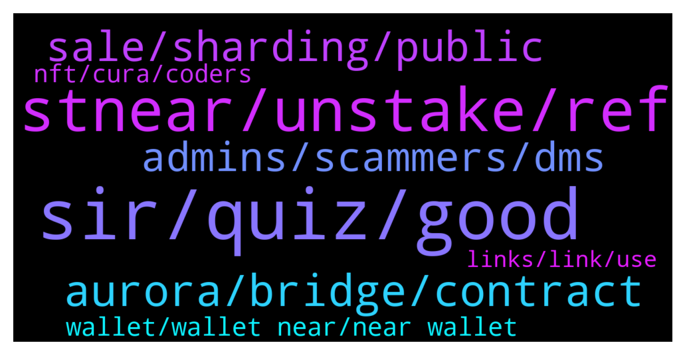

# **@cryptonear**
 ## Analysis for **2021-12-28** - **2021-12-29**.

---

## 📊 **Basic Stats**

**n_messages_sent**: 509

---

---

## 🔝 **Top keywords and related messages**

1. **sir, quiz, good**

    @Iboh_israel --- *Going good too...just preparing for final school exams after new year* **--->** [TG Discussion](https://t.me/cryptonear/253934)

    @Anon000 --- *Damm, u both have the same account name and username⚡️* **--->** [TG Discussion](https://t.me/cryptonear/253959)

    @larry_lang --- *yeah glad that u come to us to double check, next time pls keep in mind that if smt sounds too good to be true, then it's too good to be true=)))* **--->** [TG Discussion](https://t.me/cryptonear/253703)

    @thanano46 --- *Hahaha . .. nothing much sir .. you know mobile phones are really frustrating sometimes.. using 24*7 ..full addicted to it... It's 5 am over here and i haven't slept till yet..  Using mobile and watching youtube 🥶🥶* **--->** [TG Discussion](https://t.me/cryptonear/253579)

    @pavelgordok --- *guys anyone know how Near Education supports those students, who passed the course well?* **--->** [TG Discussion](https://t.me/cryptonear/254092)

    @larry_lang --- *=)) this one sir : https://t.me/nearvietnamofficial* **--->** [TG Discussion](https://t.me/cryptonear/254938)

2. **stnear, unstake, ref**

    @leoma98 --- *Hello NEAR community! Big APY 🔥  in Liquidity right now if you have some NEAR to deposit, and want to seize the opportunity!  Note: Meta Pool will be adding more liquidity to the pool and we will also gradually raise the treasury cut on liquid unstake fees. Those APY numbers are not forever.* **--->** [TG Discussion](https://t.me/cryptonear/254556)

    @fiolalala --- *https://near.oin.finance/Vault/    Is this website used to mortgage your stnear and borrow USDO stable currency? When the value of stnear falls beyond a certain price, the collateral stNear will be liquidated, right?* **--->** [TG Discussion](https://t.me/cryptonear/254760)

    @AHam --- *And metapool is legit? Never used them before* **--->** [TG Discussion](https://t.me/cryptonear/254568)

    @butola_ravi --- *I have wnear and stnear on ref finance how to swap them back on near* **--->** [TG Discussion](https://t.me/cryptonear/254792)

    @larry_lang --- *https://pulsemarket.eth.link/#!/ this is for wNEAR to NEAR* **--->** [TG Discussion](https://t.me/cryptonear/254793)

    @Kripto_Raptor --- *Hello $REF farmers! Please take a look at some guides to help you on your journey. Happy Hot Farmer Fall ❤️  1. Ref Finance User Guide: https://awesomenear.com/articles/ref-finance-user-guide/ 2. Info about farming + rewards: https://ref-finance.medium.com/ref-finance-is-bringing-farming-defi-to-the-near-ecosystem-70eb9ec9936a 3. Farming Tutorial (video): https://twitter.com/finance_ref/status/1433632457790689286 4. Farming Tutorial (image and text): https://twitter.com/NearSyndicate/status/1433480235425705989  5 Transfer Your ERC-20 assets with Rainbow Bridge (Tutorial): https://twitter.com/finance_ref/status/1433241716526485511 6. Another step-by-step video tutorial for Rainbow Bridge: https://youtu.be/_JZP40tsrZA 7. for TVL and other stats on Ref: sodaki.com* **--->** [TG Discussion](https://t.me/cryptonear/253653)

3. **aurora, bridge, contract**

    @Cctdd --- *Just checked our aurora now. But it didn't look like its near based* **--->** [TG Discussion](https://t.me/cryptonear/254396)

    @DanAlvarez79 --- *This is a little messy but it’ll work  Swap for atUST on Trisolaris and bridge from aurora to terra via allbridge  Then bridge from terra to binance via terra bridge   Then swap from UST on pancakeswap for usdt and bridge to matic via Anyswap* **--->** [TG Discussion](https://t.me/cryptonear/253483)

    @kv9990 --- *Hehe 🥲 since Aurora is new on Allbridge (like a week old) all assets are not supported yet.   ABR is Allbridge native token  Contract on Matic Network 0x04429fbb948bbd09327763214b45e505a5293346  Pad is SmartPad token  Contract on Matic Network 0x0AD2EFF7F37E0037B5E30C1947F31ABDF11461E4* **--->** [TG Discussion](https://t.me/cryptonear/253470)

    @larry_lang --- *here u go: $NEAR contract address on AURORA  "0xC42C30aC6Cc15faC9bD938618BcaA1a1FaE8501d"  $NEAR contract address on ETH "0x85F17Cf997934a597031b2E18a9aB6ebD4B9f6a4"  $NEAR contract address on BSC "0x1fa4a73a3f0133f0025378af00236f3abdee5d63"* **--->** [TG Discussion](https://t.me/cryptonear/254641)

    @Xdrks --- *How can I transfer my wnear from one Wallet  to another Wallet on Aurora* **--->** [TG Discussion](https://t.me/cryptonear/254208)

    @frankophil --- *okay cool, thanks. Can the NEAR network handle the ETH asset? Or do I need go to AURORA?* **--->** [TG Discussion](https://t.me/cryptonear/255027)

4. **sale, sharding, public**

    @Kripto_Raptor --- *but i can't participate on this pre-sale. did i miss sth?* **--->** [TG Discussion](https://t.me/cryptonear/253686)

    @hans331 --- *Hi guys, NEAR vs Kusama. Who will prevail in 2022?* **--->** [TG Discussion](https://t.me/cryptonear/254813)

    @larry_lang --- *So yeah what they promised  was an final running product on the jan 5th* **--->** [TG Discussion](https://t.me/cryptonear/253723)

    @Kaiguy69 --- *Does anyone know if public sale for empyrean will be on trisolaris?* **--->** [TG Discussion](https://t.me/cryptonear/253725)

    @Kaiguy69 --- *Whats the difference between public sale and mainnet launch? I guess public sale is within an hour for empyrean but mainnet launch is january 5th.. what is a mainnet launch?* **--->** [TG Discussion](https://t.me/cryptonear/253718)

    @Kaiguy69 --- *time is running out my presale tokens are gonna end soon* **--->** [TG Discussion](https://t.me/cryptonear/253629)

5. **admins, scammers, dms**

    @larry_lang --- *pls block whoever larry that Dms u first=00* **--->** [TG Discussion](https://t.me/cryptonear/253750)

    @iamkemoo --- *Hey mate, just send me a DM. 🙌* **--->** [TG Discussion](https://t.me/cryptonear/253925)

    @Kripto_Raptor --- *but when you zoom out you will realize you're in a total scam coin 😅* **--->** [TG Discussion](https://t.me/cryptonear/254456)

    @FritzWagner --- *Mod/Admins will never DM you first* **--->** [TG Discussion](https://t.me/cryptonear/254578)

    @Kripto_Raptor --- *haha that you need to DYOR carefully* **--->** [TG Discussion](https://t.me/cryptonear/253694)

    @zubairansari07 --- *Why did you change the dp vro* **--->** [TG Discussion](https://t.me/cryptonear/253962)

6. **wallet, wallet near, near wallet**

    @larry_lang --- *here is a NEAR wallet creation tutorial that you might need: https://near.org/blog/getting-started-with-the-near-wallet/ but after wallet is done u are good to go* **--->** [TG Discussion](https://t.me/cryptonear/254999)

    @behics --- *to be honest, username.near sounds so cool BUT i dont want to generate a wallet while using a website 😕* **--->** [TG Discussion](https://t.me/cryptonear/253975)

    @Kripto_Raptor --- *first claim a wallet on wallet.near.org you can use your ledger as well. please use Mozilla Firefox browser for smooth experience* **--->** [TG Discussion](https://t.me/cryptonear/254525)

    @Adebabss --- *Where did you put the near wallet address? ?* **--->** [TG Discussion](https://t.me/cryptonear/253518)

    @NEARverse_xd --- *You can send your deposit to your .near address by clicking on send button* **--->** [TG Discussion](https://t.me/cryptonear/253796)

    @EimiFukada96 --- *For example, I make a wallet in a trust wallet and then import the phrase into the near wallet...the contents of the wallet don't exist near can?* **--->** [TG Discussion](https://t.me/cryptonear/254336)

7. **nft, cura, coders**

    @iforbusiness2 --- *Paras, mintbase are the NFT project of NEARverse* **--->** [TG Discussion](https://t.me/cryptonear/253915)

    @de_confluence --- *As there been NFT integrations or projects on Near protocol?* **--->** [TG Discussion](https://t.me/cryptonear/253912)

    @de_confluence --- *Thanks what about a marketplace? I am in connection with project who are looking to launch their NFT and want the best way to do it.. But I don't have much info about NEAR.. What is the best way to bring them on board?* **--->** [TG Discussion](https://t.me/cryptonear/253917)

    @Lif317 --- *Where can we get info about upcoming #NFTs ???* **--->** [TG Discussion](https://t.me/cryptonear/255035)

    @rahulgoel007 --- *You can check this group and ask more questions related to NFT https://t.me/nearnftclub* **--->** [TG Discussion](https://t.me/cryptonear/254384)

    @naveenkandwal --- *For more updates on #NEAR NFT projects join discord server and connect with your favourite NFT projects LINK: https://discord.gg/vJKqBe2t9h* **--->** [TG Discussion](https://t.me/cryptonear/254301)

