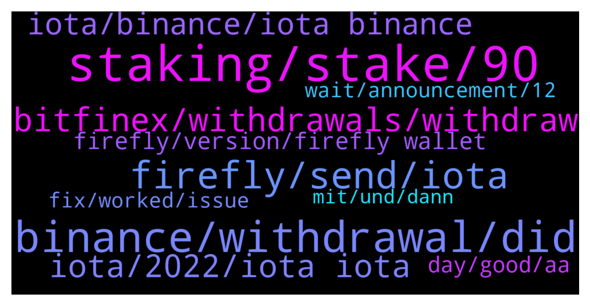

# **@iotatangle**
 ## Analysis for **2021-12-28** - **2021-12-29**.

---

## 📊 **Basic Stats**

**n_messages_sent**: 531

---

---

## 🔝 **Top keywords and related messages**

1. **staking, stake, 90**

    @HenryFecamp --- *I don't know what is happening but even tough I am prestaking from day 1 now my staking is not working?* **--->** [TG Discussion](https://t.me/iotatangle/304480)

    @oliverbitcoin --- *Hi guys. Quick question: Is staking only possible when i deposite to my wallet until 3pm today? Or can i transfer tomorrow and it will still stack ?* **--->** [TG Discussion](https://t.me/iotatangle/303648)

    @naz_1983 --- *Hi can i stake MIOTA today? Or its closed?* **--->** [TG Discussion](https://t.me/iotatangle/303897)

    @Shortzliquidated --- *And is it possible to stake after staking starts* **--->** [TG Discussion](https://t.me/iotatangle/303288)

    @ash1taka1997 --- *You may stake / un-stake anytime during the 90 days period.* **--->** [TG Discussion](https://t.me/iotatangle/303460)

    @T --- *Would really suck to let ur comp 90 days running* **--->** [TG Discussion](https://t.me/iotatangle/304131)

2. **binance, withdrawal, did**

    @Jacques --- *My tip is to check binance every half hour* **--->** [TG Discussion](https://t.me/iotatangle/304191)

    @Donnerbalken92 --- *I Did the kyc on binance, but still unable to withdrawal* **--->** [TG Discussion](https://t.me/iotatangle/303305)

    @Justme66666 --- *Wtf is going on..my withdrawl is suspended since 5 days…are you serious….fucking Binance!!!* **--->** [TG Discussion](https://t.me/iotatangle/303940)

    @itsmedev --- *Binance withdrawal is on and off today* **--->** [TG Discussion](https://t.me/iotatangle/304151)

    @ef4ort --- *Withdrawal function temporarily suspended But am not sure if the problem has been completely resolved with Binance yet* **--->** [TG Discussion](https://t.me/iotatangle/304224)

    @Jonas --- *Withdrawal on binance is possible again* **--->** [TG Discussion](https://t.me/iotatangle/303574)

3. **firefly, send, iota**

    @mahirnadi --- *Hi everyone Where can i buy iota and send to firefly for staking? Binance don’t allow iota network, can i send with bep20?* **--->** [TG Discussion](https://t.me/iotatangle/304739)

    @garciaasensi --- *Hello everyone! Yesterday evening I trasnferred several IOTAs from binance to Firefly. I can can se the Transfer completed in binance, but IOTAs havent arrived to Firefly. Its normal the delay?* **--->** [TG Discussion](https://t.me/iotatangle/304415)

    @wombt --- *Iota. bsc are wrapped iotas not supported on firefly* **--->** [TG Discussion](https://t.me/iotatangle/303431)

    @wombt --- *You have wrapped iotas on bsc network, not real iotas, you need to swap them for iotas and transfer to firefly on iota network. Iota runs on his own network, not bsc network, you cant transfer iotas to metamask* **--->** [TG Discussion](https://t.me/iotatangle/303407)

    @Leocarioka --- *Support gave up to 12h to transfer iota tokens to firefly because they are all late* **--->** [TG Discussion](https://t.me/iotatangle/303320)

    @kmittakola --- *how much time it is taking to receive tokens on firefly end* **--->** [TG Discussion](https://t.me/iotatangle/303435)

4. **bitfinex, withdrawals, withdraw**

    @alexptn72 --- *Is someone able to withdrawl from bitfinex? My withdrawl is in processing status from yesterday* **--->** [TG Discussion](https://t.me/iotatangle/303618)

    @alexptn72 --- *for people who have a withdrawl in peocessing status on bitfinex for more than 12 hours. cancel the withdrawl e submit again. After resubmit my withdrawl arrived in 5 minutes* **--->** [TG Discussion](https://t.me/iotatangle/304025)

    @razali1984 --- *Even BitFinex withdrawals are problematic now* **--->** [TG Discussion](https://t.me/iotatangle/303649)

    @Arjan --- *How long does it exactly take to withdraw from bitfinex?* **--->** [TG Discussion](https://t.me/iotatangle/303660)

    @ElmettS96 --- *How I can cancel a transaction that is in processing m* **--->** [TG Discussion](https://t.me/iotatangle/304137)

    @Fold11 --- *I put also here that current finex withdraw being processing status now 3-3,5hour* **--->** [TG Discussion](https://t.me/iotatangle/303361)

5. **iota, 2022, iota iota**

    @Tahmis --- *💎IOTA (IOTA) Gets Listed on KuCoin! 🤑Deposit Now 🚀Trade IOTA/USDT, IOTA/BTC: 09:00 on December 30, 2021 (UTC) 👉https://www.kucoin.com/news/en-iota-iota-gets-listed-on-kucoin #NewListing* **--->** [TG Discussion](https://t.me/iotatangle/304461)

    @Hisham1978y --- *yes, but now they removed IOTA option* **--->** [TG Discussion](https://t.me/iotatangle/304156)

    @mohsen --- *On March 2020 Iota was about  0.08 $* **--->** [TG Discussion](https://t.me/iotatangle/303379)

    @lodurr666 --- *I believe that when the coordinator is eliminated, the currency gains strength. Smart contracts, NFT, speed, streaming, etc. every other currency is already way more advanced than IOTA. The difference will be the much-promised decentralization* **--->** [TG Discussion](https://t.me/iotatangle/303381)

    @Basti --- *Any Germans here that might wanna give some info how iota staking is handled tax wise?* **--->** [TG Discussion](https://t.me/iotatangle/303262)

    @DidroBlake --- *Applications for TangleSwap Beta testing now open, @everyone!  We are about 85% ▓▓▓▓▓▓▓▓▓▓▓▓▓▓░░░ done with the first version of our #IOTA DEX, including: ✅ Liquidity Pools ✅ Staking ⚒️ Swap  As stated before, we'll select the Beta testers from 3 sources: • 100 website sign-ups • 50 from Twitter raffle • 20+ UI/UX experts & active community members  It is for this last category that we are now accepting applications up until the last week of Jan 2022, when the sign-up & raffle will also happen!  https://forms.gle/gZ4mZnLjAHcLt8nY6* **--->** [TG Discussion](https://t.me/iotatangle/303878)

6. **iota, binance, iota binance**

    @Matt_Unwin --- *Thank you. Yes I tried Binance and it didn’t like the address - Then said suspended, so brushed off the Bitfinex and spent ages redirecting through there - but I obviously setup the wrong type of wallet… Thank you, I am new to IOTA, looking forward to the journey.* **--->** [TG Discussion](https://t.me/iotatangle/303839)

    @Jungleman2 --- *Hi all - it says i can withdraw IOTA from binance on binance smart chain. Any way to stake it like this?* **--->** [TG Discussion](https://t.me/iotatangle/303291)

    @sy-subrc --- *Because it's wrapped IOTA on Binance Smart Chain and not real IOTA tokens on the tangle* **--->** [TG Discussion](https://t.me/iotatangle/303271)

    @wombt --- *You cant, you need to swap the wrapped iotas to real iotas on binance* **--->** [TG Discussion](https://t.me/iotatangle/303405)

    @F --- *can somebody explain to me what it means iota is sent to Cross Margin on binance?* **--->** [TG Discussion](https://t.me/iotatangle/304536)

    @terradis --- *Yea iota works on bifinex, Binance said iota will be available to withdraw today henceforth still hoping* **--->** [TG Discussion](https://t.me/iotatangle/303480)

7. **firefly, version, firefly wallet**

    @SunnySide~ --- *i dont know, the firefly wallet address just changed, its not the same as previous* **--->** [TG Discussion](https://t.me/iotatangle/304281)

    @FilipSelf --- *how to update firefly wallet to latest version? Just install new one and tokens will migrate automatically?* **--->** [TG Discussion](https://t.me/iotatangle/303703)

    @Shamsul_Jamel --- *As long you have version 1.3 firefly* **--->** [TG Discussion](https://t.me/iotatangle/303616)

    @FilipSelf --- *I have old version of firefly with tokens already* **--->** [TG Discussion](https://t.me/iotatangle/303704)

    @Tahmis --- *If you already use firefly. Just download new version and update. Here is the official link* **--->** [TG Discussion](https://t.me/iotatangle/303705)

    @markgoodlife --- *Thanks! But how do I go back to 1.2?* **--->** [TG Discussion](https://t.me/iotatangle/303986)

8. **day, good, aa**

    @Tahmis --- *np. It's a special day so we are not so strict :)* **--->** [TG Discussion](https://t.me/iotatangle/304020)

    @AaE --- *Good question. That's what I asked too* **--->** [TG Discussion](https://t.me/iotatangle/304258)

    @mahirnadi --- *Ah, thank you very much Basti* **--->** [TG Discussion](https://t.me/iotatangle/304744)

    @RamiGspo --- *Ahh ok... I see... Thank you!* **--->** [TG Discussion](https://t.me/iotatangle/303592)

    @TeOdioPez --- *good to know - very helpful, thx!* **--->** [TG Discussion](https://t.me/iotatangle/303678)

    @Tahmis --- *No problem. You just don't get it all* **--->** [TG Discussion](https://t.me/iotatangle/303370)

9. **wait, announcement, 12**

    @HenryFecamp --- *so there is nothing I have to do only wait?* **--->** [TG Discussion](https://t.me/iotatangle/304491)

    @MusicLover --- *Things have been changed this year! This is not the same as before. It is way better, but still not known by the masses yet!* **--->** [TG Discussion](https://t.me/iotatangle/303367)

    @Tahmis --- *Wait for announcement from IF. Shouldn't take too long* **--->** [TG Discussion](https://t.me/iotatangle/304523)

    @Tahmis --- *Yes we need to wait a bit* **--->** [TG Discussion](https://t.me/iotatangle/304493)

    @Shortzliquidated --- *Its been a day of waiting to me and still waiting* **--->** [TG Discussion](https://t.me/iotatangle/303338)

    @Basti --- *IF is having another call with them tomorrow* **--->** [TG Discussion](https://t.me/iotatangle/303287)

10. **fix, worked, issue**

    @Charlie_2017 --- *Ok thx , I will try* **--->** [TG Discussion](https://t.me/iotatangle/304057)

    @holdencf --- *you have to wait for the fix to be deployed, just be patient* **--->** [TG Discussion](https://t.me/iotatangle/304607)

    @JohnPhishingman --- *IF found the issue and fix it atm* **--->** [TG Discussion](https://t.me/iotatangle/304515)

    @HenryFecamp --- *ok, thank you, hopefully this will be resolved in no time* **--->** [TG Discussion](https://t.me/iotatangle/304494)

    @hishamelshazly --- *I do have the same issue* **--->** [TG Discussion](https://t.me/iotatangle/304403)

    @terradis --- *Maybe you should check the pin msg* **--->** [TG Discussion](https://t.me/iotatangle/304233)

