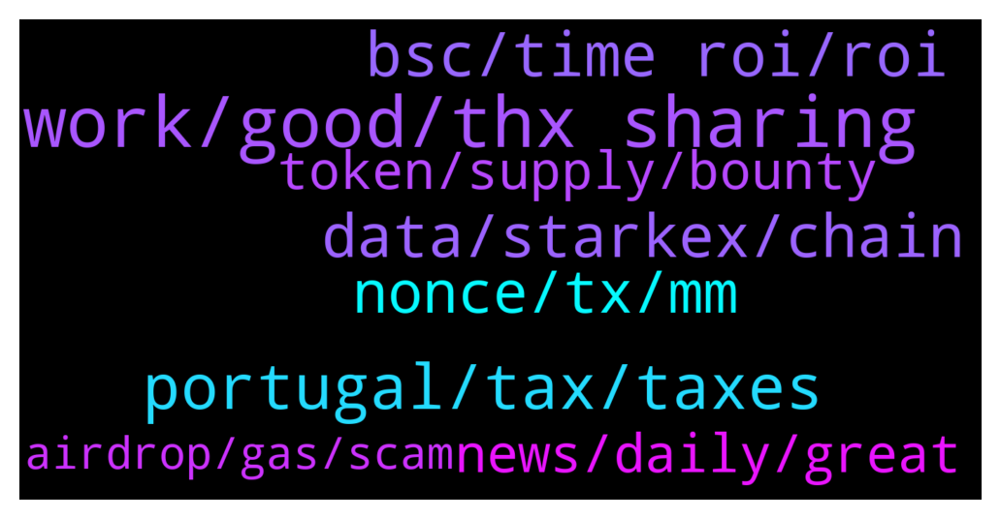

# **@lobsters_chat**
 ## Analysis for **2021-12-28** - **2021-12-29**.

---

## 📊 **Basic Stats**

**n_messages_sent**: 299

---

---

## 🔝 **Top keywords and related messages**

1. **work, good, thx sharing**

    @suzumiyachan --- *There's always a way to get to where you need to be, but it's an uphill battle especially if what you're offering basically amounts to "oh god, more work" :P    But, good luck with everything. You'll get there, I'm sure of it.* **--->** [TG Discussion](https://t.me/lobsters_chat/311185)

    @ivangbi --- *Great piece tho, u made a few awesome ones! Love to read* **--->** [TG Discussion](https://t.me/lobsters_chat/311284)

    @YoSoyCarlos --- *FYI this is def a troll post* **--->** [TG Discussion](https://t.me/lobsters_chat/310954)

    @JellyF --- *@zhongfu I've just got this DM. Looks fishy.* **--->** [TG Discussion](https://t.me/lobsters_chat/311252)

    @AdrianHetman --- *Hey!  Just wanted to leave this here as it may be helpful to some of you  https://twitter.com/adrianhetman/status/1475550508354093072?s=21* **--->** [TG Discussion](https://t.me/lobsters_chat/311010)

    @DMA1086 --- *Pretty good thread on the available info atm: https://twitter.com/Banclord/status/1474801241901256708?t=_yy5athxur8GHtXEphfCjg&s=19* **--->** [TG Discussion](https://t.me/lobsters_chat/311207)

2. **portugal, tax, taxes**

    @Justsomebodi --- *The Netherlands only taxes 3% capital gains, only on declaration. So pretty good imho* **--->** [TG Discussion](https://t.me/lobsters_chat/311387)

    @olivier27 --- *Dubai and Singapore are the only true crypto tax havens* **--->** [TG Discussion](https://t.me/lobsters_chat/311382)

    @Lemiscate --- *I can't vote I have french passport. Never grabbed a Portuguese one.* **--->** [TG Discussion](https://t.me/lobsters_chat/311456)

    @vintash --- *Portugal will probably cease to be a tax haven* **--->** [TG Discussion](https://t.me/lobsters_chat/311360)

    @TygaKim --- *korea no more metamask Portugal will probably cease to be a tax haven* **--->** [TG Discussion](https://t.me/lobsters_chat/311378)

    @TygaKim --- *bringing the best new from Korea 😉* **--->** [TG Discussion](https://t.me/lobsters_chat/311352)

3. **bsc, time roi, roi**

    @nvy0x --- *PancakeSwap is one of the only BSC projects who have actively worked with us to improve their transparency standards. Almost every other project looks like it has been developed by the same devs with the same centralized/non-transparent standards, and I’d say 80% of them don’t respond very well to the prospect of being reviewed by us. I wouldn’t call it horrendous by any means (Solana is arguably worse when it comes to that), but there is certainly a lot of opacity there.* **--->** [TG Discussion](https://t.me/lobsters_chat/311140)

    @william_s_4 --- *I would personally be very interested in reading a thorough writeup of the BSC ecosystem at this point. From the outside it sounds like a super steroid version of Keynes's beauty contest - no one believes in anything, rather invest where they other people will invest and dump when they think others will dump.* **--->** [TG Discussion](https://t.me/lobsters_chat/311071)

    @nvy0x --- *Absolutely! I definitely understand the heavy workload that comes with being a Web3 dev, and we are more than willing to accomodate, but with BSC there exists a communicational negligence aspect that we have encountered numerous times. For example, multiple times have we been censored in the protocols' communal social medias for just trying to establish comms with the dev team. It's like they know who we are and what we are trying to bring to them, but end up banishing us out of apprehension. The only way to improve your score with us is through B2B communication, and outright refusing that is neglect to some degree.* **--->** [TG Discussion](https://t.me/lobsters_chat/311178)

    @suzumiyachan --- *ah — speaking from my own experience, and this isn't just limited to BSC, but also consider how many times per day someone is trying to get in touch with admins offering anything and everything under the sun. after a while it's just kind of an auto-pilot mindset to kick. when you receive dozens of proposals per day, people shilling their services, etc. it gets easy to paint them all with the same brush stroke.  if it's okay to offer advice, have you considered maybe starting with a newer chain, and working via introductions between projects instead? it seems like it would be a good way for you to establish yourself as legitimate in one, and then expand from there. especially if you do have some of these projects willing to work with you at first, it makes it easier to branch out from there.* **--->** [TG Discussion](https://t.me/lobsters_chat/311180)

    @river0x --- *We're running metrics on our overall defisafety chain scores and I think you can imagine how BSC does compared to ETH* **--->** [TG Discussion](https://t.me/lobsters_chat/311125)

    @cryptonarratives --- *Well If PCS turns into a desert BSC will follow. Wonder If we'll see a desert chain in the future.* **--->** [TG Discussion](https://t.me/lobsters_chat/311147)

4. **data, starkex, chain**

    @GuthL --- *So we cannot really oopsie and delete the data without coordination* **--->** [TG Discussion](https://t.me/lobsters_chat/311025)

    @tatai_007 --- *If they are storing on chain, what do they need StarkEx for? Noob here, just trying to learn about all L2s* **--->** [TG Discussion](https://t.me/lobsters_chat/311023)

    @samkazemian --- *Ya I should have made very clear that I am personally not at all worried about data availability for dydx or Immutable, but was pointing out that the offchain portion relies on some non-cryptoeconomic trust. But the good news is that it only needs n=1 honest party to have stored the data for everything to be fine.* **--->** [TG Discussion](https://t.me/lobsters_chat/311026)

    @tatai_007 --- *So let's say hypothetically they are storing everything on a single sqlite file and their dev does an oopsie. In that scenario, where they lose the data, there is no way of restoring the data because they are essentially just web2 backends with just proofs on the blockchain.* **--->** [TG Discussion](https://t.me/lobsters_chat/311015)

    @GuthL --- *So under Validium, if we disapear and all DAC members disappear, the money is stuck forever* **--->** [TG Discussion](https://t.me/lobsters_chat/311035)

    @samkazemian --- *I think people could still exit to L1 but ya if that were to actually happen, I think the data is gone unless they store it somewhere else. That would be quite bad lol* **--->** [TG Discussion](https://t.me/lobsters_chat/311016)

5. **nonce, tx, mm**

    @infomorph --- *Either people who "rolled their own" cryptography, or used faulty libraries with bad sources of randomness, most likely. A particularly sneaky blackhat could make a wallet that _very rarely_ reuses a nonce...get wide enough adoption, and even rare collisions will generate a steady stream of hackable accounts. This is one of many reasons why it's very important that wallets be open source (even then, could be hard to detect...see that random number generation standard the NSA backdoored for example).* **--->** [TG Discussion](https://t.me/lobsters_chat/311242)

    @miguel_cabeza --- *But when cancelling a transaction, don't you submit the same nonce with 0 gwei?* **--->** [TG Discussion](https://t.me/lobsters_chat/311222)

    @ivangbi --- *1. Send a 0 eth tx to urself 2. Put nonce same as the pending one (if u have just 1 pending) so this u need to insert manually (see on etherscan tx nonce) 3. Put gas costs higher, 0 eth normal tx is cheap anyway   Done* **--->** [TG Discussion](https://t.me/lobsters_chat/311306)

    @xmons --- *Different nonce, the blog post explains* **--->** [TG Discussion](https://t.me/lobsters_chat/311225)

    @apophenia19 --- *fwiw; A quick note of reassurance: regular end users shouldn't worry much about these attack vectors. There's nothing you could do to reuse a nonce or expose that nonce to the public. It's something the developers of cryptography libraries should worry about, not you. Just an exploit in niche circumstances - fun read* **--->** [TG Discussion](https://t.me/lobsters_chat/311217)

    @sixty10 --- *Same principle as a known plaintext attack, but with some intermediate steps. Using the same nonce twice exposes information that can be used to invert the ecdsa algorithm and deterministically generate the signers private key.  The cool part is proving that at least one person is out there monitoring ethereum for people making that mistake.* **--->** [TG Discussion](https://t.me/lobsters_chat/311212)

6. **news, daily, great**

    @sshshln --- *🎙 Top Crypto Podcasts of December 2021:   https://twitter.com/Paradigm_fund/status/1476240598571048963?s=20* **--->** [TG Discussion](https://t.me/lobsters_chat/311471)

    @mempirate --- *Does anyone here know of a news / interesting stuff aggregator for all things defi / ethereum? Something like hacker news* **--->** [TG Discussion](https://t.me/lobsters_chat/310982)

    @svenblockchain --- *Anybody know of a crypto friendly mailchimp alternative?* **--->** [TG Discussion](https://t.me/lobsters_chat/311118)

    @J_C_H --- *Hey, does anyone know of a site that sums up defi governance dates and proposals for protocols in the top100/top 200 marketcap range?* **--->** [TG Discussion](https://t.me/lobsters_chat/311472)

    @syed_jafri --- *Squeeth is very interesting, have a read for those who haven’t: https://thedefiant.io/squeeth-eth-opyn-launch-defi/  A way to hedge against your IL among other things* **--->** [TG Discussion](https://t.me/lobsters_chat/311299)

    @rasikhmorani --- *There's a great presentation that covers this (in one of my favorite talks)  https://www.youtube.com/watch?v=6ssTlSSIJQE* **--->** [TG Discussion](https://t.me/lobsters_chat/311246)

7. **token, supply, bounty**

    @kuzzel --- *Meh definitely wouldn't agree with that. If the reward had been $100m this would have been found in a flash. You'd have had the entirety of our community hunting for it, and beyond.* **--->** [TG Discussion](https://t.me/lobsters_chat/311424)

    @StephanGoss --- *You're not going to get meaningfully better results from paying out $180M (and having what would be a pretty massively negative impact on the token) than from paying out $2M. Not saying if that's fair or not, but paying 180 would certainly be a very bad business decision* **--->** [TG Discussion](https://t.me/lobsters_chat/311414)

    @kuzzel --- *Only if they are obviously large.  The critical bounty sizes drives a lot of the eyes on code.* **--->** [TG Discussion](https://t.me/lobsters_chat/311437)

    @StephanGoss --- *I'm with you that $2M might not be enough, and you'd get incrementally better outcomes but point being going to 180 is way too high* **--->** [TG Discussion](https://t.me/lobsters_chat/311430)

    @kuzzel --- *At that size of a bounty, the hunt is worth almost any amount of work, and so people would put that in, and that codebase would end up being rock solid in no time.* **--->** [TG Discussion](https://t.me/lobsters_chat/311425)

    @StephanGoss --- *yeah but this was the ENTIRE market cap of Polygon, they could have stolen more token than the current circulating supply* **--->** [TG Discussion](https://t.me/lobsters_chat/311410)

