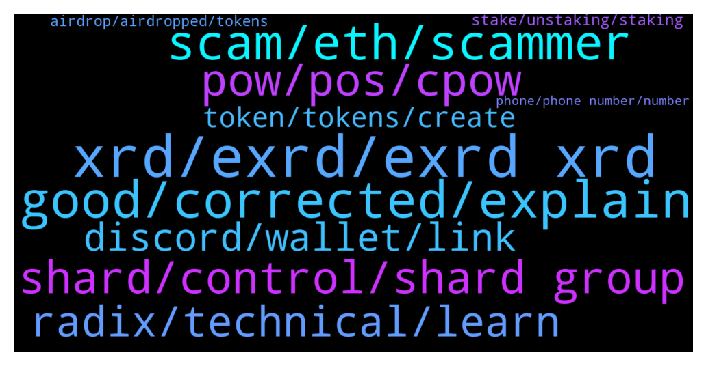

# **@radix_dlt**
 ## Analysis for **2021-12-28** - **2021-12-29**.

---

## 📊 **Basic Stats**

**n_messages_sent**: 766

---

---

## 🔝 **Top keywords and related messages**

1. **xrd, exrd, exrd xrd**

    @nocturn9x --- *eXRD is literally a bridge for XRD on ETH* **--->** [TG Discussion](https://t.me/radix_dlt/329340)

    @gonnagasato --- *what difference between xrd and exrd? why 2 tokens existing together instead of one?* **--->** [TG Discussion](https://t.me/radix_dlt/328639)

    @MiguelBHM --- *They're basically the same, exchangeable 1-1, but eXRD is ERC-20 i.e. it's Ethereum-compatible so available de-facto on most trading platforms* **--->** [TG Discussion](https://t.me/radix_dlt/329336)

    @fpieper --- *What's the attack vector with a BTC token? Scammers sending a first BTC and them asking for XRD to get more BTC?* **--->** [TG Discussion](https://t.me/radix_dlt/329069)

    @h0ll0wstick --- *Say dat to a guy/girl dat just asked here wats the difference between exrd/xrd :) me im good I know my shit* **--->** [TG Discussion](https://t.me/radix_dlt/329101)

    @Jake --- *exrd is an erc20 (Ethereum chain)* **--->** [TG Discussion](https://t.me/radix_dlt/328645)

2. **good, corrected, explain**

    @coathanger1 --- *HA HA hell i'll make one* **--->** [TG Discussion](https://t.me/radix_dlt/329212)

    @AboThamer00 --- *Yah agree, sometimes you feel it's too good to be true* **--->** [TG Discussion](https://t.me/radix_dlt/328194)

    @ashrawi123 --- *Wooo…so we can just leave it there right?* **--->** [TG Discussion](https://t.me/radix_dlt/328865)

    @nocturn9x --- *That's the best we can do really* **--->** [TG Discussion](https://t.me/radix_dlt/329118)

    @d1scere --- *Well @DavidGr03 gave some good links to read above* **--->** [TG Discussion](https://t.me/radix_dlt/328394)

    @nocturn9x --- *Let me explain how that really works* **--->** [TG Discussion](https://t.me/radix_dlt/328581)

3. **scam, eth, scammer**

    @h0ll0wstick --- *Educating community ok but scammers don't care about education* **--->** [TG Discussion](https://t.me/radix_dlt/328928)

    @h0ll0wstick --- *Yes but dats the stupid ones not all scaMmers are stupid* **--->** [TG Discussion](https://t.me/radix_dlt/329061)

    @sunworshag --- *I have been, but it seemed like a scam so I posted here just to be careful* **--->** [TG Discussion](https://t.me/radix_dlt/328308)

    @EnricoPallazzo78TAMC4 --- *(Just had a scammer impersonating you trying to contact me)* **--->** [TG Discussion](https://t.me/radix_dlt/328717)

    @PMinarno --- *I got fake Piers try to solve my issue as well lol and a call from scams* **--->** [TG Discussion](https://t.me/radix_dlt/328973)

    @ashrawi123 --- *If you have eth wallet, and they give random malicious coin, when you try to sell the coin, they can actually hack your wallet and take all your ETH, crazy nowdays* **--->** [TG Discussion](https://t.me/radix_dlt/328887)

4. **shard, control, shard group**

    @ahsimon --- *With PoS (and Dan's DPos) security and/or liveness can be broken if your validators can form a cabal large enough to control 67% or 33% of the delegated stake.  The only protection is encouraging a wide distribution of delegated stake over the entire set of shards.  That is to make an attack like the one you propose too expensive.   Also, because related data is randomly distributed over 2^256 shard addresses, it is not clear how you can fiind something worth waiting for, when only attacking one shard group.* **--->** [TG Discussion](https://t.me/radix_dlt/329385)

    @thenotthatgreat --- *but if i remember correctly, all the data on the internet distributed across 2^256 shards would mean something like 4bits pr shard i think was said at some point.* **--->** [TG Discussion](https://t.me/radix_dlt/328280)

    @S --- *It's generally seen as necessary in a sharded *blockchain* because sharding tends to degrade security. Hard to guarantee that every single shard has an honest validator set at all times* **--->** [TG Discussion](https://t.me/radix_dlt/329356)

    @Magal36 --- *And in Radix the security of a single shard is the same as the whole network, because validators can't target a single shard* **--->** [TG Discussion](https://t.me/radix_dlt/329361)

    @Magal36 --- *The math shows the probability of malicious actors being able to successfully target a single shard group and take control of it is practically impossible.* **--->** [TG Discussion](https://t.me/radix_dlt/329367)

    @S --- *But what if I hold 10% of stake thereabouts, have lots of validators, and simply wait until I get grouped into a shard group with a few of them, where I have control? It's not *targeting* per se. I just wait until I am in control of a majority vote in 1 shard group, by simple sorting* **--->** [TG Discussion](https://t.me/radix_dlt/329368)

5. **pow, pos, cpow**

    @nocturn9x --- *I just wish it didn't require a bunch of computational power that could be better spent on protein folding or physics simulations* **--->** [TG Discussion](https://t.me/radix_dlt/328546)

    @CryptoRadix --- *Interesting. I didnt realize Xi'an was going to switch from pos to pow. I assume there's some write up in the docs? I haven't gotten. through everything yet. is there an ELI5 Why the team wants to switch over to pow?* **--->** [TG Discussion](https://t.me/radix_dlt/328213)

    @thenotthatgreat --- *ye i get that, just didn't think combinatorial POW made sense for an abreviation as it's a combinatorial of POW and something else(in this case POS)* **--->** [TG Discussion](https://t.me/radix_dlt/328268)

    @Blind5ight --- *The design choices for Xi'an are not known yet Those of Babylon are still being figured out for what would be optimal...  CPoW is an option that Dan discovered Cassandra's hybrid consensus combines CPoW with POS, so POS is still in there* **--->** [TG Discussion](https://t.me/radix_dlt/328228)

    @Jazzer9F --- *PoW is a temporary thing imo. There will come a time when we look back at it and go like 'member when we used massive amounts of power to secure digital legers?  Like we look back at the way we used to create potash now. PoW will just be obsolete..* **--->** [TG Discussion](https://t.me/radix_dlt/328604)

    @thenotthatgreat --- *ye i get that, but it's not just CPOW, but CPOW and POS as i understood it, but might be wrong* **--->** [TG Discussion](https://t.me/radix_dlt/328248)

6. **radix, technical, learn**

    @Malekith_PL --- *Guys, an honest question. Does Radix / XRD have any disadvantages? Radix solves blockchainie tri (or even quad) lemma. New, secure programming language. Etc. Beside being not live yet, does it has any drowbacks that we already know of? Having some is not always bad, a some things might look too good to be true. So again, is there anything you know of?* **--->** [TG Discussion](https://t.me/radix_dlt/328187)

    @KANO_Z --- *I'd think it would be a good opportunity for those far more knowledgeable than me on the technical side to give some good insight into the strengths of radix over something like kda.* **--->** [TG Discussion](https://t.me/radix_dlt/328389)

    @Jakob --- *What is the name of the app? Can't find something with radix* **--->** [TG Discussion](https://t.me/radix_dlt/328654)

    @KANO_Z --- *I see parallels between Radix and Kadena. I can imagine Radix being in a similar position in a few years as the technicals seem stellar.* **--->** [TG Discussion](https://t.me/radix_dlt/328364)

    @h0ll0wstick --- *I don't have a problem with radix I have a problem with dishonest, manipulators and greedy people* **--->** [TG Discussion](https://t.me/radix_dlt/328953)

    @dopermon12 --- *Radix has incentives and thought this through* **--->** [TG Discussion](https://t.me/radix_dlt/328424)

7. **discord, wallet, link**

    @PMinarno --- *Hello - I still have wallet issue now* **--->** [TG Discussion](https://t.me/radix_dlt/328964)

    @mx471 --- *what happens if you click on a old post link? https://t.me/radix_dlt/112912* **--->** [TG Discussion](https://t.me/radix_dlt/329320)

    @Bartleby --- *Hello,my Cerbymask does not show my balance but it is shown on the Explorer,what do i need to do ? Wait ?* **--->** [TG Discussion](https://t.me/radix_dlt/328756)

    @Radstakes --- *That's very strange.  I'm not sure what else to suggest, except restarting the wallet and trying again later.  If it persists, you should log it in the discord Bug Reports channel where the team are more active and can provide more input. discord.gg/radixdlt* **--->** [TG Discussion](https://t.me/radix_dlt/329043)

    @LucPro --- *Man.. wallet should be working out of the box..not everyone is technical..* **--->** [TG Discussion](https://t.me/radix_dlt/328954)

    @PMinarno --- *Yes - and so what will be your suggestion for my wallet issue haha? Lost my chances to buy muted scorpion because of this* **--->** [TG Discussion](https://t.me/radix_dlt/329024)

8. **token, tokens, create**

    @h0ll0wstick --- *Who ever made this token creation tool should deactivate it it s a good tool but it s like installing a scamming machine* **--->** [TG Discussion](https://t.me/radix_dlt/328958)

    @Taswegian --- *Seems the cost of token creation isn't high enough to prevent spam* **--->** [TG Discussion](https://t.me/radix_dlt/329147)

    @Jake --- *a lot of tokens are like this* **--->** [TG Discussion](https://t.me/radix_dlt/328350)

    @Jake --- *A ton of projects do this before they have their own native token* **--->** [TG Discussion](https://t.me/radix_dlt/328642)

    @BlAzAk --- *If you are technically able to create a wrapped token, I think my token creator is not a must have 😜* **--->** [TG Discussion](https://t.me/radix_dlt/329053)

    @h0ll0wstick --- *On eth you had to have a smart contract to create a token at least at the beginning* **--->** [TG Discussion](https://t.me/radix_dlt/328931)

9. **stake, unstaking, staking**

    @giskard_rich --- *You can’t stake them at the moment. I guess that could change and things develop* **--->** [TG Discussion](https://t.me/radix_dlt/328876)

    @even_Phteven --- *Not really cause I'm dumb but from what I understand it's a mix of proof of work and proof of stake* **--->** [TG Discussion](https://t.me/radix_dlt/328238)

    @Blind5ight --- *It’s a matter of probability And it’s a function of how much stake you control The less stake, the less probability* **--->** [TG Discussion](https://t.me/radix_dlt/329411)

    @MrKrabs22 --- *Hi folks, I've just started staking for the first time. One of the nodes I tried to stake at doesn't seem to have worked. The explorer link reads "There was an error fetching your data. Try again."  There is a little spinning timer in the history of my wallet so the staking hasn't worked. The staking amount is still locked though. I'm not sure how to cancel this? Thanks!* **--->** [TG Discussion](https://t.me/radix_dlt/329324)

    @Toby --- *What does the 5% and 10% stake mean? Is it of what we have staked overall or based on some other value?* **--->** [TG Discussion](https://t.me/radix_dlt/328700)

    @S --- *Is there really nothing I could do? Double spending a substate, producing invalid transactions...* **--->** [TG Discussion](https://t.me/radix_dlt/329387)

10. **airdrop, airdropped, tokens**

    @Radstakes --- *They are an airdrop from Radix.Plus: https://radixtalk.com/t/why-do-i-have-these-weird-tokens-in-my-wallet/128* **--->** [TG Discussion](https://t.me/radix_dlt/329245)

    @CaptainMooseInc --- *We know you’ve been waiting. Our first Medium post is live! Tokenomics and airdrop post to come later this week! Go check it out!   https://xrdscan.medium.com/introducing-xrdscan-e64593ef5e34* **--->** [TG Discussion](https://t.me/radix_dlt/328696)

    @Radstakes --- *This is an airdrop from validator Radix.Plus: https://radixtalk.com/t/why-do-i-have-these-weird-tokens-in-my-wallet/128* **--->** [TG Discussion](https://t.me/radix_dlt/328220)

    @Blind5ight --- *The ideas that floated around were 1) Hiding tokens you don’t find useful and/or 2) have a setting where you can prevent airdrops to your wallet* **--->** [TG Discussion](https://t.me/radix_dlt/329469)

    @coathanger1 --- *they just airdropped it to me. how do i throw it into a black hole?* **--->** [TG Discussion](https://t.me/radix_dlt/329204)

    @J --- *Oh nice I didn’t put it together. I got an airdrop just now haha* **--->** [TG Discussion](https://t.me/radix_dlt/328743)

