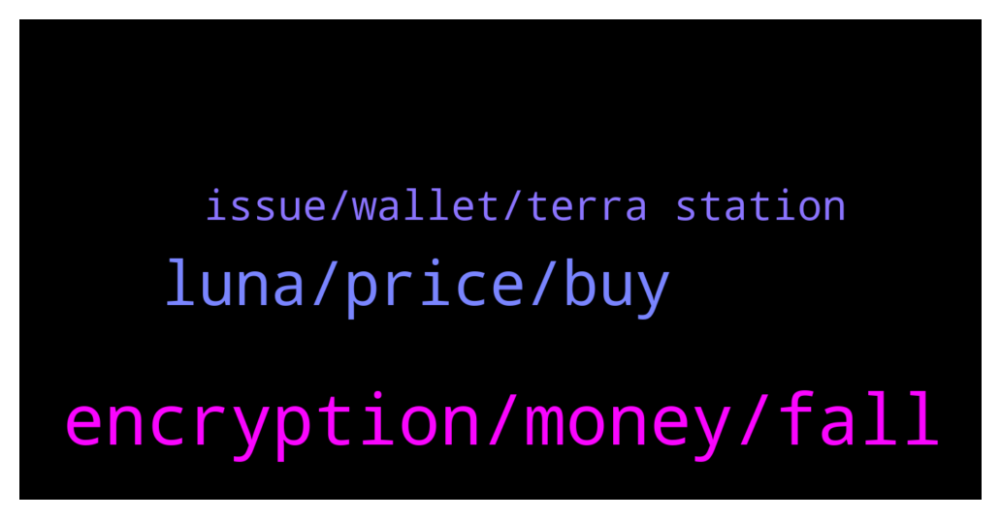

# **@terralunachat_officially**
 ## Analysis for **2021-12-28** - **2021-12-29**.

---

## 📊 **Basic Stats**

**n_messages_sent**: 110

---

---

## 🔝 **Top keywords and related messages**

1. **encryption, money, fall**

    @Diego --- *But recent day, it went up and down, nearly like BTC. Will you think it will take over BNB, and get to rank 3 in next couple years* **--->** [TG Discussion](https://t.me/terralunachat_officially/22251)

    @Zelgiust --- *Crypto is now a force to deal with in geopolitics an international economics subjects.* **--->** [TG Discussion](https://t.me/terralunachat_officially/22015)

    @Mina5201 --- *I have said that Bitcoin will fall in the past few days. Many people in the group still don’t believe it, and it has slowly fallen. Haha🤣* **--->** [TG Discussion](https://t.me/terralunachat_officially/22116)

    @Kevin --- *So people pay 18.65% to borrow?* **--->** [TG Discussion](https://t.me/terralunachat_officially/21981)

    @Mina5201 --- *Encryption novices, the core choice of cryptocurrency is not to hold it all the time, but to buy low and sell high and constantly trade to maximize benefits* **--->** [TG Discussion](https://t.me/terralunachat_officially/22259)

    @Kevin --- *If someone gets paid there must be a source. Since that source needs to be funded as well someone has to put money in. That person also wants to make money. When we come to the real source and that money comes from thin air it's confusing me.* **--->** [TG Discussion](https://t.me/terralunachat_officially/21994)

2. **luna, price, buy**

    @djackop --- *Guys you should be happy when luna price is dumping, get more luna!! Luna is unstoppable. Try to collect as much as you can.. You will regret it in few years if you don't* **--->** [TG Discussion](https://t.me/terralunachat_officially/22087)

    @Denison8888 --- *Where should I hold and what to do with my LUNA so I am eligible for airdrops, staking, etc. Sorry, I am new here..* **--->** [TG Discussion](https://t.me/terralunachat_officially/22045)

    @Oliverpilak --- *Hey terra friends. Is there a way to buy wrapped Luna on BSC? I can't seem to find a wrapped version on there. Thanks* **--->** [TG Discussion](https://t.me/terralunachat_officially/22083)

    @Randy --- *Luna is one currency that does not follow the flow of other currency. Like on the 20th or 21st Luna was rising while BTC and others were bearish* **--->** [TG Discussion](https://t.me/terralunachat_officially/22250)

    @Great fudder --- *I am waiting for luna Under 70* **--->** [TG Discussion](https://t.me/terralunachat_officially/22090)

    @hiddenanimal --- *Hello guys... do you think is a good move sell dot and buy luna now?* **--->** [TG Discussion](https://t.me/terralunachat_officially/22235)

3. **issue, wallet, terra station**

    @jackobbbb --- *Hey. I have problem with Terra Station on mac. I try to swap or deposit to anchor and get msg "Couldn't find the Ledger. Check the Ledger is plugged in and unlocked." Few days ago everything worked fine. Anyone had the issue and can help?* **--->** [TG Discussion](https://t.me/terralunachat_officially/21939)

    @Robert --- *Hi in my Terra station when I try to claim my rewards I get a message saying wallet is not defined any ideas how I can resolve this?* **--->** [TG Discussion](https://t.me/terralunachat_officially/22204)

    @xaviercib --- *how do i validate my wallet?* **--->** [TG Discussion](https://t.me/terralunachat_officially/22215)

    @may_gin --- *Hi admin, what is the UST contract address on terra, i cannot find it when add UST on wallet* **--->** [TG Discussion](https://t.me/terralunachat_officially/22226)

    @fafsharchi --- *Yes, l had same problem! Tried chrome extension instead.All good* **--->** [TG Discussion](https://t.me/terralunachat_officially/22041)

    @fafsharchi --- *Thanks! I tried above but it doesnt work with a ledger device! It looks "terra station with mac" doesnt work anymore! I could manage using chrome browser to connect to my nano s! Hope this will help anyone having same issue!* **--->** [TG Discussion](https://t.me/terralunachat_officially/22034)

