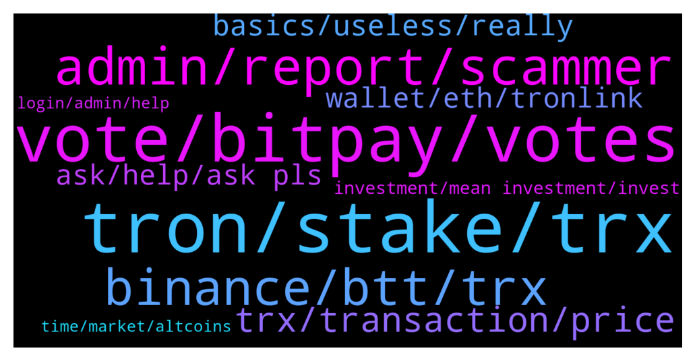

# **@tronnetworkEN**
 ## Analysis for **2021-12-28** - **2021-12-29**.

---

## 📊 **Basic Stats**

**n_messages_sent**: 350

---

---

## 🔝 **Top keywords and related messages**

1. **tron, stake, trx**

    @simon866 --- *Choose one of these legit ways to earn rewards:  1 - FREEZE AND VOTE  https://tron7010.zendesk.com/hc/en-us/articles/360043589352-How-to-Vote-and-Gain-Reward  2 - EARN ADDING LIQUIDITY POOLS   SUNSwap.com  3 - STAKE LP TOKENS  SUNSwap.com/mining  4 - SUN MINING      a) Stake SUNSwap LP tokens         (SUN/TRX)          SUN.io/#/stake         b) Deposit & Stake 3pool tokens         (USDT/USDJ/TUSD)          SUN.io/#/3pool/deposit         SUN.io/#/stake     c) Deposit & Stake USDC pool         tokens         SUN.io/#/usdc/deposit         SUN.io/#/stake  5 - LOCK SUN AND EARN TUSD & veSUN  SUN.io/#/stake  6 - EARN SUPPLYING IN JUSTLEND  JustLend.org  JustLend.org/#/market  7 - STAKE jTokens FROM JUSTLEND   JustLend.org/#/miningPool   You have a lot of ways to earn with TRON and protect your investments.  Pay attention to /GAS requirements (network fees).   Using https://Tronlink.org wallet you can see the network fees before confirm the transaction. Try it.* **--->** [TG Discussion](https://t.me/tronnetworkEN/3796035)

    @MetaverseReal --- *hello sir, may i ask a question? I'm mining on tron.cube, the initial initial withdrawal is smooth now it's 1 hour delayed, is there anyone mining on tron.cube? other than me, i need the answer* **--->** [TG Discussion](https://t.me/tronnetworkEN/3794477)

    @David --- *Is this page affiliated with tron ac were you can mine and receive tron?* **--->** [TG Discussion](https://t.me/tronnetworkEN/3797945)

    @PiterSpain --- *#USDC on #TRON (TRC20) is now live on @binanceexchange. @circlepay @jerallaire  https://twitter.com/justinsuntron/status/1476201320017240066* **--->** [TG Discussion](https://t.me/tronnetworkEN/3797682)

    @investor_pword --- *And I will be glad if some can put me through on how to buy tron coin* **--->** [TG Discussion](https://t.me/tronnetworkEN/3796489)

    @gi2237 --- *Can I ask what happens to frozen Tron after sir* **--->** [TG Discussion](https://t.me/tronnetworkEN/3796039)

2. **vote, bitpay, votes**

    @SchooleyD --- *Voted number 42. Said there are 47 hours left so I guess one more vote then done* **--->** [TG Discussion](https://t.me/tronnetworkEN/3797549)

    @xPommepote --- *You freeze your TRX to get votes. Then you vote for a SR and the SR rewards you for the vote.* **--->** [TG Discussion](https://t.me/tronnetworkEN/3797989)

    @xPommepote --- *Seems we do not look the same charts 🤷🏼‍♂️* **--->** [TG Discussion](https://t.me/tronnetworkEN/3794132)

    @Patrick --- *Yeah but we shouldn’t rest and keep voting. ADA has some huge influencers behind it that can easy generate thousands of votes within minutes* **--->** [TG Discussion](https://t.me/tronnetworkEN/3795932)

    @Carlos_TRX --- *I think we are growing well mate* **--->** [TG Discussion](https://t.me/tronnetworkEN/3794231)

    @Jyotiprakash --- *If we all vote atleast 1 today we will definitely win show the power* **--->** [TG Discussion](https://t.me/tronnetworkEN/3797163)

3. **admin, report, scammer**

    @investor_pword --- *A lot of people keep texting me and claiming admin of this group* **--->** [TG Discussion](https://t.me/tronnetworkEN/3796512)

    @NigelSamhain --- *How does one go about reporting scammers here? Just had one blowing up my telegram asking for my address* **--->** [TG Discussion](https://t.me/tronnetworkEN/3796895)

    @TERRIFICZ --- *That's a scam   Withdraw all your asset* **--->** [TG Discussion](https://t.me/tronnetworkEN/3796241)

    @KingsDove_TRX --- *Report them. No bots EVER dm you* **--->** [TG Discussion](https://t.me/tronnetworkEN/3797939)

    @MilNoslen --- *You can even search his name and previous messages, constantly negative and FUD* **--->** [TG Discussion](https://t.me/tronnetworkEN/3795415)

    @alisaghi94 --- *I mean the invite part of friends.* **--->** [TG Discussion](https://t.me/tronnetworkEN/3796196)

4. **binance, btt, trx**

    @reza94mehrad --- *Import private key to btt tron link* **--->** [TG Discussion](https://t.me/tronnetworkEN/3797318)

    @Sarge --- *Sounds pretty disorganized, you cant even trade new BTT easily after you carried out denomination, will have to wait till each wallet/ exchanges migrate or update their systems* **--->** [TG Discussion](https://t.me/tronnetworkEN/3796581)

    @Pouyahamii --- *I need question from swap btt old to btt* **--->** [TG Discussion](https://t.me/tronnetworkEN/3796453)

    @xPommepote --- *You can use binance, it’s your last hope. Send the TRX in your binance TRX ERC-20.* **--->** [TG Discussion](https://t.me/tronnetworkEN/3794383)

    @Carlos_TRX --- *use sunswap.com v2 if you want to get the new BTT* **--->** [TG Discussion](https://t.me/tronnetworkEN/3796135)

    @MilNoslen --- *You need the native coin for the transaction fee, or "gas"* **--->** [TG Discussion](https://t.me/tronnetworkEN/3796357)

5. **trx, transaction, price**

    @Vishal --- *Trx was down at this time* **--->** [TG Discussion](https://t.me/tronnetworkEN/3796080)

    @Bharatkhatri26 --- *Well we have already loaded our bags with trx, now let's just hope it touches 1$* **--->** [TG Discussion](https://t.me/tronnetworkEN/3794179)

    @gi2237 --- *I don't want to lose trx sir* **--->** [TG Discussion](https://t.me/tronnetworkEN/3796060)

    @auroracryptos --- *If you have enough trx, trx will be burned and transaction will be successful.  If you have not enough trx, then all trx will get burned but transaction will fail +++++++++++++++++++++++== does that mean there is still a burning trx?* **--->** [TG Discussion](https://t.me/tronnetworkEN/3794535)

    @billmate --- *Am angry bcus I lost money in trx from 0.1 to 0.07* **--->** [TG Discussion](https://t.me/tronnetworkEN/3795399)

    @lastbro3 --- *who said justin killed trx? you do not see that BTC is correcting to the area of ​​47.5- 49K all alt coins drag. so slowly we'll see if TRX is able to rally like 2021? So if nothing changes it's time to say goodbye* **--->** [TG Discussion](https://t.me/tronnetworkEN/3795360)

6. **basics, useless, really**

    @xPommepote --- *Bro really. It’s the basics of crypto. If you don’t know how to send crypto from a wallet to another then just give up* **--->** [TG Discussion](https://t.me/tronnetworkEN/3796064)

    @Richard --- *Honestly this is really confusing, am sorry for too much questions it's just that am new to the system* **--->** [TG Discussion](https://t.me/tronnetworkEN/3796220)

    @Muhammad Mudassir Afzal --- *Yes sir but my frnd gave his account and i tried withdrawal then it arrived sir* **--->** [TG Discussion](https://t.me/tronnetworkEN/3794770)

    @xPommepote --- *It’s a mistake. They can’t dissolve something in the past lol* **--->** [TG Discussion](https://t.me/tronnetworkEN/3797822)

    @Captain_JP --- *Hi everyone, I am new to crypto and I need 1 help.* **--->** [TG Discussion](https://t.me/tronnetworkEN/3797641)

    @Hachira --- *Guy do you work in crypto* **--->** [TG Discussion](https://t.me/tronnetworkEN/3796384)

7. **wallet, eth, tronlink**

    @Tory --- *So I have this very old eth wallet with tron in it. But I have no eth in account. I can’t send eth to account and can’t send tron with out eth. Any suggestions* **--->** [TG Discussion](https://t.me/tronnetworkEN/3797006)

    @gi2237 --- *It's seeprapa okay  Is tronlink a wallet* **--->** [TG Discussion](https://t.me/tronnetworkEN/3796077)

    @Tory --- *So I just got the memo to get tron out of old my eth wallet. Is my tron gone?* **--->** [TG Discussion](https://t.me/tronnetworkEN/3796342)

    @pino0711 --- *hi friends, i have a question. i’m using the klever app for SRE. i would like to know if Tronlink or Tronscan is better? or any other wallet?* **--->** [TG Discussion](https://t.me/tronnetworkEN/3795833)

    @Winklancer11 --- *Atleast try to search tronlink pro on Playstore. Man!* **--->** [TG Discussion](https://t.me/tronnetworkEN/3796055)

    @xPommepote --- *Yes it’s a tron network wallet.* **--->** [TG Discussion](https://t.me/tronnetworkEN/3796079)

8. **ask, help, ask pls**

    @Carlos_TRX --- *Feel free to ask what you need here...* **--->** [TG Discussion](https://t.me/tronnetworkEN/3795272)

    @xPommepote --- *Bro, make some effort for yourself.  https://www.tronlink.org* **--->** [TG Discussion](https://t.me/tronnetworkEN/3796053)

    @TERRIFICZ --- *Appreciated  But ppl should understand by themselves 😒* **--->** [TG Discussion](https://t.me/tronnetworkEN/3796249)

    @plausible --- *Many thanks for your help though Pomme* **--->** [TG Discussion](https://t.me/tronnetworkEN/3797915)

    @Carlos_TRX --- *Ask what you need here pls* **--->** [TG Discussion](https://t.me/tronnetworkEN/3796457)

    @Carlos_TRX --- *feel free to ask what you need here pls* **--->** [TG Discussion](https://t.me/tronnetworkEN/3795462)

9. **investment, mean investment, invest**

    @xPommepote --- *7% per year, you can claim every 24 hours* **--->** [TG Discussion](https://t.me/tronnetworkEN/3796216)

    @Hasti_25_mo --- *I do not mean investment or extraction?* **--->** [TG Discussion](https://t.me/tronnetworkEN/3794339)

    @xPommepote --- *And if you really bought one year ago, you are in profit.* **--->** [TG Discussion](https://t.me/tronnetworkEN/3795972)

    @SchooleyD --- *You should just be able to buy and hold and make some money. If it’s a good investment* **--->** [TG Discussion](https://t.me/tronnetworkEN/3795966)

    @Sompisi1996 --- *... Just find another coin to invest in🙂* **--->** [TG Discussion](https://t.me/tronnetworkEN/3794914)

    @Richard --- *Do you mean 7% of your investment?* **--->** [TG Discussion](https://t.me/tronnetworkEN/3796167)

10. **time, market, altcoins**

    @Pablo_oss --- *Many Altcoins have grown well today mate Our rank in the market has fallen* **--->** [TG Discussion](https://t.me/tronnetworkEN/3794228)

    @xPommepote --- *Why would it move when all the market was down 🧐🤷🏼‍♂️* **--->** [TG Discussion](https://t.me/tronnetworkEN/3794224)

    @TERRIFICZ --- *Dang.... Why ppl soo mad on high returns 🤔* **--->** [TG Discussion](https://t.me/tronnetworkEN/3796245)

    @Pablo_oss --- *You can see for yourself that the price does not move after the news of leaving JS* **--->** [TG Discussion](https://t.me/tronnetworkEN/3794223)

    @NawedAnjumkhan007 --- *Btc is freely falling..Its time to cry again. I hate this again and again* **--->** [TG Discussion](https://t.me/tronnetworkEN/3797585)

    @promarketercarlos --- *This time next year will be happy.... just trade the lows and the highs.* **--->** [TG Discussion](https://t.me/tronnetworkEN/3797600)

