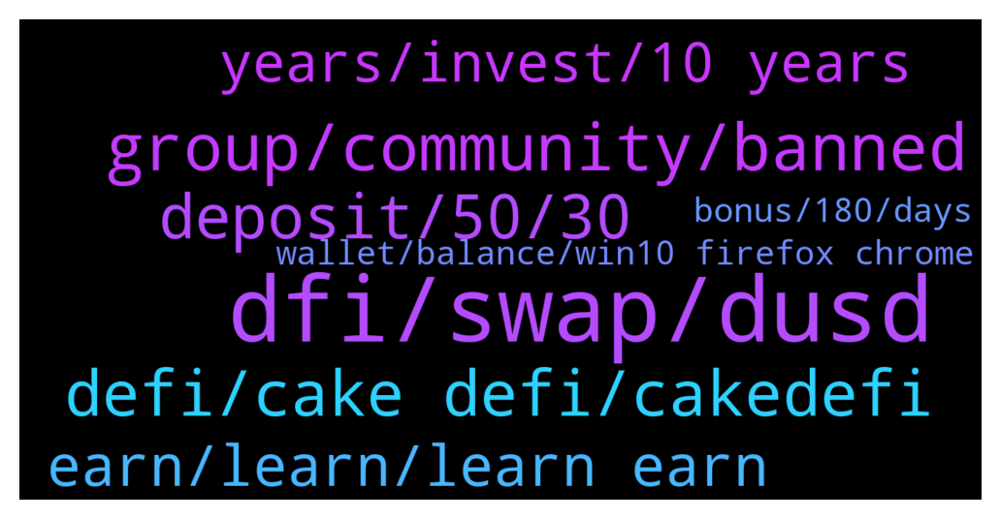

# **@CakeDeFi_EN**
 ## Analysis for **2021-12-29** - **2021-12-30**.

---

## 📊 **Basic Stats**

**n_messages_sent**: 210

---

---

## 🔝 **Top keywords and related messages**

1. **dfi, swap, dusd**

    @Josh --- *I'm trying to swap LTC to DFI so I can do liquidity mining. After 40 minutes the swap still shows u processed?* **--->** [TG Discussion](https://t.me/CakeDeFi_EN/157932)

    @JonD26 --- *For future reference, when withdrawing BTC from LM is it cheapest to swap to DFI on Cake and then withdraw?* **--->** [TG Discussion](https://t.me/CakeDeFi_EN/157953)

    @JonD26 --- *You mean claimed the sign-up reward? did a while back. I then split 50 bucks of BTC to half DFI and put it into LM. I'm wondering how I'd get the BTC out now since BTC fees are too high. I assumed I'd have to swap it all to DFI and withdraw to Kucoin. Someone mentioned Ethereum gas fees. Is DFI erc20?* **--->** [TG Discussion](https://t.me/CakeDeFi_EN/157977)

    @Kassius84 --- *What are you talking about? There is a fixed withdrawal fee on Cake. https://support.cakedefi.com/hc/en-us/articles/360035886591-What-is-the-withdrawal-fee-for-Cake-* **--->** [TG Discussion](https://t.me/CakeDeFi_EN/157957)

    @DmgBautista --- *Actually, there's a ERC-20 version of DFI. For example, HOO exchange has the ERC-20 version of DFI listed if I remember correctly* **--->** [TG Discussion](https://t.me/CakeDeFi_EN/158004)

    @Michael_Schredl --- *Swaps can take up to 24 hours* **--->** [TG Discussion](https://t.me/CakeDeFi_EN/158128)

2. **group, community, banned**

    @James --- *I cant... it is telling me that the group doesn't exist so I'm assuming I got banned or an unknown reason or mistake* **--->** [TG Discussion](https://t.me/CakeDeFi_EN/158280)

    @James --- *Anyone know why I can't get get in the defichain telegram?* **--->** [TG Discussion](https://t.me/CakeDeFi_EN/158271)

    @mehmet_yilmaz87 --- *I try  website but failed* **--->** [TG Discussion](https://t.me/CakeDeFi_EN/158052)

    @super33max --- *Just block anyone you text you for no reason* **--->** [TG Discussion](https://t.me/CakeDeFi_EN/158187)

    @Kassius84 --- *Did you get an error message?* **--->** [TG Discussion](https://t.me/CakeDeFi_EN/157942)

    @DmgBautista --- *It may happens sometimes (blacklisted word or link, and the bot kicks you imediatelly, happened to anyone being enough time around, myself also 😅). Dont worry, unless you are a scammer, you usually get warned if doing something against the community guidelines, except if using something blacklisted, in whuch the bot kicks you. Just ask a mod to rejoin if its the case and you'll be fine :) Anyway I see you already rejoined, glad to have you back again!* **--->** [TG Discussion](https://t.me/CakeDeFi_EN/158343)

3. **defi, cake defi, cakedefi**

    @007 --- *Of course it’s not Cake here. Smart Contract Address?* **--->** [TG Discussion](https://t.me/CakeDeFi_EN/157948)

    @Michael_Schredl --- *That has nothing to do with Cake DeFi - check out Cake DeFi :) https://www.cakedefi.com/* **--->** [TG Discussion](https://t.me/CakeDeFi_EN/158144)

    @Michael_Schredl --- *Yes, Cake is a registered company in singapore* **--->** [TG Discussion](https://t.me/CakeDeFi_EN/158316)

    @Michael_Schredl --- *You mean the Cake DeFi app? Yes this is official* **--->** [TG Discussion](https://t.me/CakeDeFi_EN/158045)

    @Kingquad1 --- *Do the cake have App please* **--->** [TG Discussion](https://t.me/CakeDeFi_EN/157994)

    @007 --- *Not talking about cake once it leaves cake.* **--->** [TG Discussion](https://t.me/CakeDeFi_EN/157966)

4. **deposit, 50, 30**

    @Thomas --- *If not, then you don’t get the full 30$, only 10$ if I’m not wrong and about the deposit. It doesn’t need to be in one deposit, you need a wallet value of minimum 50$* **--->** [TG Discussion](https://t.me/CakeDeFi_EN/158078)

    @Levent --- *Is 30 dollars for spot transactions?* **--->** [TG Discussion](https://t.me/CakeDeFi_EN/157873)

    @hellobyebye --- *i cant claim my 30 dollars too haha* **--->** [TG Discussion](https://t.me/CakeDeFi_EN/157972)

    @andreasisaak --- *$30 if you deposit at least 50$* **--->** [TG Discussion](https://t.me/CakeDeFi_EN/157866)

    @Samet_Aslan --- *Hi. I deposited $35 twice for a $30 gift. I exceeded the 50 dollar limit requested by the site, but I did not receive a 30 dollar gift in my account. Do I have to deposit $50 or more in one go?* **--->** [TG Discussion](https://t.me/CakeDeFi_EN/158074)

    @Michael_Schredl --- *Did you already deposit 50 USD?* **--->** [TG Discussion](https://t.me/CakeDeFi_EN/157821)

5. **earn, learn, learn earn**

    @zxcvz3 --- *good evening, how can i get 5 dollar defichain reward with learn and earn, i have completed the task* **--->** [TG Discussion](https://t.me/CakeDeFi_EN/158392)

    @Ana May --- *I think im already registerred where is my reward.how to earn money.* **--->** [TG Discussion](https://t.me/CakeDeFi_EN/158118)

    @İsa --- *How can we earn money in this app* **--->** [TG Discussion](https://t.me/CakeDeFi_EN/158046)

    @Thomas --- *It’s 20$ as Michael said, the 10$ extra are from the referral link and additional 5$ for the learn and earn* **--->** [TG Discussion](https://t.me/CakeDeFi_EN/158084)

    @Samet_Aslan --- *How do I get that 10 dollars?* **--->** [TG Discussion](https://t.me/CakeDeFi_EN/158082)

    @Nehru --- *I think im already registerred where is my reward* **--->** [TG Discussion](https://t.me/CakeDeFi_EN/157820)

6. **years, invest, 10 years**

    @007 --- *But not with the Ethereum each investment is a different contract* **--->** [TG Discussion](https://t.me/CakeDeFi_EN/157940)

    @aldair_henriquez --- *how does this platform work before i invest* **--->** [TG Discussion](https://t.me/CakeDeFi_EN/157798)

    @Michael_Schredl --- *Depends on the product you are using Take a look at https://support.cakedefi.com/hc/en-us/articles/900003427506-Cake-Service-simply-explained* **--->** [TG Discussion](https://t.me/CakeDeFi_EN/158055)

    @Juanchi114 --- *best gain its on compound interest, but theres no page, can gave me so much confidence to put my money for 10 years :(.... With 1k in CI on 10 years, that will be more than 1M$* **--->** [TG Discussion](https://t.me/CakeDeFi_EN/158182)

    @Michael_Schredl --- *Depends on the amount of money you invest* **--->** [TG Discussion](https://t.me/CakeDeFi_EN/158051)

    @falconheavy --- *Wow! I can’t believe that even after all the updates and adjustments and decline in APRs my $6k invested in May has still grown to $15k :) I wonder what it’ll look like in 5-10 years from now!* **--->** [TG Discussion](https://t.me/CakeDeFi_EN/157857)

7. **wallet, balance, win10 firefox chrome**

    @Thomas --- *Check your wallet if you have any dfi already, they should be in the freezer. Since you verified your account and enabled the deposit. It should be there already or in the next few hours* **--->** [TG Discussion](https://t.me/CakeDeFi_EN/158089)

    @Samet_Aslan --- *no money showing in frozen wallet* **--->** [TG Discussion](https://t.me/CakeDeFi_EN/158091)

    @acsivrikaya --- *Hi. When will the unlocked balance become available for withdrawal?* **--->** [TG Discussion](https://t.me/CakeDeFi_EN/158069)

    @muelln --- *Does someone know, why I don’t see the withdrawal button if i log in with Win10, Firefox or chrome, but I do see the button if I log in with my Mac and safari. I made Similar experiences with removal of liquidity in the LM pool… it worked on Mac but not on latest win10+Firefox/chrome* **--->** [TG Discussion](https://t.me/CakeDeFi_EN/157787)

    @RdxCrypto --- *And when it will be received after deposit? Instant or time period?* **--->** [TG Discussion](https://t.me/CakeDeFi_EN/158005)

    @Samet_Aslan --- *$20 was not credited to my account. Do I have to wait for it to be transferred?* **--->** [TG Discussion](https://t.me/CakeDeFi_EN/158086)

