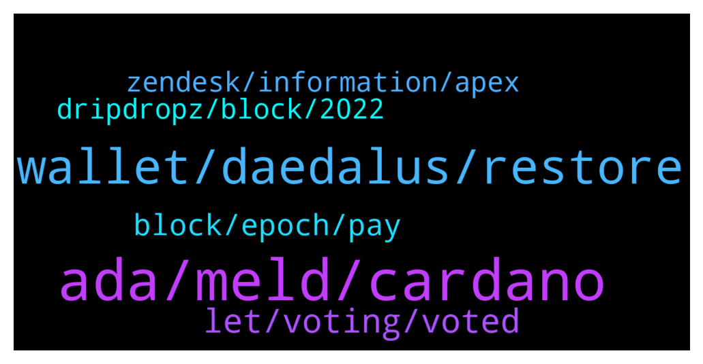

# **@Cardano**
 ## Analysis for **2021-12-29** - **2021-12-30**.

---

## 📊 **Basic Stats**

**n_messages_sent**: 113

---

---

## 🔝 **Top keywords and related messages**

1. **ada, meld, cardano**

    @thomas --- *[Forwarded from Cardano Announcements] Hey all! Want to help get more adoption and grow #Cardano? 👀  Please take a moment to vote and potentially get Ada added to bitpay app! ✨  Thanks for all the support! 💪  https://twitter.com/bitpay/status/1458977852230180868?s=21  Direct link to poll: https://gleam.io/1a0mE/bitpay-coin-poll (FYI: You can vote every day!😉)  Would you rather request a feature via the website and ask them for Cardano support? Please visit here and let your voices be heard: https://bitpay.canny.io/feature-request?sort=top* **--->** [TG Discussion](https://t.me/Cardano/763791)

    @apex_pool_spo --- *and if you have more than a few hundreds ADA, you should consider buying a hardware wallet.* **--->** [TG Discussion](https://t.me/Cardano/763628)

    @Antho --- *Hey I buy my first Ada <3 I’m joining the fam* **--->** [TG Discussion](https://t.me/Cardano/763874)

    @apex_pool_spo --- *no, actually it will help you with the NFT from MELD. one step is to Delegate to a community pool, in order to evolve your NFT.* **--->** [TG Discussion](https://t.me/Cardano/763648)

    @RVarel --- *I have few thousands and wanted to sell few* **--->** [TG Discussion](https://t.me/Cardano/763645)

    @apex_pool_spo --- *you don't need to undelegate for that. you just transfer what you want to sell to the Exchange (or where you want to sell it).* **--->** [TG Discussion](https://t.me/Cardano/763646)

2. **wallet, daedalus, restore**

    @RVarel --- *Hi George, nope its not like that I tried your method but its not restoring my wallet on yoroi* **--->** [TG Discussion](https://t.me/Cardano/763604)

    @apex_pool_spo --- *if it down not work, you should create a new wallet and transfer all your funds to the new wallet.* **--->** [TG Discussion](https://t.me/Cardano/763625)

    @Andrea --- *Hello, I want to switch from Daedalus to Yoroi because my pc is getting slower and slower. Can anyone confirm me that this is the right way to do it!? I don't want to make a mess.* **--->** [TG Discussion](https://t.me/Cardano/763581)

    @GioLoop --- *Is normal that daedalus ask of verify the wallet seed* **--->** [TG Discussion](https://t.me/Cardano/763590)

    @apex_pool_spo --- *if you are using the same recovery words and select the "restore" option, it will work.* **--->** [TG Discussion](https://t.me/Cardano/763605)

    @RVarel --- *I just verified my recovery phrase and its correct inthat Daedalus wallet* **--->** [TG Discussion](https://t.me/Cardano/763623)

3. **let, voting, voted**

    @ExInfernis --- *47 hours left. I have voted 37 times. If just everyone here votes at least once until the end we can take the lead.* **--->** [TG Discussion](https://t.me/Cardano/763502)

    @doc_holiday1881 --- *I’ve been voting everyday but seems like people aren’t voting. There’s no reason we shouldn’t beat EOS* **--->** [TG Discussion](https://t.me/Cardano/763866)

    @ExInfernis --- *Yeap, I think this group is not very active on voting. Lets do one last vote.* **--->** [TG Discussion](https://t.me/Cardano/763861)

    @thomas --- *Not bad I am not far away I have voted 36 times* **--->** [TG Discussion](https://t.me/Cardano/763509)

    @ChrisSTR8 --- *Please do support the BitPay poll, we could still win this if enough voted, only 2 days to go* **--->** [TG Discussion](https://t.me/Cardano/763299)

    @ChrisSTR8 --- *Final 24 hours in this poll, currently Tron is leading by a small margin, every vote counts* **--->** [TG Discussion](https://t.me/Cardano/763859)

4. **block, epoch, pay**

    @HammontreeArt --- *a first time delegator has to wait 21 days* **--->** [TG Discussion](https://t.me/Cardano/763691)

    @dmitry_stas --- *you'll get rewards if you staked 2 epochs before pool makes a block. the rewards will be distributed to you 2 epochs after pool makes the block* **--->** [TG Discussion](https://t.me/Cardano/763681)

    @Rowdy1219 --- *If a pool mints a block, and you have been staked in that block for over 3 or 4 weeks, do you get rewards when the block is minted?* **--->** [TG Discussion](https://t.me/Cardano/763680)

    @apex_pool_spo --- *it's 15 to 20 days, depending on the day in the epoch when he delegates. it the epoch just started, 20 days, if the epoch is about to end, 15 days.* **--->** [TG Discussion](https://t.me/Cardano/763695)

    @HammontreeArt --- *to start earning and then on epoch 5 you see the results* **--->** [TG Discussion](https://t.me/Cardano/763692)

    @sniemeyer --- *In general every pool pays around 5%. Depends on pool metrics and saturation. A big pool could pay out more than a little. But the most big pools take a fee.  Bigger pools pay more regular because they get more regular blocks. Small pools may pay out a long time nothing and then a bigger amount* **--->** [TG Discussion](https://t.me/Cardano/763452)

5. **zendesk, information, apex**

    @RickMcCracken --- *Yes, here is the information at the IOHK Zendesk https://iohk.zendesk.com/hc/en-us/articles/360038581434-Verify-wallet-recovery-phrase* **--->** [TG Discussion](https://t.me/Cardano/763616)

    @Zyroxa --- *What do you mean exactly? #safety* **--->** [TG Discussion](https://t.me/Cardano/763568)

    @RickMcCracken --- *The Zendesk is awesome for finding information. Just type in the search bar. Here is the top level link. https://iohk.zendesk.com/hc/en-us* **--->** [TG Discussion](https://t.me/Cardano/763621)

    @glitch04 --- *Yes, you should contact them about the app you found* **--->** [TG Discussion](https://t.me/Cardano/763753)

    @glitch04 --- *always best to verify direct with that developers official support / website* **--->** [TG Discussion](https://t.me/Cardano/763741)

    @RickMcCracken --- *What George [APEX] said is correct. I'm checking the Zendesk for more information.* **--->** [TG Discussion](https://t.me/Cardano/763620)

6. **dripdropz, block, 2022**

    @dominatingSlash --- *@RickMcCracken just confirming you have done your due diligence on the dripdropz team? I haven't had a chance to yet* **--->** [TG Discussion](https://t.me/Cardano/763594)

    @RickMcCracken --- *Yes. I have meetings with them once a week. Thanks for asking 🙏* **--->** [TG Discussion](https://t.me/Cardano/763595)

    @RickMcCracken --- *With DripDropz launching January 1, 2022 we have this video out on How to activate your account. How to withdraw tokens. How to get a referral link. https://www.youtube.com/watch?v=bgEwX8ATWlw* **--->** [TG Discussion](https://t.me/Cardano/763513)

    @Zyroxa --- *Sure but dont react to any incoming DMs.* **--->** [TG Discussion](https://t.me/Cardano/763872)

    @glitch04 --- *Also if anyone dm's you acting as support block and report them as they are scammers.* **--->** [TG Discussion](https://t.me/Cardano/763396)

    @jaypatelEarthling --- *He will probably block you 😂* **--->** [TG Discussion](https://t.me/Cardano/763380)

