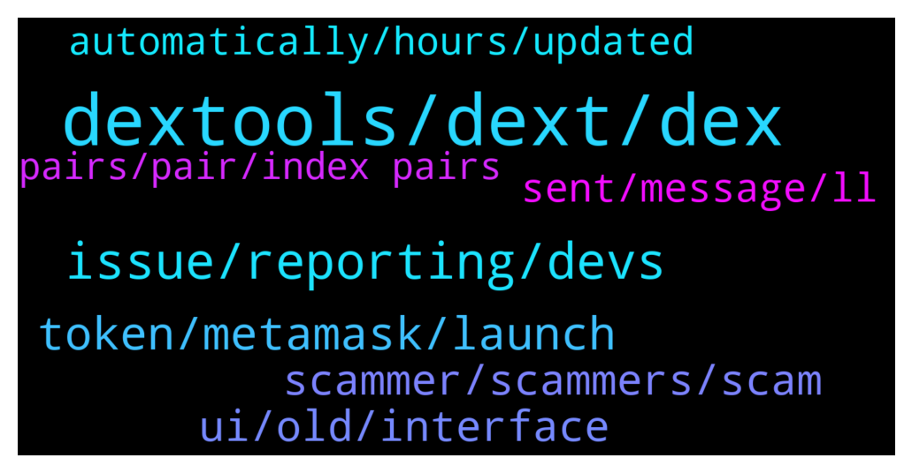

# **@DEXToolsCommunity**
 ## Analysis for **2021-12-28** - **2021-12-30**.

---

## 📊 **Basic Stats**

**n_messages_sent**: 431

---

---

## 🔝 **Top keywords and related messages**

1. **dextools, dext, dex**

    @gumbercules --- *Mine says low community score so watch out* **--->** [TG Discussion](https://t.me/DEXToolsCommunity/319112)

    @Gideon649 --- *What do I need to list on Dextool ?* **--->** [TG Discussion](https://t.me/DEXToolsCommunity/319755)

    @elialearn --- *does dextools have api to get price of token (will add a backlink on dapp)* **--->** [TG Discussion](https://t.me/DEXToolsCommunity/320378)

    @EricCryptoman --- *it was a huge security fuck up on your end, 99 dext score and verified by you guys in 2 different manners.* **--->** [TG Discussion](https://t.me/DEXToolsCommunity/319570)

    @OMOONXT1 --- *ppl are selling without any problem as I can see on dextools* **--->** [TG Discussion](https://t.me/DEXToolsCommunity/319860)

    @币圈 --- *Dextools app get ads fee can purchase dext to burn？* **--->** [TG Discussion](https://t.me/DEXToolsCommunity/319419)

2. **issue, reporting, devs**

    @FredericDEXT --- *We can fix that thanks for reporting* **--->** [TG Discussion](https://t.me/DEXToolsCommunity/318650)

    @FredericDEXT --- *All feedback is noted , we will deliver fixes for all reported issues in the next days.* **--->** [TG Discussion](https://t.me/DEXToolsCommunity/319630)

    @napascual --- *Indeed, that's the issue. Try resizing the screen as a fallback, but it will be fixed today* **--->** [TG Discussion](https://t.me/DEXToolsCommunity/318848)

    @napascual --- *Hey, we've fixed that yesterday already, added several checks and security. It won't happen again* **--->** [TG Discussion](https://t.me/DEXToolsCommunity/319566)

    @abrahamgoblinhead --- *why are you guys responding to everything but the MASK issue? @napascual @stanes   @EricCryptoman* **--->** [TG Discussion](https://t.me/DEXToolsCommunity/319565)

    @stanes --- *Team is aware of this issue, they are currently working on a fix.* **--->** [TG Discussion](https://t.me/DEXToolsCommunity/318773)

3. **token, metamask, launch**

    @gumbercules --- *I'm not seeing a verified marking (assuming we're talking about the same token)* **--->** [TG Discussion](https://t.me/DEXToolsCommunity/319109)

    @chrismagic0 --- *I need support for my token* **--->** [TG Discussion](https://t.me/DEXToolsCommunity/319970)

    @Giribabu --- *I am unable to sell my tokens* **--->** [TG Discussion](https://t.me/DEXToolsCommunity/319342)

    @CryptoAce8 --- *Have you checked if our wallets are safe or that fake Metamask token could drain our wallets as well?* **--->** [TG Discussion](https://t.me/DEXToolsCommunity/319155)

    @So --- *It's Nike RTFKT token a honey pot scam* **--->** [TG Discussion](https://t.me/DEXToolsCommunity/320199)

    @stanes --- *About social Information for your token, please update etherscan.io or bscscan.com or coingecko.com  We pull info from there.* **--->** [TG Discussion](https://t.me/DEXToolsCommunity/320365)

4. **scammer, scammers, scam**

    @tatiana211 --- *posible to buy scam? im cant undersand* **--->** [TG Discussion](https://t.me/DEXToolsCommunity/319856)

    @smid10 --- *Scammer has hosted his js payload on namecheap* **--->** [TG Discussion](https://t.me/DEXToolsCommunity/319066)

    @sirsirmoon --- *Better you gonna clean the scammer here* **--->** [TG Discussion](https://t.me/DEXToolsCommunity/320099)

    @napascual --- *That was a scammer, be aware!* **--->** [TG Discussion](https://t.me/DEXToolsCommunity/319226)

    @EricCryptoman --- *we had a security breach, completely our fault, you got scammed, goodbye* **--->** [TG Discussion](https://t.me/DEXToolsCommunity/319580)

    @BNFTTMD --- *It’s really hard to get the top of the list last time, all I met were scammers* **--->** [TG Discussion](https://t.me/DEXToolsCommunity/319747)

5. **ui, old, interface**

    @Crabouif --- *I agree. Keep reloading back the old one lol* **--->** [TG Discussion](https://t.me/DEXToolsCommunity/318840)

    @Darius5558 --- *Feel like this update has made the UI worse* **--->** [TG Discussion](https://t.me/DEXToolsCommunity/319241)

    @A10 --- *@admins I cant see these information as its black on dark mode* **--->** [TG Discussion](https://t.me/DEXToolsCommunity/320051)

    @Qboybm --- *Can I switch back to the old interface?* **--->** [TG Discussion](https://t.me/DEXToolsCommunity/318791)

    @esshack --- *alot of us prefer the old ui for many reasons* **--->** [TG Discussion](https://t.me/DEXToolsCommunity/318648)

    @Qboybm --- *the new interface is too dark, I like the old interface better* **--->** [TG Discussion](https://t.me/DEXToolsCommunity/318774)

6. **sent, message, ll**

    @FredericDEXT --- *Dm me the link and I'll check* **--->** [TG Discussion](https://t.me/DEXToolsCommunity/319621)

    @napascual --- *Sure, but I'll go through it tomorrow (2am here)* **--->** [TG Discussion](https://t.me/DEXToolsCommunity/319691)

    @genialcronyTAMC6 --- *Thanks can I DM you now?* **--->** [TG Discussion](https://t.me/DEXToolsCommunity/319688)

    @oshemeyijosh --- *I just sent back the right information in DM. Thank you.* **--->** [TG Discussion](https://t.me/DEXToolsCommunity/319181)

    @TheFlash_11 --- *Thank you @napascual ...I sent you a dm!* **--->** [TG Discussion](https://t.me/DEXToolsCommunity/319263)

    @napascual --- *Nice, feel free to dm me if it occurs again* **--->** [TG Discussion](https://t.me/DEXToolsCommunity/318621)

7. **automatically, hours, updated**

    @Dannyt6 --- *Thanks seems transactions come through now 👍* **--->** [TG Discussion](https://t.me/DEXToolsCommunity/318620)

    @Crabouif --- *👍 Thanks. I'll do the necessary there. Will it be automatically updated once it is there?* **--->** [TG Discussion](https://t.me/DEXToolsCommunity/318863)

    @napascual --- *Feel free to update it there and it'll be updated automatically* **--->** [TG Discussion](https://t.me/DEXToolsCommunity/318610)

    @TheFlash_11 --- *It's been about 2 hours....is that normal?* **--->** [TG Discussion](https://t.me/DEXToolsCommunity/319255)

    @elialearn --- *Okay sounds good looking forward to it* **--->** [TG Discussion](https://t.me/DEXToolsCommunity/320380)

    @stanes --- *Should update automatically in few hours yes. If still nothing after 24h, let us know 👍* **--->** [TG Discussion](https://t.me/DEXToolsCommunity/318864)

