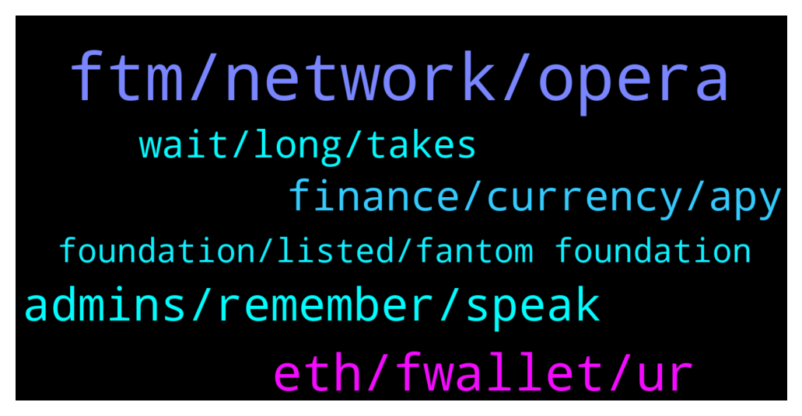

# **@Fantom_English**
 ## Analysis for **2021-12-29** - **2021-12-30**.

---

## 📊 **Basic Stats**

**n_messages_sent**: 178

---

---

## 🔝 **Top keywords and related messages**

1. **ftm, network, opera**

    @inacryptoworld --- *Guys I have a question… I have some FTM in Kucoin and I would like transfer them into fantom wallet but when I select FTM for deposit address it shows me FTMet…. Is it right ? Why ftmet and not ftm? Thanks for help I’m worry to lose my money* **--->** [TG Discussion](https://t.me/Fantom_English/618512)

    @pajamasfreak --- *It is much cheaper to utilize opera network than erc20 that’s why we give options to users.* **--->** [TG Discussion](https://t.me/Fantom_English/618383)

    @pajamasfreak --- *Yeah, per our last AMA. We will reduce erc20 tokens and increase more on opera, so yeah we are getting towards that goal. Not sure completely but majority will be on opera.* **--->** [TG Discussion](https://t.me/Fantom_English/618394)

    @pajamasfreak --- *Our supply exclude wftm since it is 1:1 to the origin chain* **--->** [TG Discussion](https://t.me/Fantom_English/618376)

    @Mcjig --- *no, you manually do it. since you have any ftm* **--->** [TG Discussion](https://t.me/Fantom_English/618555)

    @Janevietani --- *deposit it to Binance and withdraw native FTM from  Binance* **--->** [TG Discussion](https://t.me/Fantom_English/618499)

2. **eth, fwallet, ur**

    @EAE999 --- *How to import my Fwallet to metamask?* **--->** [TG Discussion](https://t.me/Fantom_English/618288)

    @Jace --- *Is a transaction hash public info? I’m sorry I’m new to this* **--->** [TG Discussion](https://t.me/Fantom_English/618560)

    @EAE999 --- *I can see it on ethscan but not Fwallet* **--->** [TG Discussion](https://t.me/Fantom_English/618276)

    @Darqus --- *since Fwallet doesnt support eth as fast as I know* **--->** [TG Discussion](https://t.me/Fantom_English/618284)

    @Darqus --- *so in that case ur eth went to eth wallet with same adress as ur Fwallet* **--->** [TG Discussion](https://t.me/Fantom_English/618282)

    @Darqus --- *sorry I got u, u sent eth to ur Fwallet* **--->** [TG Discussion](https://t.me/Fantom_English/618281)

3. **admins, remember, speak**

    @Ibn_Ahmad01 --- *Hmmm.. I've received like 10 messages and calls from people claiming to be admins/support here 😡😡😡* **--->** [TG Discussion](https://t.me/Fantom_English/618664)

    @RitwanRistanto --- *do you need ambassador or admin community from my country?* **--->** [TG Discussion](https://t.me/Fantom_English/618590)

    @N32121 --- *Can I speak to you on your personal account?* **--->** [TG Discussion](https://t.me/Fantom_English/618557)

    @SummerWind --- *Yeap I got blocked from that group* **--->** [TG Discussion](https://t.me/Fantom_English/618027)

    @Mcjig --- *you can, but highly doubtful they would be interested* **--->** [TG Discussion](https://t.me/Fantom_English/618559)

    @Mr --- *Those r scammers... Don't give ur wallet address... Be careful..* **--->** [TG Discussion](https://t.me/Fantom_English/618887)

4. **finance, currency, apy**

    @Farthaze --- *Hello, how much is the fee to mint in Artion* **--->** [TG Discussion](https://t.me/Fantom_English/618298)

    @coinmania222 --- *how much worth is advisable to buy now please* **--->** [TG Discussion](https://t.me/Fantom_English/618603)

    @Hyphaed --- *like automatic rebalance of the wallet, to a selected weekly high performance and secure coins?* **--->** [TG Discussion](https://t.me/Fantom_English/618066)

    @DevilFinance_io --- *Hello, we are the Devil Finance team and we will soon launch a Yield Optimizer platform on the Fantom blockchain. May we promote our project in your group? Thank you.* **--->** [TG Discussion](https://t.me/Fantom_English/618065)

    @DastardlyDude --- *what is the typical apr for staking in a node?* **--->** [TG Discussion](https://t.me/Fantom_English/618131)

    @Mcjig --- *[Forwarded from jane] Price discussion and FA/TA trading:  • Chat.fantom.network Discord • @fantomtrading  FTM ecosystem projects and discussion: • projects.fantom.network • https://discuss.fantom.digital/d/30-all-in-one-guide-for-fantom-newcomers • @FantomLoungeOfficial • @Fantomine • @ftm_nft  ❌NO SHILL OR ASK FINANCIAL ADVICE!❌* **--->** [TG Discussion](https://t.me/Fantom_English/618576)

5. **wait, long, takes**

    @Mcjig --- *it only takes a few minutes. obviously you had a issue* **--->** [TG Discussion](https://t.me/Fantom_English/618583)

    @H.P. --- *As you live in a rented house temporarily until your own house is finished* **--->** [TG Discussion](https://t.me/Fantom_English/618388)

    @Jace --- *Ok how long does it usually take to get liquidity?* **--->** [TG Discussion](https://t.me/Fantom_English/618563)

    @M.K --- *i think that's what I think... now I have to wait for all blocks to be confirmed and that takes about 2-3 month* **--->** [TG Discussion](https://t.me/Fantom_English/618585)

    @Jace --- *yes I checked it there and it also says completed* **--->** [TG Discussion](https://t.me/Fantom_English/618542)

    @EAE999 --- *Does that mean  its gone forever?* **--->** [TG Discussion](https://t.me/Fantom_English/618265)

6. **foundation, listed, fantom foundation**

    @Mcjig --- *never heard of it, but you can get info about different projects on https://discord.gg/etvnhPRB56* **--->** [TG Discussion](https://t.me/Fantom_English/618573)

    @Janevietani --- *just wanna make sure , this is Fantom not Phantom* **--->** [TG Discussion](https://t.me/Fantom_English/618893)

    @Kuraba --- *This is why fantom is very strong* **--->** [TG Discussion](https://t.me/Fantom_English/618682)

    @shammybabu --- *Thanks mate. I will check it out.* **--->** [TG Discussion](https://t.me/Fantom_English/618432)

    @eznika --- *any word on how to get a project listed on the "projects fantom network" website?  submitted 2 times already but it isn't listed* **--->** [TG Discussion](https://t.me/Fantom_English/618126)

    @pajamasfreak --- *It is not part of foundation, you can directly ask the person.* **--->** [TG Discussion](https://t.me/Fantom_English/618343)

