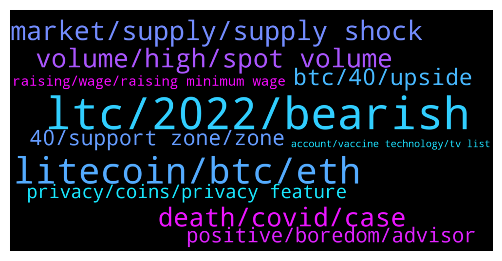

# **@Litecoin**
 ## Analysis for **2021-12-29** - **2021-12-30**.

---

## 📊 **Basic Stats**

**n_messages_sent**: 324

---

---

## 🔝 **Top keywords and related messages**

1. **ltc, 2022, bearish**

    @JIMMY G --- *Bearish sentiment on LTC is a good thing* **--->** [TG Discussion](https://t.me/Litecoin/2037315)

    @moonsie --- *my life tied to LTC at this point* **--->** [TG Discussion](https://t.me/Litecoin/2037512)

    @moonsie --- *release and miner signaling in january* **--->** [TG Discussion](https://t.me/Litecoin/2037287)

    @trisha_65 --- *You probably have a big sell order on LTC. Lol* **--->** [TG Discussion](https://t.me/Litecoin/2036928)

    @bullleaks --- *chill guys! buy LTC every month and look back in 5-15years 👍🏽* **--->** [TG Discussion](https://t.me/Litecoin/2037209)

    @syonfive --- *i sell all my whole 1 ltc due to panic sell and wish buy again 1.1 at lower price* **--->** [TG Discussion](https://t.me/Litecoin/2036781)

2. **litecoin, btc, eth**

    @jrx486 --- *Has nothing to do with Litecoin. It’s the exchange that decides you can’t withdraw funds.* **--->** [TG Discussion](https://t.me/Litecoin/2036992)

    @Sherry_HFX --- *Investing must learn to grasp opportunities. Some opportunities are enough to change our lives. Just like the current coin farming, I have repeatedly emphasized: friends who are waiting and watching should take the time to try farming* **--->** [TG Discussion](https://t.me/Litecoin/2037107)

    @finitemaz --- *the marketing some seem to refer to is from the premined newer sketchy coins that dump their stash to fund just that.  Litecoin never had that* **--->** [TG Discussion](https://t.me/Litecoin/2036659)

    @xShaminox --- *Dogecoin took all the lights out of Litecoin bro* **--->** [TG Discussion](https://t.me/Litecoin/2037271)

    @Arley --- *I’ve read that Litecoin is a better platform than BTC. Faster & cheaper to use. How come ETH is getting more value for their token.* **--->** [TG Discussion](https://t.me/Litecoin/2036635)

    @Arley --- *Is it poor markering. Maybe people just don’t know enough Abington Litecoin* **--->** [TG Discussion](https://t.me/Litecoin/2036647)

3. **market, supply, supply shock**

    @xShaminox --- *and everyone laughts at it cuz "Everytime it pumps market dumps"* **--->** [TG Discussion](https://t.me/Litecoin/2037314)

    @moonsie --- *and china sell pressure will soon stop* **--->** [TG Discussion](https://t.me/Litecoin/2037234)

    @moonsie --- *there have been at least 2 major liquidation evenet this year alone, lots of retail has been scared off for good probably* **--->** [TG Discussion](https://t.me/Litecoin/2037231)

    @ck42069 --- *supply based market supply shock all is bs* **--->** [TG Discussion](https://t.me/Litecoin/2036856)

    @ck42069 --- *as long as the futrures market exists, this market wont move* **--->** [TG Discussion](https://t.me/Litecoin/2036882)

    @ck42069 --- *or to leave the market entirely* **--->** [TG Discussion](https://t.me/Litecoin/2036938)

4. **death, covid, case**

    @RabbitL0v3r --- *Yes there was reason when death was high, but rn it isnt* **--->** [TG Discussion](https://t.me/Litecoin/2037428)

    @BennyBennyBlanco --- *The omicron is more infectious than deaths* **--->** [TG Discussion](https://t.me/Litecoin/2037424)

    @RabbitL0v3r --- *For new york, maybe lots of case but largely largely less deadly than 1 good year ago* **--->** [TG Discussion](https://t.me/Litecoin/2037423)

    @BennyBennyBlanco --- *Tons of covid jobs due to the pandemic* **--->** [TG Discussion](https://t.me/Litecoin/2037442)

    @BennyBennyBlanco --- *It’ll get worse, as well for other countries too. I say for at least another 5 years* **--->** [TG Discussion](https://t.me/Litecoin/2037411)

    @RabbitL0v3r --- *Who care about a barely lethal virus* **--->** [TG Discussion](https://t.me/Litecoin/2037427)

5. **volume, high, spot volume**

    @ck42069 --- *I listened to ray dalio on Lex Fridman podcast* **--->** [TG Discussion](https://t.me/Litecoin/2036845)

    @ck42069 --- *But this shits going down Im fucking convinced* **--->** [TG Discussion](https://t.me/Litecoin/2036867)

    @WeaponSecs --- *Oi still fuckin high v spot volume* **--->** [TG Discussion](https://t.me/Litecoin/2037089)

    @WeaponSecs --- *Will be interesting to see if spot volume increases by much or will continue remaining flaccid since the start of Dec* **--->** [TG Discussion](https://t.me/Litecoin/2037053)

    @ck42069 --- *look at these high volume sells* **--->** [TG Discussion](https://t.me/Litecoin/2036935)

    @ck42069 --- *some of that was me mate* **--->** [TG Discussion](https://t.me/Litecoin/2036879)

6. **btc, 40, upside**

    @RabbitL0v3r --- *What matters is the % not the spot price* **--->** [TG Discussion](https://t.me/Litecoin/2037195)

    @Carlos_PRO_Holder --- *Btc going to 20k and ltc $60* **--->** [TG Discussion](https://t.me/Litecoin/2036470)

    @JIMMY G --- *4 year declining wedge v btc* **--->** [TG Discussion](https://t.me/Litecoin/2037272)

    @ck42069 --- *BTC is hardly holding the 200MA* **--->** [TG Discussion](https://t.me/Litecoin/2036922)

    @jrx486 --- *btc dominance at 40% tells me it's time to buy more because we bottomed* **--->** [TG Discussion](https://t.me/Litecoin/2036905)

    @ck42069 --- *as I look BTC D is rebounding from 40% to the upside* **--->** [TG Discussion](https://t.me/Litecoin/2036894)

7. **40, support zone, zone**

    @Evee --- *What's the ta for 40? If ur going to make up numbers you should at least say it stops at 69.* **--->** [TG Discussion](https://t.me/Litecoin/2036956)

    @moonsie --- *it is now over $3000 higher* **--->** [TG Discussion](https://t.me/Litecoin/2037498)

    @moonsie --- *$300 is down from 4 years ago* **--->** [TG Discussion](https://t.me/Litecoin/2037345)

    @khalid --- *I mean what is the floor price* **--->** [TG Discussion](https://t.me/Litecoin/2037034)

    @ken_xmas --- *I remember, people talked about $4200 eoy in foy(frist of year)  And now talking about $40 Lol* **--->** [TG Discussion](https://t.me/Litecoin/2036536)

    @jw418 --- *I need about tree fiddy but I’m not counting on it* **--->** [TG Discussion](https://t.me/Litecoin/2036425)

8. **positive, boredom, advisor**

    @JIMMY G --- *Let’s try and be a bit more positive* **--->** [TG Discussion](https://t.me/Litecoin/2036874)

    @yingcheng818 --- *Wisdom and courage are both indispensable* **--->** [TG Discussion](https://t.me/Litecoin/2037111)

    @ck42069 --- *look mate thats how I release stress* **--->** [TG Discussion](https://t.me/Litecoin/2036929)

    @jrx486 --- *high emotions is the worst advisor* **--->** [TG Discussion](https://t.me/Litecoin/2036921)

    @ck42069 --- *Im just releasing the negative energy bro* **--->** [TG Discussion](https://t.me/Litecoin/2036869)

    @bake_Crypto --- *Good ser! Mental health is important* **--->** [TG Discussion](https://t.me/Litecoin/2036430)

9. **account, vaccine technology, tv list**

    @bake_Crypto --- *He want us to be removed from tv list* **--->** [TG Discussion](https://t.me/Litecoin/2036542)

    @RabbitL0v3r --- *You should check their official papers* **--->** [TG Discussion](https://t.me/Litecoin/2037379)

    @JohnTheApostle --- *No I just banned this scammer* **--->** [TG Discussion](https://t.me/Litecoin/2036813)

    @ken_xmas --- *Okay okay confirmed you are Nigerian* **--->** [TG Discussion](https://t.me/Litecoin/2036492)

    @Luigi_Bowline --- *JUST IN - Twitter has suspended the account of Dr. Robert Malone, inventor of mRNA vaccine technology.  @disclosetv* **--->** [TG Discussion](https://t.me/Litecoin/2036978)

    @ken_xmas --- *Are you trying to search on google?* **--->** [TG Discussion](https://t.me/Litecoin/2036490)

10. **privacy, coins, privacy feature**

    @jrx486 --- *Erasing coin transaction history making coins equally worth* **--->** [TG Discussion](https://t.me/Litecoin/2037401)

    @RabbitL0v3r --- *If its through bitpay then even shib is there* **--->** [TG Discussion](https://t.me/Litecoin/2037364)

    @RabbitL0v3r --- *Even btc got privacy feature with schnorr before ltc* **--->** [TG Discussion](https://t.me/Litecoin/2037334)

    @moonsie --- *that's enough for 80%+ of privacy minded ppl who use crypto* **--->** [TG Discussion](https://t.me/Litecoin/2037309)

    @moonsie --- *it justs hides the amounts transacted* **--->** [TG Discussion](https://t.me/Litecoin/2037308)

    @xShaminox --- *privacy coins are useless, nobody buys them* **--->** [TG Discussion](https://t.me/Litecoin/2037302)

