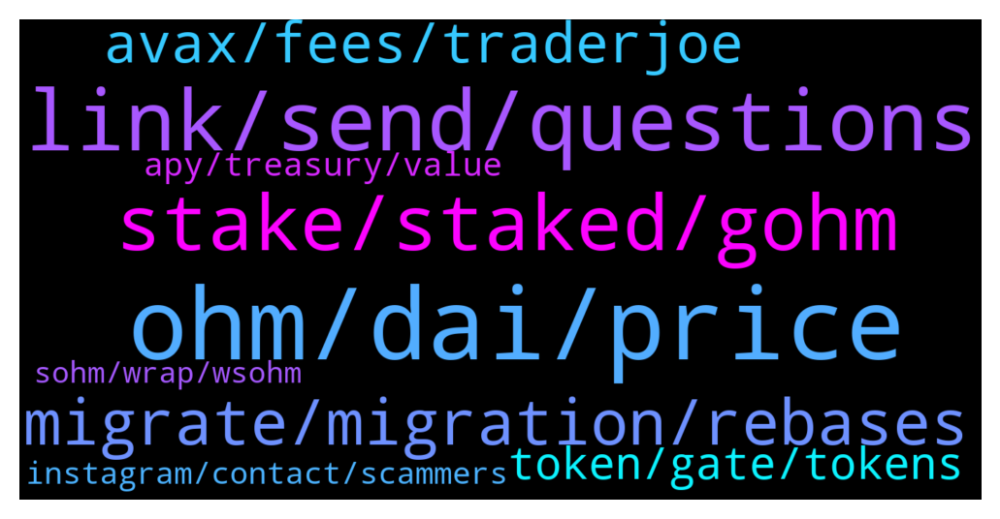

# **@OlympusTG**
 ## Analysis for **2021-12-29** - **2021-12-30**.

---

## 📊 **Basic Stats**

**n_messages_sent**: 786

---

---

## 🔝 **Top keywords and related messages**

1. **ohm, dai, price**

    @nfwaple --- *I just checked bruh, the slippage is still quite low for OHMv1 - DAI, you should be able to sell* **--->** [TG Discussion](https://t.me/OlympusTG/137039)

    @jken123456 --- *The ohmdao is for whale only...hahahaha..I'm poor can't stake my 0.1ohm..lol* **--->** [TG Discussion](https://t.me/OlympusTG/136757)

    @bike4peace --- *How does OHM perform in a bank run? https://t.me/OlympusTG/61632* **--->** [TG Discussion](https://t.me/OlympusTG/137366)

    @bike4peace --- *OFFICIAL WEBSITE _ OHM - OLYMPUS https://t.me/OlympusTG/55323  ---  Great overview of all OHM Links https://t.me/OlympusTG/62326   ---  OHM explained for beginners. https://t.me/OlympusTG/54530* **--->** [TG Discussion](https://t.me/OlympusTG/137367)

    @Zeeshan --- *Check hotbit exchange price of ohm* **--->** [TG Discussion](https://t.me/OlympusTG/137811)

    @amkuo --- *HI one silly question.  any knows why OHM shows differents stats on coingecko, coinmarketcap? its a lot of diffrences* **--->** [TG Discussion](https://t.me/OlympusTG/136867)

2. **link, send, questions**

    @Wbish91 --- *I thought the TG was an open discussion for people to understand. Okay sorry to causing a ruckus, I was just merely open to hear your views on other peoples opinions As some with a level head.* **--->** [TG Discussion](https://t.me/OlympusTG/137224)

    @JulioMXCD --- *again, if you can prove otherwise I will believe you* **--->** [TG Discussion](https://t.me/OlympusTG/136707)

    @highhix --- *Sorry this may have been asked a bunch already* **--->** [TG Discussion](https://t.me/OlympusTG/137766)

    @nfwaple --- *do your research first so you can sleep at night 🙏🏻* **--->** [TG Discussion](https://t.me/OlympusTG/137841)

    @Ap0l1o --- *I answered this to you yesterday* **--->** [TG Discussion](https://t.me/OlympusTG/137283)

    @wenpoo --- *hi, did you ohmies tried already to debunk this? https://www.reddit.com/r/defi/comments/rr6dl6/olympusdaos_economics_dont_make_sense/* **--->** [TG Discussion](https://t.me/OlympusTG/137616)

3. **stake, staked, gohm**

    @nfwaple --- *gOHM does not need to be staked, it is always in staked form. Second pic: https://twitter.com/dopex_intern/status/1473439395999068162/photo/1* **--->** [TG Discussion](https://t.me/OlympusTG/136883)

    @dropkickdarren --- *gOHM vs. sOHM TL;DR: gOHM is more useful than sOHM. gOHM is available across many networks/blockchains, avoids staking/unstaking fees, and will be supported by other DeFi projects. It's the preferred way to hold staked OHM. sOHM can be used Olympus Give or just holding. No other uses. Both tokens get exactly the same rewards.* **--->** [TG Discussion](https://t.me/OlympusTG/136848)

    @willyc --- *When we switch to gohm is it already staked then or..* **--->** [TG Discussion](https://t.me/OlympusTG/137542)

    @BTC - TheDaddy - TheFuture --- *buy gOHM on uniswap that way there is no approve cost and no stake costs and everything shows up on the dashboard. you may have to add the gOHM token address to uniswap which you can obtain from coingecko* **--->** [TG Discussion](https://t.me/OlympusTG/137952)

    @d --- *If gohm is already staked does it just automatically compound in my wallet* **--->** [TG Discussion](https://t.me/OlympusTG/137898)

    @Ap0l1o --- *you don't have to stake gOhm Fren* **--->** [TG Discussion](https://t.me/OlympusTG/137370)

4. **migrate, migration, rebases**

    @cryptojai --- *I speculate that a Lot of folks freaked during this migration and withdrew. That plus a general bearish sentiment. When dust settles and whales re enter we will hopefully see juicy rebound.  It could be days or months away.  Tame the emotions.* **--->** [TG Discussion](https://t.me/OlympusTG/137670)

    @nohso --- *i dont remember, but theres no button to click for migrate anymore, its gone* **--->** [TG Discussion](https://t.me/OlympusTG/136957)

    @cdp279 --- *Well. The migration also happened just before the market started dumping. So I don’t think this is entirely the case ser. Maybe some chumps decided to get out but yeah* **--->** [TG Discussion](https://t.me/OlympusTG/137672)

    @nfwaple --- *does the website prompt you to migrate still?* **--->** [TG Discussion](https://t.me/OlympusTG/137119)

    @(3'3) --- *I try to migrate but it does not leave me the platform ...* **--->** [TG Discussion](https://t.me/OlympusTG/137128)

    @willyc --- *How long do you have to migrate* **--->** [TG Discussion](https://t.me/OlympusTG/137534)

5. **avax, fees, traderjoe**

    @Ap0l1o --- *easiest way would be via traderjoe on avalanche I suppose* **--->** [TG Discussion](https://t.me/OlympusTG/137317)

    @Ap0l1o --- *you don't have enough avax to cover the fees?* **--->** [TG Discussion](https://t.me/OlympusTG/137271)

    @Pallas1111 --- *Does it cost much in gas fees to bridge from Eth to Avax?* **--->** [TG Discussion](https://t.me/OlympusTG/137261)

    @CodeBlooded1 --- *Need a platform like Rari Capital on Avalanche.  Ethereum Fees suck.* **--->** [TG Discussion](https://t.me/OlympusTG/136521)

    @Ryan --- *I bought time with Ava the fees were like less than a dollar I think 🧐* **--->** [TG Discussion](https://t.me/OlympusTG/136557)

    @a320_ali --- *Also I do have enough AVAX to cover the fees* **--->** [TG Discussion](https://t.me/OlympusTG/137275)

6. **token, gate, tokens**

    @Crypticmuni --- *im getting below warning messages.  "This token doesn't appear on the active token list(s). Make sure this is the token that you want to trade."* **--->** [TG Discussion](https://t.me/OlympusTG/137963)

    @Ap0l1o --- *happened to me with another token on another exchange* **--->** [TG Discussion](https://t.me/OlympusTG/136810)

    @matt_jm --- *Really frustrating, I guess because a few weeks ago I literally deposited the same coin without problems I thought I was fine* **--->** [TG Discussion](https://t.me/OlympusTG/136820)

    @Antotop30 --- *GUYS ATTENTION. It happened to me as well. I received this token named somenthing “ .io” and when I approved the contract they started having access to my wallet and stole a lot of my tokens. Never go and trade it I got fucked. Can someone help me secure my Metamask? How did they take my tokens if the transaction does not appear on my Metamask history?* **--->** [TG Discussion](https://t.me/OlympusTG/137429)

    @Nitin --- *Can anyone help with the token flow chart* **--->** [TG Discussion](https://t.me/OlympusTG/137910)

    @nfwaple --- *looks to be v1, you can check the token addresses here: https://docs.olympusdao.finance/main/contracts/tokens* **--->** [TG Discussion](https://t.me/OlympusTG/137044)

7. **apy, treasury, value**

    @Nitin --- *Where is the '1' coming from in the APY formula?* **--->** [TG Discussion](https://t.me/OlympusTG/137848)

    @Arthur --- *Thank you, Indeed, but what about the 5000% apy?* **--->** [TG Discussion](https://t.me/OlympusTG/137763)

    @Ap0l1o --- *Even if it goes down to less than 1k APY. If people unstake and sell massively, the APY will increase* **--->** [TG Discussion](https://t.me/OlympusTG/136670)

    @CBMallorca --- *Whats going on …? Its falling más falling … apy Isnt Changing …* **--->** [TG Discussion](https://t.me/OlympusTG/136715)

    @Lost --- *If less people stake does the APY increase ?* **--->** [TG Discussion](https://t.me/OlympusTG/137470)

    @Ap0l1o --- *the APY is based on the staked amount of Ohm* **--->** [TG Discussion](https://t.me/OlympusTG/136685)

8. **instagram, contact, scammers**

    @mdqmatias --- *You mean a scam or something like that? Its a super legit thing, If you're worried about that, research the project.* **--->** [TG Discussion](https://t.me/OlympusTG/137120)

    @lul_u --- *Hello, please who is ADMIN, I've got some nice offers, pls DM (Graphics, Website and DAPP Developer) and i can make you a White paper and Billboard design too, and i've  got a portfolio from previous projects.* **--->** [TG Discussion](https://t.me/OlympusTG/137996)

    @cdp279 --- *That will eventually find its way into crypto and defi. I just hope defi becomes safer and these hacks stop happening. Really bad for crypto. And these damn scammers.* **--->** [TG Discussion](https://t.me/OlympusTG/137679)

    @Orlando --- *I’ve had two responses one from called MODERATOR and another one known as Olympus Bot which had my original messaged attachment …. Who is genuine ?* **--->** [TG Discussion](https://t.me/OlympusTG/137433)

    @RAMI_ALLABAN5 --- *we have a list of verified instagram influencers that are ready to promote you on instagram, who might i contact in this regard?* **--->** [TG Discussion](https://t.me/OlympusTG/137902)

    @Ap0l1o --- *I don't care about Jay Pinho and I would appreciate if you don't advertise him here* **--->** [TG Discussion](https://t.me/OlympusTG/137219)

