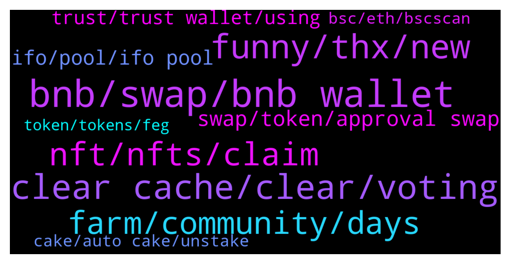

# **@PancakeSwap**
 ## Analysis for **2021-12-29** - **2021-12-30**.

---

## 📊 **Basic Stats**

**n_messages_sent**: 1141

---

---

## 🔝 **Top keywords and related messages**

1. **bnb, swap, bnb wallet**

    @Palmnim --- *Hello pls help me  I have been deposit to bitmart by pancakeswap Busd to BNB and used Recipient. pancake swap sent wbnb to bimart why not bnb 0x10ed43c718714eb63d5aa57b78b54704e256024e* **--->** [TG Discussion](https://t.me/PancakeSwap/2232545)

    @uaretheoneneo --- *i mean the one i put money in, like BBT-BNB* **--->** [TG Discussion](https://t.me/PancakeSwap/2233427)

    @Fabrices --- *Can someone help me with this question? I have $110 worth bnb but anytime i wont to swap to shiboshi, it says insufficient output.* **--->** [TG Discussion](https://t.me/PancakeSwap/2232346)

    @cryptotrip7 --- *I just made a transaction of $1000 and I think I may have lost it.  I traded Smart Chain BNB for XYZ token and the swap went through. AFTERWARDS, I realized I had my BNB Smartchain in place instead of my Etherwallet in place (In my BNB Firefox Wallet), and the token is an ether token but the swap was a wrapped BNB to XYZ swap. and I see no coins in my XYZ folder of my BNB wallet now. I fear I may have lost the $1000.  Can anyone here helm me with this, without trying to guide me to some way to connect my wallet and hand over my pass phrase? lol    I just need someone to explain to me what I need to do. Any REAL help is much appreciated.* **--->** [TG Discussion](https://t.me/PancakeSwap/2229597)

    @darkmttr --- *Hello guys, I have swapped BNB to ETH on pancake swap but eth does not show up on my eth network in my assets in metamask* **--->** [TG Discussion](https://t.me/PancakeSwap/2229692)

    @Fabrices --- *I have 0.24 bnb, i am only swaping 0.0002 bnb, but it still showing me error message* **--->** [TG Discussion](https://t.me/PancakeSwap/2232365)

2. **clear cache, clear, voting**

    @Liam --- *I have the same issue...no response yet...wtf is this😡* **--->** [TG Discussion](https://t.me/PancakeSwap/2230178)

    @Ceddi200 --- *It works fine on my end.* **--->** [TG Discussion](https://t.me/PancakeSwap/2231873)

    @Sujit --- *Can anyone suggest why im getting this error?* **--->** [TG Discussion](https://t.me/PancakeSwap/2233410)

    @TomorrowlandForLife --- *that's weird...it's working for everyone Try clear cache or from a different device if possible* **--->** [TG Discussion](https://t.me/PancakeSwap/2231330)

    @HAITIENLK --- *clear cache and try again step by step, slowly.* **--->** [TG Discussion](https://t.me/PancakeSwap/2232580)

    @Flavioaffonso --- *Try clear the cache, and restart the browser.* **--->** [TG Discussion](https://t.me/PancakeSwap/2231058)

3. **funny, thx, new**

    @Lina19878 --- *Im new, simplify it for me, does it chnaneg or no lool hehe* **--->** [TG Discussion](https://t.me/PancakeSwap/2231437)

    @Daniel_Name --- *This is not qhat he wanted 😂😂😂* **--->** [TG Discussion](https://t.me/PancakeSwap/2231432)

    @Fabrices --- *Peter, you are  so helpful. Thanks.* **--->** [TG Discussion](https://t.me/PancakeSwap/2232394)

    @CakeCompounder --- *Yes 👍🏽 just wait please 🙏🏽* **--->** [TG Discussion](https://t.me/PancakeSwap/2233629)

    @dockters --- *not jpg but .png ser 🥲* **--->** [TG Discussion](https://t.me/PancakeSwap/2233549)

    @SecuestPcs --- *Could you please write here, mate* **--->** [TG Discussion](https://t.me/PancakeSwap/2231829)

4. **nft, nfts, claim**

    @NikBertols --- *sorry guys. one question. on the market nft is there a problem? i see my nft in the wallet but if i try to sell.. dont work.. and on bsc my pancake squad is a catbread... lol* **--->** [TG Discussion](https://t.me/PancakeSwap/2229334)

    @Od --- *Where will the nft reflect? I have claimed where will I see it* **--->** [TG Discussion](https://t.me/PancakeSwap/2233134)

    @FabulousXBT --- *There is no usecase for right now, the past it give whitelisted for NFT sale.  You can use em for profile* **--->** [TG Discussion](https://t.me/PancakeSwap/2230695)

    @Kiranatashha --- *Why can't I list my nft for sale?* **--->** [TG Discussion](https://t.me/PancakeSwap/2230587)

    @dockters --- *why no irdrap NFT for me ser ?* **--->** [TG Discussion](https://t.me/PancakeSwap/2232313)

    @Vengeful_one_13 --- *admin i cant get this new NFT gift* **--->** [TG Discussion](https://t.me/PancakeSwap/2231216)

5. **farm, community, days**

    @uaretheoneneo --- *i still can't get it, dude, pls help, i see the number of block, however in the farm i used to take part in, it also shows like a number like 13929435, it was finished just a few moment ago, how can i know from the number that the farm is near to the end? thanks for the detailed explanation !* **--->** [TG Discussion](https://t.me/PancakeSwap/2233421)

    @TomorrowlandForLife --- *Farms doesn't finish The only ones that finishes are the "community" that last only 7 days* **--->** [TG Discussion](https://t.me/PancakeSwap/2233423)

    @uaretheoneneo --- *hi guys, just a quetion, how can i know a farm will be finished in advance? just too late to find that, and found the token value has reduced such a lot that make me lose a lot, just what a sudden strike!* **--->** [TG Discussion](https://t.me/PancakeSwap/2233397)

    @Lina19878 --- *cause i read an option saying 7 days 30 days 1 year 5 years..is that just a calculator to tell me howmuch apy i get?* **--->** [TG Discussion](https://t.me/PancakeSwap/2229362)

    @iClangNBang --- *Community Farms only last 7 days correct?* **--->** [TG Discussion](https://t.me/PancakeSwap/2231523)

    @rpoole69 --- *Thanks, so should be over at 7:30am EST tomorrow?* **--->** [TG Discussion](https://t.me/PancakeSwap/2230394)

6. **swap, token, approval swap**

    @TomorrowlandForLife --- *what do you mean with How? You have made 2 swaps already. Do the same* **--->** [TG Discussion](https://t.me/PancakeSwap/2232069)

    @King'ori --- *Your system is way tooooooo expensive. I invest about $20 in Ethereum Meta and within a day it has appreciated by about 1256%. When I try converting it to to USDT your system tells me that I can only receive $37. When I copy n paste my ETHM balance on uniswap, I'm informed that I can get $248. U guys r swapping 1USDT for 423m ETHM while uniswap are doing the same for 64m!!! 🤔* **--->** [TG Discussion](https://t.me/PancakeSwap/2230925)

    @Michael_Angeles --- *i need help what happen this swap 0xbbf86e9f30ae9b2ff54c983208c2bb04a872448c8789518f0a3a9983908ee533* **--->** [TG Discussion](https://t.me/PancakeSwap/2229278)

    @Michael_Angeles --- *this swap was not transfer to my trustwallet* **--->** [TG Discussion](https://t.me/PancakeSwap/2229282)

    @TomorrowlandForLife --- *this is a contract approval... You need to the swap now* **--->** [TG Discussion](https://t.me/PancakeSwap/2229697)

    @TomorrowlandForLife --- *if she/he said the swap was made on V1, then that's the problem like I said. They changed settings on the contract on V1...there's nothing we can do to help* **--->** [TG Discussion](https://t.me/PancakeSwap/2233079)

7. **ifo, pool, ifo pool**

    @Surendra111 --- *Hi there are multiple finished ifos..in which one I should stake* **--->** [TG Discussion](https://t.me/PancakeSwap/2232716)

    @TomorrowlandForLife --- *The max ammount of CAKE you can put in Basic or Unlimited Pool depend on your Average IFO Pool* **--->** [TG Discussion](https://t.me/PancakeSwap/2231278)

    @Lina19878 --- *auto cake and ifo  cake for bigginer right? :)* **--->** [TG Discussion](https://t.me/PancakeSwap/2229388)

    @Surendra111 --- *Unable to activate my ifo profile. I staked 20 cakes in ifo pool and bought 1 nft too..but unable to activate ifo profile. Please help me* **--->** [TG Discussion](https://t.me/PancakeSwap/2232576)

    @ctellyc --- *if gonna participate ifo, u may change to ifo cake pool, without profile can't join ifo, remember to set-up pcs profile* **--->** [TG Discussion](https://t.me/PancakeSwap/2230046)

    @Surendra111 --- *So do you mean  no need to stake in any IFO pool at present?  I staked in ifo cake as of now* **--->** [TG Discussion](https://t.me/PancakeSwap/2232728)

8. **trust, trust wallet, using**

    @Flavioaffonso --- *You can try a different wallet tho.....tokenpocket for example.* **--->** [TG Discussion](https://t.me/PancakeSwap/2231070)

    @Maurice --- *He called me immediately and asked me to install an app and then I had copy my security frase 🙈🙈🙈* **--->** [TG Discussion](https://t.me/PancakeSwap/2233011)

    @noname298 --- *You can search in tele with keyword: "CryptoSpace"* **--->** [TG Discussion](https://t.me/PancakeSwap/2231144)

    @Meme --- *I tried to delete,  re-downloaded trust wallet.  But doesn't work out* **--->** [TG Discussion](https://t.me/PancakeSwap/2231343)

    @TomorrowlandForLife --- *then you need to change the network. You can do that on Trust but I don't know how since I don't use it* **--->** [TG Discussion](https://t.me/PancakeSwap/2229619)

    @Flavioaffonso --- *I c....than I would try to reinstall the tw and see if that helps.....please do not forget to keep your seed protected to import the same wallet back.   Have you ever thought about trying in your PC, it might be easier.* **--->** [TG Discussion](https://t.me/PancakeSwap/2231066)

9. **cake, auto cake, unstake**

    @Dante --- *No, I didnt sir. I have 534 total staked. Auto stake - Cake and XCV staking and the third one was Bmon.  But I didnt unstake. But when i check now its out of time. So i have thought when the period time ended my cake will send it back to my wallet automaticaly* **--->** [TG Discussion](https://t.me/PancakeSwap/2231661)

    @claudyassbl --- *I lost my token cake where is anyone knows? Sorry, I'm a beginner, I don't understand.. I had 1 cake but it was lost😭* **--->** [TG Discussion](https://t.me/PancakeSwap/2232595)

    @HAITIENLK --- *https://t.me/PancakeSwap/2232718  , when stake, you still get cake reward like autocake pool.* **--->** [TG Discussion](https://t.me/PancakeSwap/2232733)

    @sunshine11112 --- *How do I get back my cake from the  dPT IFO staked I must have staked a few hours after the event* **--->** [TG Discussion](https://t.me/PancakeSwap/2230567)

    @Donsharry --- *Please my cake was unstake from my wallet and send to a particular address* **--->** [TG Discussion](https://t.me/PancakeSwap/2232364)

    @AFH7399 --- *Guys let's say I staked cake on auto cake.. and after 1 month I saw price of cake going up..I can unstake and sell..and not paying any penalties?* **--->** [TG Discussion](https://t.me/PancakeSwap/2230432)

10. **bsc, eth, bscscan**

    @mic_min --- *best thing is to check your transactions in bscscan yourself* **--->** [TG Discussion](https://t.me/PancakeSwap/2229598)

    @juapia --- *the chefs already know. Possibly issue in bsc node or with chainlink random number generator . We are going to have to wait till the next drawing window and it will likely be drawn.* **--->** [TG Discussion](https://t.me/PancakeSwap/2233358)

    @Moscownf --- *I need help why bsc exchange work slow?* **--->** [TG Discussion](https://t.me/PancakeSwap/2232778)

    @amibe32 --- *0x9e84aaf311ceb7dba78ea7d653250f1e0a58f9d4f67d7974bab21dd44df2deef  Please check this on Bsc scan website* **--->** [TG Discussion](https://t.me/PancakeSwap/2232952)

    @C_finance_op --- *My bsc transaction pending from last 10 mins🤧* **--->** [TG Discussion](https://t.me/PancakeSwap/2233775)

    @joakoPR --- *is BSC congested? I am getting difficulty in performing transactions* **--->** [TG Discussion](https://t.me/PancakeSwap/2231731)

