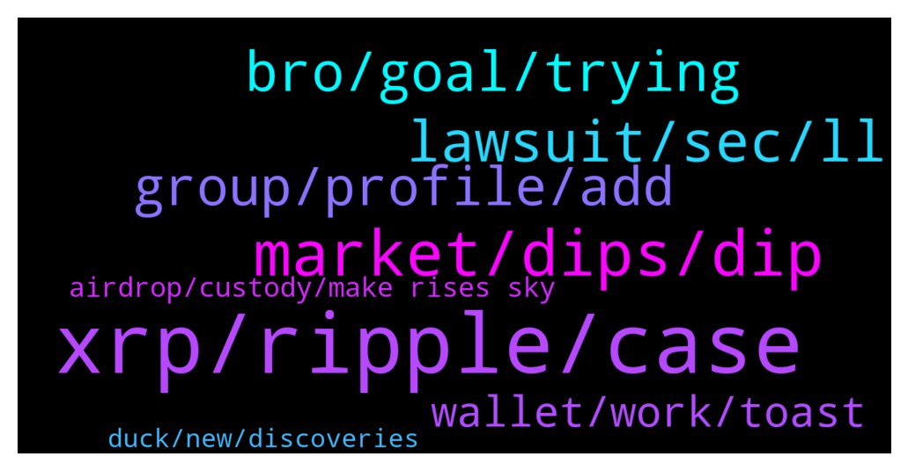

# **@Ripple**
 ## Analysis for **2021-12-29** - **2021-12-30**.

---

## 📊 **Basic Stats**

**n_messages_sent**: 166

---

---

## 🔝 **Top keywords and related messages**

1. **xrp, ripple, case**

    @JustinTKFoo --- *Since the SEC case against Ripple is expected to go in favor of Ripple, is it a good time to ape on XRP?* **--->** [TG Discussion](https://t.me/Ripple/3032925)

    @Exemplifyd --- *Isn't ripple planning any new year publicity stunt. So many projects usually use the new year celebration to do some marketing* **--->** [TG Discussion](https://t.me/Ripple/3033053)

    @acohen97 --- *They want all the XRP for themselves* **--->** [TG Discussion](https://t.me/Ripple/3032611)

    @Likeitorpumpit --- *XRP be higher than we all think !!* **--->** [TG Discussion](https://t.me/Ripple/3032498)

    @XRPslayer --- *Everyone should just relax. Xrp has a very good position in this crypto market and actually solves problems that we have been battling for years. In my opinion, ripple will blow this case off the face of the earth. Ive been following the lawsuit every single day since it started and if you go and look at all the facts then you will be able to make a decision. When i invested my first bit of money in XRP i told myself that it will be as a 5year investment so im not worried about what it does now while this lawsuit is still happening. Just forget about the price now and relax and forget about the idea that you will become rich overnight. All good things take time, dont rush the market. Let it take its course and practice holding those coins.     Diamond hands!!!* **--->** [TG Discussion](https://t.me/Ripple/3032420)

    @richcryto --- *Crypto discount time. I'm buying more XRP . Ready for when it moons .* **--->** [TG Discussion](https://t.me/Ripple/3032522)

2. **market, dips, dip**

    @Bilbraskey --- *For all people worried about a little dip, just use it to invest more.  It's only going to go up over time.* **--->** [TG Discussion](https://t.me/Ripple/3032267)

    @And --- *What do you think, is ok to buy right now or will be a downground in near future* **--->** [TG Discussion](https://t.me/Ripple/3032486)

    @A.A. --- *I think from now, the trend has reversed to move up, watch out so buy more or hold your quantity* **--->** [TG Discussion](https://t.me/Ripple/3032565)

    @Ni_sani89 --- *Any reason why the market is so down* **--->** [TG Discussion](https://t.me/Ripple/3032429)

    @A.A. --- *I’m wondering about crypto market and how its move. Brent and crude oil keep raising up. US market reached new historical top and they have seen Santa clause rally. Crypto market is still suffering from what? It’s all about luck and I can’t bid on my own luck, it is going from bottom to deep bottom. Cross fingers to get best of luck for us* **--->** [TG Discussion](https://t.me/Ripple/3032365)

    @A.A. --- *Focus on BTC, it is the main benchmark for all coins. I see most of other coins are ready to hit back their previous prices but unfortunately BTC pressures the market down. To sum up, pray for BTC to get stable as soon as possible otherwise we will get harm more🥺* **--->** [TG Discussion](https://t.me/Ripple/3032294)

3. **lawsuit, sec, ll**

    @XRPMUSTMOON --- *prediction price after win the lawsuit pls. with TA or economic theories are ok.* **--->** [TG Discussion](https://t.me/Ripple/3032447)

    @ReiTeh --- *I will say it will break ATH. If this lawsuit ends in our victory, we are the first crypto that actually are given the green light from the SEC.* **--->** [TG Discussion](https://t.me/Ripple/3032471)

    @kelvinDirh --- *It is Justin. But when this case gonna end ?* **--->** [TG Discussion](https://t.me/Ripple/3033071)

    @LincolnXtamc4 --- *Problem there is if you take someones advice to ape in then price heads south you'll be blaming that person for your lose...* **--->** [TG Discussion](https://t.me/Ripple/3032928)

    @NialPial --- *So if you ask me, there is definitely some clarity in terms of the lawsuit, it just wont be published yet, since it’ll impact too many economic standards. It has to go steady, so all the big companies and stakeholders can adapt ;-).* **--->** [TG Discussion](https://t.me/Ripple/3032673)

    @Elsuperior90 --- *the court case is hampering journey to the moon* **--->** [TG Discussion](https://t.me/Ripple/3033077)

4. **bro, goal, trying**

    @azmeer929 --- *Bro i keep holding from 2017.. LOL 2017 - 2021, 5 year bro 😂* **--->** [TG Discussion](https://t.me/Ripple/3032888)

    @JesusJames --- *lol probably an inside job then if it was bitboy* **--->** [TG Discussion](https://t.me/Ripple/3032987)

    @gharry1 --- *Here we go again back down 😴* **--->** [TG Discussion](https://t.me/Ripple/3032519)

    @azmeer929 --- *Don’t wanna lose any money..so that’s i keep hodl 🤣🤣* **--->** [TG Discussion](https://t.me/Ripple/3032898)

    @SVII_6 --- *He’s trying to say your delusional and on drugs* **--->** [TG Discussion](https://t.me/Ripple/3033039)

    @EML1993 --- *Hey Gary Gensler, is that you? Just kidding. Lol.* **--->** [TG Discussion](https://t.me/Ripple/3032537)

5. **group, profile, add**

    @JesusJames --- *nice ya its a problem but we cant punish others we have to make them aware and tell them not to click on anything* **--->** [TG Discussion](https://t.me/Ripple/3032990)

    @SamSakamoto --- *Exactly, you’re right if everyone turns off auto downloading then we should be fine in that case.* **--->** [TG Discussion](https://t.me/Ripple/3032991)

    @Ambivert_Brenyah --- *This room is overly policed. Very dry nowadays* **--->** [TG Discussion](https://t.me/Ripple/3032353)

    @SamSakamoto --- *Can we turn off Media in the group?* **--->** [TG Discussion](https://t.me/Ripple/3032980)

    @SamSakamoto --- *Nahh some random stranger shared a exe file* **--->** [TG Discussion](https://t.me/Ripple/3032988)

    @SamSakamoto --- *Someone shared some files yesterday and people got hacked in another group* **--->** [TG Discussion](https://t.me/Ripple/3032981)

6. **wallet, work, toast**

    @Tinkabellagal --- *Ask Wietsewind on twitter  He might be able to help  Did the toast wallet work out?  Try this https://m.youtube.com/watch?v=QHY7pOTR1_U&t=213s* **--->** [TG Discussion](https://t.me/Ripple/3032378)

    @ze_itsy_ze_bitsy --- *I have a Nano X I believe, the fancier one. And the transaction keeps getting cancelled out on Huobi so I think maybe that's the reason?* **--->** [TG Discussion](https://t.me/Ripple/3032640)

    @Tinkabellagal --- *Only you have Ledger nano wallet No tag needed* **--->** [TG Discussion](https://t.me/Ripple/3032639)

    @Isolemnlyswear --- *Anybody else have trouble buying on uphold with mastercard debit? It lets me with visa debit.* **--->** [TG Discussion](https://t.me/Ripple/3032692)

    @Lallulu --- *You were scammed sorry to hear that* **--->** [TG Discussion](https://t.me/Ripple/3032244)

    @ScreeN007 --- *Toast wallet doesnt work anymore. But I somehow managed to enter my wallet 😍* **--->** [TG Discussion](https://t.me/Ripple/3032706)

7. **airdrop, custody, make rises sky**

    @Exemplifyd --- *I'm talking about some new year giveaway. Waykichain did airdrop for thier community and still achieved some marketing feet.* **--->** [TG Discussion](https://t.me/Ripple/3033059)

    @MrCarbone --- *I know man, i m just asking here if someone got something, we need xrp for airdrop no* **--->** [TG Discussion](https://t.me/Ripple/3032276)

    @P4L0M1N0 --- *Does it acceptable a exchange take the tokens of an airdrop because it  custody the HOLDs of its customer? When it charges fees, i mean custody is not free of charge* **--->** [TG Discussion](https://t.me/Ripple/3032512)

    @unchained_django --- *anyone signed up with the Xcoin airdrop? and which is the best airdrop right now to join?* **--->** [TG Discussion](https://t.me/Ripple/3032514)

    @cration2017 --- *withdraw your solo to xumm and you get another airdrop (coreum)* **--->** [TG Discussion](https://t.me/Ripple/3032651)

    @NialPial --- *The one small airdrop dropped it 0.10-0.15 $, the more you can buy now, for a lower price. The more you’ll make once it rises sky high.* **--->** [TG Discussion](https://t.me/Ripple/3032569)

8. **duck, new, discoveries**

    @Tinkabellagal --- *Take all other queries to @rippleresolutions* **--->** [TG Discussion](https://t.me/Ripple/3032667)

    @Marhul --- *Does anyone have any new discoveries?* **--->** [TG Discussion](https://t.me/Ripple/3033007)

    @kelvinDirh --- *What kind of discovery you want. So many new stuffs everyday* **--->** [TG Discussion](https://t.me/Ripple/3033049)

    @acohen97 --- *Duck duck go is a good search engine* **--->** [TG Discussion](https://t.me/Ripple/3032620)

    @acohen97 --- *Wouldnt surprise me though, google are shady* **--->** [TG Discussion](https://t.me/Ripple/3032617)

    @ze_itsy_ze_bitsy --- *Or where to even find that?* **--->** [TG Discussion](https://t.me/Ripple/3032637)

