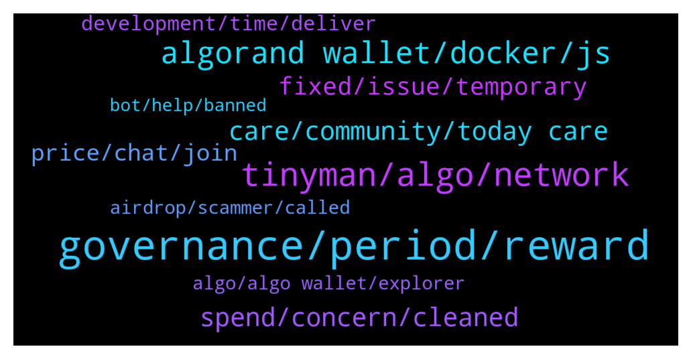

# **@algorand**
 ## Analysis for **2021-12-29** - **2021-12-30**.

---

## 📊 **Basic Stats**

**n_messages_sent**: 277

---

---

## 🔝 **Top keywords and related messages**

1. **governance, period, reward**

    @MackDenver --- *Hello Emeka, Community Governance enables all Algo holders to participate in the decision making process on the growth and development of the Algorand ecosystem. Signup is ongoing for the second governance period. Check out more here: https://algorand.foundation/governance/* **--->** [TG Discussion](https://t.me/algorand/327321)

    @NightAlgorand --- *You will have to claim it after the period ends.* **--->** [TG Discussion](https://t.me/algorand/327410)

    @Patdogbaby --- *Are all participation rewards aside from the 1% to be allocated through governance ? when will there be an updated participation reward schedule issued ? no info past feb 2022* **--->** [TG Discussion](https://t.me/algorand/327734)

    @trappist1 --- *is it possibile to change the address where rewards will be sent for the Governance#1 period? without risking losing it? my governor address is elegible* **--->** [TG Discussion](https://t.me/algorand/327839)

    @EmekaKingsley --- *I've committed my algo into the period 2  Am I to use it and vote or I should leave it like that there though am not seeing any voting option there* **--->** [TG Discussion](https://t.me/algorand/327322)

    @Jillani1256 --- *When we get rewards in algorand governance period #1* **--->** [TG Discussion](https://t.me/algorand/327834)

2. **tinyman, algo, network**

    @MackDenver --- *There is already Tinyman live on Algorand. There is Algodex on testnet as well* **--->** [TG Discussion](https://t.me/algorand/327794)

    @arnoldinho71 --- *I have read it. But algomint project already did it. Moreover there is no info about algo on swingby roadmap. Is these cooperation continues?* **--->** [TG Discussion](https://t.me/algorand/327772)

    @Razzypt --- *Sorry I meant win out against the other dexes on Algorand (eg, against Algodex). Is there anything special about Tinyman vs other Algorand dexes or is it just first mover advantage?* **--->** [TG Discussion](https://t.me/algorand/327837)

    @Razzypt --- *Hi guys. What is now / going to be the main dex on Algorand?* **--->** [TG Discussion](https://t.me/algorand/327792)

    @Razzypt --- *So, do you think Tinyman will win out similar to Joe over Pangolin on Avalanche. If so, why?* **--->** [TG Discussion](https://t.me/algorand/327812)

    @KAPIBAYSIDE --- *Does Akita in have any utility?* **--->** [TG Discussion](https://t.me/algorand/327524)

3. **algorand wallet, docker, js**

    @E --- *Is there any problem with ios wallet app? My assets wont load* **--->** [TG Discussion](https://t.me/algorand/327672)

    @TheRealGiulio --- *Admin, there seems to be an issue with the Algorand Wallet.* **--->** [TG Discussion](https://t.me/algorand/327579)

    @arodfuels366 --- *How do we sign up to be a governor? Click the get started within the Algorand wallet and link my wallet, but I'm redirected back to my Algorand wallet, not prompted to do anything else.* **--->** [TG Discussion](https://t.me/algorand/327529)

    @mfocus1 --- *anyone having 'cannot reach the server' issue on the official algorand wallet?* **--->** [TG Discussion](https://t.me/algorand/327838)

    @NightAlgorand --- *Seems to have some issue with the wallet at the moment so please try again later* **--->** [TG Discussion](https://t.me/algorand/327875)

    @NightAlgorand --- *Seems like there is a bug with the wallet. Sorry for the inconvenience.* **--->** [TG Discussion](https://t.me/algorand/327860)

4. **spend, concern, cleaned**

    @eXtremeV --- *Yes works fine and the best solution to store cryptos* **--->** [TG Discussion](https://t.me/algorand/327501)

    @KAPIBAYSIDE --- *For example  people can see what coins you are interested  in and staking is that cause for concern ?* **--->** [TG Discussion](https://t.me/algorand/327420)

    @Franklinsmooth --- *Where and how can I stake my Algorand?* **--->** [TG Discussion](https://t.me/algorand/327432)

    @domioo911 --- *I Hope 2022 will be huge for crypto* **--->** [TG Discussion](https://t.me/algorand/327761)

    @Sofiane --- *Take us the bitcoin  please it detruit our country.* **--->** [TG Discussion](https://t.me/algorand/327563)

    @hope9999999 --- *But but there will be no fiat 🤥🤥🤥* **--->** [TG Discussion](https://t.me/algorand/327405)

5. **care, community, today care**

    @KB00001 --- *Was just wondering why , I will look elsewhere for answering ser* **--->** [TG Discussion](https://t.me/algorand/327756)

    @AbuRidwan16 --- *Not at all lol, i wish* **--->** [TG Discussion](https://t.me/algorand/327339)

    @MackDenver --- *I will check in with the team. You can also try contacting Swingby team* **--->** [TG Discussion](https://t.me/algorand/327780)

    @NightAlgorand --- *You can join the Chinese Community https://t.me/AlgorandFoundationCN* **--->** [TG Discussion](https://t.me/algorand/327311)

    @Jeanne --- *Hello, everyone, I just came in today. Please take care of me later.* **--->** [TG Discussion](https://t.me/algorand/327752)

    @burn2moonfinance --- *Admin if you don't mind ..i want to laugh 😂😂😂😂😂🤣🤣🤣🤣🤣😅😅😅whahahahahaaa.* **--->** [TG Discussion](https://t.me/algorand/327600)

6. **fixed, issue, temporary**

    @MackDenver --- *It will take a little time to reflect. Don't worry, it will be fixed shortly.* **--->** [TG Discussion](https://t.me/algorand/327723)

    @MackDenver --- *The issue has already been informed to the team, it will be fixed soon.* **--->** [TG Discussion](https://t.me/algorand/327704)

    @MackDenver --- *Hello there, Sorry for the temporary inconvenience. The team is working on to fix this issue and it will be fixed shortly.* **--->** [TG Discussion](https://t.me/algorand/327618)

    @MackDenver --- *Don't worry guys, it will be fixed soon.* **--->** [TG Discussion](https://t.me/algorand/327611)

    @MackDenver --- *We are aware of this minor bug, it will be fixed soon.* **--->** [TG Discussion](https://t.me/algorand/327597)

    @TheRealGiulio --- *Everything ok now. Must have been some temporary thing. Thanks.* **--->** [TG Discussion](https://t.me/algorand/327584)

7. **price, chat, join**

    @King21212112 --- *Anyone know why the price is running up?* **--->** [TG Discussion](https://t.me/algorand/327824)

    @MackDenver --- *You can join the price chat: @algorand_price* **--->** [TG Discussion](https://t.me/algorand/327757)

    @MackDenver --- *We don't talk about price or market movements. You can join the price chat: @algorand_price* **--->** [TG Discussion](https://t.me/algorand/327829)

    @MackDenver --- *We don't speculate on price here* **--->** [TG Discussion](https://t.me/algorand/327754)

    @daniela2i --- *The price of Algorand  is down by almost40% from Ath this is what we call buying the dip and hold* **--->** [TG Discussion](https://t.me/algorand/327341)

    @defirlkp --- *what price did you buy it at?* **--->** [TG Discussion](https://t.me/algorand/327230)

8. **development, time, deliver**

    @MackDenver --- *We will announce when the ends.* **--->** [TG Discussion](https://t.me/algorand/327577)

    @hadiyat --- *To some it is still a bearish bullish time* **--->** [TG Discussion](https://t.me/algorand/327550)

    @Crypt0Playa --- *For sure. Software development should have a timeline on deliverables otherwise it tells you something about the development team. Can't be punting quarter after quarter forever. Be clear and deliver.* **--->** [TG Discussion](https://t.me/algorand/327287)

    @Crypt0Playa --- *Yes for sure. People want a development and leadership team that is delivering on the timeline.* **--->** [TG Discussion](https://t.me/algorand/327284)

    @arodfuels366 --- *The best time to plant a tree was 10 years ago. The second best time to plant a tree is right now.* **--->** [TG Discussion](https://t.me/algorand/327233)

    @Crypt0Playa --- *I see. I would agree that proper communication is critical and mgmt should stop making promises that they cant deliver on. That's just weak leadership and they should clarify where they r at with tps and finality.* **--->** [TG Discussion](https://t.me/algorand/327281)

9. **airdrop, scammer, called**

    @MackDenver --- *Dear Algorand community, We would like to inform that there is NO Algorand Airdrop, Giveaway or any related event ongoing at the moment. If someone reaches out to you about this, please report to Telegram and block the user.  Also, please note that, no one from the Algorand team will ever reach out to you first to help you and ask you to verify your wallet, your wallet phrase or complete any transaction.   Please stay safe and secure, thank you 🙏🏻* **--->** [TG Discussion](https://t.me/algorand/327318)

    @MeemBhai --- *I won't be able to get the airdrop that's gonna be in 6 minutes 😢* **--->** [TG Discussion](https://t.me/algorand/327665)

    @April O'Neil: --- *Scammers are DMing people from within this group experiencing the wallet issue. Be careful guys* **--->** [TG Discussion](https://t.me/algorand/327642)

    @Whateverrrrlahhhh --- *I just trolled a scammer who dm me hahahaha about Algo airdrop* **--->** [TG Discussion](https://t.me/algorand/327314)

    @Crypt0Playa --- *Change your privacy settings and no one from Algorand Support called you because admins here will never direct message you first and definitely never call you. That was a scammer who called you.* **--->** [TG Discussion](https://t.me/algorand/327262)

    @jay_sca --- *Sounds like you got an air drop already. 😳* **--->** [TG Discussion](https://t.me/algorand/327667)

10. **algo, algo wallet, explorer**

    @Zen_ZZZ --- *Hi team, what problem with Algo wallet on Android ? Just updated, my bag balance is zero now 🥸 Checked on Algo.explorer, it is still fine Please help* **--->** [TG Discussion](https://t.me/algorand/327614)

    @hongzhi99 --- *@MackDenver Algo wallet page doesn’t appear my balances. At explorer can saw my balances. The page display problem, how long will it take to fix it? ? ?* **--->** [TG Discussion](https://t.me/algorand/327703)

    @rainboweyes --- *oh my gOd my algo is gone! what is going on?* **--->** [TG Discussion](https://t.me/algorand/327637)

    @MackDenver --- *Please check your wallet in the algo explorer, you will see your balance in the explorer. The team is working on to fix this issue and it will be fixed shortly.* **--->** [TG Discussion](https://t.me/algorand/327639)

    @hapsarinuha --- *What happend with algo wallet? My balance dissapear* **--->** [TG Discussion](https://t.me/algorand/327601)

    @rudysimare --- *hello admin, why did my algo balance in algorand wallet disappear?* **--->** [TG Discussion](https://t.me/algorand/327615)

