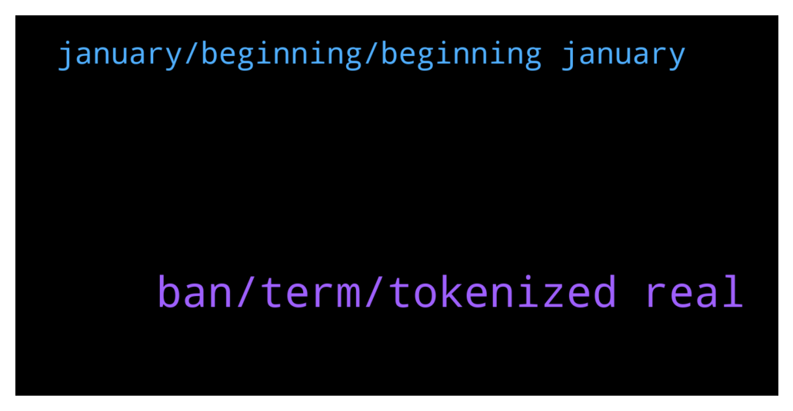

# **@ampnetapxchat**
 ## Analysis for **2021-12-25** - **2021-12-30**.

---

## 📊 **Basic Stats**

**n_messages_sent**: 39

---

---

## 🔝 **Top keywords and related messages**

1. **ban, term, tokenized real**

    @<UNK> --- *Please read community guidelines, next time  https://t.me/ampnetapxchat/20271* **--->** [TG Discussion](https://t.me/ampnetapxchat/35754)

    @IncogSen --- *No we are rekt because not enough transparency* **--->** [TG Discussion](https://t.me/ampnetapxchat/35777)

    @IncogSen --- *U rek me and you ban me?* **--->** [TG Discussion](https://t.me/ampnetapxchat/35752)

    @E_Don --- *Why's AAPX price dropping to zero?Is this project still alive or dead?* **--->** [TG Discussion](https://t.me/ampnetapxchat/35862)

    @IncogSen --- *If we were told they were working on this new solution, I could've protected my capital earlier* **--->** [TG Discussion](https://t.me/ampnetapxchat/35779)

    @IlDiavolo92 --- *Importance of investing what u can afford to lose + diversified portfolio will make your paper hands diamondish.* **--->** [TG Discussion](https://t.me/ampnetapxchat/35857)

2. **january, beginning, beginning january**

    @arikthereal --- *Hi Team, who would I be able to disucss listing opportunity on BitMart with ? Verification will be provided if requested.* **--->** [TG Discussion](https://t.me/ampnetapxchat/35900)

    @<UNK> --- *You can check the latest update here https://t.me/ampnetapxchat/35378* **--->** [TG Discussion](https://t.me/ampnetapxchat/35863)

    @<UNK> --- *Hey, you can send  preposition and contact us on this email: support@ampnet.io* **--->** [TG Discussion](https://t.me/ampnetapxchat/35901)

    @matejmz --- *Just google TOKO by Dla Piper. It leverages Hedera and Algorand.* **--->** [TG Discussion](https://t.me/ampnetapxchat/35801)

    @North --- *Hey community. I know we've been silent for a while but there was really nothing major to report.   However, we are pleased to say we have some very big news which will be released at the beginning of January.   I would love to inform you more, however we have to be respectful towards our contractual obligations.* **--->** [TG Discussion](https://t.me/ampnetapxchat/35794)

    @runex_x1 --- *Let's just wait and see for January... Then we can ask questions I suppose 😉. Enjoy the end of the year. Tx* **--->** [TG Discussion](https://t.me/ampnetapxchat/35793)

