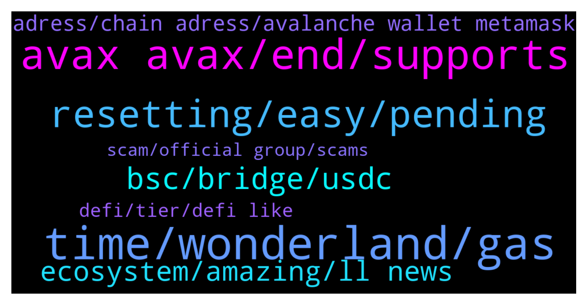

# **@avalancheavax**
 ## Analysis for **2021-12-29** - **2021-12-30**.

---

## 📊 **Basic Stats**

**n_messages_sent**: 178

---

---

## 🔝 **Top keywords and related messages**

1. **time, wonderland, gas**

    @FutureTiger --- *I was just about to send some JOE from my gateIO, or some AVAX from my Binance, to my Metamask, in order to convert into AVAX/MEMO/TIME on Wonderland, but then I noticed that on app . wonderland . money I cannot connect to Metamask , nor to wallet . avax . network , so this is all starting to look dreadfully complicated .. any SIMPLE way to get started on Wonderland?* **--->** [TG Discussion](https://t.me/avalancheavax/318465)

    @FutureTiger --- *Ah yes, Daniele, he was recommended on Banter, by Ran I think, or maybe Ellio Trades... probably both, and many more :)* **--->** [TG Discussion](https://t.me/avalancheavax/318522)

    @bobby_blanco --- *Time has a solid core of devs who are all very well known like Daniele sestagalli .. time is part of an ecosystem that includes popsicle finance , abracadabra and he is taking over sushi swap .. they already have plenty of money and the likely hood of them destroying there reputation by rug pulling is highly unlikely .. the apy fluctuation and price are offset by the compounding interest you get on your account 3 times a day..* **--->** [TG Discussion](https://t.me/avalancheavax/318512)

    @FutureTiger --- *i am very wary of the hi-APY platforms cos there are YT vids of people making NO money due to plummeting APY or other causes.. I am more confident about Wonderland because I saw Ian Balina deployed on it on 3rd DEC :)* **--->** [TG Discussion](https://t.me/avalancheavax/318508)

    @YourDaddyNico --- *I am invested in TIME since September, i completely agree. I just like to invest in different projects, that's all.* **--->** [TG Discussion](https://t.me/avalancheavax/318644)

    @bobby_blanco --- *Is anyone here invested in time wonderland* **--->** [TG Discussion](https://t.me/avalancheavax/318446)

2. **avax avax, end, supports**

    @hossein_barati_93 --- *Thank you very much But I mean good news for avax* **--->** [TG Discussion](https://t.me/avalancheavax/318429)

    @Gabriel --- *can be avax if that helps* **--->** [TG Discussion](https://t.me/avalancheavax/318615)

    @Turquality78 --- *To send avax From paribu to binance which one i should choose anybody knows* **--->** [TG Discussion](https://t.me/avalancheavax/318282)

    @Kenneth --- *I have not entered avax, which is an area of interest ?* **--->** [TG Discussion](https://t.me/avalancheavax/318542)

    @MrDanhod --- *I also recommend maxi, see maximizer_xyz on twitter if you're in long term investment for avax* **--->** [TG Discussion](https://t.me/avalancheavax/318503)

    @Plato the Enlightener (👁,👁) --- *Yes if you send it all to Binance or kucoin or any other exchange that supports Avax and buy there! Yo should lose 15-20$ for sending your eth but that you cant avoid and thats why Eth will die the slow death and get replaced by avax* **--->** [TG Discussion](https://t.me/avalancheavax/318261)

3. **resetting, easy, pending**

    @TaschaWolf --- *God damn. No one can help a simple thing here.* **--->** [TG Discussion](https://t.me/avalancheavax/318491)

    @AnthonyP93 --- *I have issue with kyc who can i contact* **--->** [TG Discussion](https://t.me/avalancheavax/318624)

    @SAFU_Master --- *No DMs please I will just delete them* **--->** [TG Discussion](https://t.me/avalancheavax/318381)

    @oathtobarbatos --- *I could give you a hug if you were near me* **--->** [TG Discussion](https://t.me/avalancheavax/318428)

    @oathtobarbatos --- *You could try resetting your Metamask account (it won't change your balance)* **--->** [TG Discussion](https://t.me/avalancheavax/318445)

    @K --- *It's super easy to do. First time is hard. I know what u mean tho. I'm expert now lool* **--->** [TG Discussion](https://t.me/avalancheavax/318470)

4. **bsc, bridge, usdc**

    @bobby_blanco --- *Swap the usdt.e to usdc on trader joe .. then go to the bridge .. make sure you have bsc network set up on MetaMask first.. start the bridge and swap your usdc from avax to bsc.. your usdc in your avax account on MetaMask will move over to your usdc on your bsc account on MetaMask .. then send the usdc from your bsc account on MetaMask to a bsc address* **--->** [TG Discussion](https://t.me/avalancheavax/318523)

    @bobby_blanco --- *You need to bridge avax tokens via avax bridge to bsc chain and then send it from a bsc wallet* **--->** [TG Discussion](https://t.me/avalancheavax/318516)

    @Gabriel --- *hello. was wondering if there is a cheaper way to get from kucoin to c-chain then the bridge ? tu* **--->** [TG Discussion](https://t.me/avalancheavax/318609)

    @SalKanz --- *Where can I bridge LINK from BSC to AVAX?* **--->** [TG Discussion](https://t.me/avalancheavax/318350)

    @Nicolas_A --- *Synapse / Celer bridge perhaps ?* **--->** [TG Discussion](https://t.me/avalancheavax/318361)

    @helolleh --- *guys, can I return money if I sent usdt.e from avax network to bep20 USDT address? 🙊* **--->** [TG Discussion](https://t.me/avalancheavax/318513)

5. **ecosystem, amazing, ll news**

    @clairewilsonxz --- *Avalanche tends to hit a static pump soon that hold more and thank me later* **--->** [TG Discussion](https://t.me/avalancheavax/318357)

    @Rocco --- *Hi Guys Is there an legit Defi 2.0 project on the avalanche chain?* **--->** [TG Discussion](https://t.me/avalancheavax/318388)

    @oathtobarbatos --- *You'll find news for Avalanche in this channel https://t.me/avalanche_announcements* **--->** [TG Discussion](https://t.me/avalancheavax/318430)

    @APExCaesar --- *No, avalanche is its own ecosystem which is highly functional and upon which other programmable ecosystems (subnets) can be built.* **--->** [TG Discussion](https://t.me/avalancheavax/318368)

    @exobitto --- *Try yieldyak bro its a avalanche platform* **--->** [TG Discussion](https://t.me/avalancheavax/318243)

    @elizabeth_baker --- *Web3 dev's are building something amazing on Avalanche* **--->** [TG Discussion](https://t.me/avalancheavax/318236)

6. **adress, chain adress, avalanche wallet metamask**

    @Carlos --- *Can I use my seed phrase of avalanche wallet on MetaMask Sr.?* **--->** [TG Discussion](https://t.me/avalancheavax/318586)

    @SAFU_Master --- *Does anyone have to hand the mainnet and testnet router addresses for pangolin, hurricane or trader joe?* **--->** [TG Discussion](https://t.me/avalancheavax/318370)

    @TheSEOdude --- *Can use private key of c chain in metamask.* **--->** [TG Discussion](https://t.me/avalancheavax/318589)

    @sri3003 --- *Is avalanche wallet on metamask a c-chain wallet* **--->** [TG Discussion](https://t.me/avalancheavax/318276)

    @Abhi --- *while connecting wallet in avalanche launchpad what to keep in mind before connecting metamask in launch pad ....i mean to say i have to set account in metamask wallet in avalanche network or is it k in etherium mainnet account by default... and please dont text me privately ....* **--->** [TG Discussion](https://t.me/avalancheavax/318209)

    @K --- *Yes. U log in and then click network and u can switch* **--->** [TG Discussion](https://t.me/avalancheavax/318484)

7. **defi, tier, defi like**

    @Rocco --- *Something like Traderjoe and OHM combined. With POL and Bonding mechanism. There is an article on Medium what DEFI 2.0 could be, but i cant send links on this group.* **--->** [TG Discussion](https://t.me/avalancheavax/318391)

    @santiloopz --- *Come up with a good definition of DeFi 2.0 please* **--->** [TG Discussion](https://t.me/avalancheavax/318389)

    @bobby_blanco --- *Snowball yak and beefy are decent too .. yeah no KyC is appealing that’s why I love defi* **--->** [TG Discussion](https://t.me/avalancheavax/318647)

    @Nicolas_A --- *It’s just that like 1 week after people came up with DeFi 2.0 some were already talking about 3.0* **--->** [TG Discussion](https://t.me/avalancheavax/318425)

    @Abhi --- *i am just little bit confused ..what is tier 1 and tier 2...how it will work* **--->** [TG Discussion](https://t.me/avalancheavax/318296)

    @Rocco --- *What is considered defi 4.0.. do you mean by that you would wait until a new form of Defi?* **--->** [TG Discussion](https://t.me/avalancheavax/318406)

8. **scam, official group, scams**

    @Yoopez --- *don't worry, soon they will stop their shitty cashgrabs. I've found their real identities :). They will regret all their soft scam* **--->** [TG Discussion](https://t.me/avalancheavax/318632)

    @Lanzhujian --- *I was in another avalanche official group and they are doing airdrop. That scam right?* **--->** [TG Discussion](https://t.me/avalancheavax/318274)

    @Yoopez --- *Only "nice words" to avoid the FUD + ban. You are not all white when all your products had issues & scams. They were linked to this guys and didn't care of it so yeah be carefull with them  +1 totally agree with Bobby* **--->** [TG Discussion](https://t.me/avalancheavax/318641)

    @oathtobarbatos --- *Careful with this kind of message, guys. Most of them are scams* **--->** [TG Discussion](https://t.me/avalancheavax/318532)

    @Rocco --- *Just got a few scammers trying to impersonate Rado Minchev wanting to give them my seed phrase 😂 @Wan_Tan_Soup thank you 😃* **--->** [TG Discussion](https://t.me/avalancheavax/318394)

    @oathtobarbatos --- *Yup, it's a scam. This is the only official group!* **--->** [TG Discussion](https://t.me/avalancheavax/318275)

