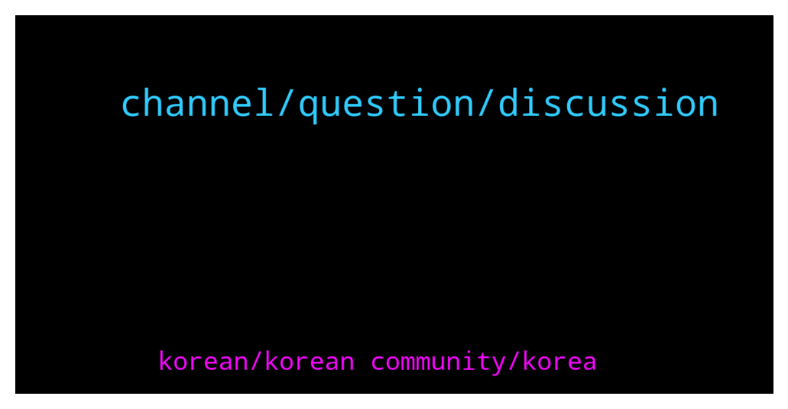

# **@chainlinkofficial**
 ## Analysis for **2021-12-29** - **2021-12-30**.

---

## 📊 **Basic Stats**

**n_messages_sent**: 88

---

---

## 🔝 **Top keywords and related messages**

1. **channel, question, discussion**

    @CryptoNoobee --- *No way just asnwer the question its basically a yes/no question* **--->** [TG Discussion](https://t.me/chainlinkofficial/357885)

    @SurpriseMF3000 --- *Hello, how much ETH do you need to run your own Node ? I already testet the Testnet Kovan.  Thanks for answers 👍* **--->** [TG Discussion](https://t.me/chainlinkofficial/358038)

    @Aaronthedog --- *yes ok ... but it didn't seem like a discussion on prices ...* **--->** [TG Discussion](https://t.me/chainlinkofficial/357864)

    @RomainSwitzerland --- *Hi Simon, This channel is for a focused technical discussions about Chainlink, price action is outside the scope of this channel.* **--->** [TG Discussion](https://t.me/chainlinkofficial/357991)

    @Simon --- *I want really to buy chainlink, but I am not sure* **--->** [TG Discussion](https://t.me/chainlinkofficial/357989)

    @Evan --- *Hi all. Where can I find growth stats and income stream details chain link? Doing due diligence before investing more* **--->** [TG Discussion](https://t.me/chainlinkofficial/357892)

2. **korean, korean community, korea**

    @창현 --- *are they no longer working for korean community?* **--->** [TG Discussion](https://t.me/chainlinkofficial/358107)

    @창현 --- *korean managers abandoned korean community. they have literally evoparated without anywords.* **--->** [TG Discussion](https://t.me/chainlinkofficial/358100)

    @창현 --- *i am just telling what happened in korean community.* **--->** [TG Discussion](https://t.me/chainlinkofficial/358136)

    @marcromeron --- *We have a team in South Korea but as mentioned we need a CM on there.* **--->** [TG Discussion](https://t.me/chainlinkofficial/358119)

    @PolivodaTatiana --- *perhaps you'd like to become a community advocate in Korea? feel free to share this application form with your friends and colleagues: https://chain.link/community/advocates* **--->** [TG Discussion](https://t.me/chainlinkofficial/358103)

    @RomainSwitzerland --- *Chainlink – Telegram communities      Korea - @chainlink_korea   SE Asia - @chainlinkSEA   Indonesia - @ChainlinkID   Spain/LatAm - @chainlinkedesp   Turkey - @chainlinkTR   Italian –  @Chainlink_italian   Finnish – @chainlinksuomi   Sweden - @chainlinkSWEDEN   France – @chainlinkFRA   German - @Chainlinkgerman   Dutch - @chainlinkNL   Middle East - @chainlinkME   Vietnam - @chainlinkVIETNAM   Japan - @chainlinkJAPAN Russia - @ChainlinkRussia* **--->** [TG Discussion](https://t.me/chainlinkofficial/358078)

