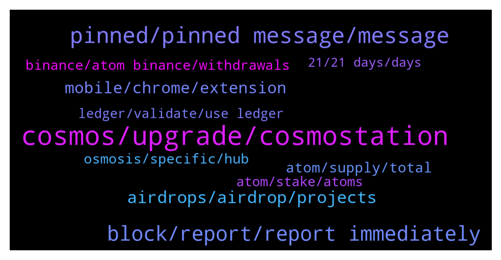

# **@cosmosproject**
 ## Analysis for **2021-12-29** - **2021-12-30**.

---

## 📊 **Basic Stats**

**n_messages_sent**: 527

---

---

## 🔝 **Top keywords and related messages**

1. **cosmos, upgrade, cosmostation**

    @luketchang --- *Hey anyone got any recommendations for podcasts on the Cosmos ecosystem? :)* **--->** [TG Discussion](https://t.me/cosmosproject/462155)

    @themoonscholar --- *Anyone have a link to a great (long) Twitter thread that goes deep on Cosmos? Looking for something that I could send to easily onboard/inform people about the beauty of Cosmos without having to type a lot myself and would prefer not to have to just send them the straight up docs to look through.* **--->** [TG Discussion](https://t.me/cosmosproject/462849)

    @pnp_404 --- *normally, how much time cex need to upgrade network for cosmos to be able to withdraw? 🥲* **--->** [TG Discussion](https://t.me/cosmosproject/463308)

    @ZoltanAtom --- *Hi there,you need Keplr wallet to connect cronos chain. After that you will able to connect your Cosmos account to Cronos Chain.  Have a look at this step by step guide of Keplr and get your Cosmos account if you don’t have one.   https://medium.com/chainapsis/how-to-use-keplr-wallet-40afc80907f6* **--->** [TG Discussion](https://t.me/cosmosproject/462276)

    @citizencosmos --- *Several projects that launched around the Cosmos ecosystem in 2021 are able to bring significant value to the crypto industry. And we had a discussion with one of them recently!   - A project on the edge of two ecosystems: Cosmos & Ethereum - A project that brings IBC interoperability to Ethereum - A project that includes Cosmos-SDK and full EVM compatibility  As many of you have guessed, we are talking about Evmos.  Check out our episode with their co-founder tomorrow on: https://www.citizencosmos.space/episodes* **--->** [TG Discussion](https://t.me/cosmosproject/462505)

    @ZoltanAtom --- *Starname is specific apps which built on Cosmos for domain/name services. Join them and learn more;  https://t.me/starname_me* **--->** [TG Discussion](https://t.me/cosmosproject/462840)

2. **pinned, pinned message, message**

    @AtomJazz --- *I often ask myself the same thing* **--->** [TG Discussion](https://t.me/cosmosproject/463014)

    @luketchang --- *Ahh thanks so much @TicoJohnny! These look great* **--->** [TG Discussion](https://t.me/cosmosproject/462188)

    @J417A --- *But is the network undergoing a scheduled update now?* **--->** [TG Discussion](https://t.me/cosmosproject/462269)

    @TicoJohnny --- *You can head here if you’d like: https://t.me/AtomPrice* **--->** [TG Discussion](https://t.me/cosmosproject/462162)

    @mariosuperdigital --- *We are live now https://twitter.com/i/spaces/1mrGmajwnMnGy LFG* **--->** [TG Discussion](https://t.me/cosmosproject/462578)

    @AtomDragon --- *Lol hope your doing well buddy. Really impressive that your answering the same questions forever and always* **--->** [TG Discussion](https://t.me/cosmosproject/463025)

3. **block, report, report immediately**

    @Rico --- *Got a Message from Moderator with link to claim btsg pls what to do* **--->** [TG Discussion](https://t.me/cosmosproject/463192)

    @ZoltanAtom --- *If someone DM to you, block ad report them immediately! No wallet support on telegram. ⚠️⚠️⚠️* **--->** [TG Discussion](https://t.me/cosmosproject/462846)

    @vladc1 --- *If you are a member of any crypto-related #Telegram or #WhatsApp group, you are a target for all sorts of scammers  There are 3 main kinds of scams in #crypto communities: fake groups, copycat admins, and pump and dump groups  1. The perpetrators create a copycat group that mimics an original. For example, it might offer an opportunity to purchase tokens at a discount price  Change your group invite settings to "My contacts" only — and you’ll essentially eliminate this problem  2. After requesting support in a public group you can receive a DM from the copycat admin. They will pretend to help you, but end up asking for your #privatekeys or #seedphrase  Search the group for posts from this user — if nothing appears, it's a fake admin  3. The feigned purpose of most pump groups is to provide insider insights  Many of these platforms will try to promote a sense of urgency in you, to force you to act without thinking. If you get this feeling, you’re probably dealing with a pump group  Please take care!* **--->** [TG Discussion](https://t.me/cosmosproject/462116)

    @TenaciuousT --- *@ZoltanAtom I was dm'd by someone acting as u to get me to share wallet details* **--->** [TG Discussion](https://t.me/cosmosproject/462893)

    @yamato2190 --- *...asked a simple Q on Sandbox and got over 10 DM's in seconds. wtf !!! 😆😆* **--->** [TG Discussion](https://t.me/cosmosproject/462323)

    @Vivek --- *It was just a test, wanted to see how quickly scammers dm me* **--->** [TG Discussion](https://t.me/cosmosproject/463222)

4. **airdrops, airdrop, projects**

    @TenaciuousT --- *so could I get airdrops on say coinomi or atomic wallet or exodus (out of curiosity)* **--->** [TG Discussion](https://t.me/cosmosproject/463043)

    @TenaciuousT --- *do these airdrops automatically land in your wallet (even if it does not support the new tokens)?* **--->** [TG Discussion](https://t.me/cosmosproject/462907)

    @ZoltanAtom --- *There was lots of snapshot for lofs of airdrop. Please join Cosmos airdrop community to follow all airdrops ;  https://t.me/CosmosAirdrops* **--->** [TG Discussion](https://t.me/cosmosproject/462310)

    @AtomJazz --- *Cool, you'll be able to earn some future airdrops that way* **--->** [TG Discussion](https://t.me/cosmosproject/462415)

    @Crypto --- *I think if you consider airdrops in this the earnings are way larger* **--->** [TG Discussion](https://t.me/cosmosproject/462803)

    @ebp700 --- *i dont participate in airdrops of atom* **--->** [TG Discussion](https://t.me/cosmosproject/462416)

5. **mobile, chrome, extension**

    @MPLD35 --- *But I received massage to install it only via chrome browser* **--->** [TG Discussion](https://t.me/cosmosproject/463145)

    @TenaciuousT --- *does keplr have official app or only chrome extension? don't want to download a scam wallet* **--->** [TG Discussion](https://t.me/cosmosproject/462922)

    @Mirec --- *Hello guys…when i press undtake on keplr wallet, nothing happens* **--->** [TG Discussion](https://t.me/cosmosproject/463173)

    @ely_2022 --- *Is there any http GET request to generate a JSON with all transactions of a wallet? 🤔* **--->** [TG Discussion](https://t.me/cosmosproject/462301)

    @Bluerise --- *hello anybody having issues with the Keprl Mobile wallet ?* **--->** [TG Discussion](https://t.me/cosmosproject/463167)

    @Vasko --- *I have been having the same issue* **--->** [TG Discussion](https://t.me/cosmosproject/462596)

6. **atom, supply, total**

    @yamato2190 --- *...scammer or legit from Atom ??* **--->** [TG Discussion](https://t.me/cosmosproject/462317)

    @. --- *any prediction of atom till end of january?* **--->** [TG Discussion](https://t.me/cosmosproject/462154)

    @asirshahid --- *Kinda sucks. I'll have to sell the Atom and rebuy. At least I only bought a small amount at first* **--->** [TG Discussion](https://t.me/cosmosproject/462101)

    @GameChangerUST --- *Is there a Total upper ceiling or number of tokens/total supply for ATOM ?* **--->** [TG Discussion](https://t.me/cosmosproject/463126)

    @ZoltanAtom --- *Where is your Atom ? At exchange ?* **--->** [TG Discussion](https://t.me/cosmosproject/462263)

    @alen_muly --- *I bought juno and osmo last friday. And also atom one month ago. So thats why i ask if i am in for the drop 😊 thanks for the answer* **--->** [TG Discussion](https://t.me/cosmosproject/462313)

7. **binance, atom binance, withdrawals**

    @AtomJazz --- *Afaik withdrawals are already enabled on Binance* **--->** [TG Discussion](https://t.me/cosmosproject/462650)

    @AtomJazz --- *Idk, after enabling withdrawals yesterday they have suspended them again apparently. Disappointed with Binance tbh* **--->** [TG Discussion](https://t.me/cosmosproject/462920)

    @cz1785 --- *binance still has pending withdrawals 🤬* **--->** [TG Discussion](https://t.me/cosmosproject/462019)

    @TenaciuousT --- *does binance do that often. I have a fair chunk of my small portfolio in binance (I'm in UK) so is this a major issue kinda thing?* **--->** [TG Discussion](https://t.me/cosmosproject/462924)

    @LP --- *Hi,  does anyone know when it will possible to withdraw Atom from Binance ? Because 2 days ago it was supposed to be ok yesterday and yesterday today... So still impossible to move from Binance to Keplr* **--->** [TG Discussion](https://t.me/cosmosproject/462649)

    @B --- *Binance still not sending Atom to my wallet …* **--->** [TG Discussion](https://t.me/cosmosproject/462666)

8. **osmosis, specific, hub**

    @ZoltanAtom --- *Yes On Osmosis AMM  Please join them ;  https://t.me/osmosis_chat* **--->** [TG Discussion](https://t.me/cosmosproject/462476)

    @TenaciuousT --- *osmosis is the DEX right? Keplr = wallet. Hub well ... hub for coins dApps etc* **--->** [TG Discussion](https://t.me/cosmosproject/462946)

    @AtomJazz --- *It should be ok. For more specific Osmosis questions it's better to ask on Osmosis chat directly* **--->** [TG Discussion](https://t.me/cosmosproject/461993)

    @bcosmos --- *Comsostation not backin down, can't wait to see osmosis with an order book* **--->** [TG Discussion](https://t.me/cosmosproject/462944)

    @JAbioye1 --- *What i see here are osmosis cosmo regen amd persistence* **--->** [TG Discussion](https://t.me/cosmosproject/462167)

    @TenaciuousT --- *is cosmos hub another wallet? same question for osmosis? y have 3?* **--->** [TG Discussion](https://t.me/cosmosproject/462938)

9. **atom, stake, atoms**

    @Jonsnow_2 --- *Hi guys, I have troubles to staking atom trough ladger… it says API HTTP 501* **--->** [TG Discussion](https://t.me/cosmosproject/463338)

    @Alex --- *hi witch platoform cefi/defi use for stake/earn ATOM ?? i use COSMOS but i would different risk :) TY* **--->** [TG Discussion](https://t.me/cosmosproject/462581)

    @Ozzyz00 --- *finally staked osmo & atom . easy and useful wallet extension , like it  now go atom go to the moon:)* **--->** [TG Discussion](https://t.me/cosmosproject/462979)

    @JAbioye1 --- *Hey admin, thanks for the other time. I was abke to swap to atom. Is there any staking opportunity for atom holders?* **--->** [TG Discussion](https://t.me/cosmosproject/462294)

    @ebp700 --- *i want to stake atom in cosmosation* **--->** [TG Discussion](https://t.me/cosmosproject/462407)

    @ZoltanAtom --- *Do not unstake it. Just redelegate your Atoms* **--->** [TG Discussion](https://t.me/cosmosproject/462404)

10. **ledger, validate, use ledger**

    @ZoltanAtom --- *Well then please contact to Ledger. Can’t help much🤷‍♂️* **--->** [TG Discussion](https://t.me/cosmosproject/462512)

    @A --- *I'm not importing my Ledger private key anywhere!* **--->** [TG Discussion](https://t.me/cosmosproject/462511)

    @A --- *Can't somebody just contact Ledger and help them get the shiff together.* **--->** [TG Discussion](https://t.me/cosmosproject/462507)

    @devilmay --- *is it possible to connect an account already created on keplr to the ledger? that is to make sure that transactions are validated on the ledger even if the account was already created on keplr without ledger* **--->** [TG Discussion](https://t.me/cosmosproject/462207)

    @devilmay --- *however, doing restore on the ledger and deleting the data left on the browser should still be much safer because I would always need the ledger to validate, right?* **--->** [TG Discussion](https://t.me/cosmosproject/462220)

    @qbmedi --- *i will move my tokens to ledger anyway... feel safer.  i miss the be it. thanks guys.  happy holidays* **--->** [TG Discussion](https://t.me/cosmosproject/462744)

