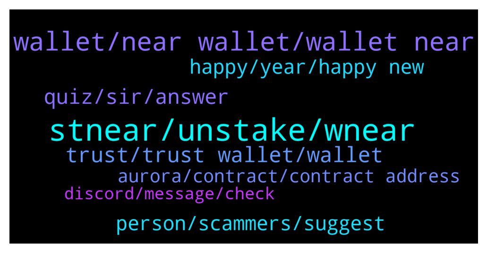

# **@cryptonear**
 ## Analysis for **2021-12-29** - **2021-12-30**.

---

## 📊 **Basic Stats**

**n_messages_sent**: 477

---

---

## 🔝 **Top keywords and related messages**

1. **stnear, unstake, wnear**

    @leoma98 --- *Hello NEAR community! Big APY 🔥  in Liquidity right now if you have some NEAR to deposit, and want to seize the opportunity!  Note: Meta Pool will be adding more liquidity to the pool and we will also gradually raise the treasury cut on liquid unstake fees. Those APY numbers are not forever.* **--->** [TG Discussion](https://t.me/cryptonear/254556)

    @fiolalala --- *https://near.oin.finance/Vault/    Is this website used to mortgage your stnear and borrow USDO stable currency? When the value of stnear falls beyond a certain price, the collateral stNear will be liquidated, right?* **--->** [TG Discussion](https://t.me/cryptonear/254760)

    @kv9990 --- *When you'll deposit $NEAR to Ref,it'll be converted to wNear 👀 it's same thing* **--->** [TG Discussion](https://t.me/cryptonear/256090)

    @butola_ravi --- *I have wnear and stnear on ref finance how to swap them back on near* **--->** [TG Discussion](https://t.me/cryptonear/254792)

    @larry_lang --- *https://pulsemarket.eth.link/#!/ this is for wNEAR to NEAR* **--->** [TG Discussion](https://t.me/cryptonear/254793)

    @larry_lang --- *https://twitter.com/finance_ref/status/1476233555428745237?s=20 free $REF reward spotted 👀👀* **--->** [TG Discussion](https://t.me/cryptonear/255783)

2. **wallet, near wallet, wallet near**

    @larry_lang --- *here is a NEAR wallet creation tutorial that you might need: https://near.org/blog/getting-started-with-the-near-wallet/ but after wallet is done u are good to go* **--->** [TG Discussion](https://t.me/cryptonear/254999)

    @Isabelle --- *Hello everyone. I have Near and sent it to my ledger tru smart binance chain....is there a way to convert my coins to the Near Chain?* **--->** [TG Discussion](https://t.me/cryptonear/254514)

    @minhBui28 --- *when create near wallet, I need to deposit 0.1 NEAR, is this true?* **--->** [TG Discussion](https://t.me/cryptonear/255683)

    @frankophil --- *Does the NEAR team have any plans to incorporate Metamask or other browser wallet?* **--->** [TG Discussion](https://t.me/cryptonear/255056)

    @TheGo1denBull --- *Please make a NEAR WALLET first. I recommend it @Estigio69 . Get NEAR from a CEX like kucoin or binance.* **--->** [TG Discussion](https://t.me/cryptonear/256060)

    @Isabelle --- *Thanks Kripto Raptor,....I did that already and still not recognizing my binance chain near pegged account* **--->** [TG Discussion](https://t.me/cryptonear/254529)

3. **trust, trust wallet, wallet**

    @Joseph --- *I sent near from my kucoin to my trust wallet, the transaction went through and then the next time I opened my trust wallet, my existing near had been sent out, is this a service issue? Can anyone help?* **--->** [TG Discussion](https://t.me/cryptonear/255810)

    @Joseph --- *20mins after the transaction I saw another transaction sending out the near* **--->** [TG Discussion](https://t.me/cryptonear/255815)

    @Joseph --- *I just checked the adress, it has only received one transaction and that's my near* **--->** [TG Discussion](https://t.me/cryptonear/255828)

    @NEARverse_xd --- *Sent out means? Your existing trust wallet near disappear?* **--->** [TG Discussion](https://t.me/cryptonear/255812)

    @larry_lang --- *but yeah like anup said it''s quite weird that your coin get send out another time form trust wallet* **--->** [TG Discussion](https://t.me/cryptonear/255813)

    @NEARverse_xd --- *Same like some girls are leaking their bf's trust wallet seedphrase🤑* **--->** [TG Discussion](https://t.me/cryptonear/255845)

4. **quiz, sir, answer**

    @NEARverse_xd --- *Bru only 2 min. What time consuming🙃* **--->** [TG Discussion](https://t.me/cryptonear/255698)

    @TheGo1denBull --- *Like that was so corny lol* **--->** [TG Discussion](https://t.me/cryptonear/255415)

    @Kripto_Raptor --- *hey, what language do you speak sir* **--->** [TG Discussion](https://t.me/cryptonear/255200)

    @kv9990 --- *Yeah,pretty sure that's a question for Quiz 😆* **--->** [TG Discussion](https://t.me/cryptonear/254728)

    @ProDragRuyu --- *hello, i already made the quiz 2 weeks ago. But i didn't got any NEAR. is it normal?* **--->** [TG Discussion](https://t.me/cryptonear/254625)

    @kv9990 --- *He was the lucky one 😜* **--->** [TG Discussion](https://t.me/cryptonear/254755)

5. **person, scammers, suggest**

    @iforbusiness2 --- *But I suggest less because it can time consuming and can irritating for the person to whom we suggest* **--->** [TG Discussion](https://t.me/cryptonear/255696)

    @Kripto_Raptor --- *please reach me out or direct me the person who would like to lead this initiative.* **--->** [TG Discussion](https://t.me/cryptonear/255218)

    @Kripto_Raptor --- *but when you zoom out you will realize you're in a total scam coin 😅* **--->** [TG Discussion](https://t.me/cryptonear/254456)

    @Horse_prsl --- *Hi there 👋  I have a business proposal its about doing an AMA & posting ads on different social media with our commun . Our community including  investors, traders, ambassador etc. Should I contact with?* **--->** [TG Discussion](https://t.me/cryptonear/254341)

    @Owen965 --- *Hello, I'm  Marketer at Crypto Crowd, I think your project has great potential.I would like to invite you to hold an AMA session in our community, who is the concerned person here I can talk to?* **--->** [TG Discussion](https://t.me/cryptonear/254387)

    @Darius_Nearinsider --- *I will send more useful information to everyone* **--->** [TG Discussion](https://t.me/cryptonear/255557)

6. **happy, year, happy new**

    @Jacques --- *Thank you again and for all. Now I'll go for some reading and exploring. Will be back when I know more. Have a great year end* **--->** [TG Discussion](https://t.me/cryptonear/255346)

    @TheGo1denBull --- *Well you're good to go 😃* **--->** [TG Discussion](https://t.me/cryptonear/255135)

    @larry_lang --- *hi buddy^^ how are u doing dude=00* **--->** [TG Discussion](https://t.me/cryptonear/254796)

    @iamkemoo --- *i feel like im having a cold.. but doing good mate! and you?* **--->** [TG Discussion](https://t.me/cryptonear/254799)

    @amoremio1121 --- *Why are you sad lmao 😂😭* **--->** [TG Discussion](https://t.me/cryptonear/254962)

    @Kate134w --- *I wish you all a Happy New Year🎉🎉🎉* **--->** [TG Discussion](https://t.me/cryptonear/255608)

7. **aurora, contract, contract address**

    @StephenShimel --- *Or join the auroranetwork community TG? (fan made)* **--->** [TG Discussion](https://t.me/cryptonear/254394)

    @Cctdd --- *Just checked our aurora now. But it didn't look like its near based* **--->** [TG Discussion](https://t.me/cryptonear/254396)

    @larry_lang --- *here u go: $NEAR contract address on AURORA  "0xC42C30aC6Cc15faC9bD938618BcaA1a1FaE8501d"  $NEAR contract address on ETH "0x85F17Cf997934a597031b2E18a9aB6ebD4B9f6a4"  $NEAR contract address on BSC "0x1fa4a73a3f0133f0025378af00236f3abdee5d63"* **--->** [TG Discussion](https://t.me/cryptonear/254641)

    @kv9990 --- *+ $523M TVL of Aurora which is L2 as an smart contract on NEAR. ✌️  https://defillama.com/chain/Aurora* **--->** [TG Discussion](https://t.me/cryptonear/254708)

    @larry_lang --- *oh so are u currently  having eth on NEAR wallet or on aurora network?* **--->** [TG Discussion](https://t.me/cryptonear/254985)

    @frankophil --- *okay cool, thanks. Can the NEAR network handle the ETH asset? Or do I need go to AURORA?* **--->** [TG Discussion](https://t.me/cryptonear/255027)

