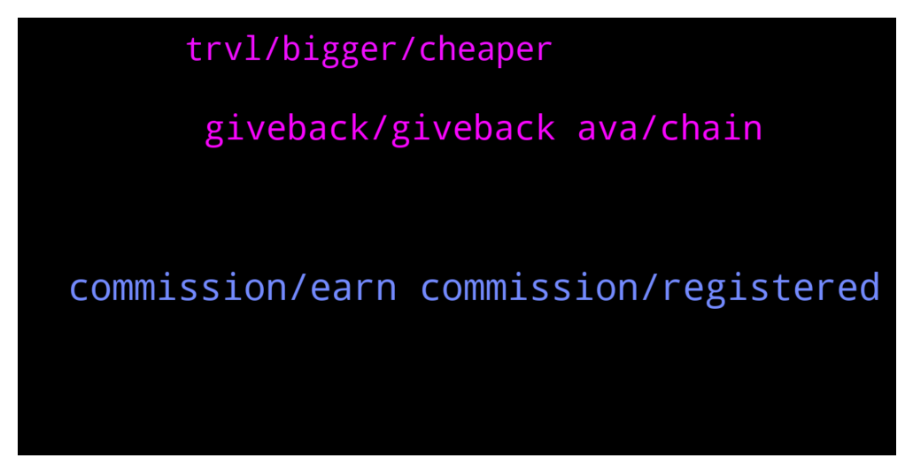

# **@defisearchpublic**
 ## Analysis for **2021-12-28** - **2021-12-30**.

---

## 📊 **Basic Stats**

**n_messages_sent**: 32

---

---

## 🔝 **Top keywords and related messages**

1. **commission, earn commission, registered**

    @raver --- *ow okay so in affiliate program i will also earn the 5% on their fisrt booking.* **--->** [TG Discussion](https://t.me/defisearchpublic/240787)

    @athaliah --- *just one time after they registered and make their first booking ..* **--->** [TG Discussion](https://t.me/defisearchpublic/240786)

    @athaliah --- *yeah but in affiliate program you will earn 5% commission on every booking that is made with your link ..* **--->** [TG Discussion](https://t.me/defisearchpublic/240784)

    @athaliah --- *all you need is a social media acct. you don't need to be an influencer too you just need to make the people use your link to book flights or accommodation to earn the 5% commission ..* **--->** [TG Discussion](https://t.me/defisearchpublic/240790)

    @raver --- *yeah ! really cool i will invite my friends and pushed them to registered and book their travels hahaha 😂* **--->** [TG Discussion](https://t.me/defisearchpublic/240781)

    @raver --- *alright that's the difference between the two .. how can i earn commission what do i need to do ?* **--->** [TG Discussion](https://t.me/defisearchpublic/240789)

2. **giveback, giveback ava, chain**

    @raver --- *ow it's still okay coz i can still have AVA even i don't purchase coz i will have giveback on AVA token.* **--->** [TG Discussion](https://t.me/defisearchpublic/240776)

    @athaliah --- *yeah but you can still have giveback on AVA token whatever payment method you make.* **--->** [TG Discussion](https://t.me/defisearchpublic/240774)

    @athaliah --- *AVA is a multi chain token based on Binance Chain, Binance Smart Chain and Ethereum blockchain.* **--->** [TG Discussion](https://t.me/defisearchpublic/240765)

    @raver --- *in invite program how many times can i get the $25 worth of AVA ?* **--->** [TG Discussion](https://t.me/defisearchpublic/240785)

    @blake --- *that's right you can also exchange now on  changeNow io* **--->** [TG Discussion](https://t.me/defisearchpublic/240762)

    @athaliah --- *there's more to way to earn AVA without actually purchasing it ..* **--->** [TG Discussion](https://t.me/defisearchpublic/240777)

3. **trvl, bigger, cheaper**

    @athaliah --- *you wouldn't be dissapointed on travala it's not just cheaper but also giving discounts and rewards.* **--->** [TG Discussion](https://t.me/defisearchpublic/240767)

    @raver --- *hey is Dtravel part of travala ?* **--->** [TG Discussion](https://t.me/defisearchpublic/240769)

    @raver --- *bilated merry Christmas Everyone ☺️ what do you guys think about travala ?* **--->** [TG Discussion](https://t.me/defisearchpublic/240750)

    @athaliah --- *if you want to trade sell or buy travala AVA you can exchange on Binance KuCoin or gate io* **--->** [TG Discussion](https://t.me/defisearchpublic/240757)

    @blake --- *they are partners to itegrate the TRVL token on travala .. so now you can pay with TRVL on travala* **--->** [TG Discussion](https://t.me/defisearchpublic/240770)

    @athaliah --- *yeah i saw that on twitter recently .. travala is getting bigger and bigger now* **--->** [TG Discussion](https://t.me/defisearchpublic/240763)

