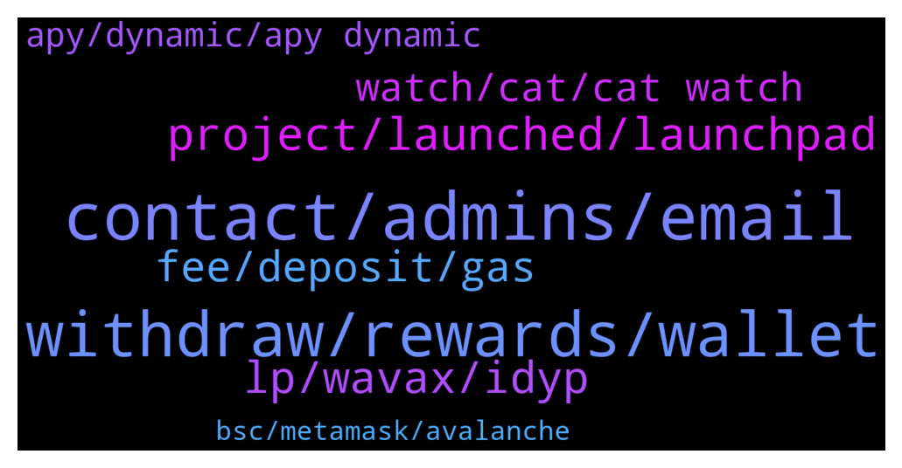

# **@dypfinance**
 ## Analysis for **2021-12-29** - **2021-12-30**.

---

## 📊 **Basic Stats**

**n_messages_sent**: 169

---

---

## 🔝 **Top keywords and related messages**

1. **contact, admins, email**

    @thurlo79 --- *More scammers pretending to be dhonimsd* **--->** [TG Discussion](https://t.me/dypfinance/235137)

    @xtrema220s --- *ok. thanks. apologies I was not following this channel since a while* **--->** [TG Discussion](https://t.me/dypfinance/235195)

    @MDMH10 --- *Hi admins, I have marketing and listing proposal whom to contact?* **--->** [TG Discussion](https://t.me/dypfinance/235096)

    @bigwinrchrd --- *Hi good day people May I ask who can I contact for promotion?* **--->** [TG Discussion](https://t.me/dypfinance/235279)

    @Marinecommandoz --- *Can you guide me? Just new to things like this.* **--->** [TG Discussion](https://t.me/dypfinance/235261)

    @DhoniMSD516 --- *I don't have any such infos with me, will try to get checking internally :)* **--->** [TG Discussion](https://t.me/dypfinance/235497)

2. **withdraw, rewards, wallet**

    @Siky55 --- *but my wallet is stollen, how to connect new wallet for rewards etc.* **--->** [TG Discussion](https://t.me/dypfinance/235154)

    @shinigamikami --- *Check if your approval transaction was successful* **--->** [TG Discussion](https://t.me/dypfinance/235429)

    @Siky55 --- *i use a wallet for DYP stake and farm that has been compromised. Can I connect that funds to new wallet* **--->** [TG Discussion](https://t.me/dypfinance/235152)

    @xtrema220s --- *Hello! I've some trouble unstaking DYP v1 from 12day ETH: in chrome console, got this error as I press WITHDRAW:* **--->** [TG Discussion](https://t.me/dypfinance/235191)

    @Dr Augusto --- *Hello, how i can withdrwal dyp or another LP? i click on withdraw botton and nothing happning* **--->** [TG Discussion](https://t.me/dypfinance/235019)

    @sinaht --- *hello when i use 3 day lock for deposit in farm does it mean that after 3 days there would be no profit or is it just for withdrawal wait period?* **--->** [TG Discussion](https://t.me/dypfinance/235105)

3. **project, launched, launchpad**

    @Gepeng2211 --- *will there be a new project launch here?* **--->** [TG Discussion](https://t.me/dypfinance/235547)

    @Awais31819977 --- *Hi, where can i find history of projects launched at Defi Launchpad?* **--->** [TG Discussion](https://t.me/dypfinance/235364)

    @Marinecommandoz --- *Any way to make money now before launch?* **--->** [TG Discussion](https://t.me/dypfinance/235257)

    @hemanrock --- *Launchpad is coming soon and 1st project will be in January* **--->** [TG Discussion](https://t.me/dypfinance/235255)

    @iamJubi --- *Hello. None have been launched yet. We are accepting applications at the moment.* **--->** [TG Discussion](https://t.me/dypfinance/235365)

    @Muthunayagam3 --- *Hi bro, tiers announced for the launchpad?* **--->** [TG Discussion](https://t.me/dypfinance/235117)

4. **lp, wavax, idyp**

    @sinaht --- *I mean what is one lp equal to?* **--->** [TG Discussion](https://t.me/dypfinance/235128)

    @sinaht --- *I can change it back to wavax or avax using pangolin?* **--->** [TG Discussion](https://t.me/dypfinance/235124)

    @Onur --- *23.34 LP how much avax is it worth* **--->** [TG Discussion](https://t.me/dypfinance/235456)

    @DhoniMSD516 --- *LP is WAVAX-iDYP pair, when you deposited smart contract does 75% to LP on which you earn wavax and 25% to dyp on which you earn DYP* **--->** [TG Discussion](https://t.me/dypfinance/235119)

    @sinaht --- *Sorry for too much Q but what is lp? It’s my wavax?* **--->** [TG Discussion](https://t.me/dypfinance/235116)

    @Wheadonator --- *Okay thanks I've read it but I don't think it answers my question unfortunately. For instance this says 75% of my WAVAX goes to AVAX/DYP pool on Pangolin (Pangolin states fee's of up to 0.25% per transaction on the LP) so I don't see how this ends up with the high APR* **--->** [TG Discussion](https://t.me/dypfinance/235326)

5. **fee, deposit, gas**

    @shinigamikami --- *Cause of the current gwei 130 staking gas fee would be $100+ you can wait for it to come down below 100 gwei, anytime it’s below 100 gwei it won’t charge you more than $100 regardless of the suggested gas* **--->** [TG Discussion](https://t.me/dypfinance/235070)

    @shinigamikami --- *Leme check the current gwei and give you max estimate it will charge* **--->** [TG Discussion](https://t.me/dypfinance/235066)

    @sinaht --- *I deposited a couple of days ago but in earned section it still says zero!* **--->** [TG Discussion](https://t.me/dypfinance/235109)

    @appliepietrade --- *hi admin,  i am still confused by the statement on the staking site that says "Please approve before staking. 0% fee for deposit." while I clicking deposit, it will charge 3 hundred something for the deposit( the gas fee might be lower that what it says for the gas fee), but why you provide this 0 percent fee for deposit?* **--->** [TG Discussion](https://t.me/dypfinance/235356)

    @iamJubi --- *Hello. DYP team or the pool don’t charge fee upon deposit. What charges fee is Eth/bsc/avalanche chain.* **--->** [TG Discussion](https://t.me/dypfinance/235358)

    @sinaht --- *And as you said the later the better right fee wise I mean* **--->** [TG Discussion](https://t.me/dypfinance/235114)

6. **watch, cat, cat watch**

    @DhoniMSD516 --- *Each Cat is unique and produced digitally from over 182 possible traits, such as expression, skin, clothing, watches, and many more. All Cats are dope, but some are more outstanding than others depending on the watch they wear.* **--->** [TG Discussion](https://t.me/dypfinance/235480)

    @Richcal --- *i read on website, we get free 1 watch.. what is that mean? if i buy 1 that means i get 2 nft (1 cat and 1 watch)?* **--->** [TG Discussion](https://t.me/dypfinance/235483)

    @timdyp --- *Happy Thursday #DYPians😼  Don't forget that the mint will start on January 17, 2022 https://dyp.finance/nft  #NFTs #NFTCommunity #DYP #nftart #watches  👉https://twitter.com/dypfinance/status/1476495462848946179* **--->** [TG Discussion](https://t.me/dypfinance/235466)

    @Richcal --- *Is the watch that created by the dyp team have same brand with the one in the real world? if so, does dyp already have a license to use that brand?* **--->** [TG Discussion](https://t.me/dypfinance/235496)

    @DhoniMSD516 --- *Well you only get Watch free and not Cat + Watch* **--->** [TG Discussion](https://t.me/dypfinance/235487)

    @DhoniMSD516 --- *If you buy 1 Cat it already has watch in addition you get another watch for free* **--->** [TG Discussion](https://t.me/dypfinance/235484)

7. **apy, dynamic, apy dynamic**

    @Vl_investor --- *Why does APY STAKE AVAX go down so much by itself?* **--->** [TG Discussion](https://t.me/dypfinance/234966)

    @hemanrock --- *APY is dynamic. When more users deposit, it can be decreased.* **--->** [TG Discussion](https://t.me/dypfinance/234967)

    @hemanrock --- *APY is dynamic and it can be increased or decreased.* **--->** [TG Discussion](https://t.me/dypfinance/234960)

    @DJ Olkan --- *Hi. Newbie here. Looking to stake DYP (ETH chain), 90-day locked, currently at 496% APY. Once in, is the APY also locked for that time period or sliding? Thanks for your help* **--->** [TG Discussion](https://t.me/dypfinance/234958)

    @hemanrock --- *Hey our devs used some good strategies to have good APY's and passive income, also it is common scenario to have this high APY's if pools are fresh but still the APY's will be good enough moving forward. The APY is dynamic it can increased or decreased.* **--->** [TG Discussion](https://t.me/dypfinance/235328)

    @Wheadonator --- *hi, any good info on how APY's are so high, i see that tokens are split between AVAX/DYP LP and LP staking but I can't figure out how this alone ends up in 000's of returns* **--->** [TG Discussion](https://t.me/dypfinance/235312)

8. **bsc, metamask, avalanche**

    @hemanrock --- *https://t.me/dypfinance/229271  please check this to know more about DYP and its features.  there are also various video tutorials and ex FARM on BSC:   https://www.youtube.com/watch?v=2pOUmRTMN1o&t=304s* **--->** [TG Discussion](https://t.me/dypfinance/235263)

    @DhoniMSD516 --- *Hey we are available on ETH, BSC and AVAX chains So if you want to use BSC with Metamask yes you can do it.* **--->** [TG Discussion](https://t.me/dypfinance/235399)

    @agr_86 --- *hi admin, im new joiner, this platform running in bsc? may i use metamask with bsc or i have to add avalanche chain in my metamask?* **--->** [TG Discussion](https://t.me/dypfinance/235398)

    @Marinecommandoz --- *Any risk associated to the options listed by you?* **--->** [TG Discussion](https://t.me/dypfinance/235267)

    @iamJubi --- *If you are building to #Avalanche our LaunchPad can help your project to raise capital safely and fast! +162,414 Community Members +23,659 #DYP Holders  Integrated presale smart contracts, token locker, and DYP Tools security features.  Apply to Launch👇 https://dyp.finance/launchpad  👉https://twitter.com/dypfinance/status/1476243288273399816* **--->** [TG Discussion](https://t.me/dypfinance/235414)

