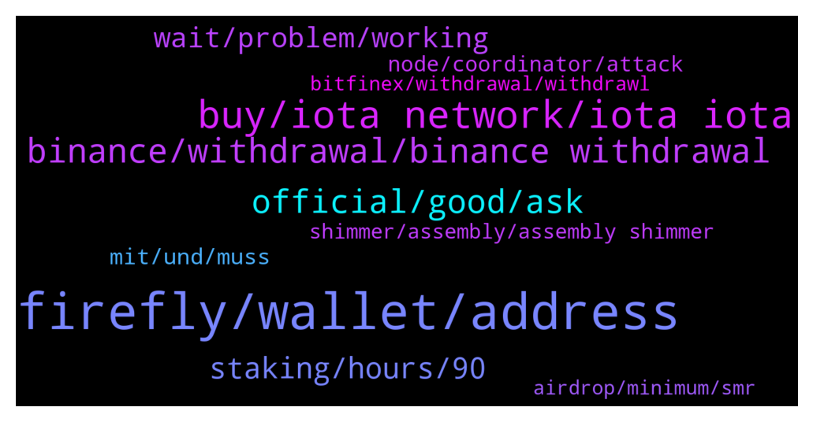

# **@iotatangle**
 ## Analysis for **2021-12-29** - **2021-12-30**.

---

## 📊 **Basic Stats**

**n_messages_sent**: 368

---

---

## 🔝 **Top keywords and related messages**

1. **firefly, wallet, address**

    @SunnySide~ --- *i dont know, the firefly wallet address just changed, its not the same as previous* **--->** [TG Discussion](https://t.me/iotatangle/304281)

    @garciaasensi --- *Hello everyone! Yesterday evening I trasnferred several IOTAs from binance to Firefly. I can can se the Transfer completed in binance, but IOTAs havent arrived to Firefly. Its normal the delay?* **--->** [TG Discussion](https://t.me/iotatangle/304415)

    @mahirnadi --- *Hi everyone Where can i buy iota and send to firefly for staking? Binance don’t allow iota network, can i send with bep20?* **--->** [TG Discussion](https://t.me/iotatangle/304739)

    @Basti --- *You can check the status of mainnet always under:  https://status.iota.org/?s=09  If it changes from red to green, everything is good, and your wallets should work againg as usual.* **--->** [TG Discussion](https://t.me/iotatangle/304484)

    @DMoneyShot --- *You can check the status of mainnet always under:  https://status.iota.org/?s=09  If it changes from red to green, everything is good, and your wallets should work againg as usual.* **--->** [TG Discussion](https://t.me/iotatangle/304448)

    @markgoodlife --- *Hello guys. I am having a problem to migrate the funds from my sister. Everything works Fine and we See the correct amount to migrate, but in the last step the migration doesn’t go through. Any ideas? :/ we migrate with Nano X* **--->** [TG Discussion](https://t.me/iotatangle/303981)

2. **buy, iota network, iota iota**

    @Tahmis --- *💎IOTA (IOTA) Gets Listed on KuCoin! 🤑Deposit Now 🚀Trade IOTA/USDT, IOTA/BTC: 09:00 on December 30, 2021 (UTC) 👉https://www.kucoin.com/news/en-iota-iota-gets-listed-on-kucoin #NewListing* **--->** [TG Discussion](https://t.me/iotatangle/304461)

    @Hisham1978y --- *yes, but now they removed IOTA option* **--->** [TG Discussion](https://t.me/iotatangle/304156)

    @DidroBlake --- *not quite correct display here.  1gi = 1000 iota* **--->** [TG Discussion](https://t.me/iotatangle/304945)

    @johnprays --- *Is IOTA listed yet in binance?* **--->** [TG Discussion](https://t.me/iotatangle/304976)

    @F --- *can somebody explain to me what it means iota is sent to Cross Margin on binance?* **--->** [TG Discussion](https://t.me/iotatangle/304536)

    @PNol1 --- *No, you are asking a question that requires a crystal ball. You can look towards kusama/polkadot for nearest comparison* **--->** [TG Discussion](https://t.me/iotatangle/305068)

3. **binance, withdrawal, binance withdrawal**

    @PNol1 --- *Thanks. Managed to get a recent purchase out of binance after seeing your post* **--->** [TG Discussion](https://t.me/iotatangle/303975)

    @Jacques --- *My tip is to check binance every half hour* **--->** [TG Discussion](https://t.me/iotatangle/304191)

    @itsmedev --- *Binance withdrawal is on and off today* **--->** [TG Discussion](https://t.me/iotatangle/304151)

    @ef4ort --- *Withdrawal function temporarily suspended But am not sure if the problem has been completely resolved with Binance yet* **--->** [TG Discussion](https://t.me/iotatangle/304224)

    @Basti --- *But binance is working every few hours* **--->** [TG Discussion](https://t.me/iotatangle/304745)

    @navinhn --- *Binance allowed withdrawal but withdrawal is getting failed , can anyone have solution for this ?* **--->** [TG Discussion](https://t.me/iotatangle/304347)

4. **official, good, ask**

    @Tahmis --- *np. It's a special day so we are not so strict :)* **--->** [TG Discussion](https://t.me/iotatangle/304020)

    @Papa_Moose --- *I love how the people in this chat don’t read the chat, but just ask their question while it’s been answered multiple times* **--->** [TG Discussion](https://t.me/iotatangle/304546)

    @AaE --- *Good question. That's what I asked too* **--->** [TG Discussion](https://t.me/iotatangle/304258)

    @Czarli --- *smash the likes + retweet for Tommy Chong  https://twitter.com/muzible/status/1476367653606465545* **--->** [TG Discussion](https://t.me/iotatangle/304915)

    @Polka_Systems --- *You need to pass the basic registration of course* **--->** [TG Discussion](https://t.me/iotatangle/304897)

    @Shamsul_Jamel --- *You might want to ask in official discord* **--->** [TG Discussion](https://t.me/iotatangle/304286)

5. **staking, hours, 90**

    @HenryFecamp --- *I don't know what is happening but even tough I am prestaking from day 1 now my staking is not working?* **--->** [TG Discussion](https://t.me/iotatangle/304480)

    @Btcwars --- *So people staking today lost 1 day* **--->** [TG Discussion](https://t.me/iotatangle/304265)

    @T --- *Would really suck to let ur comp 90 days running* **--->** [TG Discussion](https://t.me/iotatangle/304131)

    @Ragnar_mb --- *They lost however many hours they hadn't staked* **--->** [TG Discussion](https://t.me/iotatangle/304267)

    @Patrick --- *Staking was suspended for a few hours because of a problem with the coordinator. Those lost hours will be added at the end so the full 90 days of staking will be achieved* **--->** [TG Discussion](https://t.me/iotatangle/304779)

    @⠠⠵ Lucas! --- *Maybe you disabled shimmer by error when managing staking* **--->** [TG Discussion](https://t.me/iotatangle/304093)

6. **wait, problem, working**

    @Charlie_2017 --- *Ok thx , I will try* **--->** [TG Discussion](https://t.me/iotatangle/304057)

    @HenryFecamp --- *so there is nothing I have to do only wait?* **--->** [TG Discussion](https://t.me/iotatangle/304491)

    @hishamelshazly --- *I do have the same issue* **--->** [TG Discussion](https://t.me/iotatangle/304403)

    @JohnPhishingman --- *IF found the issue and fix it atm* **--->** [TG Discussion](https://t.me/iotatangle/304515)

    @Louis --- *I thought it was my problem, thank you!* **--->** [TG Discussion](https://t.me/iotatangle/304507)

    @Jacques --- *Did two steps one try to see if it worked and then the rest* **--->** [TG Discussion](https://t.me/iotatangle/304194)

7. **mit, und, muss**

    @Basti --- *Man verbindet sich dann mit dem testnetzwerk* **--->** [TG Discussion](https://t.me/iotatangle/304105)

    @DixiW --- *danke.... und wofür ist diese Option, wenn man das wallet als Entwickler erstellt?* **--->** [TG Discussion](https://t.me/iotatangle/304104)

    @DixiW --- *wozu , was kann man damit anstellen* **--->** [TG Discussion](https://t.me/iotatangle/304107)

    @DixiW --- *jetzt wird mir gesagt ich muss mein wallet erst verwenden bevor ich ein neues anlegen kann... muss ich jetzt neu installieren???* **--->** [TG Discussion](https://t.me/iotatangle/304082)

    @Basti --- *Neues wallet erstellen, dann geht's :)* **--->** [TG Discussion](https://t.me/iotatangle/304078)

    @Basti --- *Um als Entwickler zu testen ohne diese mit echten tokens testen zu müssen und eventuell Geld zu verlieren* **--->** [TG Discussion](https://t.me/iotatangle/304111)

8. **node, coordinator, attack**

    @JohnPhishingman --- *just wait until the coordinator-Node is up again* **--->** [TG Discussion](https://t.me/iotatangle/304512)

    @Eren --- *I changed nodes and all, yet kind of had a miniature heart attack lol* **--->** [TG Discussion](https://t.me/iotatangle/304426)

    @DMoneyShot --- *Just a node. They located it and are fixing. Time to lose the coordinator* **--->** [TG Discussion](https://t.me/iotatangle/304406)

    @Osaaaa --- *i do automaticly and lost  old node ,  can anyone send me  node to add* **--->** [TG Discussion](https://t.me/iotatangle/304375)

    @itsmedev --- *Lol no attack. Issue with the coordinator at the moment* **--->** [TG Discussion](https://t.me/iotatangle/304476)

    @Osaaaa --- *what is  good  node ?* **--->** [TG Discussion](https://t.me/iotatangle/304388)

9. **shimmer, assembly, assembly shimmer**

    @Javi --- *Assembly 100 Billions. Shimmer supply will depend on IOTA staking* **--->** [TG Discussion](https://t.me/iotatangle/304696)

    @BigMak_999 --- *Hello, Does anyone know the supply of Assembly and Shimmer?* **--->** [TG Discussion](https://t.me/iotatangle/304693)

    @QingshanLFT --- *Am earning assembly but not earning shimmer . What could be wrong* **--->** [TG Discussion](https://t.me/iotatangle/304090)

    @Chris --- *What is the price for shimmer and assembly? How do I know what my staking rewards is worth?* **--->** [TG Discussion](https://t.me/iotatangle/304250)

    @kmittakola --- *What is the use of shimmer and assembly tokens* **--->** [TG Discussion](https://t.me/iotatangle/304953)

    @Btcwars --- *anyone got idea of shimmer estimate token value each* **--->** [TG Discussion](https://t.me/iotatangle/304943)

10. **bitfinex, withdrawal, withdrawl**

    @ElmettS96 --- *How I can cancel a transaction that is in processing m* **--->** [TG Discussion](https://t.me/iotatangle/304137)

    @alexptn72 --- *for people who have a withdrawl in peocessing status on bitfinex for more than 12 hours. cancel the withdrawl e submit again. After resubmit my withdrawl arrived in 5 minutes* **--->** [TG Discussion](https://t.me/iotatangle/304025)

    @sy-subrc --- *There was also another one yesterday. But withdrawals and deposits not yet possible  https://twitter.com/litebiteu/status/1475845178116218889?s=21* **--->** [TG Discussion](https://t.me/iotatangle/304689)

    @itsmedev --- *It's of no use unless they open withdrawal  hehe* **--->** [TG Discussion](https://t.me/iotatangle/304466)

    @A4mos --- *Now only bsc withdrawal @binance possibile* **--->** [TG Discussion](https://t.me/iotatangle/304142)

    @Donnerbalken92 --- *Click on it under historie in withdrawal* **--->** [TG Discussion](https://t.me/iotatangle/304139)

