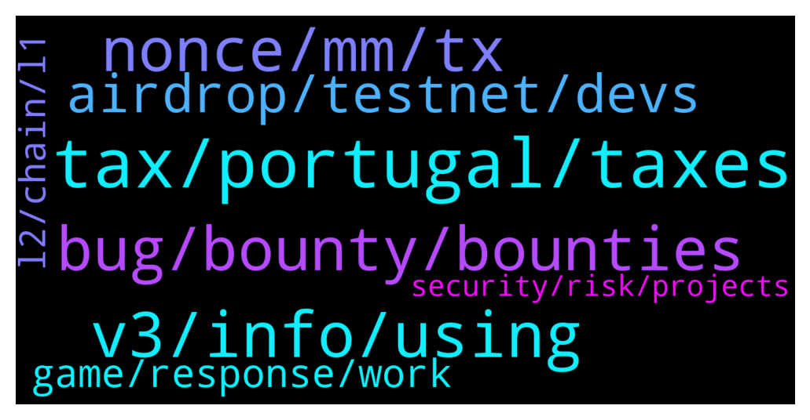

# **@lobsters_chat**
 ## Analysis for **2021-12-29** - **2021-12-30**.

---

## 📊 **Basic Stats**

**n_messages_sent**: 302

---

---

## 🔝 **Top keywords and related messages**

1. **tax, portugal, taxes**

    @vintash --- *Here's good news from Portugal too (taxes for crypto) https://eco.sapo.pt/2021/12/21/bloco-de-esquerda-propoe-alargar-irs-as-criptomoedas/* **--->** [TG Discussion](https://t.me/lobsters_chat/311354)

    @vintash --- *Portugal will probably cease to be a tax haven* **--->** [TG Discussion](https://t.me/lobsters_chat/311360)

    @Justsomebodi --- *The Netherlands only taxes 3% capital gains, only on declaration. So pretty good imho* **--->** [TG Discussion](https://t.me/lobsters_chat/311387)

    @Lemiscate --- *I can't vote I have french passport. Never grabbed a Portuguese one.* **--->** [TG Discussion](https://t.me/lobsters_chat/311456)

    @olivier27 --- *Dubai and Singapore are the only true crypto tax havens* **--->** [TG Discussion](https://t.me/lobsters_chat/311382)

    @TygaKim --- *korea no more metamask Portugal will probably cease to be a tax haven* **--->** [TG Discussion](https://t.me/lobsters_chat/311378)

2. **v3, info, using**

    @Lemiscate --- *Aave V3 is technically released. You just don't know where it is yet 😘* **--->** [TG Discussion](https://t.me/lobsters_chat/311458)

    @blockminded --- *I think Illuvium might be using Unreal, if not, it's using Unity* **--->** [TG Discussion](https://t.me/lobsters_chat/311189)

    @norswap --- *this has most of what you might  want to know on OlympusDAO https://dune.xyz/shadow* **--->** [TG Discussion](https://t.me/lobsters_chat/311488)

    @michael_p3711 --- *"the year is still 2021 and AAVE v3 is released...."   *checks calendar** **--->** [TG Discussion](https://t.me/lobsters_chat/311457)

    @zhongfu --- *if you're trying to find this out so that you can estimate how long you have left for a fast/snap sync, don't bother -- if your hardware is too slow to catch up, knownStates will increase forever* **--->** [TG Discussion](https://t.me/lobsters_chat/311224)

    @Tiarizzi93 --- *https://twitter.com/proposalbot?t=L3xkKy_HuiKFSAbUQDfxkQ&s=09  Don't know if useful but I keep track of most snapshot proposal using this little twitter bot* **--->** [TG Discussion](https://t.me/lobsters_chat/311599)

3. **nonce, mm, tx**

    @infomorph --- *Either people who "rolled their own" cryptography, or used faulty libraries with bad sources of randomness, most likely. A particularly sneaky blackhat could make a wallet that _very rarely_ reuses a nonce...get wide enough adoption, and even rare collisions will generate a steady stream of hackable accounts. This is one of many reasons why it's very important that wallets be open source (even then, could be hard to detect...see that random number generation standard the NSA backdoored for example).* **--->** [TG Discussion](https://t.me/lobsters_chat/311242)

    @miguel_cabeza --- *But when cancelling a transaction, don't you submit the same nonce with 0 gwei?* **--->** [TG Discussion](https://t.me/lobsters_chat/311222)

    @ivangbi --- *1. Send a 0 eth tx to urself 2. Put nonce same as the pending one (if u have just 1 pending) so this u need to insert manually (see on etherscan tx nonce) 3. Put gas costs higher, 0 eth normal tx is cheap anyway   Done* **--->** [TG Discussion](https://t.me/lobsters_chat/311306)

    @xmons --- *Different nonce, the blog post explains* **--->** [TG Discussion](https://t.me/lobsters_chat/311225)

    @yic_alex --- *It would be interesting to know how victims of that bot managed to reuse the nonce. They must be either devs or using some obscure implementation to create their tx.* **--->** [TG Discussion](https://t.me/lobsters_chat/311221)

    @ChiTimesChi --- *Worth noting that for MM you'd have to enable "custom nonce" It's under Settings -> Advanced -> Customize transaction nonce  This is an advanced feature, use cautiously.* **--->** [TG Discussion](https://t.me/lobsters_chat/311311)

4. **bug, bounty, bounties**

    @StephanGoss --- *I'm going to make a wildly unpopular statement: I think it'd be money better spent for a project to spend $2M on some high quality private investigators to track down black hats and then cooperate with law enforcement than spend $180M on bounties.* **--->** [TG Discussion](https://t.me/lobsters_chat/311529)

    @rata0x --- *But if team would negotiate with the hacker for 9billion token do you really think a hacker would settle only for 2million$? The people who suggested higher amount  bounty to hacker are trying to motivate and convert black hat to white hat. It is simple.* **--->** [TG Discussion](https://t.me/lobsters_chat/311512)

    @coine_r --- *"cultural problem"  In which other culture is it normal to pay $180M+ for a bug bounty?* **--->** [TG Discussion](https://t.me/lobsters_chat/311503)

    @kuzzel --- *At that size of a bounty, the hunt is worth almost any amount of work, and so people would put that in, and that codebase would end up being rock solid in no time.* **--->** [TG Discussion](https://t.me/lobsters_chat/311425)

    @StephanGoss --- *what's the highest bug bounty anyone currently offers on your platform? (love your work btw)* **--->** [TG Discussion](https://t.me/lobsters_chat/311433)

    @obaidoteth --- *“Codebase would end up being rock solid in no time”  If you pay $150M per high severity bug you will not have enough money to make the code rock solid* **--->** [TG Discussion](https://t.me/lobsters_chat/311496)

5. **airdrop, testnet, devs**

    @zegdathetkan --- *Can someone help me understand what is the point of recent airdrops like GAS and SOS? it occurs to me they are airdropping before they have a working platform, why? what is the point? is this just a marketing stunt? is this somehow a scheme to make money by somebody? who is providing the liquidity?* **--->** [TG Discussion](https://t.me/lobsters_chat/311331)

    @Sp33dyTT --- *Hey guys there is apparently airdrop ongoing for wasted gas can anyone smarter with solidity knowledge have a look at smart contract? http://Gasdao.org* **--->** [TG Discussion](https://t.me/lobsters_chat/311276)

    @ncerovac --- *Anton making epic dunes these days https://twitter.com/k06a/status/1475492168433287171?t=DOxk3kW9NxKTuvi8rHEANg&s=19  @ivangbi can we ask politely to help us with lobster dune?* **--->** [TG Discussion](https://t.me/lobsters_chat/311608)

    @phil_muhbags --- *Airdrops are nice when you get it because you were a user (1inch, uni, radar etc). It's getting out of control with airdrops.* **--->** [TG Discussion](https://t.me/lobsters_chat/311349)

    @dunno112 --- *im still scared to claim gas airdrop lol* **--->** [TG Discussion](https://t.me/lobsters_chat/311337)

    @ivangbi --- *Looks generic? Anyway small pp shit, not gonna bother more with it. Not a worthy airdrop* **--->** [TG Discussion](https://t.me/lobsters_chat/311293)

6. **game, response, work**

    @kuzzel --- *In the interest of freeing @ivangbi of further moderation, would you be game of putting together your questions/points together and sharing them with me?  Sounds like I'd be doing everyone a favor if I just wrote a long form response via blog post, that people could just link to to get fully informed on the perspectives. That way it's less conversational and more 'here are the options and tradeoffs, you take the risk you think best fellow founders/DAO community members'.  Happy to write it with you if you're game* **--->** [TG Discussion](https://t.me/lobsters_chat/311565)

    @ivangbi --- *Great piece tho, u made a few awesome ones! Love to read* **--->** [TG Discussion](https://t.me/lobsters_chat/311284)

    @coine_r --- *Shifting the goalposts? Your earlier comment insinuated it's some sort of norm somewhere* **--->** [TG Discussion](https://t.me/lobsters_chat/311508)

    @suzumiyachan --- *There's always a way to get to where you need to be, but it's an uphill battle especially if what you're offering basically amounts to "oh god, more work" :P    But, good luck with everything. You'll get there, I'm sure of it.* **--->** [TG Discussion](https://t.me/lobsters_chat/311185)

    @kuzzel --- *Anyways back to work I go, just chiming in* **--->** [TG Discussion](https://t.me/lobsters_chat/311429)

    @suzumiyachan --- *thank you for your response! :)* **--->** [TG Discussion](https://t.me/lobsters_chat/311193)

7. **l2, chain, l1**

    @alekseipu --- *https://www.coingecko.com/en/coins/olympus#markets  1. Check sushi pools on GC 2. How to compute TVL (liquidity): use “+2%” market depth and divide this number to 0.02.   Example: OHM/DAI 2% md is: 4.8mln$  So, it means there is: 240 mln$ in the pool.  According to OHM website almost all LPs are in POL (owned by protocol).* **--->** [TG Discussion](https://t.me/lobsters_chat/311324)

    @RomanDub --- *Is there a place to check how much liquidity OlympusDAO (and other forks) actually own?* **--->** [TG Discussion](https://t.me/lobsters_chat/311323)

    @Alphamint --- *Q: if you where to sort all the protocols with tokens that are actually of use and aren't L1s by legal risk for the founders starting with less risky, which ones would be in the top 10?  I'm guessing chain link would one of them cus theyrnt touching any money  (Only judging by the type of service they provide,  ignoring that some have legal buffers like no website, DAO decided on activation, foundation in BVI...)* **--->** [TG Discussion](https://t.me/lobsters_chat/311578)

    @Cat_Graphy --- *Also, is there any analytic tools that compile the DeFi TVL compared across different chains? I've seen most TVL only refer to ETH chain as the major indicator for the market.   Not sure if this will still be a viable indicator in the near future* **--->** [TG Discussion](https://t.me/lobsters_chat/311275)

    @foflexity --- *Anyone remember the Twitter feed that discussed the L1/L2 value add comparison between blue chip cross chain dapps and native chain specific ones?  And if so, link? 🙏😅  Example like Uniswap/Sushiswap vs Pancakeswap/TraderJoes, and what brings for value for a L1/L2 network* **--->** [TG Discussion](https://t.me/lobsters_chat/311231)

    @foflexity --- *It was more along the lines of “these big name players are doing a disservice to the L1/L2 contenders by diluting their value and extracting all the value by running on every chain possible, pointing out that more benefit comes to the network with the chain specific implementations like pancakeswap and traderjoes* **--->** [TG Discussion](https://t.me/lobsters_chat/311251)

