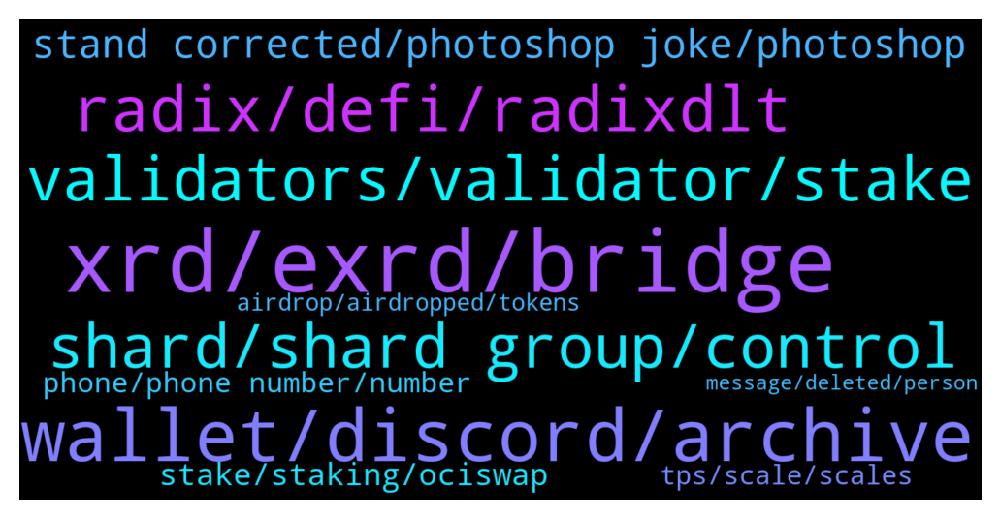

# **@radix_dlt**
 ## Analysis for **2021-12-29** - **2021-12-30**.

---

## 📊 **Basic Stats**

**n_messages_sent**: 748

---

---

## 🔝 **Top keywords and related messages**

1. **xrd, exrd, bridge**

    @fpieper --- *What's the attack vector with a BTC token? Scammers sending a first BTC and them asking for XRD to get more BTC?* **--->** [TG Discussion](https://t.me/radix_dlt/329069)

    @Baldyo7 --- *My EXRD is on KuCoin, how do I transfer it to XRD and send to my radix wallet* **--->** [TG Discussion](https://t.me/radix_dlt/330004)

    @Kesswitz --- *a) to promote our staking service and b) to allow our Delegator‘s in participating in our Service‘s economic success. When you stake with our Node, you will also receive XSEED tokens. The more you stake, the more tokens you will receive and the larger your share is.* **--->** [TG Discussion](https://t.me/radix_dlt/329892)

    @Kesswitz --- *Hi, have a look at our XSEED-token offering when you stake to our Node: https://www.radixdltstaking.com/xseed-token/* **--->** [TG Discussion](https://t.me/radix_dlt/329849)

    @brandonfanboy --- *Is there any plans for a bridge for XRD, is that not necessary because its the native token?* **--->** [TG Discussion](https://t.me/radix_dlt/329339)

    @MiguelBHM --- *They're basically the same, exchangeable 1-1, but eXRD is ERC-20 i.e. it's Ethereum-compatible so available de-facto on most trading platforms* **--->** [TG Discussion](https://t.me/radix_dlt/329336)

2. **wallet, discord, archive**

    @Radstakes --- *That's very strange.  I'm not sure what else to suggest, except restarting the wallet and trying again later.  If it persists, you should log it in the discord Bug Reports channel where the team are more active and can provide more input. discord.gg/radixdlt* **--->** [TG Discussion](https://t.me/radix_dlt/329043)

    @mx471 --- *what happens if you click on a old post link? https://t.me/radix_dlt/112912* **--->** [TG Discussion](https://t.me/radix_dlt/329320)

    @PMinarno --- *Now i got this stupid message when I want to check the explorer:* **--->** [TG Discussion](https://t.me/radix_dlt/329944)

    @Peter (HAM) --- *Can we check our hardware wallet's balance using Radix Desktop wallet without connecting the Ledger first? I only get "Unable to Connect to Ledger" as a result.* **--->** [TG Discussion](https://t.me/radix_dlt/329920)

    @PMinarno --- *@Jacob_XRD - tried to put my  wallet issue in discord under #support and there is no response yet.* **--->** [TG Discussion](https://t.me/radix_dlt/329793)

    @PMinarno --- *Yes - and so what will be your suggestion for my wallet issue haha? Lost my chances to buy muted scorpion because of this* **--->** [TG Discussion](https://t.me/radix_dlt/329024)

3. **radix, defi, radixdlt**

    @ChristopherHouse --- *What is unique about Radix? Vs other blockchains?!* **--->** [TG Discussion](https://t.me/radix_dlt/329655)

    @LucPro --- *Is Concordium project competitor to Radix?* **--->** [TG Discussion](https://t.me/radix_dlt/329850)

    @Jazzer9F --- *🎉NEW RADIX REPORT IS NOW LIVE!🎉  In the last Radix Report of 2021 we have some juicy updates from the marketing and development teams, plus news on the latest efforts from the Radix Marketing Council.  Full Report: https://www.radixdlt.com/post/radix-report-9th-december* **--->** [TG Discussion](https://t.me/radix_dlt/329247)

    @Magal36 --- *Yes, but I am not sure challenging exists in Radix* **--->** [TG Discussion](https://t.me/radix_dlt/329360)

    @DefiYields --- *GLCH was a great pump, now dumped it all for Radix. Glitch is not really a serious L1. Pretty low tech.* **--->** [TG Discussion](https://t.me/radix_dlt/328813)

    @AT --- *I have not found any competitor able to compete with Radix. Yes, there is a prototype.* **--->** [TG Discussion](https://t.me/radix_dlt/329906)

4. **validators, validator, stake**

    @Baldyo7 --- *Nice. Can anybody recommend a few validators for me to look at with reasonable fees and a solid infrastructure* **--->** [TG Discussion](https://t.me/radix_dlt/329985)

    @ahsimon --- *Total supply = zero only for validators 157-161.   Those validators are very far from being in the top 100, and hence staking to them very unlikely to ever participate in consensus and earn emission rewards.  Anyone can run a validator node, if only to gain experience, but does not needed to have any stake delegated to them.* **--->** [TG Discussion](https://t.me/radix_dlt/329494)

    @Veezy --- *Why are these validators creating there own coins* **--->** [TG Discussion](https://t.me/radix_dlt/330036)

    @Baldyo7 --- *What does self stake mean on the radix dashboard of validators* **--->** [TG Discussion](https://t.me/radix_dlt/329986)

    @mattiabe98 --- *Shameless plug: I run my own validator, if you want more info check here http://stake.mattia.wiki/ 😁* **--->** [TG Discussion](https://t.me/radix_dlt/329992)

    @EnricoPallazzo78TAMC4 --- *Hi All, which validators are you using for staking?* **--->** [TG Discussion](https://t.me/radix_dlt/328714)

5. **shard, shard group, control**

    @S --- *#AMA. What if I hold 10% of stake thereabouts, have lots of validators, and simply wait until I get grouped into a shard group with a few of them, where I have control? It's not *targeting* per se. I just wait until I am in control of a majority vote in 1 shard group, by simple sorting. Say there's 10K shard groups and I have 10% of stake. I would expect to be in control of a shard group at least once in a reasonable amount of time. Is there a concept of challenging, i.e. fishermen or hidden validators? Or is there another guarantee that I wouldn't be able to do a lot of damage? Or is my assumption incorrect that I could control a shard group at some point?* **--->** [TG Discussion](https://t.me/radix_dlt/329373)

    @S --- *But what if I hold 10% of stake thereabouts, have lots of validators, and simply wait until I get grouped into a shard group with a few of them, where I have control? It's not *targeting* per se. I just wait until I am in control of a majority vote in 1 shard group, by simple sorting* **--->** [TG Discussion](https://t.me/radix_dlt/329368)

    @ahsimon --- *With PoS (and Dan's DPos) security and/or liveness can be broken if your validators can form a cabal large enough to control 67% or 33% of the delegated stake.  The only protection is encouraging a wide distribution of delegated stake over the entire set of shards.  That is to make an attack like the one you propose too expensive.   Also, because related data is randomly distributed over 2^256 shard addresses, it is not clear how you can fiind something worth waiting for, when only attacking one shard group.* **--->** [TG Discussion](https://t.me/radix_dlt/329385)

    @S --- *If I don't care about what shard group I will eventually control, it shouldn't matter if my stake is split up, right. If you assume that there's lots of shard groups, and I have lots of validators, then by simple normal distribution you'd expect me end up with a few shard groups where I have lots of control, even though most of my stake will be quite evenly spread. Assuming I have 10% of stake thereabouts, it should still follow that I can spin up lots of validators with a reasonable amount of stake-power, that will sometimes cluster together at random points. Correct me if I'm wrong.* **--->** [TG Discussion](https://t.me/radix_dlt/330082)

    @thenotthatgreat --- *Ofc they will cluster at some degree at some point, but the more it is split up the lower the chance should be that you get most or all of it in the same shard group. Assuming alot of shard groups.* **--->** [TG Discussion](https://t.me/radix_dlt/330087)

    @S --- *Yes, but I'm not aiming at controlling a specific set. I'm just waiting around until I'm in control for once* **--->** [TG Discussion](https://t.me/radix_dlt/329404)

6. **stand corrected, photoshop joke, photoshop**

    @FitzRock --- *I did it. Thanks for your help Florian 👍* **--->** [TG Discussion](https://t.me/radix_dlt/329133)

    @Radstakes --- *the Jacob you have tagged is the real deal* **--->** [TG Discussion](https://t.me/radix_dlt/329973)

    @Baldyo7 --- *Ok thanks I’ll have a read now* **--->** [TG Discussion](https://t.me/radix_dlt/329961)

    @MassieFur --- *Thanks now I understand what he meant* **--->** [TG Discussion](https://t.me/radix_dlt/329427)

    @RadixMonk --- *I see, i stand corrected haha* **--->** [TG Discussion](https://t.me/radix_dlt/329012)

    @RadixMonk --- *Same, i stand corrected means i admit I'm wrong xD* **--->** [TG Discussion](https://t.me/radix_dlt/329028)

7. **stake, staking, ociswap**

    @S --- *In PoS you can just put out an ad saying 'I buy up your keys. If you're done staking, sell me your keys', kek* **--->** [TG Discussion](https://t.me/radix_dlt/329473)

    @giskard_rich --- *You can’t stake them at the moment. I guess that could change and things develop* **--->** [TG Discussion](https://t.me/radix_dlt/328876)

    @Baldyo7 --- *Where do I find good information on how to stake and what rates there are etc* **--->** [TG Discussion](https://t.me/radix_dlt/329958)

    @MrKrabs22 --- *Hi folks, I've just started staking for the first time. One of the nodes I tried to stake at doesn't seem to have worked. The explorer link reads "There was an error fetching your data. Try again."  There is a little spinning timer in the history of my wallet so the staking hasn't worked. The staking amount is still locked though. I'm not sure how to cancel this? Thanks!* **--->** [TG Discussion](https://t.me/radix_dlt/329324)

    @Toby --- *What does the 5% and 10% stake mean? Is it of what we have staked overall or based on some other value?* **--->** [TG Discussion](https://t.me/radix_dlt/328700)

    @ChristopherHouse --- *I’m impressed with the staking rewards!* **--->** [TG Discussion](https://t.me/radix_dlt/329648)

8. **phone, phone number, number**

    @Radstakes --- *Let's give this a rest now please and keep the chat on topic.  You're right about the risks of hacks from phone number alone, and the privacy concerns are also well founded.* **--->** [TG Discussion](https://t.me/radix_dlt/329021)

    @PMinarno --- *not quite sure if you will be comfortable to share your phone number to random people haha..* **--->** [TG Discussion](https://t.me/radix_dlt/329020)

    @PMinarno --- *If the setting wasn't correct, the phone number can be seen lol* **--->** [TG Discussion](https://t.me/radix_dlt/329005)

    @Radstakes --- *I think their comment was advising not to expose your phone number in TG* **--->** [TG Discussion](https://t.me/radix_dlt/329003)

    @nocturn9x --- *and unless you're under surveillance by an oppressive government, even SMSs are decent enough for one time codes* **--->** [TG Discussion](https://t.me/radix_dlt/329011)

    @RadixMonk --- *Just what i read online. Because in TG all you need to log in is phone number if you havent set up a password yet* **--->** [TG Discussion](https://t.me/radix_dlt/329007)

9. **tps, scale, scales**

    @ChristopherHouse --- *I also thought I heard ICP has No limits on scaling!* **--->** [TG Discussion](https://t.me/radix_dlt/329664)

    @ChristopherHouse --- *What’s the maximum tps radix can do? Per second?* **--->** [TG Discussion](https://t.me/radix_dlt/329624)

    @acgirl95 --- *50 tps at current state. But when Xi’an is released, it scales linearly with the number of validator nodes. Tempo was able to do 1.4M tps, but Xi’an will be unlimited* **--->** [TG Discussion](https://t.me/radix_dlt/329628)

    @fpieper --- *ICP does not have composability between subnets which limits it scalability for highly interacting ecosystems like DeFi drastically* **--->** [TG Discussion](https://t.me/radix_dlt/330013)

    @Magal36 --- *Previous tests with deprecated consensus Tempo reached 1.4mil tps. No reason to think that's a limit since Cerberus scales linearly, in theory achieving unlimited scalability* **--->** [TG Discussion](https://t.me/radix_dlt/329626)

    @S --- *Does anyone know why the KDA devs think it's impossible to have fast data availability in a DHT? What's 'fast' anywhow? It doesn't seem to impede on the 7 sec finality time* **--->** [TG Discussion](https://t.me/radix_dlt/328707)

10. **airdrop, airdropped, tokens**

    @Radstakes --- *They are an airdrop from Radix.Plus: https://radixtalk.com/t/why-do-i-have-these-weird-tokens-in-my-wallet/128* **--->** [TG Discussion](https://t.me/radix_dlt/329245)

    @Radstakes --- *There's many reasons why tokens could be airdropped.  I can't rule out any reasons, so a dusting attack could be possible, however there is no risk to your funds.  At most it could be used in an attempt to de-anonymise a wallet.  However in most cases it's just for promotion and advertising.* **--->** [TG Discussion](https://t.me/radix_dlt/329303)

    @Blind5ight --- *The ideas that floated around were 1) Hiding tokens you don’t find useful and/or 2) have a setting where you can prevent airdrops to your wallet* **--->** [TG Discussion](https://t.me/radix_dlt/329469)

    @coathanger1 --- *they just airdropped it to me. how do i throw it into a black hole?* **--->** [TG Discussion](https://t.me/radix_dlt/329204)

    @Radstakes --- *There is a list of airdrop tokens here with links to the relevant validators: https://radixtalk.com/t/why-do-i-have-these-weird-tokens-in-my-wallet/128  Also you can check out radixlist.com* **--->** [TG Discussion](https://t.me/radix_dlt/329845)

    @chublay --- *there is many airdrop token project, which some is currently useless, but will have the usecase later* **--->** [TG Discussion](https://t.me/radix_dlt/328892)

