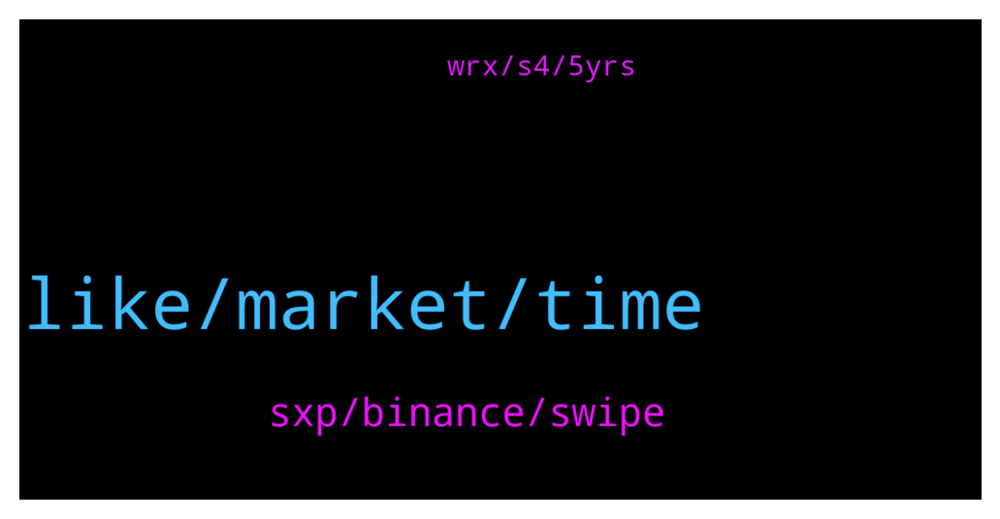

# **@shitpool**
 ## Analysis for **2021-12-29** - **2021-12-30**.

---

## 📊 **Basic Stats**

**n_messages_sent**: 203

---

---

## 🔝 **Top keywords and related messages**

1. **like, market, time**

    @Horselorde --- *No. When EOS finally pumps, that is when it’s over.* **--->** [TG Discussion](https://t.me/shitpool/712335)

    @NotTheGodfather --- *Never in my life seen a project with such good fundamentals and solid backing, trip over themselves this badly* **--->** [TG Discussion](https://t.me/shitpool/712676)

    @pizza_dog --- *What’s happening on Jan 1 lol* **--->** [TG Discussion](https://t.me/shitpool/712440)

    @gonubie --- *oh jeez, forgot about cannon, what a shit show that was, the first IWO* **--->** [TG Discussion](https://t.me/shitpool/712694)

    @sumtemm --- *https://www.tradingview.com/x/ZwfMW8pk this is a nice goblin town experience* **--->** [TG Discussion](https://t.me/shitpool/712731)

    @pizza_dog --- *They don’t want to lower the apy and they think the dilution isn’t a problem right now. Which doesn’t seem right. At this market cap last month, it was like 8k, now it’s barely holding on to 3.5* **--->** [TG Discussion](https://t.me/shitpool/712548)

2. **sxp, binance, swipe**

    @EmotionLotion --- *are you still bagholding sxp? did you seriously not learn this whole cycle?* **--->** [TG Discussion](https://t.me/shitpool/712806)

    @kekurikekukaka --- *Today is a very important day for the SXP community. I want to let you know that Binance will now fully acquire Swipe and I am resigning from my capacity as Swipe CEO, Director and Chairman of the Board as well as Head of Binance Card.   I will stay on until a full transition is done and there will no effect on the current products being offered by Swipe and Binance Card in any capacity.* **--->** [TG Discussion](https://t.me/shitpool/712795)

    @gonubie --- *ye I wasnt prepared to go for it, was already too far down on sxp.* **--->** [TG Discussion](https://t.me/shitpool/712699)

    @gonubie --- *lots of ppl mentioned sxp in the past* **--->** [TG Discussion](https://t.me/shitpool/712658)

    @OxZilla --- *Where would you put sxp lmao* **--->** [TG Discussion](https://t.me/shitpool/712662)

    @wojackdegreate --- *Sxp only use case is extracting value from investors* **--->** [TG Discussion](https://t.me/shitpool/712672)

3. **wrx, s4, 5yrs**

    @wanker007 --- *2015 with minor mods. Quite enjoyable in the winter too now ;).  Also have Michelin super sport for summer on rims.* **--->** [TG Discussion](https://t.me/shitpool/712451)

    @goldencatpat --- *this is the only wrx that exists in my mind* **--->** [TG Discussion](https://t.me/shitpool/712437)

    @wanker007 --- *I had an sti for 1.5yrs but sold it. Love the Subies but couldn't love it* **--->** [TG Discussion](https://t.me/shitpool/712430)

    @Horselorde --- *I had a wrx but traded it a while back for a 2019 Camry. Excellent change* **--->** [TG Discussion](https://t.me/shitpool/712435)

    @wanker007 --- *S4 now and it is great* **--->** [TG Discussion](https://t.me/shitpool/712423)

    @wanker007 --- *Had an s2k for 5yrs, loved it* **--->** [TG Discussion](https://t.me/shitpool/712421)

