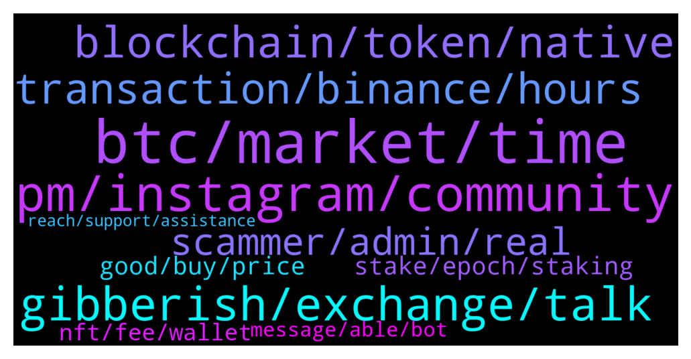

# **@solana**
 ## Analysis for **2021-12-29** - **2021-12-30**.

---

## 📊 **Basic Stats**

**n_messages_sent**: 393

---

---

## 🔝 **Top keywords and related messages**

1. **btc, market, time**

    @Dorothy --- *Why do so many people lose money in cryptocurrency and so many people come in?* **--->** [TG Discussion](https://t.me/solana/883318)

    @Nuskymeda --- *Many people make money in cryptocurrency too* **--->** [TG Discussion](https://t.me/solana/883485)

    @lameboredghiniii --- *I think china has already banned crypto and it's mining. I've heard in some videos 🤔* **--->** [TG Discussion](https://t.me/solana/883195)

    @Pawan --- *I know some of the fake breakouts like the news of China banning crypto. It has been running since the beginning of this year* **--->** [TG Discussion](https://t.me/solana/883193)

    @aneesa_t --- *I understand maybe you don't like BTC but you still have to acknowledge the strength it has given this crypto space moreover when it is doing well, others follow* **--->** [TG Discussion](https://t.me/solana/882475)

    @Farewell --- *The currency market continues to decline. From the current market situation, it is not suitable for spot trading. It is recommended that you choose to hold. BTC will continue to decline. Market hedging is a good choice now. Even if it is not profitable, it will not lose money.* **--->** [TG Discussion](https://t.me/solana/884203)

2. **pm, instagram, community**

    @cryptolover1987 --- *Hello How can I help you ?* **--->** [TG Discussion](https://t.me/solana/884116)

    @mahib45 --- *Hello 👋  How may we help you?* **--->** [TG Discussion](https://t.me/solana/882629)

    @mahib45 --- *Hello 👋  How may we help you ?* **--->** [TG Discussion](https://t.me/solana/883992)

    @likewinni --- *Does DeFi have a good friend who can teach me?* **--->** [TG Discussion](https://t.me/solana/883864)

    @Pawan --- *But I am really amazed to see one ardent follower like you.. Glad indeed* **--->** [TG Discussion](https://t.me/solana/883188)

    @zet07 --- *I wanted to catch the old fishy guys that Rob people, just typed "help" and they are like fish in water, too many of them from nowhere* **--->** [TG Discussion](https://t.me/solana/884069)

3. **gibberish, exchange, talk**

    @w1onebit --- *Morethan like older you... people always skip words come with something SOLid, we spot gibberish* **--->** [TG Discussion](https://t.me/solana/883183)

    @w1onebit --- *You see gibberish because you are absolutely clueless and not capable of having discussion... I actually don't even know why you are take yourself self to one of those crypto groups where they endlessly talk trash about everything. . You must have lost a money so you're pissed right.. when sol goes up you feel better... its normal to have mood swing because of charts 🤣🤣🤣* **--->** [TG Discussion](https://t.me/solana/883161)

    @w1onebit --- *Yh this is what you call data that makes a token go up or down .. Like really... tbh that is what is call pure gibberish* **--->** [TG Discussion](https://t.me/solana/883175)

    @Rhubear --- *Lol he retired at age 25. He's been retired 20 years & multi millionaire. He understands everything in life far more than most people do.* **--->** [TG Discussion](https://t.me/solana/884418)

    @Pawan --- *Hey dude... chill.. how old are you?* **--->** [TG Discussion](https://t.me/solana/883179)

    @ибр 🍗💤 --- *rh should learn how money works. otherway he misguides people* **--->** [TG Discussion](https://t.me/solana/884368)

4. **blockchain, token, native**

    @LuchoTopSky --- *Hello, I need to create a token on the Solana network. Also I need to create several smart contracts. If anyone has the knowledge to do the job, please write to me. Thank you.* **--->** [TG Discussion](https://t.me/solana/883747)

    @cryptolover1987 --- *https://solana.com/ecosystem/starlaunch  Yet to be verified on Solana ecosystem* **--->** [TG Discussion](https://t.me/solana/883409)

    @muccurly --- *Hey guys, if you need to your project Blockchain/ web3.js developer on Solana. RN I’m open to new project* **--->** [TG Discussion](https://t.me/solana/883351)

    @mahib45 --- *Hello 👋  Any Projects can build on Solana but Solana doesn't offer any endorsement or investment advice.  Do your own research! Thanks for the understanding ❤* **--->** [TG Discussion](https://t.me/solana/883611)

    @William --- *I am looking for a Mr. Volodymyr Boian - I understand that you are a Solana and Blockchain developer - I need your help - Can you please kindly reply me - Thank You Sir -* **--->** [TG Discussion](https://t.me/solana/882685)

    @wva12345 --- *can you tell me where i can find the roadmap of solana ?* **--->** [TG Discussion](https://t.me/solana/882520)

5. **transaction, binance, hours**

    @GGiridhar --- *Even my txn of SOL from Binance seems frozen. Got the txn id but still processing since 9 hours* **--->** [TG Discussion](https://t.me/solana/883906)

    @Miimghaaf --- *Hi, i had a solana withdrawal from kucoin to trust wallet last night but steel didn't receive in my wallet, I checked  solscan, there's no match found with my txhash but kucoin show successfully transferred  Please help me* **--->** [TG Discussion](https://t.me/solana/884138)

    @Rx_Sulab --- *Pls how long does it take solana to arrive from binance. I made withdrawal over 2hrs now it has not arrived.* **--->** [TG Discussion](https://t.me/solana/883441)

    @ks094 --- *Hello.  Yesterday I was withdrawing usdc from binance to phantom and the transaction was frozen* **--->** [TG Discussion](https://t.me/solana/883895)

    @ks094 --- *and that transaction is still hangingthis is a new deal just* **--->** [TG Discussion](https://t.me/solana/883924)

    @mojitocrush --- *hi i did a withdrawal from my exchange to my phantom wallet. the transaction says complete on my exchange but i dont see the transaction in solscan and its been 5hours. is this normal? the address is correct.* **--->** [TG Discussion](https://t.me/solana/883805)

6. **scammer, admin, real**

    @mahib45 --- *Scammer always try to pretend as admin! Always remember that real admin won't PM first!* **--->** [TG Discussion](https://t.me/solana/882514)

    @lalelilulos --- *Can I be the lucky one who sends you money? Pwease* **--->** [TG Discussion](https://t.me/solana/883764)

    @Hibebee --- *They are all scammer.pls to be care full.* **--->** [TG Discussion](https://t.me/solana/882863)

    @Emicabj --- *Be careful there are many scammers in this group, I already discovered two* **--->** [TG Discussion](https://t.me/solana/884381)

    @Chavex77 --- *@Real_Master_Yoda scammer take care spamming people* **--->** [TG Discussion](https://t.me/solana/884282)

    @mahib45 --- *We are always banning scammers! Read the warning message! Just block anyone who PM first!* **--->** [TG Discussion](https://t.me/solana/882521)

7. **stake, epoch, staking**

    @cryptolover1987 --- *Yes it’s normal process!  Stake/Unstake takes several epoch to warm up or to cool down (aprox. 2-3 days). You can read more about it here:  🔗https://docs.solana.com/staking/stake-accounts  You can use the   🔗 https://solanabeach.io/ explorer for monitoring the Epoch* **--->** [TG Discussion](https://t.me/solana/882845)

    @RealPrinceOla --- *Stake/Unstake takes several epoch to warm up or to cool down (aprox. 2-3 days). You can read more about it here:  🔗https://docs.solana.com/staking/stake-accounts  You can use the   🔗 https://solanabeach.io/ explorer for monitoring the Epoch* **--->** [TG Discussion](https://t.me/solana/882734)

    @Andre --- *SOL staked but I see no increase in staked amount fir a few weeks. Is this normal?* **--->** [TG Discussion](https://t.me/solana/882717)

    @cryptolover1987 --- *On which platform do you staking ?* **--->** [TG Discussion](https://t.me/solana/884127)

    @cryptolover1987 --- *Stake/Unstake takes several epoch to warm up or to cool down (aprox. 2-3 days). You can read more about it here:  🔗https://docs.solana.com/staking/stake-accounts  You can use the   🔗 https://solanabeach.io/ explorer for monitoring the Epoch* **--->** [TG Discussion](https://t.me/solana/884130)

    @aminpm --- *Which validator is good for staking?* **--->** [TG Discussion](https://t.me/solana/882874)

8. **good, buy, price**

    @AR101001 --- *Should I sell my 23 bitcoins now ?* **--->** [TG Discussion](https://t.me/solana/882692)

    @crypto_adik --- *is it good to buy now?* **--->** [TG Discussion](https://t.me/solana/883039)

    @lauretta122 --- *Becareful as the market will dip more further and only buy the dip at different support will might see sol at $160 again* **--->** [TG Discussion](https://t.me/solana/883521)

    @Yurmalei --- *Yes, going to 80 in Feb* **--->** [TG Discussion](https://t.me/solana/883384)

    @w1onebit --- *brb hope to catch you on here again. . Generally I think we should be good with Sol, I deal more in £ than $ when I see below £120 that's when I start to worry... I entered in much earlier... but its 120 is my area of concern* **--->** [TG Discussion](https://t.me/solana/883208)

    @daniela2i --- *Yea we are in 50ema and from 4 hour trade we have retraced and holding to support buying now is a good entry* **--->** [TG Discussion](https://t.me/solana/883044)

9. **nft, fee, wallet**

    @mranoncoder --- *Which wallet to you use ? you don't need to pay fee for creating wallet. You can just send few Solana to you new wallet, than you can send your NFT to the new wallet.* **--->** [TG Discussion](https://t.me/solana/882631)

    @mranoncoder --- *When you want to move the NFT you pay the gas fee than you can move the SOLANA which you have in your wallet!* **--->** [TG Discussion](https://t.me/solana/882626)

    @Born_To_Jet --- *What about the 0.0235sol fee I have paid for account creation for the token?* **--->** [TG Discussion](https://t.me/solana/882627)

    @Born_To_Jet --- *Hi Guys, If I move NFT to a different wallet does the 0.0235 sol account creation fee gets moved there?* **--->** [TG Discussion](https://t.me/solana/882616)

    @Folaross --- *Hey, most of Solana wallet charges very minimal fees like 0.000005 SOL per transaction.* **--->** [TG Discussion](https://t.me/solana/883836)

    @Tulpar_Ot --- *i just opened my Phantom and i see there is solana NFT, it say official NFT 1500, is it real ?* **--->** [TG Discussion](https://t.me/solana/883594)

10. **message, able, bot**

    @cryptolover1987 --- *Bot deleted your message. Because you included link in you message.  You should ask to catodex support team* **--->** [TG Discussion](https://t.me/solana/883108)

    @Ayush912002 --- *Why my message got deleted. It took me too long to type😔* **--->** [TG Discussion](https://t.me/solana/883104)

    @cryptolover1987 --- *You can join our discord channel. Our dev support will be able to help you technical things!   👉 https://solana.com/discord  ✅Click on #role and select the emoji "Community " 👨‍🌾 on Carl -bot. And then go back to the general section again.  Then you will able to send message!* **--->** [TG Discussion](https://t.me/solana/884012)

    @RealPrinceOla --- *You can join our discord channel. Our dev support will be able to help you technical things!   👉 https://solana.com/discord  ✅Click on #role and select the emoji "Community " 👨‍🌾 on Carl -bot. And then go back to the general section again.  Then you will able to send message!* **--->** [TG Discussion](https://t.me/solana/882689)

    @Ayush912002 --- *I didnt included any link. Maybe any full stop was placed in between my message and it was sent like a  link😂* **--->** [TG Discussion](https://t.me/solana/883110)

    @HaseyQuads --- *Check my twitter for the link* **--->** [TG Discussion](https://t.me/solana/882678)

