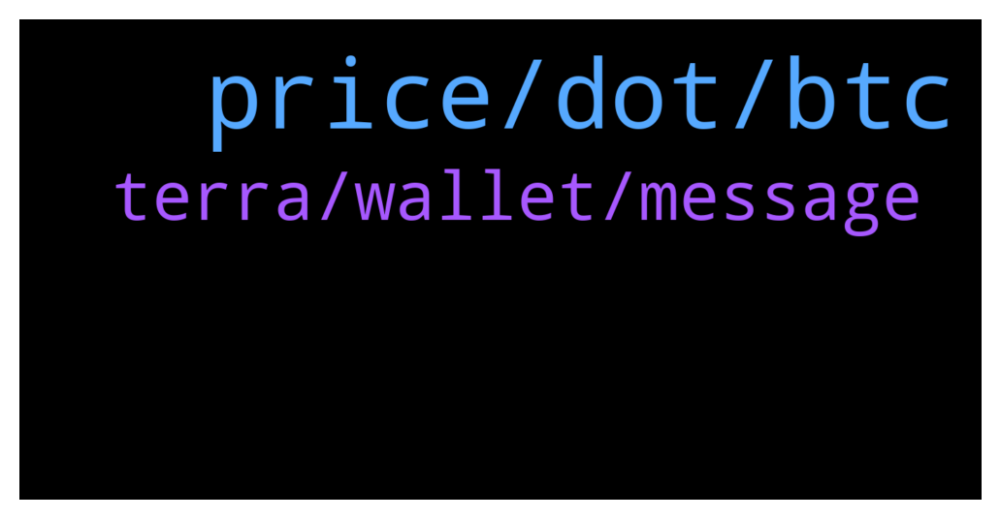

# **@terralunachat_officially**
 ## Analysis for **2021-12-29** - **2021-12-30**.

---

## 📊 **Basic Stats**

**n_messages_sent**: 48

---

---

## 🔝 **Top keywords and related messages**

1. **price, dot, btc**

    @Na5201 --- *Many crypto novices have suffered losses, they only know how to follow suit, passively wait for the rise or fall, causing losses* **--->** [TG Discussion](https://t.me/terralunachat_officially/22316)

    @Randy --- *Luna is one currency that does not follow the flow of other currency. Like on the 20th or 21st Luna was rising while BTC and others were bearish* **--->** [TG Discussion](https://t.me/terralunachat_officially/22250)

    @hiddenanimal --- *Hello guys... do you think is a good move sell dot and buy luna now?* **--->** [TG Discussion](https://t.me/terralunachat_officially/22235)

    @Diego --- *If market of ust go up, price of luna will follow up too, right?* **--->** [TG Discussion](https://t.me/terralunachat_officially/22249)

    @Diego --- *But recent day, it went up and down, nearly like BTC. Will you think it will take over BNB, and get to rank 3 in next couple years* **--->** [TG Discussion](https://t.me/terralunachat_officially/22251)

    @Zelgiust --- *Loss are inevitable. Just have to learn to hold and have faith in your strategy. My Luna grid bot turned green at the first candle. Never sell red on a deep dip if you didn't set SL before.* **--->** [TG Discussion](https://t.me/terralunachat_officially/22319)

2. **terra, wallet, message**

    @Robert --- *Hi in my Terra station when I try to claim my rewards I get a message saying wallet is not defined any ideas how I can resolve this?* **--->** [TG Discussion](https://t.me/terralunachat_officially/22204)

    @xaviercib --- *how do i validate my wallet?* **--->** [TG Discussion](https://t.me/terralunachat_officially/22215)

    @Kevin --- *All good, i just worked it out and now working. You need to disconnect your wallet and reconnect (at least thats what I did and have been able to undelegate).* **--->** [TG Discussion](https://t.me/terralunachat_officially/22278)

    @Kevin --- *Got the same problem and couldn't sell. Hopefully it's a good thing! ☺️* **--->** [TG Discussion](https://t.me/terralunachat_officially/22193)

    @Kevin --- *Hey Robert, I have teh same problem > did you get a response or an answer?* **--->** [TG Discussion](https://t.me/terralunachat_officially/22275)

    @Kevin --- *Hi, I have an problem with my luna wallet in terra - is there an email address at Terra to get support?* **--->** [TG Discussion](https://t.me/terralunachat_officially/22274)

