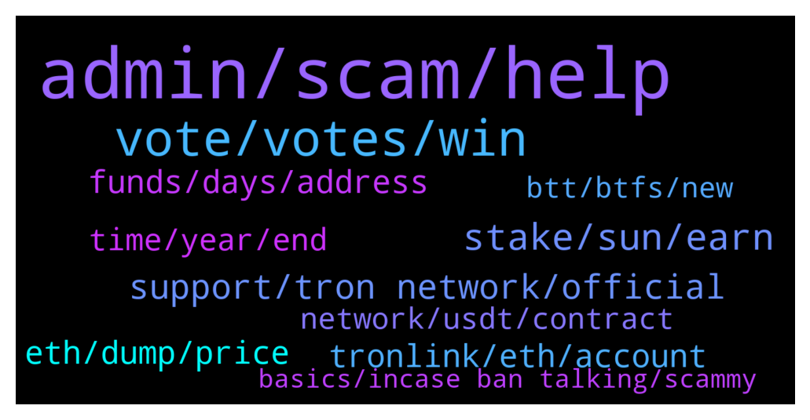

# **@tronnetworkEN**
 ## Analysis for **2021-12-29** - **2021-12-30**.

---

## 📊 **Basic Stats**

**n_messages_sent**: 369

---

---

## 🔝 **Top keywords and related messages**

1. **admin, scam, help**

    @investor_pword --- *A lot of people keep texting me and claiming admin of this group* **--->** [TG Discussion](https://t.me/tronnetworkEN/3796512)

    @xPommepote --- *Bro, make some effort for yourself.  https://www.tronlink.org* **--->** [TG Discussion](https://t.me/tronnetworkEN/3796053)

    @rosalie_jame --- *Why are my messages being deleted* **--->** [TG Discussion](https://t.me/tronnetworkEN/3798943)

    @KingsDove_TRX --- *If you are getting a DM from a bit it is a scam!!* **--->** [TG Discussion](https://t.me/tronnetworkEN/3797942)

    @Ossy355 --- *I can't login, someone(admin) please help* **--->** [TG Discussion](https://t.me/tronnetworkEN/3797363)

    @Ossy355 --- *I can't login my mining engine,* **--->** [TG Discussion](https://t.me/tronnetworkEN/3797385)

2. **vote, votes, win**

    @SchooleyD --- *Voted number 42. Said there are 47 hours left so I guess one more vote then done* **--->** [TG Discussion](https://t.me/tronnetworkEN/3797549)

    @Patrick --- *Yeah but we shouldn’t rest and keep voting. ADA has some huge influencers behind it that can easy generate thousands of votes within minutes* **--->** [TG Discussion](https://t.me/tronnetworkEN/3795932)

    @Jyotiprakash --- *A warm remender please vote guys* **--->** [TG Discussion](https://t.me/tronnetworkEN/3799263)

    @xPommepote --- *🧐 for each TRX you stake you get 1 vote. And then you choose a SR and vote for him.* **--->** [TG Discussion](https://t.me/tronnetworkEN/3796171)

    @Jyotiprakash --- *Please vote guys show our community power please ☺️* **--->** [TG Discussion](https://t.me/tronnetworkEN/3797160)

    @Jyotiprakash --- *If we all vote atleast 1 today we will definitely win show the power* **--->** [TG Discussion](https://t.me/tronnetworkEN/3797163)

3. **stake, sun, earn**

    @simon866 --- *Choose one of these legit ways to earn rewards:  1 - FREEZE AND VOTE  https://tron7010.zendesk.com/hc/en-us/articles/360043589352-How-to-Vote-and-Gain-Reward  2 - EARN ADDING LIQUIDITY POOLS   SUNSwap.com  3 - STAKE LP TOKENS  SUNSwap.com/mining  4 - SUN MINING      a) Stake SUNSwap LP tokens         (SUN/TRX)          SUN.io/#/stake         b) Deposit & Stake 3pool tokens         (USDT/USDJ/TUSD)          SUN.io/#/3pool/deposit         SUN.io/#/stake     c) Deposit & Stake USDC pool         tokens         SUN.io/#/usdc/deposit         SUN.io/#/stake  5 - LOCK SUN AND EARN TUSD & veSUN  SUN.io/#/stake  6 - EARN SUPPLYING IN JUSTLEND  JustLend.org  JustLend.org/#/market  7 - STAKE jTokens FROM JUSTLEND   JustLend.org/#/miningPool   You have a lot of ways to earn with TRON and protect your investments.  Pay attention to /GAS requirements (network fees).   Using https://Tronlink.org wallet you can see the network fees before confirm the transaction. Try it.* **--->** [TG Discussion](https://t.me/tronnetworkEN/3796035)

    @agentpiki --- *Choose one of these legit ways to earn rewards:  1 - FREEZE AND VOTE  https://tron7010.zendesk.com/hc/en-us/articles/360043589352-How-to-Vote-and-Gain-Reward  2 - EARN ADDING LIQUIDITY POOLS   SUNSwap.com  3 - STAKE LP TOKENS  SUNSwap.com/mining  4 - SUN MINING      a) Stake SUNSwap LP tokens         (SUN/TRX)          SUN.io/#/stake         b) Deposit & Stake 3pool tokens         (USDT/USDJ/TUSD)          SUN.io/#/3pool/deposit         SUN.io/#/stake     c) Deposit & Stake USDC pool         tokens         SUN.io/#/usdc/deposit         SUN.io/#/stake  5 - LOCK SUN AND EARN TUSD & veSUN  SUN.io/#/stake  6 - EARN SUPPLYING IN JUSTLEND  JustLend.org  JustLend.org/#/market  7 - STAKE jTokens FROM JUSTLEND   JustLend.org/#/miningPool   You have a lot of ways to earn with TRON and protect your investments.  Pay attention to /GAS requirements (network fees).   Using https://Tronlink.org wallet you can see the network fees before confirm the transaction. Try it.* **--->** [TG Discussion](https://t.me/tronnetworkEN/3799594)

    @Ny_Ando --- *Hey guys, how to stake tron on trustwallet for energy?* **--->** [TG Discussion](https://t.me/tronnetworkEN/3798127)

    @Winklancer11 --- *Download tronlink pro.  Buy Trx from exchanges. Transfer the  Trx to your tronlinkpro.  Stake the Trx for energy after that vote for Sr's* **--->** [TG Discussion](https://t.me/tronnetworkEN/3796045)

    @xPommepote --- *Buy TRX on exchanges and stake to earn* **--->** [TG Discussion](https://t.me/tronnetworkEN/3799560)

    @alisaghi94 --- *hold and stake not too need pump* **--->** [TG Discussion](https://t.me/tronnetworkEN/3796184)

4. **support, tron network, official**

    @rwothomiobrian --- *Please note that TRON ANGEL is a scam* **--->** [TG Discussion](https://t.me/tronnetworkEN/3798948)

    @David --- *Is this page affiliated with tron ac were you can mine and receive tron?* **--->** [TG Discussion](https://t.me/tronnetworkEN/3797945)

    @PUGINU1 --- *I know but can't support tron community tron community need support @Justinsun1990  @PiterSpain  all community* **--->** [TG Discussion](https://t.me/tronnetworkEN/3797679)

    @Carlos_TRX --- *https://tronwiki.com <—— check here to know more about TRON ecosystem* **--->** [TG Discussion](https://t.me/tronnetworkEN/3798085)

    @xPommepote --- *Please stay focus on trx and tron ecosystem.* **--->** [TG Discussion](https://t.me/tronnetworkEN/3799503)

    @wikpar --- *Imagine if people realize Tron Network use on entire country 😎🤑* **--->** [TG Discussion](https://t.me/tronnetworkEN/3798592)

5. **funds, days, address**

    @Lionel2233 --- *Hi! as far as search shows, sending funds by mistake to TR7NHqjeKQxGTCi8q8ZY4pL8otSzgjLj6t will loose them, right? Or something can be done here?* **--->** [TG Discussion](https://t.me/tronnetworkEN/3797145)

    @Fabs_trx --- *I guess your withdrawal are limited* **--->** [TG Discussion](https://t.me/tronnetworkEN/3799250)

    @NAZIFI --- *I withdraw TRX form bundle to Okx withing three weeks never inter my account* **--->** [TG Discussion](https://t.me/tronnetworkEN/3797432)

    @xPommepote --- *Next time, ask before depositing your money* **--->** [TG Discussion](https://t.me/tronnetworkEN/3799251)

    @PiterSpain --- *Trontrade.io is a reputable decentralized exchange. If ur wallet was emptied is probably for another reason* **--->** [TG Discussion](https://t.me/tronnetworkEN/3798738)

    @Said_To --- *Do not trade here ... your wallet will be empty* **--->** [TG Discussion](https://t.me/tronnetworkEN/3798578)

6. **eth, dump, price**

    @thebigguns --- *Anybody else seen the top post on Reddit fudding Justin Sun and Tron? Basically it says JS has been dumping 165,000 ETH through Binance. What are your guys thoughts about this? In my opinion, the on-chain data doesn’t really prove anything.* **--->** [TG Discussion](https://t.me/tronnetworkEN/3799066)

    @thebigguns --- *They are saying that he is dumping it from the money he made from TRX investors* **--->** [TG Discussion](https://t.me/tronnetworkEN/3799072)

    @simon866 --- *Who cares, he should dump ETH, they always FUD us so they would deserve it 🤷‍♂️* **--->** [TG Discussion](https://t.me/tronnetworkEN/3799069)

    @simon866 --- *That would not make sense as its ETH, if he buys back TRX then what would they say?* **--->** [TG Discussion](https://t.me/tronnetworkEN/3799073)

    @gi2237 --- *I don't want to lose trx sir* **--->** [TG Discussion](https://t.me/tronnetworkEN/3796060)

    @Vishal --- *Trx was down at this time* **--->** [TG Discussion](https://t.me/tronnetworkEN/3796080)

7. **tronlink, eth, account**

    @Tory --- *So I have this very old eth wallet with tron in it. But I have no eth in account. I can’t send eth to account and can’t send tron with out eth. Any suggestions* **--->** [TG Discussion](https://t.me/tronnetworkEN/3797006)

    @gi2237 --- *It's seeprapa okay  Is tronlink a wallet* **--->** [TG Discussion](https://t.me/tronnetworkEN/3796077)

    @Tory --- *So I just got the memo to get tron out of old my eth wallet. Is my tron gone?* **--->** [TG Discussion](https://t.me/tronnetworkEN/3796342)

    @PiterSpain --- *You can't Import your trustwallet account in Tronlink.org app. Trustwallet is almost useless for TRON Ecosystem* **--->** [TG Discussion](https://t.me/tronnetworkEN/3798128)

    @Winklancer11 --- *Atleast try to search tronlink pro on Playstore. Man!* **--->** [TG Discussion](https://t.me/tronnetworkEN/3796055)

    @PiterSpain --- *TRON/TRX is not compatible with Metamask so don't buy if you see something there. Probably you saw a wrapped version or a fake version. Buy TRX on TRON. Tronlink.org wallet is advised to manage your account* **--->** [TG Discussion](https://t.me/tronnetworkEN/3798977)

8. **time, year, end**

    @TERRIFICZ --- *Dang.... Why ppl soo mad on high returns 🤔* **--->** [TG Discussion](https://t.me/tronnetworkEN/3796245)

    @xPommepote --- *This promotion is over for months now* **--->** [TG Discussion](https://t.me/tronnetworkEN/3796175)

    @NigelSamhain --- *Thank You. Whenever something seems too good to be true...It usually is* **--->** [TG Discussion](https://t.me/tronnetworkEN/3798240)

    @Kellyx17 --- *The dip has not yet end* **--->** [TG Discussion](https://t.me/tronnetworkEN/3797667)

    @promarketercarlos --- *This time next year will be happy.... just trade the lows and the highs.* **--->** [TG Discussion](https://t.me/tronnetworkEN/3797600)

    @NawedAnjumkhan007 --- *Btc is freely falling..Its time to cry again. I hate this again and again* **--->** [TG Discussion](https://t.me/tronnetworkEN/3797585)

9. **network, usdt, contract**

    @ar --- *How do I do that? transfer trx to my wallet?* **--->** [TG Discussion](https://t.me/tronnetworkEN/3797991)

    @MilNoslen --- *You need the native coin for the transaction fee, or "gas"* **--->** [TG Discussion](https://t.me/tronnetworkEN/3796357)

    @SilvaNeiii --- *I need the TRX contract number to add to the trust. Can someone send me ??* **--->** [TG Discussion](https://t.me/tronnetworkEN/3799405)

    @! --- *Send details of adding Thron transmission network* **--->** [TG Discussion](https://t.me/tronnetworkEN/3798009)

    @xPommepote --- *It’s USDT smart contract, you can try to contact tether.io* **--->** [TG Discussion](https://t.me/tronnetworkEN/3797255)

    @hm4t30x01 --- *My intention was transfer this USDT in TRX network to avoid traces from unwanted people, I guess that I will use Binance as bridge* **--->** [TG Discussion](https://t.me/tronnetworkEN/3796344)

10. **btt, btfs, new**

    @Pouyahamii --- *I need question from swap btt old to btt* **--->** [TG Discussion](https://t.me/tronnetworkEN/3796453)

    @Carlos_TRX --- *use sunswap.com v2 if you want to get the new BTT* **--->** [TG Discussion](https://t.me/tronnetworkEN/3796135)

    @Sarge --- *Sounds pretty disorganized, you cant even trade new BTT easily after you carried out denomination, will have to wait till each wallet/ exchanges migrate or update their systems* **--->** [TG Discussion](https://t.me/tronnetworkEN/3796581)

    @Sarge --- *Anybody know when pricing information going to be added to the new BTT token for all exchanges and wallets after redomination?* **--->** [TG Discussion](https://t.me/tronnetworkEN/3796575)

    @Winklancer11 --- *Anyone has knowledge about BTTswap finance* **--->** [TG Discussion](https://t.me/tronnetworkEN/3799418)

    @NigelSamhain --- *Thanks all. Any advice on my original BTFS Node question?* **--->** [TG Discussion](https://t.me/tronnetworkEN/3796927)

