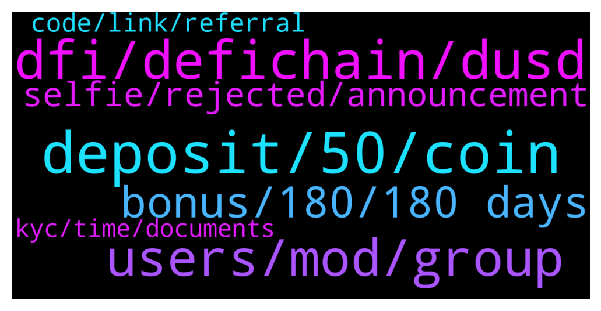

# **@CakeDeFi_EN**
 ## Analysis for **2021-12-30** - **2021-12-31**.

---

## 📊 **Basic Stats**

**n_messages_sent**: 130

---

---

## 🔝 **Top keywords and related messages**

1. **deposit, 50, coin**

    @Babas --- *then can i make $70 withdrawal after $50 deposit* **--->** [TG Discussion](https://t.me/CakeDeFi_EN/158614)

    @dmytro_gera --- *Hello. I have a problem with withdrawing money. Any admin here who can help me?* **--->** [TG Discussion](https://t.me/CakeDeFi_EN/158601)

    @Rogue --- *But in which coin i will choose to deposit* **--->** [TG Discussion](https://t.me/CakeDeFi_EN/158309)

    @Michael_Schredl --- *Finish your KYC process and deposit at least 50$* **--->** [TG Discussion](https://t.me/CakeDeFi_EN/158613)

    @Spi --- *What's the loan process? Does it get cheaper than bying it on the dex?* **--->** [TG Discussion](https://t.me/CakeDeFi_EN/158400)

    @Joanne --- *Invest in projects that are not cryptocurrencies, you will find even more pleasant surprises* **--->** [TG Discussion](https://t.me/CakeDeFi_EN/158589)

2. **dfi, defichain, dusd**

    @Kassius84 --- *You need to withdraw your DFI via Ethereum Network as ERC20 Token. You need to define the DFI AS Custom token in your MM. Here you will find the needed contract adress and some further informations. But be aware of the high Ethereum gas fees 👍  https://blog.cakedefi.com/another-sweet-transfer-option-erc-20-version-of-the-dfi-coin/* **--->** [TG Discussion](https://t.me/CakeDeFi_EN/158544)

    @frnklfrt --- *DeFiChain DEX offers dBTC-DFI at 78.46% APR while Cake DeFi offers BTC-DFI at 67.97% APR, I'm assuming there's more hoops to jump through to get dBTC paried with DFI for the higher rate as opposed to BTC-DFI, hence the higher APR?* **--->** [TG Discussion](https://t.me/CakeDeFi_EN/158460)

    @Mats_1992 --- *Can i swap DFI to BTC?* **--->** [TG Discussion](https://t.me/CakeDeFi_EN/158437)

    @jiayingo --- *hello, does anyone know the most optimal way of transferring fiat SGD to cakedefi? if i unds correctly, needs to be crypto only, so how would i convert SGD to DFI? or should i be using something like dbs multiplier to convert SGD to USD then deposit USD?* **--->** [TG Discussion](https://t.me/CakeDeFi_EN/158560)

    @Aaron0791 --- *Hey guys quick question. If I freeze my dfi holdings for 10 years do I actually get twice the rewards or does cakedefi only removes any staking fees?* **--->** [TG Discussion](https://t.me/CakeDeFi_EN/158413)

    @frank0308 --- *question regarding cake. Are withdrawal fees the same, even if we are withdrawing via DFI network?* **--->** [TG Discussion](https://t.me/CakeDeFi_EN/158425)

3. **users, mod, group**

    @James --- *I cant... it is telling me that the group doesn't exist so I'm assuming I got banned or an unknown reason or mistake* **--->** [TG Discussion](https://t.me/CakeDeFi_EN/158280)

    @DmgBautista --- *Be carefull, asking such questions here will get you flooded by scammers DM you. Do not answer to any DM or call, even if it looks a mod. No mod will ever DM you and is also against the rule to any other user to DM you. Refer your communications only to this official chat and take care!* **--->** [TG Discussion](https://t.me/CakeDeFi_EN/158620)

    @Michael_Schredl --- *Works for me - Please try another browser or another device* **--->** [TG Discussion](https://t.me/CakeDeFi_EN/158594)

    @yellowjellow88 --- *I’ve experienced it once. It’s so scary! I find it weird to have so many mod coming to my rescue. Lol* **--->** [TG Discussion](https://t.me/CakeDeFi_EN/158631)

    @James --- *Anyone know why I can't get get in the defichain telegram?* **--->** [TG Discussion](https://t.me/CakeDeFi_EN/158271)

    @super33max --- *Just block anyone you text you for no reason* **--->** [TG Discussion](https://t.me/CakeDeFi_EN/158187)

4. **bonus, 180, 180 days**

    @burakkd27 --- *I have 22 testimonials but does anyone know why I didn't get any bonuses* **--->** [TG Discussion](https://t.me/CakeDeFi_EN/158193)

    @burakkd27 --- *What exactly are the terms of receiving the referral bonus?* **--->** [TG Discussion](https://t.me/CakeDeFi_EN/158199)

    @Rogue --- *How can i get my bonus* **--->** [TG Discussion](https://t.me/CakeDeFi_EN/158307)

    @Michael_Schredl --- *Do you mean the sign up bonus?* **--->** [TG Discussion](https://t.me/CakeDeFi_EN/158610)

    @Rogue --- *You also got your bonus ?  can i trust in this app.* **--->** [TG Discussion](https://t.me/CakeDeFi_EN/158314)

    @DmgBautista --- *If any of your referrals meet the criteria to enable you to have bonuses, they cant be paid.* **--->** [TG Discussion](https://t.me/CakeDeFi_EN/158197)

5. **selfie, rejected, announcement**

    @ABIOLA SYLVESTER --- *Thank you but I am always asked a question which does not seems to not have a right answer but I appreciate this* **--->** [TG Discussion](https://t.me/CakeDeFi_EN/158555)

    @Nhlaka311 --- *My verification selfie is getting rejected please help* **--->** [TG Discussion](https://t.me/CakeDeFi_EN/158528)

    @Nhlaka311 --- *They accepted id only thong rejected is tye selfie .. I have been resubmitting non stop* **--->** [TG Discussion](https://t.me/CakeDeFi_EN/158530)

    @Kassius84 --- *You mean the "Safety checks"? Well I tried and it worked for me. Are you sure you answered the questions correctly?* **--->** [TG Discussion](https://t.me/CakeDeFi_EN/158556)

    @Kassius84 --- *The email from support should include a reason why your KYC request or the selfie was rejected. Did your selfie matched the discriped requirements? https://support.cakedefi.com/hc/en-us/articles/360038921292-What-documents-are-accepted-for-Proof-of-Identity-KYC-* **--->** [TG Discussion](https://t.me/CakeDeFi_EN/158529)

    @Kassius84 --- *Hey, you can have a look at this posting on reddit 👍  https://www.reddit.com/r/cakedefi/comments/mqwu9y/how_to_transfer_fiat_sgd_to_dfi_in_cakedefi/* **--->** [TG Discussion](https://t.me/CakeDeFi_EN/158571)

6. **code, link, referral**

    @frank0308 --- *great, thank you. Where can I find this info?* **--->** [TG Discussion](https://t.me/CakeDeFi_EN/158428)

    @mm_phoenix --- *in the app you only get the qr code. on the website you can generate a link for yourself* **--->** [TG Discussion](https://t.me/CakeDeFi_EN/158416)

    @AivernT --- *Hi guys is there a way to just copy and paste a referral link? All i can get from the app is copying my referral code* **--->** [TG Discussion](https://t.me/CakeDeFi_EN/158415)

    @mm_phoenix --- *click on https://app.cakedefi.com/referral -> "get QR code" than you see the link* **--->** [TG Discussion](https://t.me/CakeDeFi_EN/158420)

    @mm_phoenix --- *You mean refferals? On the Website you See the Status of your refferals* **--->** [TG Discussion](https://t.me/CakeDeFi_EN/158196)

    @predictablestupidities --- *i got there. but whats the full URL I share out with the referees?* **--->** [TG Discussion](https://t.me/CakeDeFi_EN/158436)

7. **kyc, time, documents**

    @Rogue --- *The how much time will it take ?* **--->** [TG Discussion](https://t.me/CakeDeFi_EN/158341)

    @zxcvz3 --- *12 network confirmations still missing :/* **--->** [TG Discussion](https://t.me/CakeDeFi_EN/158385)

    @IndraSagar2000 --- *It's been more than 24hrs but my kyc documents isn't verified yet* **--->** [TG Discussion](https://t.me/CakeDeFi_EN/158539)

    @sgabade --- *When was that, how many confirmation at the blockchain* **--->** [TG Discussion](https://t.me/CakeDeFi_EN/158375)

    @IndraSagar2000 --- *Thanks for help , how much time does it take for kyc Verification ,i submitted 5 hrs ago my kyc documents* **--->** [TG Discussion](https://t.me/CakeDeFi_EN/158363)

    @Thomas --- *You can check in the blockexplorer of Ltc, how fast the last blocks were created, so you have an estimated time* **--->** [TG Discussion](https://t.me/CakeDeFi_EN/158345)

