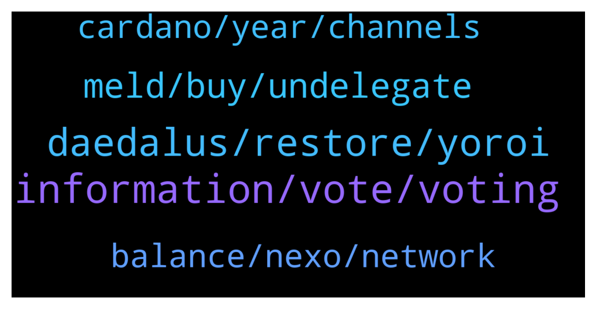

# **@Cardano**
 ## Analysis for **2021-12-30** - **2021-12-31**.

---

## 📊 **Basic Stats**

**n_messages_sent**: 122

---

---

## 🔝 **Top keywords and related messages**

1. **information, vote, voting**

    @RickMcCracken --- *Yes, here is the information at the IOHK Zendesk https://iohk.zendesk.com/hc/en-us/articles/360038581434-Verify-wallet-recovery-phrase* **--->** [TG Discussion](https://t.me/Cardano/763616)

    @apex_pool_spo --- *ok, so I see you don't trust my answers...  I already answered you. https://t.me/Cardano/763523  Rick can only confirm what I answered you.* **--->** [TG Discussion](https://t.me/Cardano/763601)

    @Sephire420 --- *@joseph_bohm (Joseph Böhm)  Thx for the quick support!* **--->** [TG Discussion](https://t.me/Cardano/764156)

    @glitch04 --- *what is your twitter id? I will forward the information* **--->** [TG Discussion](https://t.me/Cardano/764154)

    @dominatingSlash --- *@RickMcCracken just confirming you have done your due diligence on the dripdropz team? I haven't had a chance to yet* **--->** [TG Discussion](https://t.me/Cardano/763594)

    @Deji --- *Not gonna happen. They want your social media info and permissions. never.  It's a scam. They collect your email, then still don't let you vote unless you give more info. Don't bother.* **--->** [TG Discussion](https://t.me/Cardano/763891)

2. **daedalus, restore, yoroi**

    @RVarel --- *Hi George, nope its not like that I tried your method but its not restoring my wallet on yoroi* **--->** [TG Discussion](https://t.me/Cardano/763604)

    @RVarel --- *I just verified my recovery phrase and its correct inthat Daedalus wallet* **--->** [TG Discussion](https://t.me/Cardano/763623)

    @apex_pool_spo --- *if you are using the same recovery words and select the "restore" option, it will work.* **--->** [TG Discussion](https://t.me/Cardano/763605)

    @apex_pool_spo --- *if it down not work, you should create a new wallet and transfer all your funds to the new wallet.* **--->** [TG Discussion](https://t.me/Cardano/763625)

    @Zyroxa --- *Simply restore your wallet with your seed phrase.* **--->** [TG Discussion](https://t.me/Cardano/763584)

    @RVarel --- *I entered wallet name, then 24 letter seed phrase, then the new password but the the restore wallet button is still greyed out* **--->** [TG Discussion](https://t.me/Cardano/763606)

3. **meld, buy, undelegate**

    @apex_pool_spo --- *no, actually it will help you with the NFT from MELD. one step is to Delegate to a community pool, in order to evolve your NFT.* **--->** [TG Discussion](https://t.me/Cardano/763648)

    @Antho --- *Hey I buy my first Ada <3 I’m joining the fam* **--->** [TG Discussion](https://t.me/Cardano/763874)

    @apex_pool_spo --- *and if you have more than a few hundreds ADA, you should consider buying a hardware wallet.* **--->** [TG Discussion](https://t.me/Cardano/763628)

    @Antho --- *I want to buy Ada should I buy now or wait* **--->** [TG Discussion](https://t.me/Cardano/763637)

    @DU69SYP4 --- *First time IOTA >>> ADA. , nornal 1 ADA=2 IOTA* **--->** [TG Discussion](https://t.me/Cardano/763783)

    @... --- *i think i just shed a tear, how beautiful is the adax cex* **--->** [TG Discussion](https://t.me/Cardano/763867)

4. **cardano, year, channels**

    @thomas --- *[Forwarded from Cardano Announcements] Hey all! Want to help get more adoption and grow #Cardano? 👀  Please take a moment to vote and potentially get Ada added to bitpay app! ✨  Thanks for all the support! 💪  https://twitter.com/bitpay/status/1458977852230180868?s=21  Direct link to poll: https://gleam.io/1a0mE/bitpay-coin-poll (FYI: You can vote every day!😉)  Would you rather request a feature via the website and ask them for Cardano support? Please visit here and let your voices be heard: https://bitpay.canny.io/feature-request?sort=top* **--->** [TG Discussion](https://t.me/Cardano/763791)

    @Jose Leni --- *Hi guys. Any news when hydra is going live mainnet?* **--->** [TG Discussion](https://t.me/Cardano/764038)

    @Rabbitholepools --- *I welcome the suggestion and will make efforts to anonimise the guide. I feel like a couple of points need to be made though:  I have used this guide on a variety of channels since March and not a single delegation has resulted from it;  There are countless community tools around Cardano which not so subtly point to specific pools (eg brought to you by, etc). Most of these are great tools that make a better user experience of the whole. Some of them i personally consider essential, and i  am sure I don't need to name them. Such tools are not only frequently "advertised" on official channels, but also presented directly to the community by prominent figures in the space. I personally have no issue with that: some SPOs have gone to great lengths to help the community and should be allowed to get some credit for it. Officially or otherwise.* **--->** [TG Discussion](https://t.me/Cardano/764010)

    @glitch04 --- *While that is a nice guide this will be the one and only time we ask that you not use it as you advertise the pool within the guide* **--->** [TG Discussion](https://t.me/Cardano/764001)

    @georgelovegrove --- *Final video before the new year on Cardano Contributors League -https://www.youtube.com/watch?v=_wo8yXrX9oM  Discusses how funding contributors directly that have a simple objective to maximise impact could help core parts of the ecosystem like Project Catalyst thrive in 2022.  Have a great new year everyone 😄🎉* **--->** [TG Discussion](https://t.me/Cardano/764177)

    @jared1996z --- *I hope in 2022 cardano project grows exponentially and the ada coin takes top 3. An lovely project👀🎉🎉* **--->** [TG Discussion](https://t.me/Cardano/764230)

5. **balance, nexo, network**

    @Tustyrusty --- *I've spoken to IR about this. They have put a technical doc on Gov.uk I will either treat stake as income or interest on savings or a capital gain based on £0 purchase. I believe all are acceptable. I put exact what I've done in email to accountant. IR will not chastise you if you are genuinely trying to be legit. Worst case they will alter your return which could even be in your favour!* **--->** [TG Discussion](https://t.me/Cardano/763957)

    @glitch04 --- *They offer returns based on their own system not the networks native option. Is that a good platform? Sure for many that find it useful but they have different functions. Staking on the network is done with out releasing control of your wallet balance or having lock periods, where as with a platform like Nexo or Celsius you release custody of your assets to them in exchange for interest paid out while they loan your balance (assets) out.* **--->** [TG Discussion](https://t.me/Cardano/764079)

    @JudgeDJ --- *Anyone know how staking is taxed in the UK?  Is it from the point you click claim that you get charged income tax?* **--->** [TG Discussion](https://t.me/Cardano/763913)

    @Rabbitholepools --- *Ok, it might be worth pointing Antho to one such non-branded staking guide then. Could you please help with that?* **--->** [TG Discussion](https://t.me/Cardano/764015)

    @Snowden29 --- *Hallo, is Nexo trusted for staking ur cardano?* **--->** [TG Discussion](https://t.me/Cardano/764076)

    @RVarel --- *I have few thousands and wanted to sell few* **--->** [TG Discussion](https://t.me/Cardano/763645)

