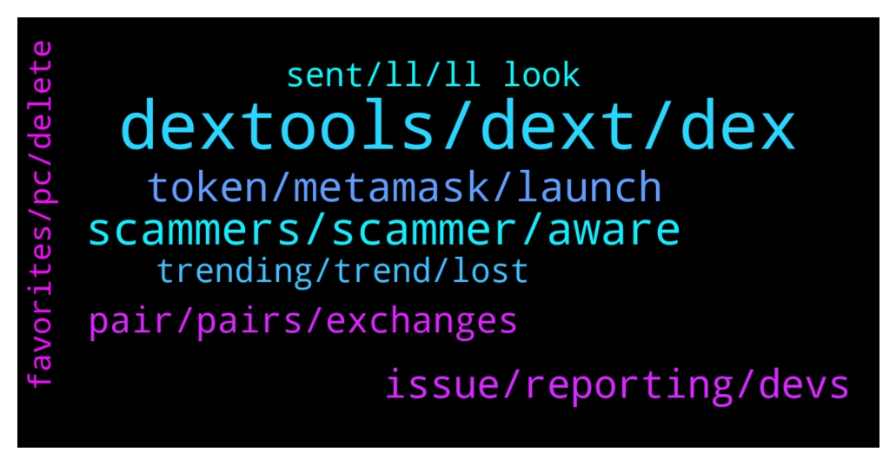

# **@DEXToolsCommunity**
 ## Analysis for **2021-12-29** - **2021-12-31**.

---

## 📊 **Basic Stats**

**n_messages_sent**: 370

---

---

## 🔝 **Top keywords and related messages**

1. **dextools, dext, dex**

    @Gideon649 --- *What do I need to list on Dextool ?* **--->** [TG Discussion](https://t.me/DEXToolsCommunity/319755)

    @hmk18990 --- *it's not a downloadable app. it's a web app. https://www.dextools.io/app/ether/pair-explorer/0xa29fe6ef9592b5d408cca961d0fb9b1faf497d6d* **--->** [TG Discussion](https://t.me/DEXToolsCommunity/319308)

    @atosm --- *Is there a list of changelog for dextool recent update? Thank you for the recent tweaks. love the new UI now with the 2 mini-update.   If possible please save the "sort by" option. It keep reverting to "last added" rather than retaining my selected sorting option.* **--->** [TG Discussion](https://t.me/DEXToolsCommunity/319361)

    @napascual --- *Dm me the factory/deployer and dex info* **--->** [TG Discussion](https://t.me/DEXToolsCommunity/319659)

    @LIRItheBobm --- *How can i subscribe on dextool ??? I have dex on my wallet that i connect.* **--->** [TG Discussion](https://t.me/DEXToolsCommunity/320496)

    @PMC_COIN --- *PMC list on one more exchange how I can update on Dextools* **--->** [TG Discussion](https://t.me/DEXToolsCommunity/320290)

2. **scammers, scammer, aware**

    @tatiana211 --- *posible to buy scam? im cant undersand* **--->** [TG Discussion](https://t.me/DEXToolsCommunity/319856)

    @stanes --- *Please DM @guillermorodriguez78 he is the person-in-charge.  Be aware of scammers, HE WILL NEVER DM YOU FIRST.* **--->** [TG Discussion](https://t.me/DEXToolsCommunity/320548)

    @stanes --- *We all make mistakes. We need to learn one way or an other 😅. Always DYOR before buying is a golden rule 😉* **--->** [TG Discussion](https://t.me/DEXToolsCommunity/320183)

    @napascual --- *@guillermorodriguez78 for marketing. He will never dm first* **--->** [TG Discussion](https://t.me/DEXToolsCommunity/320602)

    @senzacionale --- *Omg. So many scammers contact me* **--->** [TG Discussion](https://t.me/DEXToolsCommunity/320578)

    @napascual --- *That was a scammer, be aware!* **--->** [TG Discussion](https://t.me/DEXToolsCommunity/319226)

3. **token, metamask, launch**

    @chrismagic0 --- *I need support for my token* **--->** [TG Discussion](https://t.me/DEXToolsCommunity/319970)

    @Lost --- *Why favor tokens cant load ?* **--->** [TG Discussion](https://t.me/DEXToolsCommunity/319406)

    @hodlshitcoins4life --- *guys is this the official metamask token?* **--->** [TG Discussion](https://t.me/DEXToolsCommunity/319026)

    @CliffordGrows --- *Is it different for BEP20 tokens?  Thanks!* **--->** [TG Discussion](https://t.me/DEXToolsCommunity/320477)

    @napascual --- *Follow Uniswap docs, you can Google that* **--->** [TG Discussion](https://t.me/DEXToolsCommunity/320475)

    @CryptoAce8 --- *Have you checked if our wallets are safe or that fake Metamask token could drain our wallets as well?* **--->** [TG Discussion](https://t.me/DEXToolsCommunity/319155)

4. **issue, reporting, devs**

    @FredericDEXT --- *All feedback is noted , we will deliver fixes for all reported issues in the next days.* **--->** [TG Discussion](https://t.me/DEXToolsCommunity/319630)

    @croft4r --- *Never had this happen yet so I don’t know how to handle it* **--->** [TG Discussion](https://t.me/DEXToolsCommunity/319160)

    @BuyTheCheeseDip --- *just stays at the loading screen* **--->** [TG Discussion](https://t.me/DEXToolsCommunity/320657)

    @abrahamgoblinhead --- *why are you guys responding to everything but the MASK issue? @napascual @stanes   @EricCryptoman* **--->** [TG Discussion](https://t.me/DEXToolsCommunity/319565)

    @napascual --- *Hey, we've fixed that yesterday already, added several checks and security. It won't happen again* **--->** [TG Discussion](https://t.me/DEXToolsCommunity/319566)

    @FredericDEXT --- *Nothing we can do about it. Our devs are checking and fixing the issue.* **--->** [TG Discussion](https://t.me/DEXToolsCommunity/319069)

5. **pair, pairs, exchanges**

    @davlee999 --- *is there a way to export the pair explorer trade history to excel file?* **--->** [TG Discussion](https://t.me/DEXToolsCommunity/319223)

    @sirsirmoon --- *We have an issue with our smart contract on your website where the pair shows [no symbol]* **--->** [TG Discussion](https://t.me/DEXToolsCommunity/320119)

    @FredericDEXT --- *We know and it's fixed, and no we are not an exchange.* **--->** [TG Discussion](https://t.me/DEXToolsCommunity/319151)

    @Crypt0r --- *Even Frederic saying ‘were not an exchange’* **--->** [TG Discussion](https://t.me/DEXToolsCommunity/319146)

    @stanes --- *We need that to display the pair.* **--->** [TG Discussion](https://t.me/DEXToolsCommunity/320352)

    @FredericDEXT --- *Yes, the pair must have a minimum volumen or visits* **--->** [TG Discussion](https://t.me/DEXToolsCommunity/320316)

6. **sent, ll, ll look**

    @napascual --- *Sure, but I'll go through it tomorrow (2am here)* **--->** [TG Discussion](https://t.me/DEXToolsCommunity/319691)

    @FredericDEXT --- *Dm me the link and I'll check* **--->** [TG Discussion](https://t.me/DEXToolsCommunity/319621)

    @genialcronyTAMC6 --- *Thanks can I DM you now?* **--->** [TG Discussion](https://t.me/DEXToolsCommunity/319688)

    @napascual --- *Dm me your wallet I'll take a look* **--->** [TG Discussion](https://t.me/DEXToolsCommunity/320647)

    @nihiLismistheway --- *@guillermorodriguez78 I sent you a dm* **--->** [TG Discussion](https://t.me/DEXToolsCommunity/319859)

    @MiamiLand --- *hey @stanes - before i DM you; id like to know if it is ok to ask you a question in regards to the room! Thanks. via DM* **--->** [TG Discussion](https://t.me/DEXToolsCommunity/319372)

7. **trending, trend, lost**

    @stanes --- *Sorry for your lost. I always avoid trading when I am pissed, best way to make mistakes. Trending spots are decided by an algorithm. It happens sometimes that a scam is able to reach one of these spots, then people start watching the pair and so that make it trend even more... We are constantly improving the algorithm to avoid manipulations but we will probably never be able to guarantee the perfect legitimacy of these spots.* **--->** [TG Discussion](https://t.me/DEXToolsCommunity/320188)

    @maroraza --- *ya you right but i cant believe i did this stupidity, usually i do check but i was just pissed at couple of project and then saw this trending on top 10 never thought a scam coin can ever trend and just throw in 10k 😤 fucking stupid cant sell them back* **--->** [TG Discussion](https://t.me/DEXToolsCommunity/320184)

    @stanes --- *Yeah yeah yeah, we have people like you every days accusing us of that. Then we ask: so if we accept payment for trending, how come you are not able to show any proof or make your own token trend by paying for it?  Then people suddenly shut up. 🤷‍♂️* **--->** [TG Discussion](https://t.me/DEXToolsCommunity/319790)

    @EricCryptoman --- *how was it obvious? it let you sell at the start and it was verified lol* **--->** [TG Discussion](https://t.me/DEXToolsCommunity/319583)

    @sczptix --- *Because of their verified marking I lost money. Seriously how tf did that happen* **--->** [TG Discussion](https://t.me/DEXToolsCommunity/319092)

    @sczptix --- *Bro I think it might be one of the biggest rug. Because they’re so incompetent to mark it verified. I personally lost 1Eth and many of people lose a lot more* **--->** [TG Discussion](https://t.me/DEXToolsCommunity/319163)

