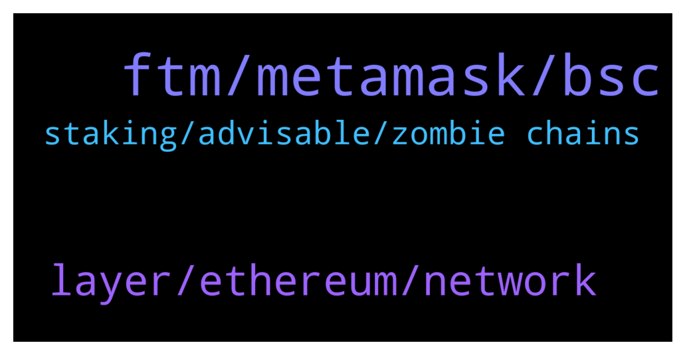

# **@Fantom_English**
 ## Analysis for **2021-12-30** - **2021-12-31**.

---

## 📊 **Basic Stats**

**n_messages_sent**: 92

---

---

## 🔝 **Top keywords and related messages**

1. **ftm, metamask, bsc**

    @Edouard3 --- *anyone know how you get WFTM?* **--->** [TG Discussion](https://t.me/Fantom_English/619147)

    @faisal_chawdhary --- *it is not found on the FTM explorer but on BSC is shows as successful* **--->** [TG Discussion](https://t.me/Fantom_English/619209)

    @faisal_chawdhary --- *Interacted With (To): Contract 0xad29abb318791d579433d831ed122afeaf29dcfe (Fantom: FTM Token)* **--->** [TG Discussion](https://t.me/Fantom_English/619213)

    @faisal_chawdhary --- *done. I see the FTM in my metamask on BSC network. Thanks for your help.  How do I get to FTM network in my metamask?* **--->** [TG Discussion](https://t.me/Fantom_English/619223)

    @Eatgreencandlesforbreakfast --- *Guys, how do I withdraw my FTM on fantom Opera network on metamask, back to FTX?* **--->** [TG Discussion](https://t.me/Fantom_English/618835)

    @KoinLuc --- *guys what about FTMLaunch.com ...  ?* **--->** [TG Discussion](https://t.me/Fantom_English/618632)

2. **layer, ethereum, network**

    @saeed_radin --- *The Coinex Exchange introduce Fantom like this :   Coin POS Layer 2* **--->** [TG Discussion](https://t.me/Fantom_English/618946)

    @Mcjig --- *How does Fantom work? Fantom is modular Lachesis represents one layer, the consensus, of the blockchain technology stack and can be plugged into any distributed ledger. Lachesis powers Fantom’s Opera mainnet deployment, that uses the Ethereum Virtual Machine (EVM) and it’s compatible with Ethereum.* **--->** [TG Discussion](https://t.me/Fantom_English/618948)

    @Kuraba --- *This is why fantom is very strong* **--->** [TG Discussion](https://t.me/Fantom_English/618682)

    @Janevietani --- *just wanna make sure , this is Fantom not Phantom* **--->** [TG Discussion](https://t.me/Fantom_English/618893)

    @abz352 --- *Its just commonly known information, you can research it you'll see it's layer 1. However, fantom does use the EVM ethereum virtual machine to deploy smart contracts (If a smart contract is valid on ethereum it will be valid on fantom)* **--->** [TG Discussion](https://t.me/Fantom_English/618945)

    @ABfromNZ --- *Hey team, just wondering what the best wallet to store my Fantom.  I had a look at Fwallet but I couldn’t send eth or binance chain.* **--->** [TG Discussion](https://t.me/Fantom_English/619088)

3. **staking, advisable, zombie chains**

    @coinmania222 --- *how much worth is advisable to buy now please* **--->** [TG Discussion](https://t.me/Fantom_English/618603)

    @mauricevessen --- *I need some help with spookyswap* **--->** [TG Discussion](https://t.me/Fantom_English/619247)

    @pajamasfreak --- *It’s coming out soon. Wait for further announcement* **--->** [TG Discussion](https://t.me/Fantom_English/618727)

    @NeonThunderX --- *Even zombie chains have launchpads for them* **--->** [TG Discussion](https://t.me/Fantom_English/618618)

    @Heisenbvrg --- *Top5 and im gonna shit myself haha* **--->** [TG Discussion](https://t.me/Fantom_English/618933)

    @varmology --- *One way is by staking xBOO on SpookySwap* **--->** [TG Discussion](https://t.me/Fantom_English/619148)

