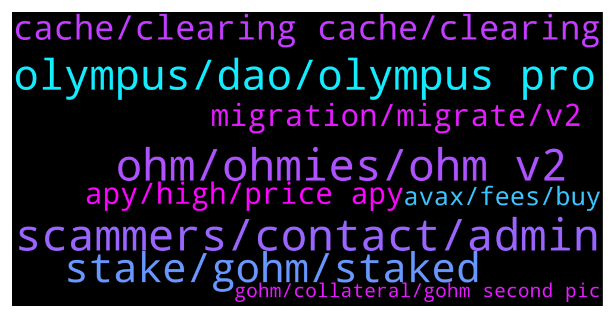

# **@OlympusTG**
 ## Analysis for **2021-12-30** - **2021-12-31**.

---

## 📊 **Basic Stats**

**n_messages_sent**: 858

---

---

## 🔝 **Top keywords and related messages**

1. **scammers, contact, admin**

    @lul_u --- *Hello, please who is ADMIN, I've got some nice offers, pls DM (Graphics, Website and DAPP Developer) and i can make you a White paper and Billboard design too, and i've  got a portfolio from previous projects.* **--->** [TG Discussion](https://t.me/OlympusTG/137996)

    @mandingo_0 --- *half the people in here are scammers. ffs i cant deal with these dm's* **--->** [TG Discussion](https://t.me/OlympusTG/138038)

    @lyc9968 --- *Hello administrator, about the promotion and cooperation of Chinese market, which person in charge should I contact.* **--->** [TG Discussion](https://t.me/OlympusTG/138437)

    @shogunfx1 --- *Did you receive a dm from another bot?* **--->** [TG Discussion](https://t.me/OlympusTG/138365)

    @fpietrosanti --- *Removed, just wanted to share the scam schema* **--->** [TG Discussion](https://t.me/OlympusTG/138539)

    @cdp279 --- *That will eventually find its way into crypto and defi. I just hope defi becomes safer and these hacks stop happening. Really bad for crypto. And these damn scammers.* **--->** [TG Discussion](https://t.me/OlympusTG/137679)

2. **ohm, ohmies, ohm v2**

    @theMagicUnicorn --- *a lot of people flock to the instantly attractive high apy for the short term benefit, but the smart ones know that ohm has to be about long term value...people who read about it and educate themselves on it get it* **--->** [TG Discussion](https://t.me/OlympusTG/138783)

    @EricCryptoman --- *hey how do i know if i have the latest version of ohm* **--->** [TG Discussion](https://t.me/OlympusTG/138003)

    @C --- *I’d like to see the devs clean up the project after v2, it’s not noon friendly with ohm, sohm, gohm, wsohm* **--->** [TG Discussion](https://t.me/OlympusTG/138166)

    @stacyd82d --- *I was following it a few weeks back. It looked like a spin off of ohm. Seems that the rug has been pulled on that project* **--->** [TG Discussion](https://t.me/OlympusTG/138308)

    @Arda --- *it is improvement of ohm not me i invested in ohm to improve already* **--->** [TG Discussion](https://t.me/OlympusTG/138867)

    @theMagicUnicorn --- *people who stay for the long haul know the true value of ohm* **--->** [TG Discussion](https://t.me/OlympusTG/138153)

3. **olympus, dao, olympus pro**

    @Ap0l1o --- *The difference between Olympus and the other DAOs is that Olympus put it’s money to work, always building something more and improving* **--->** [TG Discussion](https://t.me/OlympusTG/138831)

    @Toby --- *Do I just import the Olympus V2?* **--->** [TG Discussion](https://t.me/OlympusTG/137747)

    @nfwaple --- *the article missed the part about how the treasury assets will be strategically used to generate revenue, and the potential of Olympus Pro when it goes permissionless* **--->** [TG Discussion](https://t.me/OlympusTG/137793)

    @charlieshrem2 --- *Hello I opened a new MetaMask wallet and sent the Olympus using the ETH address* **--->** [TG Discussion](https://t.me/OlympusTG/138615)

    @maurofibonacci --- *I think Olympus now is paying the price of other DAO’s failure* **--->** [TG Discussion](https://t.me/OlympusTG/137606)

    @Ap0l1o --- *It should be shown in the Olympus page* **--->** [TG Discussion](https://t.me/OlympusTG/138012)

4. **stake, gohm, staked**

    @BTC - TheDaddy - TheFuture --- *buy gOHM on uniswap that way there is no approve cost and no stake costs and everything shows up on the dashboard. you may have to add the gOHM token address to uniswap which you can obtain from coingecko* **--->** [TG Discussion](https://t.me/OlympusTG/137952)

    @Ap0l1o --- *you can buy and hold gOhm, no need to stake it* **--->** [TG Discussion](https://t.me/OlympusTG/137935)

    @willyc --- *When we switch to gohm is it already staked then or..* **--->** [TG Discussion](https://t.me/OlympusTG/137542)

    @d --- *If gohm is already staked does it just automatically compound in my wallet* **--->** [TG Discussion](https://t.me/OlympusTG/137898)

    @BTC - TheDaddy - TheFuture --- *best to buy gOHM on uniswap that way there is no approve cost and no stake costs and everything shows up on the dashboard. you'll have to add the gOHM token address to uniswap which you can do with one click from coingecko* **--->** [TG Discussion](https://t.me/OlympusTG/137749)

    @jfbaron --- *I recently bought gohm through uniswap. Traded for some ETH.   Should I stake it as well to earn the yield?* **--->** [TG Discussion](https://t.me/OlympusTG/138186)

5. **cache, clearing cache, clearing**

    @nfwaple --- *clear cache, disconnect reconnect and try again, if you're using mobile try desktop version* **--->** [TG Discussion](https://t.me/OlympusTG/137641)

    @nfwaple --- *do the basic troubleshoot first, do you see sOHM in your wallet, sometimes it also take awhile to show up on the website, also try clearing cache and using desktop version* **--->** [TG Discussion](https://t.me/OlympusTG/138384)

    @maurofibonacci --- *Are you guys having problem connecting your Wallet to The page?* **--->** [TG Discussion](https://t.me/OlympusTG/137551)

    @nfwaple --- *what was the error you encountered? try using desktop version + clearing cache* **--->** [TG Discussion](https://t.me/OlympusTG/137782)

    @nfwaple --- *have you tried basic troubleshooting? clearing cache and reconnecting wallet* **--->** [TG Discussion](https://t.me/OlympusTG/137623)

    @nfwaple --- *disconnect, close tab, then reconnect your wallet, then reopen the website first* **--->** [TG Discussion](https://t.me/OlympusTG/137710)

6. **migration, migrate, v2**

    @cdp279 --- *Well. The migration also happened just before the market started dumping. So I don’t think this is entirely the case ser. Maybe some chumps decided to get out but yeah* **--->** [TG Discussion](https://t.me/OlympusTG/137672)

    @willyc --- *How long do you have to migrate* **--->** [TG Discussion](https://t.me/OlympusTG/137534)

    @cryptojai --- *I speculate that a Lot of folks freaked during this migration and withdrew. That plus a general bearish sentiment. When dust settles and whales re enter we will hopefully see juicy rebound.  It could be days or months away.  Tame the emotions.* **--->** [TG Discussion](https://t.me/OlympusTG/137670)

    @Jay_1010 --- *And remember complaining is not changing the reality of the situation. Migrate or don't...* **--->** [TG Discussion](https://t.me/OlympusTG/138911)

    @Dave_881010 --- *The current migration handling doesn’t give confidence to the stakers. One of the contribution factors* **--->** [TG Discussion](https://t.me/OlympusTG/138485)

    @cdp279 --- *I think the uncertainty about the migration making people worried. Unjustly* **--->** [TG Discussion](https://t.me/OlympusTG/138280)

7. **apy, high, price apy**

    @AllochkaMeow --- *Hello, can anyone suggest high yield APY projects?🙏* **--->** [TG Discussion](https://t.me/OlympusTG/138118)

    @timon_k --- *yeah because ****% apy is not enough haha :)* **--->** [TG Discussion](https://t.me/OlympusTG/138519)

    @ccryii --- *APY isn’t the matter now. It’s to become even more decentralized* **--->** [TG Discussion](https://t.me/OlympusTG/138520)

    @Arthur --- *Quick question, if I stake more and more Ohm, how can I track when Ill get the APY?* **--->** [TG Discussion](https://t.me/OlympusTG/137761)

    @Arthur --- *Thank you, Indeed, but what about the 5000% apy?* **--->** [TG Discussion](https://t.me/OlympusTG/137763)

    @Nitin --- *Where is the '1' coming from in the APY formula?* **--->** [TG Discussion](https://t.me/OlympusTG/137848)

8. **avax, fees, buy**

    @Ap0l1o --- *easiest way would be via traderjoe on avalanche I suppose* **--->** [TG Discussion](https://t.me/OlympusTG/137317)

    @Pallas1111 --- *Does it cost much in gas fees to bridge from Eth to Avax?* **--->** [TG Discussion](https://t.me/OlympusTG/137261)

    @Ap0l1o --- *you can bridge your eth to avalanche and then swap it for avax after which you can buy gOhm directly with avax* **--->** [TG Discussion](https://t.me/OlympusTG/137323)

    @Rete --- *Gohm in eth,  which better liquidity, bridge to avax or unwrap to ohm & unstake* **--->** [TG Discussion](https://t.me/OlympusTG/137903)

    @charlieshrem2 --- *Do you need ETH to pay gas fees?* **--->** [TG Discussion](https://t.me/OlympusTG/138628)

    @Tha_bag_man --- *I have gohm erc20. Do I bridge to gohm avax? Also can I buy straight gohm on avax?* **--->** [TG Discussion](https://t.me/OlympusTG/138893)

