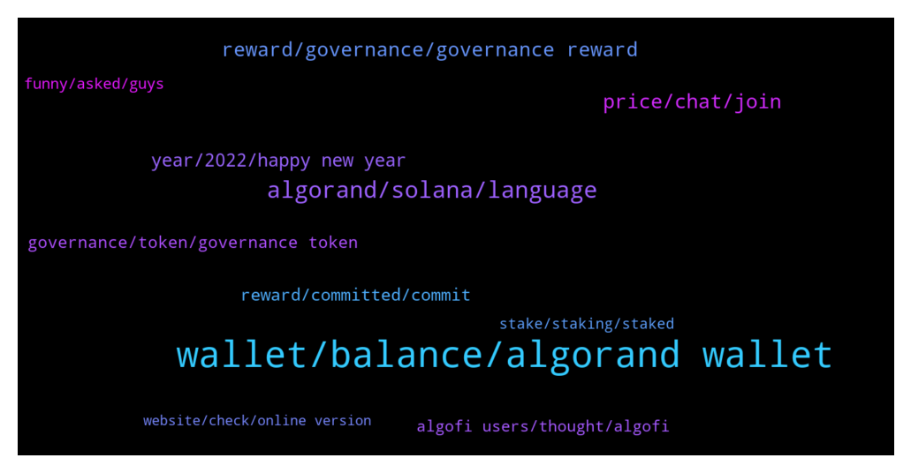

# **@algorand**
 ## Analysis for **2021-12-30** - **2021-12-31**.

---

## 📊 **Basic Stats**

**n_messages_sent**: 360

---

---

## 🔝 **Top keywords and related messages**

1. **wallet, balance, algorand wallet**

    @yunusp24 --- *I don't see my balance in my wallet why* **--->** [TG Discussion](https://t.me/algorand/327661)

    @Zen_ZZZ --- *Hi team, what problem with Algo wallet on Android ? Just updated, my bag balance is zero now 🥸 Checked on Algo.explorer, it is still fine Please help* **--->** [TG Discussion](https://t.me/algorand/327614)

    @yunusp24 --- *but in ab2 the gallery can be seen... when can this wallet be recovered* **--->** [TG Discussion](https://t.me/algorand/327701)

    @arodfuels366 --- *How do we sign up to be a governor? Click the get started within the Algorand wallet and link my wallet, but I'm redirected back to my Algorand wallet, not prompted to do anything else.* **--->** [TG Discussion](https://t.me/algorand/327529)

    @MackDenver --- *You need to get your binance deposit address and send your ALGO there.* **--->** [TG Discussion](https://t.me/algorand/328146)

    @TheRealGiulio --- *Admin, there seems to be an issue with the Algorand Wallet.* **--->** [TG Discussion](https://t.me/algorand/327579)

2. **algorand, solana, language**

    @defirlkp --- *why do you think algorand will grow faster? it uses a different development language doesn't it which reduces the pool of available developers compared to evm-based chains using solidity* **--->** [TG Discussion](https://t.me/algorand/327967)

    @DTX234 --- *I don't understand why ETH Is the number 2 whereas much better blockchain technology exist like Algorand...* **--->** [TG Discussion](https://t.me/algorand/327956)

    @bernijw --- *Network Effect. It will take time to develop an ecosystem remotely as huge as Ethereum. Ethereum will stay big, it won't go away, but Algorand will grow much faster. Think about it...Bitcoin is dominant, even though it really can't do anything but store and transfer value (the latter quite slowly), but it has a huge first mover advantage.* **--->** [TG Discussion](https://t.me/algorand/327957)

    @Teo --- *Important decision. I kindly ask you for your opinion. Why prefer algo to solana and terra luna today? thank you very much for your availability* **--->** [TG Discussion](https://t.me/algorand/328012)

    @defirlkp --- *i'm also looking at the future - all i said is because algorand uses a different language it can only draw from a smaller pool of developers which may slow down work* **--->** [TG Discussion](https://t.me/algorand/327977)

    @littlemix55 --- *sol is way too prone to attack because the node leader can be known beforehand. Luna is the only true competitor imo* **--->** [TG Discussion](https://t.me/algorand/328014)

3. **price, chat, join**

    @MackDenver --- *You can join the price chat: @algorand_price* **--->** [TG Discussion](https://t.me/algorand/327757)

    @King21212112 --- *Anyone know why the price is running up?* **--->** [TG Discussion](https://t.me/algorand/327824)

    @DTX234 --- *The actual price of Algorand (1.73 $) Is a good Price to buy Algo ?* **--->** [TG Discussion](https://t.me/algorand/327994)

    @c_blecar --- *is there an api to get price history of a token?* **--->** [TG Discussion](https://t.me/algorand/327984)

    @Annie5212 --- *Is 16.44 equal to US dollars?* **--->** [TG Discussion](https://t.me/algorand/328187)

    @AlgoSparks_Gabbard --- *great do you communicate more there?* **--->** [TG Discussion](https://t.me/algorand/328255)

4. **reward, governance, governance reward**

    @MackDenver --- *Check out the link below. The distribution of the governance reward will start from January 1 to January 5  https://algorand.foundation/news/key-dates-algorand-governance* **--->** [TG Discussion](https://t.me/algorand/328149)

    @Patdogbaby --- *Are all participation rewards aside from the 1% to be allocated through governance ? when will there be an updated participation reward schedule issued ? no info past feb 2022* **--->** [TG Discussion](https://t.me/algorand/327734)

    @uswock --- *hello sir, how to claim reward governance period 1?* **--->** [TG Discussion](https://t.me/algorand/328100)

    @MackDenver --- *The governance reward depends on the total committed amount in a phase* **--->** [TG Discussion](https://t.me/algorand/328109)

    @Jillani1256 --- *When we get rewards in algorand governance period #1* **--->** [TG Discussion](https://t.me/algorand/327834)

    @n --- *at what time are the gov rewards distributed? exactly at newyear UTC?* **--->** [TG Discussion](https://t.me/algorand/328147)

5. **year, 2022, happy new year**

    @littlemix55 --- *youre thinking of now when all I see is future* **--->** [TG Discussion](https://t.me/algorand/327975)

    @MackDenver --- *We will announce when the ends.* **--->** [TG Discussion](https://t.me/algorand/327577)

    @yue666777 --- *Happy new year, congratulations on getting rich* **--->** [TG Discussion](https://t.me/algorand/328069)

    @EldarDRM --- *My monthly elevator pitch/summary updated. Happy New Year!* **--->** [TG Discussion](https://t.me/algorand/328153)

    @Landy9956 --- *2021 is coming to an end. How have you been in the past year* **--->** [TG Discussion](https://t.me/algorand/328259)

    @hadiyat --- *To some it is still a bearish bullish time* **--->** [TG Discussion](https://t.me/algorand/327550)

6. **reward, committed, commit**

    @mhrasel --- *Hmm but they already said if you commit 10 algo you got .45 algo This is holding reward 😁* **--->** [TG Discussion](https://t.me/algorand/328229)

    @MackDenver --- *The reward depends on the amount of ALGO that you committed.* **--->** [TG Discussion](https://t.me/algorand/328171)

    @MackDenver --- *There is no minimum, you can commit any amount* **--->** [TG Discussion](https://t.me/algorand/328129)

    @Wurzelbear --- *Can we change our commitment yet?* **--->** [TG Discussion](https://t.me/algorand/327751)

    @Jillani1256 --- *I think this is committed reward* **--->** [TG Discussion](https://t.me/algorand/328230)

    @MackDenver --- *If you committed 10 ALGO in phase, your reward will be based on that* **--->** [TG Discussion](https://t.me/algorand/328173)

7. **governance, token, governance token**

    @mhrasel --- *He'llo admin what is the planing for listing algo governance token* **--->** [TG Discussion](https://t.me/algorand/328218)

    @arguser --- *It seems that I double commited Algo for Gov2, for some reason is not showing on te governance page, would it be a problem?* **--->** [TG Discussion](https://t.me/algorand/327872)

    @Martin --- *Is there anywhere I can see how much people applied for the second governance, compared to last governance?* **--->** [TG Discussion](https://t.me/algorand/328159)

    @james8794 --- *What’s the minimum to becoming part of the governance?* **--->** [TG Discussion](https://t.me/algorand/328128)

    @Lord_Shin_Chan_2_O --- *Sir... How much total supply for the governance token sir...?* **--->** [TG Discussion](https://t.me/algorand/328131)

    @MackDenver --- *Yes, it is visible on the governance website  https://governance.algorand.foundation/* **--->** [TG Discussion](https://t.me/algorand/328160)

8. **algofi users, thought, algofi**

    @arnoldinho71 --- *I have read it. But algomint project already did it. Moreover there is no info about algo on swingby roadmap. Is these cooperation continues?* **--->** [TG Discussion](https://t.me/algorand/327772)

    @Vivantusbonus --- *could you tell me which are good groups for Algo degens/ upcoming launches etc?* **--->** [TG Discussion](https://t.me/algorand/327516)

    @minimalist_stranger --- *Just to alert admins. I saw a TG Algorand chat exactly like this, that was “giving away ALGO”. Mack was the first name I saw, so I almost thought it was legit. Huge number of members too. Luckily I thought twice to check.* **--->** [TG Discussion](https://t.me/algorand/327512)

    @Yawn_Crypto_SA --- *Yeah. Heart attack time. Can Algo do an announcement?* **--->** [TG Discussion](https://t.me/algorand/327604)

    @MackDenver --- *There is already Tinyman live on Algorand. There is Algodex on testnet as well* **--->** [TG Discussion](https://t.me/algorand/327794)

    @MackDenver --- *With the recent launch of Algofi, users can now lend and borrow against their ALGO, USDC, goBTC & more.   Learn more about their simple-to-use platform and a new initiative that will distribute 2M ALGO to Algofi users in Q1 2022: https://blog.algofi.org/673aaaf8d662* **--->** [TG Discussion](https://t.me/algorand/327560)

9. **funny, asked, guys**

    @Jillani1256 --- *yeah sure i understand the point* **--->** [TG Discussion](https://t.me/algorand/328243)

    @Annie5212 --- *What you said, I asked you, but you asked me to explain, you are so funny!😢* **--->** [TG Discussion](https://t.me/algorand/328198)

    @MeemBhai --- *Appreciate it's being addressed but I shit my pants 😂* **--->** [TG Discussion](https://t.me/algorand/327658)

    @MW_MWMW --- *Alright guys, I had a mini heart attack too. Quickly came to check out this TG* **--->** [TG Discussion](https://t.me/algorand/327609)

    @MackDenver --- *Sorry, what do you mean? The explanation message was not referred to you* **--->** [TG Discussion](https://t.me/algorand/328200)

    @Martin --- *That’s the reason then I guess* **--->** [TG Discussion](https://t.me/algorand/327886)

10. **stake, staking, staked**

    @Franklinsmooth --- *Where and how can I stake my Algorand?* **--->** [TG Discussion](https://t.me/algorand/327432)

    @james8794 --- *What can you get for just staking? Approx* **--->** [TG Discussion](https://t.me/algorand/328126)

    @MackDenver --- *You can stake ALGO just by holding them in your wallet. For extra APY you can participate in the governance* **--->** [TG Discussion](https://t.me/algorand/328106)

    @Igwetoo --- *I guess is perfect when staking with mobile wallet like Atomic Wallet that has provision for that* **--->** [TG Discussion](https://t.me/algorand/328031)

    @Stephen --- *If your Algo is in that wallet... 8ts staked* **--->** [TG Discussion](https://t.me/algorand/327440)

    @TenaciuousT --- *what would be the best options for staking etc* **--->** [TG Discussion](https://t.me/algorand/328047)

