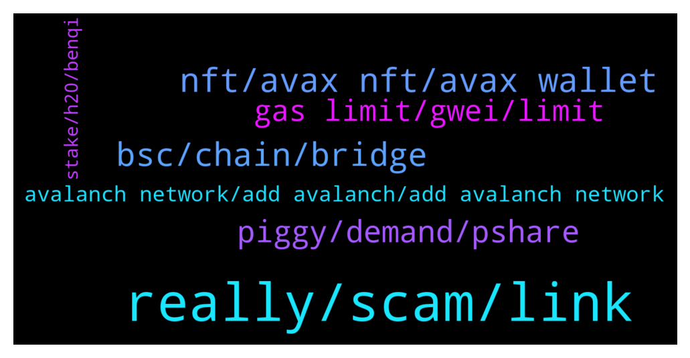

# **@avalancheavax**
 ## Analysis for **2021-12-30** - **2021-12-31**.

---

## 📊 **Basic Stats**

**n_messages_sent**: 194

---

---

## 🔝 **Top keywords and related messages**

1. **really, scam, link**

    @TaschaWolf --- *God damn. No one can help a simple thing here.* **--->** [TG Discussion](https://t.me/avalancheavax/318491)

    @FutureTiger --- *Ah yes, Daniele, he was recommended on Banter, by Ran I think, or maybe Ellio Trades... probably both, and many more :)* **--->** [TG Discussion](https://t.me/avalancheavax/318522)

    @SAFU_Master --- *No DMs please I will just delete them* **--->** [TG Discussion](https://t.me/avalancheavax/318381)

    @K --- *It's super easy to do. First time is hard. I know what u mean tho. I'm expert now lool* **--->** [TG Discussion](https://t.me/avalancheavax/318470)

    @Joe --- *Does anyone have a non scam link to roco chat* **--->** [TG Discussion](https://t.me/avalancheavax/318672)

    @Joe --- *Ok si there is no official chat for rocofiniance* **--->** [TG Discussion](https://t.me/avalancheavax/318674)

2. **nft, avax nft, avax wallet**

    @hossein_barati_93 --- *Thank you very much But I mean good news for avax* **--->** [TG Discussion](https://t.me/avalancheavax/318429)

    @Kenneth --- *I have not entered avax, which is an area of interest ?* **--->** [TG Discussion](https://t.me/avalancheavax/318542)

    @Gabriel --- *can be avax if that helps* **--->** [TG Discussion](https://t.me/avalancheavax/318615)

    @Umitimd --- *One of the first NFT Play to Earn games of the Avalanche network, Avaxtars, is launching Phase3 tomorrow at 20:00 UTC  https://twitter.com/Avaxtars_Game/status/1476268110139305984  Have a nice day.* **--->** [TG Discussion](https://t.me/avalancheavax/318404)

    @alexbwork --- *still wondering when avax fees gonna be like matic, etc…* **--->** [TG Discussion](https://t.me/avalancheavax/318563)

    @alrightnhe --- *Waiting for one day I can visit Avax Apls in Highstreet* **--->** [TG Discussion](https://t.me/avalancheavax/318798)

3. **bsc, chain, bridge**

    @bobby_blanco --- *Swap the usdt.e to usdc on trader joe .. then go to the bridge .. make sure you have bsc network set up on MetaMask first.. start the bridge and swap your usdc from avax to bsc.. your usdc in your avax account on MetaMask will move over to your usdc on your bsc account on MetaMask .. then send the usdc from your bsc account on MetaMask to a bsc address* **--->** [TG Discussion](https://t.me/avalancheavax/318523)

    @bobby_blanco --- *You need to bridge avax tokens via avax bridge to bsc chain and then send it from a bsc wallet* **--->** [TG Discussion](https://t.me/avalancheavax/318516)

    @helolleh --- *guys, can I return money if I sent usdt.e from avax network to bep20 USDT address? 🙊* **--->** [TG Discussion](https://t.me/avalancheavax/318513)

    @FutureTiger --- *Hullo chaps, when withdrawing AVAX from gateIO, I am offered 2 Chains, AVAX chain and AVAX C-Chain. The fee for AVAX chain is small but AVAX C-Chain is very expensive. Is it safe to send AVAX from Gate to Metamask using AVAX Chain? If it is not safe, perhaps I should buy TIME on gateIO itself, and then send TIME to MM using AVAX C-Chain. For some mysterious reason the fee is small when withdrawing TIME from Gate using AVAX C-Chain !* **--->** [TG Discussion](https://t.me/avalancheavax/318702)

    @Gabriel --- *hello. was wondering if there is a cheaper way to get from kucoin to c-chain then the bridge ? tu* **--->** [TG Discussion](https://t.me/avalancheavax/318609)

    @bobby_blanco --- *To set up MetaMask for bsc bridging and swapping here are the instructions   https://academy.binance.com/en/articles/connecting-metamask-to-binance-smart-chain.amp* **--->** [TG Discussion](https://t.me/avalancheavax/318527)

4. **piggy, demand, pshare**

    @bobby_blanco --- *Time has a solid core of devs who are all very well known like Daniele sestagalli .. time is part of an ecosystem that includes popsicle finance , abracadabra and he is taking over sushi swap .. they already have plenty of money and the likely hood of them destroying there reputation by rug pulling is highly unlikely .. the apy fluctuation and price are offset by the compounding interest you get on your account 3 times a day..* **--->** [TG Discussion](https://t.me/avalancheavax/318512)

    @bobby_blanco --- *Is anyone here invested in time wonderland* **--->** [TG Discussion](https://t.me/avalancheavax/318446)

    @oceanboy007 --- *Piggy is an algorithmic stablecoin on Avalanche, created through a simple yet complex process of minting or burning Piggy tokens dependent on supply and demand. More demand allows the staked PSHARE (Piggy Share) token to mint more PIGGY to meet demand. Less demand means more selling pressure, allowing protocol supporters to purchase PBONDS that burn PIGGY from the market in exchange for a premium in the future, returning PIGGY back to peg.  PSHARE currently mints PIGGY at a rate of 3669.40%!!!  and providing liquidity for PIGGY or PSHARE gives over 13731.28% APR  https://twitter.com/piggy_finance/status/1476610397931114506?s=21* **--->** [TG Discussion](https://t.me/avalancheavax/318694)

    @Bruno --- *Is not to mean I am superb,  but I gotta tell you guys I have enough coins  to live The all rest of The year whithout working so much* **--->** [TG Discussion](https://t.me/avalancheavax/318765)

    @bobby_blanco --- *Iv been in time for over a month with decent money staked .. it’s actually performed the best out of my stash  during bear times because of the rebases .. So proof is in the pudding* **--->** [TG Discussion](https://t.me/avalancheavax/318643)

    @Javian --- *FARM coin did its thing yday* **--->** [TG Discussion](https://t.me/avalancheavax/318387)

5. **gas limit, gwei, limit**

    @oathtobarbatos --- *It didn't work? I told you it was 21000, 25, 25* **--->** [TG Discussion](https://t.me/avalancheavax/318497)

    @oathtobarbatos --- *You could try resetting your Metamask account (it won't change your balance)* **--->** [TG Discussion](https://t.me/avalancheavax/318445)

    @ItzaKO --- *Had to split my contract into 2 when i added liquidity i was unable to buy in through my other account.* **--->** [TG Discussion](https://t.me/avalancheavax/318717)

    @FutureTiger --- *that's what i thought.. thanx for confirming!* **--->** [TG Discussion](https://t.me/avalancheavax/318723)

    @FutureTiger --- *it's all good now, it's just strange the app does not prompt, have not noticed this deficiency on other websites recently* **--->** [TG Discussion](https://t.me/avalancheavax/318486)

    @TaschaWolf --- *My settings are currently reset to 0. What amount do I set for gwei and gas limit? Need to buy Avax urgently* **--->** [TG Discussion](https://t.me/avalancheavax/318443)

6. **avalanch network, add avalanch, add avalanch network**

    @Rocco --- *Hi Guys Is there an legit Defi 2.0 project on the avalanche chain?* **--->** [TG Discussion](https://t.me/avalancheavax/318388)

    @oathtobarbatos --- *You'll find news for Avalanche in this channel https://t.me/avalanche_announcements* **--->** [TG Discussion](https://t.me/avalancheavax/318430)

    @bobby_blanco --- *This is the avax tutorial  to add avalanch network to MetaMask  https://support.avax.network/en/articles/4626956-how-do-i-set-up-metamask-on-avalanche* **--->** [TG Discussion](https://t.me/avalancheavax/318481)

    @Nicolas_A --- *If you have at least 25 avax you can delegate it https://docs.avax.network/build/tutorials/nodes-and-staking/staking-avax-by-validating-or-delegating-with-the-avalanche-wallet   Else you could use some of the Defi apps ecosystem.avax.network* **--->** [TG Discussion](https://t.me/avalancheavax/318902)

    @oathtobarbatos --- *I think I'm not the right person to answer that but, I'd suggest you ask there: chat.avax.network. Tech questions are always answered in the Avalanche discord server* **--->** [TG Discussion](https://t.me/avalancheavax/318719)

    @K --- *Yes. U log in and then click network and u can switch* **--->** [TG Discussion](https://t.me/avalancheavax/318484)

7. **stake, h20, benqi**

    @CryptoGator --- *Hey guys. Where can I get the beat returns single staking AVAX right now? I’ve currently got it in Banker joe.* **--->** [TG Discussion](https://t.me/avalancheavax/318849)

    @luisao8788 --- *Question, can I stake AVAX? where?* **--->** [TG Discussion](https://t.me/avalancheavax/318898)

    @bobby_blanco --- *Then simply send avax to your MetaMask avax address .. go to traderjoe .. swap avax for time … time will appear on your MetaMask wallet make sure you leave at least half an avax on your MetaMask at all times for gas fees .. then go to wonderland.money click connect and click stake .. and done* **--->** [TG Discussion](https://t.me/avalancheavax/318487)

    @CypherBlock --- *I'd be happy to send you my Node ID and you can use wallet.avax.network to delegate your avax there. My staking period ends in 17 days,  so if you want to try out delegating that is a good place to start (I think 14 days is the minimum). I'm doing one month validation periods, so I'll start a new one when this one is over.* **--->** [TG Discussion](https://t.me/avalancheavax/318905)

    @ramziakram --- *maybe can try this startegy.can DYOR  deposit avax into benqi for lending  then use benqi avax lp token to put as collateral on defrost finance supervault.  supervault help autocompound your benqi avax  from supervault, you can also mint h20 stablecoin and deposit those h20 stablecoin into h20 curvepool for farming Melt(deforst governance token) at deforst finance.* **--->** [TG Discussion](https://t.me/avalancheavax/318852)

    @bobby_blanco --- *When you want to unstake after a few months or so.. click unstake then swap time for avax or what ever coin you want on either trader joe or any other avax exchange* **--->** [TG Discussion](https://t.me/avalancheavax/318490)

