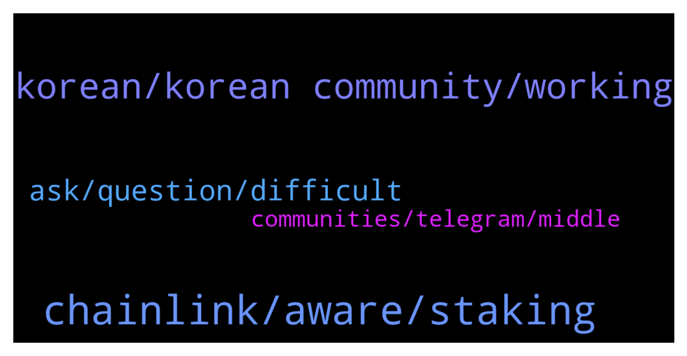

# **@chainlinkofficial**
 ## Analysis for **2021-12-30** - **2021-12-31**.

---

## 📊 **Basic Stats**

**n_messages_sent**: 68

---

---

## 🔝 **Top keywords and related messages**

1. **chainlink, aware, staking**

    @SurpriseMF3000 --- *Hello, how much ETH do you need to run your own Node ? I already testet the Testnet Kovan.  Thanks for answers 👍* **--->** [TG Discussion](https://t.me/chainlinkofficial/358038)

    @Sylvarantt --- *Please be aware that there is no price, market, trading, or yield farming discussions allowed here. Please find an unofficial channel if that is what you want to talk about. You can find some groups by searching Telegram for "Chainlink Community" but be aware that they are not operated or endorsed by the Chainlink team or admins of this chat.* **--->** [TG Discussion](https://t.me/chainlinkofficial/358383)

    @Adrxcrypto --- *can i stake my chainlink ?* **--->** [TG Discussion](https://t.me/chainlinkofficial/358225)

    @Digeshacharya --- *Hello, can someone tell if Monsterclan is an official partner with Chainlink?* **--->** [TG Discussion](https://t.me/chainlinkofficial/358306)

    @PolivodaTatiana --- *Chainlink doesn’t pay for promotion however feel free to email support@chain.link* **--->** [TG Discussion](https://t.me/chainlinkofficial/358051)

    @marcromeron --- *Chainlink staking is not yet available. Other forms of staking offered by exchanges are actually yield farming, lending/borrowing, which is not endorsed by us and is outside the scope of discussion in this channel.* **--->** [TG Discussion](https://t.me/chainlinkofficial/358226)

2. **korean, korean community, working**

    @창현 --- *are they no longer working for korean community?* **--->** [TG Discussion](https://t.me/chainlinkofficial/358107)

    @창현 --- *korean managers abandoned korean community. they have literally evoparated without anywords.* **--->** [TG Discussion](https://t.me/chainlinkofficial/358100)

    @창현 --- *i am just telling what happened in korean community.* **--->** [TG Discussion](https://t.me/chainlinkofficial/358136)

    @marcromeron --- *We have a team in South Korea but as mentioned we need a CM on there.* **--->** [TG Discussion](https://t.me/chainlinkofficial/358119)

    @PolivodaTatiana --- *perhaps you'd like to become a community advocate in Korea? feel free to share this application form with your friends and colleagues: https://chain.link/community/advocates* **--->** [TG Discussion](https://t.me/chainlinkofficial/358103)

    @창현 --- *is there any feedback about korean community? korean community is not managed for more than one month. managers are disappeared without any words.* **--->** [TG Discussion](https://t.me/chainlinkofficial/358067)

3. **ask, question, difficult**

    @창현 --- *so i asked like this. just say yes or no. is it difficult question?* **--->** [TG Discussion](https://t.me/chainlinkofficial/358114)

    @PolivodaTatiana --- *Hi there, I highly recommend to ask your question on our Discord: https://discord.gg/DfDuSDTW* **--->** [TG Discussion](https://t.me/chainlinkofficial/358047)

    @nam_nguyenson --- *Not sure. Maybe you can explore https://market.link/ and ask them if they can provide you a list of sort.* **--->** [TG Discussion](https://t.me/chainlinkofficial/358345)

    @totomaze --- *Yeah I ll try to contact them :) thanks for your answer.* **--->** [TG Discussion](https://t.me/chainlinkofficial/358351)

    @marcromeron --- *I think that I’ve answered your question. Thank you for your understanding.* **--->** [TG Discussion](https://t.me/chainlinkofficial/358137)

    @marcromeron --- *If you’re interested feel free to apply.* **--->** [TG Discussion](https://t.me/chainlinkofficial/358123)

4. **communities, telegram, middle**

    @RomainSwitzerland --- *Chainlink – Telegram communities      Korea - @chainlink_korea   SE Asia - @chainlinkSEA   Indonesia - @ChainlinkID   Spain/LatAm - @chainlinkedesp   Turkey - @chainlinkTR   Italian –  @Chainlink_italian   Finnish – @chainlinksuomi   Sweden - @chainlinkSWEDEN   France – @chainlinkFRA   German - @Chainlinkgerman   Dutch - @chainlinkNL   Middle East - @chainlinkME   Vietnam - @chainlinkVIETNAM   Japan - @chainlinkJAPAN Russia - @ChainlinkRussia* **--->** [TG Discussion](https://t.me/chainlinkofficial/358078)

    @ivankwananda --- *Is there any Indonesian community for LINK?* **--->** [TG Discussion](https://t.me/chainlinkofficial/358293)

    @CryptoYam --- *I'm looking for Chainlink Korean group* **--->** [TG Discussion](https://t.me/chainlinkofficial/358075)

    @harrumphharrumph --- *Hi there! China has a telegram group, It’s called @chainlinkfans (unofficial) and please also feel free to check out our Chinese communities (official) here:  https://blog.chain.link/chainlink-chinese-communities/* **--->** [TG Discussion](https://t.me/chainlinkofficial/358317)

    @Joypokkamol --- *Hi there! China has a telegram group, It’s called @chainlinkfans (unofficial) and please also feel free to check out our Chinese communities (official) here:  https://blog.chain.link/chainlink-chinese-communities/* **--->** [TG Discussion](https://t.me/chainlinkofficial/358055)

    @harrumphharrumph --- *Chainlink – Telegram communities      Korea - @chainlink_korea   SE Asia - @chainlinkSEA   Indonesia - @ChainlinkID   Spain/LatAm - @chainlinkedesp   Turkey - @chainlinkTR   Italian –  @Chainlink_italian   Finnish – @chainlinksuomi   Sweden - @chainlinkSWEDEN   France – @chainlinkFRA   German - @Chainlinkgerman   Dutch - @chainlinkNL   Middle East - @chainlinkME   Vietnam - @chainlinkVIETNAM   Japan - @chainlinkJAPAN Russia - @ChainlinkRussia* **--->** [TG Discussion](https://t.me/chainlinkofficial/358294)

