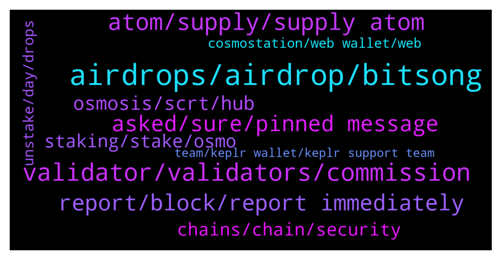

# **@cosmosproject**
 ## Analysis for **2021-12-30** - **2021-12-31**.

---

## 📊 **Basic Stats**

**n_messages_sent**: 542

---

---

## 🔝 **Top keywords and related messages**

1. **airdrops, airdrop, bitsong**

    @W --- *People staking ATOM should be able to claim them at any time, not have to jump through hoops or keep up with the network 24/7 to avoid missing out. Communication about the airdrops is also terrible to be honest.* **--->** [TG Discussion](https://t.me/cosmosproject/463427)

    @TenaciuousT --- *so could I get airdrops on say coinomi or atomic wallet or exodus (out of curiosity)* **--->** [TG Discussion](https://t.me/cosmosproject/463043)

    @Bringme11 --- *Thanks for the reply ser. Assuming 10 Atoms staked AirDrop received would make sense or would it be better not to claim them?* **--->** [TG Discussion](https://t.me/cosmosproject/463885)

    @Ragnarlothbrok_9_9 --- *Hey guys i was looking into yhe bitsong airdrop and saw that the airdrop isnt going to people staking atom with the game validator. Why exclude validators?* **--->** [TG Discussion](https://t.me/cosmosproject/463757)

    @TenaciuousT --- *do these airdrops automatically land in your wallet (even if it does not support the new tokens)?* **--->** [TG Discussion](https://t.me/cosmosproject/462907)

    @not a name --- *No validator is going to qualify you for ALL airdrops.  Huahua airdropped to juno stakers who delegated to them. None others qualified that i know of* **--->** [TG Discussion](https://t.me/cosmosproject/463600)

2. **validator, validators, commission**

    @Ultimatejoy --- *I can see few validators list, which are not part of top 50 validators list, and I recently added Keplr* **--->** [TG Discussion](https://t.me/cosmosproject/464013)

    @AtomJazz --- *You should be able to see the whole validator set in that case then* **--->** [TG Discussion](https://t.me/cosmosproject/463796)

    @Jason --- *You can pick any of the list, up to you.  Choosing lower ranked validators is better for decentralization.* **--->** [TG Discussion](https://t.me/cosmosproject/463535)

    @bcosmos --- *id like to begin validating on a server* **--->** [TG Discussion](https://t.me/cosmosproject/463751)

    @Jason --- *All of them are 14 percent apr.  The percentage shown is the commision the validator takes. Eg  So you get 1 osmo reward, the validator takes 5 percent* **--->** [TG Discussion](https://t.me/cosmosproject/463527)

    @AtomJazz --- *It's how much commission validators are charging delegators ranging from 0 (the lowest) to 100% (the highest). Anything from 1% to 10% should be ok* **--->** [TG Discussion](https://t.me/cosmosproject/463847)

3. **atom, supply, supply atom**

    @crypto4life4eva --- *hey guys where do i buy atom/* **--->** [TG Discussion](https://t.me/cosmosproject/463818)

    @TenaciuousT --- *was wondering if anyone could share their thoughts as to ATOM VS DOT VS LayerZero protocol (vry young)* **--->** [TG Discussion](https://t.me/cosmosproject/462870)

    @ndcast --- *i did, and only have atom, scrt and cro* **--->** [TG Discussion](https://t.me/cosmosproject/463626)

    @W --- *So why did you hold ATOM before this year when it had no utility other than staking?* **--->** [TG Discussion](https://t.me/cosmosproject/463402)

    @JAbioye1 --- *Would be nice to get a .atom domain name. Can’t someone build this?* **--->** [TG Discussion](https://t.me/cosmosproject/462839)

    @ZoltanAtom --- *Ofcourse. Check this one if you couldn’t find how to redelegate your atoms ;  a step by step guide: https://medium.com/chainapsis/how-to-use-keplr-wallet-40afc80907f6* **--->** [TG Discussion](https://t.me/cosmosproject/463790)

4. **report, block, report immediately**

    @ZoltanAtom --- *If someone DM to you,block and report it immediately ⚠️⚠️⚠️* **--->** [TG Discussion](https://t.me/cosmosproject/464026)

    @Rico --- *Got a Message from Moderator with link to claim btsg pls what to do* **--->** [TG Discussion](https://t.me/cosmosproject/463192)

    @Vivek --- *It was just a test, wanted to see how quickly scammers dm me* **--->** [TG Discussion](https://t.me/cosmosproject/463222)

    @ZoltanAtom --- *If someone DM to you, block ad report them immediately! No wallet support on telegram. ⚠️⚠️⚠️* **--->** [TG Discussion](https://t.me/cosmosproject/462846)

    @AtomJazz --- *Recieved message by whom? Admins will never DM you* **--->** [TG Discussion](https://t.me/cosmosproject/463146)

    @AtomDragon --- *Best admin in the world, i havent forgotten and never will sir. Whoever is in charge here, give this man a raise!* **--->** [TG Discussion](https://t.me/cosmosproject/463034)

5. **asked, sure, pinned message**

    @AtomJazz --- *I often ask myself the same thing* **--->** [TG Discussion](https://t.me/cosmosproject/463014)

    @AtomJazz --- *Not sure, probably best to ask on https://t.me/CosmosAirdrops* **--->** [TG Discussion](https://t.me/cosmosproject/462618)

    @TicoJohnny --- *This channel is very helpful https://t.me/CosmosAirdrops* **--->** [TG Discussion](https://t.me/cosmosproject/463547)

    @AtomJazz --- *You can begin following https://t.me/CosmosAirdrops for starters* **--->** [TG Discussion](https://t.me/cosmosproject/463391)

    @AtomJazz --- *Not sure I understand your question* **--->** [TG Discussion](https://t.me/cosmosproject/463888)

    @AsyncSakamoto --- *thx @ZoltanAtom, I will read immediately.* **--->** [TG Discussion](https://t.me/cosmosproject/462883)

6. **osmosis, scrt, hub**

    @TenaciuousT --- *osmosis is the DEX right? Keplr = wallet. Hub well ... hub for coins dApps etc* **--->** [TG Discussion](https://t.me/cosmosproject/462946)

    @TenaciuousT --- *is cosmos hub another wallet? same question for osmosis? y have 3?* **--->** [TG Discussion](https://t.me/cosmosproject/462938)

    @AtomJazz --- *Superfluid is Osmosis feature. Doubt it will have much effect on ATOM* **--->** [TG Discussion](https://t.me/cosmosproject/463858)

    @AtomJazz --- *IDK to be honest. Some users were saying earlier that its already possible. If not you can withdraw IRIS or SCRT to Keplr and swap it back to ATOM on Osmosis* **--->** [TG Discussion](https://t.me/cosmosproject/462654)

    @Sergam21 --- *Yeah I'm having issues with osmosis not showing up on cosmostation desktop wallet* **--->** [TG Discussion](https://t.me/cosmosproject/462754)

    @AtomJazz --- *You can withdraw IRIS or SCRT to Keplr and swap them to ATOM on Osmosis* **--->** [TG Discussion](https://t.me/cosmosproject/462930)

7. **staking, stake, osmo**

    @B --- *I am new. Whats the difference between staking Atom and osmo. Whats the benefit of osmo?* **--->** [TG Discussion](https://t.me/cosmosproject/462993)

    @Rico --- *When i stake, what difference does it make when i choose the gas fee?* **--->** [TG Discussion](https://t.me/cosmosproject/463963)

    @LP --- *Ok but i do have to select a centralized entity to stake, no ?* **--->** [TG Discussion](https://t.me/cosmosproject/463533)

    @AtomJazz --- *Staking is done on-chain so it doesn't matter where you stake. Wallets are just UIs* **--->** [TG Discussion](https://t.me/cosmosproject/463855)

    @Cordtus --- *Staking reward goes up when percentage of supply staked goes down and vise versa.* **--->** [TG Discussion](https://t.me/cosmosproject/463713)

    @jasbanza --- *or is that due to the type of collateral you use?... e.g. stables or crypto* **--->** [TG Discussion](https://t.me/cosmosproject/463650)

8. **chains, chain, security**

    @themoonscholar --- *Anyone have a link to a great (long) Twitter thread that goes deep on Cosmos? Looking for something that I could send to easily onboard/inform people about the beauty of Cosmos without having to type a lot myself and would prefer not to have to just send them the straight up docs to look through.* **--->** [TG Discussion](https://t.me/cosmosproject/462849)

    @aabdygaziev --- *I am new to cosmos guys. What makes cosmos so attractive to you? I mean in terms of transactions the network has around 5 million transaction total while other chains having a million a day. Clearly Cosmos is lagging and needs more users* **--->** [TG Discussion](https://t.me/cosmosproject/462594)

    @AtomJazz --- *You're talking about a single Cosmos chain. We have the infrastructure to scale horizontally in Cosmos through IBC, which means we don't have to put everything on one chain but we can connect infinite number of Cosmos SDK chains each capable of doing up to 10k tps. Clearly Cosmos is ahead compared to all other crypto ecosystems* **--->** [TG Discussion](https://t.me/cosmosproject/462597)

    @AtomJazz --- *You can read this article to get an idea about all upcoming Hub features https://blog.cosmos.network/whats-coming-to-cosmos-in-2022-ce8e48d383ab* **--->** [TG Discussion](https://t.me/cosmosproject/462950)

    @doyoko999 --- *But now DVPN is on my cosmos chain, how should I operate his cross-chain DVPN chain* **--->** [TG Discussion](https://t.me/cosmosproject/462856)

    @staycat1on --- *Or is it sole business of Cosmos hub only?* **--->** [TG Discussion](https://t.me/cosmosproject/463727)

9. **unstake, day, drops**

    @Cordtus --- *Yep but that's part of the incentive to not unstake* **--->** [TG Discussion](https://t.me/cosmosproject/462738)

    @Mirec --- *Hello guys? Does it take 21 days to unstake my coins? 😀* **--->** [TG Discussion](https://t.me/cosmosproject/463321)

    @Tom --- *By mistake I bonded Atom SCRT LP tokens for 1 day bonding. I wanted to do 14 day bond. Can I unbond and then do 14 day bonding. If I do so, I need to wait 24 hrs. Don’t I ?* **--->** [TG Discussion](https://t.me/cosmosproject/463791)

    @Jason --- *You do get rewards. 24 hours after pressing unbond, you apr drops to the next tier.  Eg, you bonded for 14 days, it drops to 7, and then in another week drops to 1 day* **--->** [TG Discussion](https://t.me/cosmosproject/463518)

    @Rico --- *Im sorry i was talking about unstaking* **--->** [TG Discussion](https://t.me/cosmosproject/463516)

    @pasqualeBuonocore --- *Thank you! Is it mandatory for each validotor an unstaking peroid of 21 days?* **--->** [TG Discussion](https://t.me/cosmosproject/463243)

10. **cosmostation, web wallet, web**

    @StefStuntpilot --- *Any wallets significantly better? Keplr, Cosmostation?* **--->** [TG Discussion](https://t.me/cosmosproject/463907)

    @sandman4ever --- *can i import my cosmostation into keplr and is that recomended to do* **--->** [TG Discussion](https://t.me/cosmosproject/463485)

    @aabdygaziev --- *how can I set up a web-wallet using cosmostation/keystation?* **--->** [TG Discussion](https://t.me/cosmosproject/462610)

    @AtomJazz --- *Keplr or Cosmostation are the suggested wallets* **--->** [TG Discussion](https://t.me/cosmosproject/463893)

    @TenaciuousT --- *is there any good software non central wallets for many tokens* **--->** [TG Discussion](https://t.me/cosmosproject/462932)

    @Cordtus --- *Ah yeah their desktop wallet (web wallet) is not great. I suggest keplr. Cosmostation is king on mobile though.* **--->** [TG Discussion](https://t.me/cosmosproject/462756)

