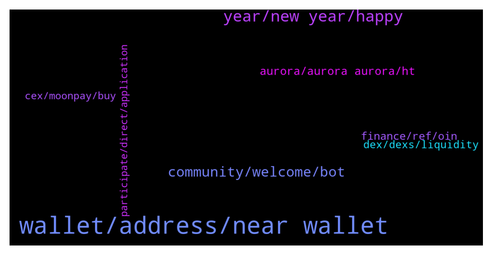

# **@cryptonear**
 ## Analysis for **2021-12-30** - **2021-12-31**.

---

## 📊 **Basic Stats**

**n_messages_sent**: 546

---

---

## 🔝 **Top keywords and related messages**

1. **wallet, address, near wallet**

    @Joseph --- *I sent near from my kucoin to my trust wallet, the transaction went through and then the next time I opened my trust wallet, my existing near had been sent out, is this a service issue? Can anyone help?* **--->** [TG Discussion](https://t.me/cryptonear/255810)

    @Joseph --- *20mins after the transaction I saw another transaction sending out the near* **--->** [TG Discussion](https://t.me/cryptonear/255815)

    @rainloving --- *When I register a new wallet, only deposit from CEX to active account? Can I deposit 0.1 NEAR from a DEX?* **--->** [TG Discussion](https://t.me/cryptonear/257115)

    @Jacques --- *Well, may have missed. Liked much like connecting fee, not approval Fe. Long day, eyes tired. Sorry.* **--->** [TG Discussion](https://t.me/cryptonear/255308)

    @minhBui28 --- *when create near wallet, I need to deposit 0.1 NEAR, is this true?* **--->** [TG Discussion](https://t.me/cryptonear/255683)

    @Bisma --- *How can i make a wallet?* **--->** [TG Discussion](https://t.me/cryptonear/257165)

2. **year, new year, happy**

    @Jacques --- *Thank you again and for all. Now I'll go for some reading and exploring. Will be back when I know more. Have a great year end* **--->** [TG Discussion](https://t.me/cryptonear/255346)

    @NEARverse_xd --- *Happy New Year to all Nearians💸* **--->** [TG Discussion](https://t.me/cryptonear/256600)

    @Alex --- *Happy new year by the way* **--->** [TG Discussion](https://t.me/cryptonear/256547)

    @rahulgoel007 --- *Happy New Year to all Nearians🎉* **--->** [TG Discussion](https://t.me/cryptonear/256634)

    @larry_lang --- *Happy new year to u as well^^* **--->** [TG Discussion](https://t.me/cryptonear/256551)

    @larry_lang --- *Happy new year to all of u^^ and for those who have been with me through ups and downs this year- it has been a great journey and really looking forward continue it with u guys* **--->** [TG Discussion](https://t.me/cryptonear/256596)

3. **community, welcome, bot**

    @Zedrone --- *Hey community!  We've launched a new validator on Near 🙂  Your delegations are very welcome!  https://twitter.com/prophet_node/status/1476254322782609417* **--->** [TG Discussion](https://t.me/cryptonear/255125)

    @thanano46 --- *I always find these kinds of chat which starts suddenly seems fishy to me.. i mean bot attacks 🥴🥴.. That's my perception though* **--->** [TG Discussion](https://t.me/cryptonear/256453)

    @frankophil --- *Cheers brother. Best mods in TG here* **--->** [TG Discussion](https://t.me/cryptonear/255530)

    @Aflatoon123 --- *Thank you for giving tg of dmityne* **--->** [TG Discussion](https://t.me/cryptonear/256280)

    @Darius_Nearinsider --- *I will send more useful information to everyone* **--->** [TG Discussion](https://t.me/cryptonear/255557)

    @iforbusiness2 --- *I guess this is the platform https://twitter.com/NEAR_daily/status/1457309354936475651?s=20* **--->** [TG Discussion](https://t.me/cryptonear/257005)

4. **aurora, aurora aurora, ht**

    @hoangca6789 --- *Now, I cant find aurora on ht.* **--->** [TG Discussion](https://t.me/cryptonear/256941)

    @Kaiguy69 --- *Are there no taxes on near like there arent on aurora?* **--->** [TG Discussion](https://t.me/cryptonear/256781)

    @larry_lang --- *Hmm pretty sure the hype is around aurora ecosystem with projects onboarding each weeks* **--->** [TG Discussion](https://t.me/cryptonear/256752)

    @marko_eth --- *can someone explain me the utility of AURORA token...i know what we use NEAR for everything, but what do we use aurora for?* **--->** [TG Discussion](https://t.me/cryptonear/256895)

    @iforbusiness2 --- *In addition to this I suggest you to conect with aurora here - https://t.me/auroraisnear for your appropriate reply 😊@marko_eth* **--->** [TG Discussion](https://t.me/cryptonear/256900)

    @hoangca6789 --- *Why I checked from defillama have not aurora at tvl* **--->** [TG Discussion](https://t.me/cryptonear/256841)

5. **finance, ref, oin**

    @rimberjack --- *📣Join us for a #stablecoins deep dive!  🗓 AMA tomorrow, Thursday 30th, 2pm UTC on discord: https://discord.gg/reffinance, hosted by our @rimberjack 🤨  Ref Finance and OIN Finance will share their knowledge and answer all of your questions 🤔  https://twitter.com/finance_ref/status/1476233555428745237?s=20* **--->** [TG Discussion](https://t.me/cryptonear/255871)

    @SPB_Nikta_Klimash --- *i answer OIN Finance,but maybe it's not right* **--->** [TG Discussion](https://t.me/cryptonear/256999)

    @Kaiguy69 --- *Near is getting a lot of headlines lately i dont understand why ref finance isnt pumping* **--->** [TG Discussion](https://t.me/cryptonear/256744)

    @realpeter --- *Come make your voice heard if you want an incentivized FLX pool on Ref Finance and Trisolaris! 🙂 https://twitter.com/peterflux/status/1476673788343427076?s=20* **--->** [TG Discussion](https://t.me/cryptonear/256285)

    @bailey_12 --- *Hey guys, OIN Finance is doing AMA with Ref Finance Do tune in @ https://discord.gg/KAQvVz3Q* **--->** [TG Discussion](https://t.me/cryptonear/255949)

    @Kripto_Raptor --- *Just got out from oin finance AMA on discord. exciting stuff going on there* **--->** [TG Discussion](https://t.me/cryptonear/256061)

6. **dex, dexs, liquidity**

    @larry_lang --- *And it is not that hard to jump from one DEXs to another* **--->** [TG Discussion](https://t.me/cryptonear/256777)

    @Kaiguy69 --- *Ya i guess im just confused about the dynamic between aurora and near. It sounds like dex there are competition to dex here* **--->** [TG Discussion](https://t.me/cryptonear/256774)

    @Cato_3 --- *okay so theres no liq on any dex? CEX or bridge only?* **--->** [TG Discussion](https://t.me/cryptonear/256013)

    @TheGo1denBull --- *By adding liquidity to a dex you get LP tokens in return to add to farm pools.* **--->** [TG Discussion](https://t.me/cryptonear/256035)

    @larry_lang --- *If the money flow into Near it has to go there for DEX* **--->** [TG Discussion](https://t.me/cryptonear/256740)

    @Kaiguy69 --- *Youre saying ref finance isnt Olympus dao clone? What successful dexs are olympus dao clone?* **--->** [TG Discussion](https://t.me/cryptonear/256754)

7. **cex, moonpay, buy**

    @kv9990 --- *Moonpay wallet wallet.near.org/buy and these CEXs https://coinmarketcap.com/currencies/near-protocol/markets/* **--->** [TG Discussion](https://t.me/cryptonear/256659)

    @rodnas83 --- *Which wallet is better? Near official or moonlet?* **--->** [TG Discussion](https://t.me/cryptonear/255960)

    @murtala serein --- *How should I get coins you are talking about ?* **--->** [TG Discussion](https://t.me/cryptonear/256745)

    @cuongdcc --- *moon pay support buy near, you can use moon pay instead* **--->** [TG Discussion](https://t.me/cryptonear/257139)

    @iamkemoo --- *You can deposit to your wallet from CEX or top up via MoonPay.* **--->** [TG Discussion](https://t.me/cryptonear/257117)

    @NEARverse_xd --- *By clicking on top up to buy via moonpay or send from any CEX to your wallet* **--->** [TG Discussion](https://t.me/cryptonear/256005)

