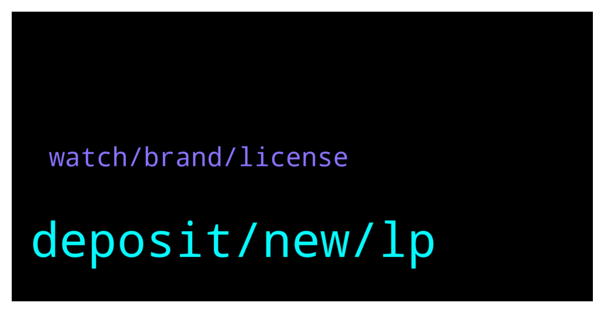

# **@dypfinance**
 ## Analysis for **2021-12-30** - **2021-12-31**.

---

## 📊 **Basic Stats**

**n_messages_sent**: 164

---

---

## 🔝 **Top keywords and related messages**

1. **deposit, new, lp**

    @hemanrock --- *you can check FARMS/Buyback,Stake features in DYP* **--->** [TG Discussion](https://t.me/dypfinance/235260)

    @iamJubi --- *you can check dollar value of your LP here https://app-bsc.dyp.finance/staking-stats* **--->** [TG Discussion](https://t.me/dypfinance/235718)

    @hemanrock --- *https://t.me/dypfinance/229271  please check this to know more about DYP and its features.  there are also various video tutorials and ex FARM on BSC:   https://www.youtube.com/watch?v=2pOUmRTMN1o&t=304s* **--->** [TG Discussion](https://t.me/dypfinance/235263)

    @timdyp --- *Happy New Year #DYPians family🥳🎉 A huge thank you for coming along for the ride.  Looking forward to 2022!  👉https://twitter.com/dypfinance/status/1476946094156353597* **--->** [TG Discussion](https://t.me/dypfinance/235783)

    @iamJubi --- *We launched v2 pools you can check it here https://t.me/dypfinance/229271* **--->** [TG Discussion](https://t.me/dypfinance/235382)

    @timdyp --- *Happy Thursday #DYPians😼  Don't forget that the mint will start on January 17, 2022 https://dyp.finance/nft  #NFTs #NFTCommunity #DYP #nftart #watches  👉https://twitter.com/dypfinance/status/1476495462848946179* **--->** [TG Discussion](https://t.me/dypfinance/235466)

2. **watch, brand, license**

    @Richcal --- *Is the watch that created by the dyp team have same brand with the one in the real world? if so, does dyp already have a license to use that brand?* **--->** [TG Discussion](https://t.me/dypfinance/235496)

    @Richcal --- *i think its also better we have our own watch brand, with the explaination about their rarity, so we keep it original from our side, no need license anymore.. just in my opinion 🙏* **--->** [TG Discussion](https://t.me/dypfinance/235631)

    @Richcal --- *In my opinion, if we don't have a license from the watch brand, one day we can be sued by their side. a bit deviated from the license, you know token pocket? they just changed their logo because they were sued by paypal for having almost the same logo. see? only the logo is almost the same they are sued? what if it's really their brand? I think we still need legality/licenses and I think if we have licenses from well-known products, I think our NFTs will be very good in the market.* **--->** [TG Discussion](https://t.me/dypfinance/235629)

    @iamJubi --- *I don’t think license for creating an nft watch art is needed as we are on decentralized market. There are many crypto non licensed projects such as kfc, mcdonalds, etc. But we are sure we will follow what is necessary if legality, license, etc. is needed.* **--->** [TG Discussion](https://t.me/dypfinance/235625)

    @Richcal --- *guys if dyp have a license to using the watch world brand, just let me know, i want to have one.. or if dyp have own watch brand its good too 👍* **--->** [TG Discussion](https://t.me/dypfinance/235623)

    @DhoniMSD516 --- *Each Cat is unique and produced digitally from over 182 possible traits, such as expression, skin, clothing, watches, and many more. All Cats are dope, but some are more outstanding than others depending on the watch they wear.* **--->** [TG Discussion](https://t.me/dypfinance/235480)

